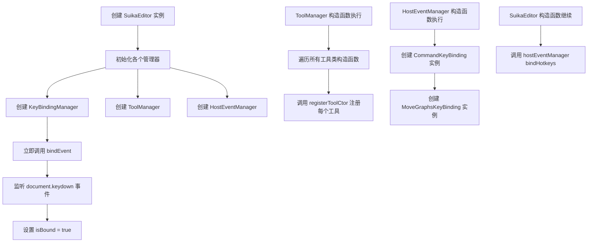
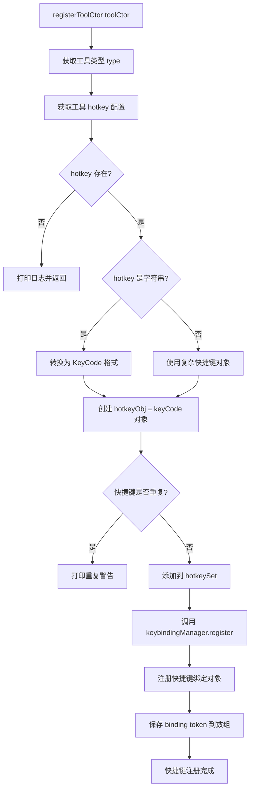
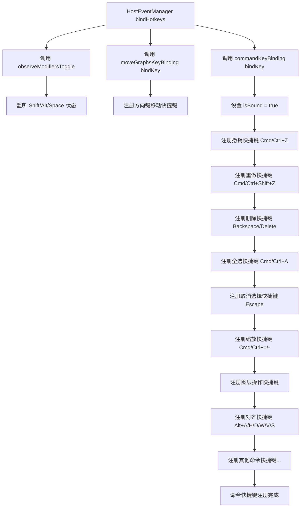
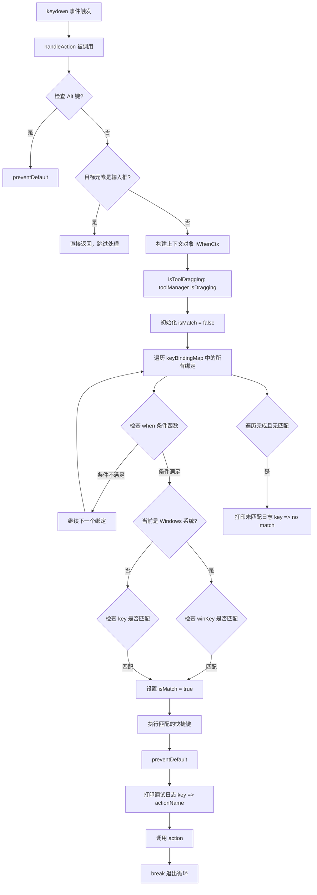
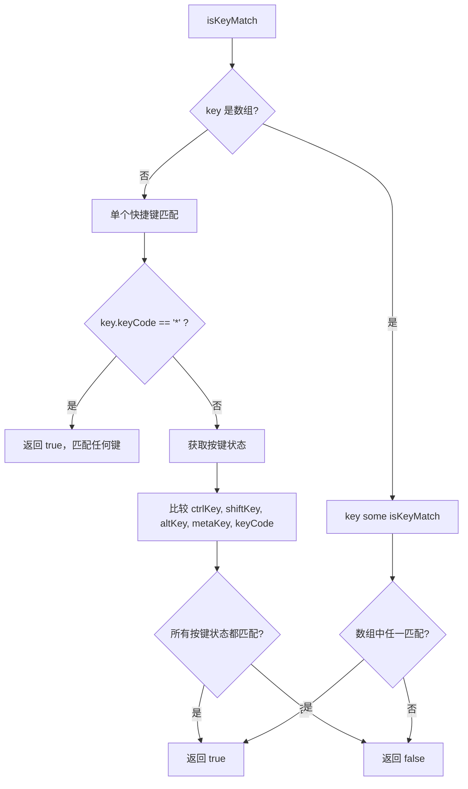
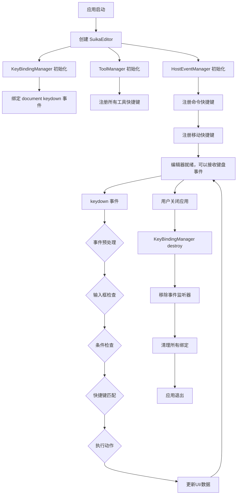

# Suika 编辑器快捷键绑定系统完整流程文档

## 概述

本文档详细描述了 Suika 编辑器中快捷键绑定系统的完整实现流程，包括从初始化到触发执行的各个阶段。

## 🔍 流程图查看指南

**如果您的 Markdown 查看器不支持 Mermaid 图表渲染，请使用以下在线工具查看：**

1. **Mermaid Live Editor**: https://mermaid.live/
2. **复制下方任一流程图代码块 → 粘贴到在线编辑器 → 查看可视化流程图**

## 核心组件

### 1. KeyBindingManager 类

位置：`packages/core/src/key_binding_manager.ts`

#### 主要功能

- 管理所有快捷键绑定
- 处理键盘事件监听
- 执行快捷键匹配和触发

#### 核心属性

```typescript
private keyBindingMap = new Map<number, IKeyBinding>(); // 快捷键映射
private isBound = false; // 绑定状态
private id = 0; // ID 计数器
```

#### 关键方法

- `register()`: 注册快捷键绑定
- `registerWithHighPrior()`: 注册高优先级快捷键
- `bindEvent()`: 绑定键盘事件
- `handleAction()`: 处理键盘事件
- `isKeyMatch()`: 匹配快捷键

### 2. 数据结构

#### IKey 接口

```typescript
interface IKey {
  ctrlKey?: boolean;  // 控制键
  shiftKey?: boolean; // 移位键
  altKey?: boolean;   // 替代键
  metaKey?: boolean;  // 元键 (Mac: Cmd, Windows: Win)
  keyCode: string;    // 键盘事件码 (KeyboardEvent.code)
}
```

#### IKeyBinding 接口

```typescript
interface IKeyBinding {
  key: IKey | IKey[];           // Mac 系统快捷键
  winKey?: IKey | IKey[];       // Windows 系统快捷键
  when?: (ctx: IWhenCtx) => boolean; // 快捷键启动条件
  actionName: string;           // 动作名称 (调试用)
  action: (e: KeyboardEvent) => void; // 触发的方法
}

interface IWhenCtx {
  isToolDragging: boolean; // 工具是否正在拖拽
}
```

## 系统架构

```text
┌─────────────────────────────────────────────────┐
│                 SuikaEditor                     │
│  ┌─────────────────────────────────────────┐    │
│  │          KeyBindingManager             │    │
│  │  ┌─────────────────────────────────┐   │    │
│  │  │       keyBindingMap            │   │    │
│  │  │  id => IKeyBinding             │   │    │
│  │  └─────────────────────────────────┘   │    │
│  └─────────────────────────────────────────┘    │
│                                                 │
│  ┌─────────────────────────────────────────┐    │
│  │         HostEventManager               │    │
│  │  ┌─────────────────────────────────┐   │    │
│  │  │     CommandKeyBinding         │   │    │
│  │  │  ├─ Undo/Redo                 │   │    │
│  │  │  ├─ Delete                    │   │    │
│  │  │  ├─ Select All                │   │    │
│  │  │  └─ ...                       │   │    │
│  │  └─────────────────────────────────┘   │    │
│  │  ┌─────────────────────────────────┐   │    │
│  │  │   MoveGraphsKeyBinding        │   │    │
│  │  │  ├─ Arrow Keys                │   │    │
│  │  │  └─ ...                       │   │    │
│  │  └─────────────────────────────────┘   │    │
│  └─────────────────────────────────────────┘    │
│                                                 │
│  ┌─────────────────────────────────────────┐    │
│  │           ToolManager                 │    │
│  │  ┌─────────────────────────────────┐   │    │
│  │  │      Tool Hotkeys              │   │    │
│  │  │  ├─ SelectTool (V)             │   │    │
│  │  │  ├─ DrawRectTool (R)           │   │    │
│  │  │  ├─ DrawEllipseTool (O)        │   │    │
│  │  │  └─ ...                        │   │    │
│  │  └─────────────────────────────────┘   │    │
│  └─────────────────────────────────────────┘    │
└─────────────────────────────────────────────────┘
```

## 完整流程图

### 📋 Phase 1: 初始化阶段 (复制下方代码块到 mermaid.live 查看)



### Phase 2: 注册阶段

#### 🔧 2.1 工具快捷键注册流程 (复制下方代码块到 mermaid.live 查看)



#### ⌨️ 2.2 命令快捷键注册流程 (复制下方代码块到 mermaid.live 查看)



### ⚡ Phase 3: 触发处理阶段 (复制下方代码块到 mermaid.live 查看)



### 🎯 Phase 4: 快捷键匹配逻辑 (复制下方代码块到 mermaid.live 查看)



### 🔄 Phase 5: 完整生命周期流程 (复制下方代码块到 mermaid.live 查看)



## 详细流程说明

### 1. 初始化流程

1. **编辑器创建**
   - 在 `SuikaEditor` 构造函数中创建 `KeyBindingManager` 实例
   - 立即调用 `keybindingManager.bindEvent()` 绑定全局事件

2. **事件绑定**

   ```typescript
   bindEvent() {
     if (this.isBound) return;
     this.isBound = true;
     document.addEventListener('keydown', this.handleAction);
   }
   ```

### 2. 注册流程

#### 2.1 工具快捷键注册

```typescript
// tool_draw_rect.ts
const HOTKEY = 'r';
export class DrawRectTool extends DrawGraphicsTool {
  static override readonly hotkey = HOTKEY; // 'r'
}

// tool_manager.ts
private registerToolCtor(toolCtor: IToolClassConstructor) {
  const hotkey = toolCtor.hotkey;
  if (typeof hotkey === 'string') {
    const keyCode = `Key${hotkey.toUpperCase()}`;
    const hotkeyObj = { keyCode: keyCode };
  }
  const token = this.editor.keybindingManager.register({
    key: hotkeyObj,
    actionName: type,
    when: () => this.enableToolTypes.includes(type),
    action: () => this.setActiveTool(type),
  });
}
```

#### 2.2 命令快捷键注册

```typescript
// command_key_binding.ts
bindKey() {
  // 撤销快捷键
  editor.keybindingManager.register({
    key: { metaKey: true, keyCode: 'KeyZ' },
    winKey: { ctrlKey: true, keyCode: 'KeyZ' },
    when: (ctx) => !ctx.isToolDragging,
    actionName: 'Undo',
    action: () => editor.commandManager.undo(),
  });
  // ... 更多快捷键
}
```

#### 2.3 移动快捷键注册

```typescript
// move_graphs_key_binding.ts
editor.keybindingManager.register({
  key: [
    ...keys.map((keyCode) => ({ keyCode })),
    ...keys.map((keyCode) => ({ shiftKey: true, keyCode })),
  ],
  actionName: 'Move Elements',
  action: handleKeydown,
});
```

### 3. 触发处理流程

#### 3.1 事件捕获

```typescript
private handleAction = (e: KeyboardEvent) => {
  // 防止浏览器默认行为干扰
  if (e.altKey) {
    e.preventDefault();
  }

  // 跳过输入框中的输入
  if (e.target instanceof HTMLInputElement ||
      e.target instanceof HTMLTextAreaElement) {
    return;
  }
}
```

#### 3.2 快捷键匹配

```typescript
private isKeyMatch(key: IKey | IKey[], e: KeyboardEvent): boolean {
  if (Array.isArray(key)) {
    return key.some((k) => this.isKeyMatch(k, e));
  }

  if (key.keyCode == '*') return true;

  return (
    key.ctrlKey == e.ctrlKey &&
    key.shiftKey == e.shiftKey &&
    key.altKey == e.altKey &&
    key.metaKey == e.metaKey &&
    key.keyCode == e.code
  );
}
```

#### 3.3 条件检查和执行

```typescript
for (const keyBinding of this.keyBindingMap.values()) {
  // 检查启动条件
  if (!keyBinding.when || keyBinding.when(ctx)) {
    // 匹配快捷键
    if (isWindows() && keyBinding.winKey) {
      if (this.isKeyMatch(keyBinding.winKey, e)) {
        isMatch = true;
      }
    } else if (this.isKeyMatch(keyBinding.key, e)) {
      isMatch = true;
    }
  }

  if (isMatch) {
    e.preventDefault();
    console.log(`[${getKeyStr(e)}] => ${keyBinding.actionName}`);
    keyBinding.action(e);
    break; // 优先执行第一个匹配的快捷键
  }
}
```

## 快捷键列表

### 工具切换快捷键

| 快捷键 | 功能 | 工具类 |
|--------|------|--------|
| V | 选择工具 | SelectTool |
| R | 矩形工具 | DrawRectTool |
| O | 椭圆工具 | DrawEllipseTool |
| L | 直线工具 | DrawLineTool |
| T | 文本工具 | DrawTextTool |
| P | 铅笔工具 | PencilTool |
| F | 画板工具 | DrawFrameTool |
| Shift + R | 标尺切换 | - |

### 编辑操作快捷键

| 快捷键 | 功能 | 说明 |
|--------|------|------|
| Cmd/Ctrl + Z | 撤销 | 撤销上一步操作 |
| Cmd/Ctrl + Shift + Z | 重做 | 重做上一步撤销 |
| Backspace / Delete | 删除 | 删除选中元素 |
| Cmd/Ctrl + A | 全选 | 选中所有元素 |
| Esc | 取消选择 | 取消当前选择或切换到选择工具 |

### 缩放快捷键

| 快捷键 | 功能 | 说明 |
|--------|------|------|
| Cmd/Ctrl + = | 放大 | 放大视图 |
| Cmd/Ctrl + - | 缩小 | 缩小视图 |
| Cmd/Ctrl + 0 | 缩放到 100% | 重置缩放比例 |
| Shift + 1 | 缩放到适应 | 适应画布大小 |
| Shift + 2 | 缩放到选择 | 适应选中元素 |

### 图层操作快捷键

| 快捷键 | 功能 | 说明 |
|--------|------|------|
| ] | 前移一层 | 将选中元素向前移动一层 |
| [ | 后移一层 | 将选中元素向后移动一层 |
| Cmd/Ctrl + ] | 移到最前 | 将选中元素移到最顶层 |
| Cmd/Ctrl + [ | 移到最后 | 将选中元素移到底层 |

### 对齐快捷键

| 快捷键 | 功能 | 说明 |
|--------|------|------|
| Alt + A | 左对齐 | 左边对齐 |
| Alt + H | 水平居中对齐 | 水平居中对齐 |
| Alt + D | 右对齐 | 右边对齐 |
| Alt + W | 顶部对齐 | 顶部对齐 |
| Alt + V | 垂直居中对齐 | 垂直居中对齐 |
| Alt + S | 底部对齐 | 底部对齐 |

### 分组和编辑快捷键

| 快捷键 | 功能 | 说明 |
|--------|------|------|
| Cmd/Ctrl + G | 分组 | 将选中元素组合成组 |
| Cmd/Ctrl + Shift + G | 取消分组 | 解散当前组 |
| Enter | 进入编辑模式 | 编辑路径或文本 |
| Cmd/Ctrl + Shift + H | 显示/隐藏 | 切换元素的可见性 |
| Cmd/Ctrl + Shift + L | 锁定/解锁 | 切换元素的锁定状态 |

### 移动快捷键

| 快捷键 | 功能 | 说明 |
|--------|------|------|
| ↑ ↓ ← → | 移动元素 | 小步移动选中元素 |
| Shift + ↑ ↓ ← → | 大步移动 | 大步移动选中元素 |

### 翻转快捷键

| 快捷键 | 功能 | 说明 |
|--------|------|------|
| Shift + V | 垂直翻转 | 垂直翻转选中元素 |
| Shift + H | 水平翻转 | 水平翻转选中元素 |

### 网格和参考线快捷键

| 快捷键 | 功能 | 说明 |
|--------|------|------|
| Cmd/Ctrl + ' | 切换网格 | 显示/隐藏像素网格 |
| Cmd/Ctrl + Shift + ' | 吸附到网格 | 切换网格吸附 |

## 平台差异

### macOS

- 使用 `metaKey` (Cmd 键) 作为主要修饰键
- 撤销: Cmd + Z
- 全选: Cmd + A

### Windows/Linux

- 使用 `ctrlKey` 作为主要修饰键
- 撤销: Ctrl + Z
- 全选: Ctrl + A

## 技术特点

### 1. 跨平台兼容性

- 自动检测操作系统 (`isWindows()`)
- 为不同平台提供不同的快捷键配置 (`key` vs `winKey`)

### 2. 条件执行

- `when` 回调函数允许根据上下文状态控制快捷键是否生效
- 例如在工具拖拽时禁用某些快捷键

### 3. 优先级管理

- `registerWithHighPrior()` 提供高优先级注册
- 通过 Map 的插入顺序控制执行优先级

### 4. 资源管理

- 完善的绑定和解绑机制
- 避免内存泄漏

### 5. 调试支持

- 详细的控制台日志输出
- 显示匹配的快捷键和执行的动作

## 扩展指南

### 添加新的快捷键

1. **工具快捷键**: 在工具类中定义 `static readonly hotkey`
2. **命令快捷键**: 在 `CommandKeyBinding.bindKey()` 中注册
3. **特殊快捷键**: 创建新的 KeyBinding 类

### 最佳实践

1. **使用语义化的 actionName**: 有助于调试
2. **合理使用 when 条件**: 避免冲突
3. **支持跨平台**: 同时定义 `key` 和 `winKey`
4. **避免过度绑定**: 不要绑定过多快捷键

## 总结

Suika 编辑器的快捷键系统采用了模块化设计，具有良好的可维护性和扩展性。通过集中管理的事件处理机制，确保了快捷键的可靠性和一致性。系统支持复杂的快捷键组合、条件触发和跨平台兼容，为用户提供了丰富的编辑体验。
