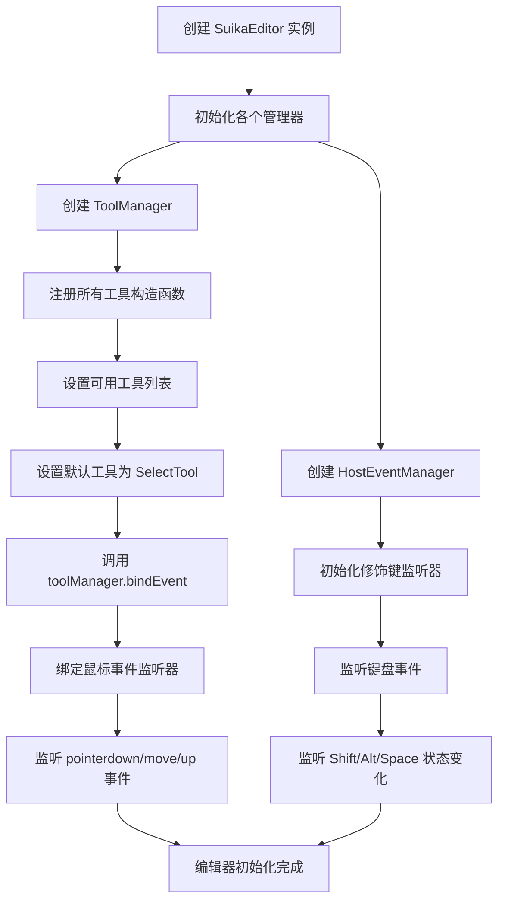
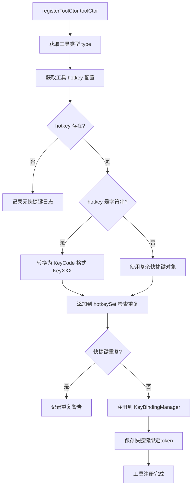
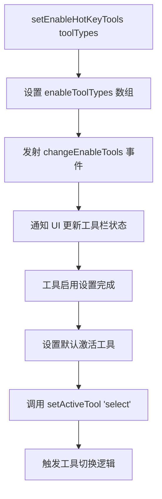
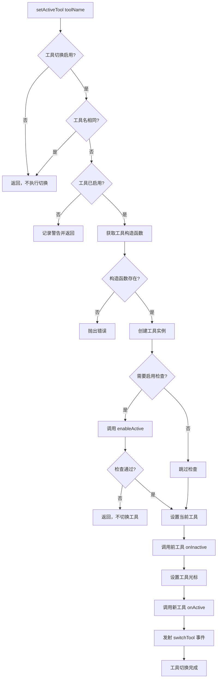
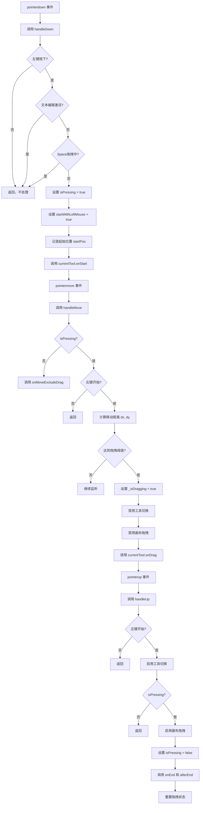
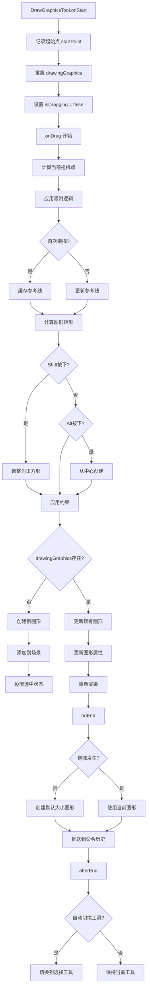
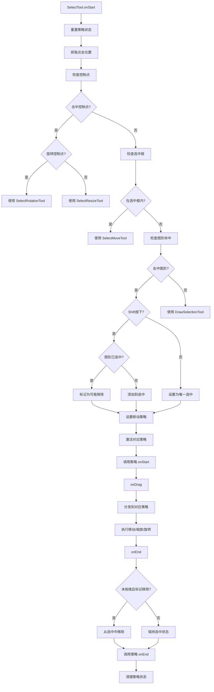

# Suika 编辑器基本工具系统完整流程文档

## 概述

本文档详细描述了 Suika 编辑器中基本工具系统的完整实现流程，包括从初始化到工具切换、事件处理的各个阶段。

## 🔍 流程图查看指南

**如果您的 Markdown 查看器不支持 Mermaid 图表渲染，请使用以下在线工具查看：**

1. **Mermaid Live Editor**: <https://mermaid.live/>
2. **复制下方任一流程图代码块 → 粘贴到在线编辑器 → 查看可视化流程图**

## 核心组件

### 1. ToolManager 类

位置：`packages/core/src/tools/tool_manager.ts`

#### 主要功能

- 管理所有工具的注册和切换
- 处理工具快捷键绑定
- 管理工具状态（激活/非激活）
- 处理工具拖拽状态
- 控制工具启用/禁用
- 协调鼠标事件分发

#### 核心属性

```typescript
private toolCtorMap = new Map<string, IToolClassConstructor>(); // 工具构造函数映射
private hotkeySet = new Set<string>(); // 快捷键集合
private currentTool: ITool | null = null; // 当前激活工具
private _isDragging = false; // 拖拽状态
private enableToolTypes: string[] = []; // 启用的工具列表
```

#### 关键方法

- `registerToolCtor()`: 注册工具构造函数
- `setActiveTool()`: 设置当前激活工具
- `setEnableHotKeyTools()`: 设置可用的快捷键工具
- `isDragging()`: 检查拖拽状态

### 2. ITool 接口

位置：`packages/core/src/tools/type.ts`

#### 接口定义

```typescript
interface ITool {
  type: string; // 工具类型
  hotkey: string | IKey; // 快捷键
  cursor: ICursor; // 光标类型

  onActive(): void; // 激活时调用
  onInactive(): void; // 非激活时调用
  onStart(event: PointerEvent): void; // 开始操作
  onDrag(event: PointerEvent): void; // 拖拽中
  onEnd(event: PointerEvent, isDragHappened: boolean): void; // 结束操作
  onMoveExcludeDrag(event: PointerEvent, isOutsideCanvas: boolean): void; // 移动事件

  // 可选方法
  enableActive?(): Promise<boolean>; // 启用检查
  getDragBlockStep?(): number; // 拖拽步长
}
```

### 3. DrawGraphicsTool 基类

位置：`packages/core/src/tools/tool_draw_graphics.ts`

#### 主要功能

- 提供绘图工具的通用逻辑
- 处理拖拽、预览、创建等通用功能
- 支持约束操作（Shift正方形、Alt居中）
- 处理吸附和参考线

#### 核心特性

- **约束操作**:
  - `Shift`: 创建正方形/圆形
  - `Alt`: 从中心创建
  - `Space`: 临时切换到抓手工具

- **吸附系统**: 支持网格吸附和对象吸附

### 4. HostEventManager 类

位置：`packages/core/src/host_event_manager/host_event_manager.ts`

#### 主要功能

- 封装原生事件处理
- 监听修饰键状态（Shift/Alt/Space）
- 管理键盘和鼠标事件
- 协调工具和命令的交互

## 系统架构

```text
┌─────────────────────────────────────────────────┐
│                 SuikaEditor                     │
│  ┌─────────────────────────────────────────┐    │
│  │           ToolManager                   │    │
│  │  ┌─────────────────────────────────┐   │    │
│  │  │     toolCtorMap                 │   │    │
│  │  │  type => ToolConstructor       │   │    │
│  │  └─────────────────────────────────┘   │    │
│  │  ┌─────────────────────────────────┐   │    │
│  │  │     currentTool                 │   │    │
│  │  │  ITool instance                 │   │    │
│  │  └─────────────────────────────────┘   │    │
│  └─────────────────────────────────────────┘    │
│                                                 │
│  ┌─────────────────────────────────────────┐    │
│  │        HostEventManager               │    │
│  │  ┌─────────────────────────────────┐   │    │
│  │  │   Modifier Keys State          │   │    │
│  │  │  ├─ isShiftPressing            │   │    │
│  │  │  ├─ isAltPressing              │   │    │
│  │  │  ├─ isSpacePressing            │   │    │
│  │  │  └─ ...                        │   │    │
│  │  └─────────────────────────────────┘   │    │
│  └─────────────────────────────────────────┘    │
│                                                 │
│  ┌─────────────────────────────────────────┐    │
│  │         具体工具实现                    │    │
│  │  ┌─────────────────────────────────┐   │    │
│  │  │   SelectTool                    │   │    │
│  │  │   DrawRectTool                  │   │    │
│  │  │   DrawEllipseTool               │   │    │
│  │  │   DrawPathTool                  │   │    │
│  │  │   ...                           │   │    │
│  │  └─────────────────────────────────┘   │    │
│  └─────────────────────────────────────────┘    │
└─────────────────────────────────────────────────┘
```

## 完整流程图

### 📋 Phase 1: 初始化阶段 (复制下方代码块到 mermaid.live 查看)



### Phase 2: 工具注册阶段

#### 🔧 2.1 工具注册流程 (复制下方代码块到 mermaid.live 查看)



#### 🎯 2.2 工具启用设置流程 (复制下方代码块到 mermaid.live 查看)



### ⚡ Phase 3: 工具切换阶段 (复制下方代码块到 mermaid.live 查看)



### 🖱️ Phase 4: 鼠标事件处理阶段 (复制下方代码块到 mermaid.live 查看)



### 🎨 Phase 5: 绘图工具工作流程 (复制下方代码块到 mermaid.live 查看)



### 🔄 Phase 6: 选择工具工作流程 (复制下方代码块到 mermaid.live 查看)



## 详细流程说明

### 1. 初始化流程

#### 1.1 编辑器初始化

```typescript
// 在 SuikaEditor 构造函数中
this.toolManager = new ToolManager(this);
this.hostEventManager = new HostEventManager(this);

// ToolManager 构造函数执行
// 1. 注册所有工具
this.registerToolCtor(SelectTool);
this.registerToolCtor(DrawRectTool);
// ... 更多工具

// 2. 设置可用工具
this.setEnableHotKeyTools([
  SelectTool.type,
  DrawRectTool.type,
  // ...
]);

// 3. 设置默认工具
this.setActiveTool(SelectTool.type);

// 4. 绑定事件
this._unbindEvent = this.bindEvent();
```

#### 1.2 事件绑定

```typescript
private bindEvent() {
  // 绑定鼠标事件
  canvas.addEventListener('pointerdown', handleDown);
  window.addEventListener('pointermove', handleMove);
  window.addEventListener('pointerup', handleUp);

  // 绑定工具相关事件
  this.editor.commandManager.on('change', handleCommandChange);
  this.editor.hostEventManager.on('spaceToggle', handleSpaceToggle);
  // ... 更多事件绑定
}
```

### 2. 工具注册流程

#### 2.1 工具构造函数注册

```typescript
private registerToolCtor(toolCtor: IToolClassConstructor) {
  const type = toolCtor.type;
  const hotkey = toolCtor.hotkey;

  // 注册到构造函数映射
  this.toolCtorMap.set(type, toolCtor);

  // 处理快捷键
  if (hotkey) {
    const keyCode = typeof hotkey === 'string'
      ? `Key${hotkey.toUpperCase()}`
      : hotkey.keyCode;

    // 检查快捷键重复
    if (this.hotkeySet.has(keyCode)) {
      console.log(`register same hotkey: "${keyCode}"`);
    }

    // 注册快捷键绑定
    const token = this.editor.keybindingManager.register({
      key: hotkeyObj,
      actionName: type,
      when: () => this.enableToolTypes.includes(type),
      action: () => this.setActiveTool(type),
    });

    this.keyBindingToken.push(token);
  }
}
```

#### 2.2 工具实例化

```typescript
async setActiveTool(toolName: string) {
  // 检查和验证
  if (!this.enableSwitchTool || this.getActiveToolName() === toolName) {
    return;
  }

  if (!this.enableToolTypes.includes(toolName)) {
    console.warn(`target tool "${toolName}" is not enable`);
    return;
  }

  // 获取构造函数并创建实例
  const currentToolCtor = this.toolCtorMap.get(toolName);
  const currentTool = new currentToolCtor(this.editor);

  // 启用检查
  if (currentTool.enableActive) {
    const canActive = await currentTool.enableActive();
    if (!canActive) return;
  }

  // 切换工具
  const prevTool = this.currentTool;
  this.currentTool = currentTool;

  prevTool && prevTool.onInactive();
  this.setCursorWhenActive();
  currentTool.onActive();

  this.eventEmitter.emit('switchTool', currentTool.type);
}
```

### 3. 鼠标事件处理流程

#### 3.1 事件捕获和分发

```typescript
// handleDown - 鼠标按下
const handleDown = (e: PointerEvent) => {
  // 各种检查（左键、文本编辑、空格拖拽等）
  if (/* 检查失败 */) return;

  isPressing = true;
  startWithLeftMouse = true;
  startPos = { x: e.clientX, y: e.clientY };

  this.currentTool.onStart(e);
};

// handleMove - 鼠标移动
const handleMove = (e: PointerEvent) => {
  if (isPressing && startWithLeftMouse) {
    // 计算拖拽距离
    const dx = e.clientX - startPos.x;
    const dy = e.clientY - startPos.y;

    // 检查是否达到拖拽阈值
    if (!this._isDragging && (Math.abs(dx) > dragBlockStep || Math.abs(dy) > dragBlockStep)) {
      this._isDragging = true;
      this.enableSwitchTool = false;
      this.editor.canvasDragger.disableDragBySpace();
      this.currentTool.onDrag(e);
    }
  } else {
    const isOutsideCanvas = this.editor.canvasElement !== e.target;
    this.currentTool.onMoveExcludeDrag(e, isOutsideCanvas);
  }
};
```

#### 3.2 绘图工具的具体实现

```typescript
// DrawGraphicsTool.onDrag
onDrag(e: PointerEvent) {
  // 计算拖拽点（带吸附）
  this.lastDragPoint = SnapHelper.getSnapPtBySetting(
    this.editor.getSceneCursorXY(e),
    this.editor.setting
  );

  // 应用对象吸附
  const offset = this.editor.refLine.getGraphicsSnapOffset([this.lastDragPoint]);
  this.lastDragPoint = {
    x: this.lastDragPoint.x + offset.x,
    y: this.lastDragPoint.y + offset.y,
  };

  this.isDragging = true;
  this.updateRect();
}

// updateRect - 更新图形
private updateRect() {
  const { x, y } = this.lastDragPoint;
  const { x: startX, y: startY } = this.startPoint;

  let width = x - startX;
  let height = y - startY;

  // 处理零宽高情况
  if (width === 0 || height === 0) {
    const size = this.solveWidthOrHeightIsZero({ width, height }, /* delta */);
    width = size.width;
    height = size.height;
  }

  let rect = { x: startX, y: startY, width, height };

  // 应用约束
  const isStartPtAsCenter = this.editor.hostEventManager.isAltPressing;
  const keepSquare = this.editor.hostEventManager.isShiftPressing;

  if (keepSquare) {
    rect = this.adjustSizeWhenShiftPressing(rect);
  }

  if (isStartPtAsCenter) {
    rect = {
      x: rect.x - width,
      y: rect.y - height,
      width: rect.width * 2,
      height: rect.height * 2,
    };
  }

  // 创建或更新图形
  if (this.drawingGraphics) {
    this.updateGraphics(rect);
  } else {
    this.createGraphics(rect, parent);
  }

  this.editor.render();
}
```

### 4. 选择工具的策略模式

#### 4.1 策略选择逻辑

```typescript
// SelectTool.onStart
onStart(e: PointerEvent) {
  this.startPoint = this.editor.getSceneCursorXY(e);

  // 检查控制点
  const handleInfo = this.editor.controlHandleManager.getHandleInfoByPoint(this.startPoint);

  if (handleInfo) {
    if (isRotationCursor(handleInfo.cursor)) {
      this.strategySelectRotation.handleType = handleInfo.handleName;
      this.currStrategy = this.strategySelectRotation;
    } else {
      this.currStrategy = this.strategySelectResize;
    }
  } else {
    const isInsideSelectedBox = this.editor.selectedBox.hitTest(this.startPoint);
    const topHitElement = getTopHitElement(this.editor, this.startPoint);

    if (isInsideSelectedBox) {
      this.currStrategy = this.strategyMove;
    } else if (topHitElement) {
      // 处理选中逻辑
      if (!isShiftPressing) {
        selectedElements.setItems([topHitElement]);
      } else {
        selectedElements.toggleItems([topHitElement]);
      }
      this.currStrategy = this.strategyMove;
    } else {
      this.currStrategy = this.strategyDrawSelection;
    }
  }

  if (this.currStrategy) {
    this.currStrategy.onActive();
    this.currStrategy.onStart(e);
  }
}
```

### 5. 工具生命周期管理

#### 5.1 工具激活和非激活

```typescript
// 工具激活
onActive() {
  // 绑定事件监听器
  this.editor.selectedElements.on('hoverItemChange', this.handleHoverItemChange);
  this.editor.mouseEventManager.on('comboClick', this.onComboClick);

  // 工具特定的初始化
  // ...
}

// 工具非激活
onInactive() {
  // 清理事件监听器
  this.editor.selectedElements.off('hoverItemChange', this.handleHoverItemChange);
  this.editor.mouseEventManager.off('comboClick', this.onComboClick);

  // 清理状态
  this.editor.selectedElements.setHighlightedItem(null);
  // ...
}
```

#### 5.2 资源清理

```typescript
// ToolManager.destroy
destroy() {
  this.currentTool?.onInactive();
}

// ToolManager.unbindEvent
unbindEvent() {
  this._unbindEvent();
  this._unbindEvent = noop;
  this.unbindHotkey();
}
```

## 工具列表

### 选择和编辑工具

| 工具 | 类型 | 快捷键 | 光标 | 功能描述 |
|------|------|--------|------|----------|
| 选择工具 | `select` | `V` | `default` | 选择、移动、缩放、旋转图形 |
| 路径选择 | `pathSelect` | 双击路径 | - | 编辑路径节点和控制点 |

### 绘图工具

| 工具 | 类型 | 快捷键 | 光标 | 功能描述 |
|------|------|--------|------|----------|
| 矩形 | `drawRect` | `R` | `crosshair` | 创建矩形图形 |
| 椭圆 | `drawEllipse` | `O` | `crosshair` | 创建椭圆/圆形图形 |
| 直线 | `drawLine` | `L` | `crosshair` | 创建直线图形 |
| 路径 | `drawPath` | `P` | `crosshair` | 创建多段线路径 |
| 钢笔 | `drawPen` | - | `crosshair` | 创建贝塞尔曲线路径 |
| 铅笔 | `pencil` | - | `crosshair` | 自由绘制路径 |
| 文本 | `drawText` | `T` | `text` | 创建文本图形 |
| 图片 | `drawImg` | `I` | `crosshair` | 创建图片图形 |
| 画板 | `drawFrame` | `F` | `crosshair` | 创建画板容器 |

### 高级形状工具

| 工具 | 类型 | 快捷键 | 光标 | 功能描述 |
|------|------|--------|------|----------|
| 正多边形 | `drawRegularPolygon` | - | `crosshair` | 创建正多边形 |
| 星星 | `drawStar` | - | `crosshair` | 创建星形图形 |

### 视图工具

| 工具 | 类型 | 快捷键 | 光标 | 功能描述 |
|------|------|--------|------|----------|
| 抓手 | `dragCanvas` | `H` / `Space` | `grab` | 拖拽画布视图 |

## 约束操作

### 绘图工具约束

| 修饰键 | 功能 | 适用工具 |
|--------|------|----------|
| `Shift` | 创建正方形/圆形 | 矩形、椭圆工具 |
| `Alt` | 从中心创建 | 所有绘图工具 |
| `Space` | 临时抓手工具 | 所有工具 |

### 选择工具约束

| 修饰键 | 功能 | 说明 |
|--------|------|------|
| `Shift` | 多选/切换选中 | 点击添加/移除选中项 |
| `Alt` | - | - |

## 吸附系统

### 网格吸附

- 基于设置的网格大小自动吸附
- 可通过设置开启/关闭

### 对象吸附

- 检测图形之间的对齐关系
- 显示参考线和吸附点
- 支持中心线和边缘对齐

## 技术特点

### 1. 模块化设计

- **工具接口标准化**: 所有工具实现统一的 `ITool` 接口
- **策略模式**: 选择工具使用策略模式处理不同操作
- **继承体系**: 绘图工具继承 `DrawGraphicsTool` 基类

### 2. 事件驱动架构

- **统一事件处理**: 通过 `ToolManager` 统一分发鼠标事件
- **状态管理**: 集中管理工具状态和拖拽状态
- **生命周期管理**: 完善的工具激活/非激活生命周期

### 3. 性能优化

- **节流处理**: 鼠标移动事件使用节流优化
- **延迟初始化**: 工具实例延迟创建
- **资源清理**: 完善的内存管理和事件解绑

### 4. 可扩展性

- **插件化注册**: 新工具通过注册机制添加
- **配置化**: 工具可用性通过配置控制
- **组合操作**: 支持修饰键的组合操作

## 扩展指南

### 添加新的绘图工具

1. **继承基类**:

   ```typescript
   export class DrawMyShapeTool extends DrawGraphicsTool implements ITool {
     static override readonly type = 'drawMyShape';
     static override readonly hotkey = 'M';

     protected override createGraphics(rect: IRect, parent: SuikaGraphics) {
       // 创建自定义图形
       return new MyShapeGraphics({ ... });
     }
   }
   ```

2. **注册工具**:

   ```typescript
   // 在 ToolManager 构造函数中
   this.registerToolCtor(DrawMyShapeTool);
   this.setEnableHotKeyTools([...existingTools, DrawMyShapeTool.type]);
   ```

### 添加新的选择策略

1. **实现策略类**:

   ```typescript
   export class SelectMyOperationTool implements IBaseTool {
     onStart(e: PointerEvent) { /* 自定义逻辑 */ }
     onDrag(e: PointerEvent) { /* 自定义逻辑 */ }
     onEnd(e: PointerEvent, isDrag: boolean) { /* 自定义逻辑 */ }
     // ... 其他接口方法
   }
   ```

2. **集成到选择工具**:

   ```typescript
   // 在 SelectTool 中添加策略
   private readonly strategyMyOperation: SelectMyOperationTool;

   constructor(editor: SuikaEditor) {
     this.strategyMyOperation = new SelectMyOperationTool(editor);
   }
   ```

## 总结

Suika 编辑器的工具系统采用了高度模块化和可扩展的设计，通过统一的接口规范、策略模式和事件驱动架构，实现了复杂的设计工具功能。系统支持丰富的约束操作、吸附系统和性能优化，为用户提供了流畅的设计体验。

工具系统作为编辑器的核心交互层，承担着用户操作到图形更新的桥梁作用，其设计直接影响了编辑器的易用性和扩展性。
