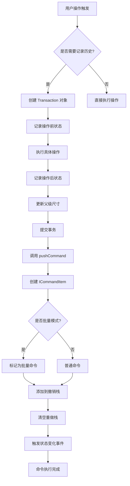
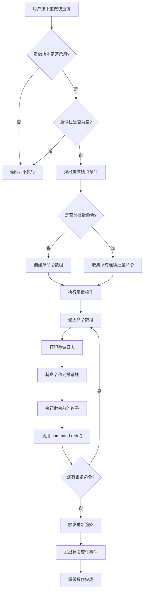
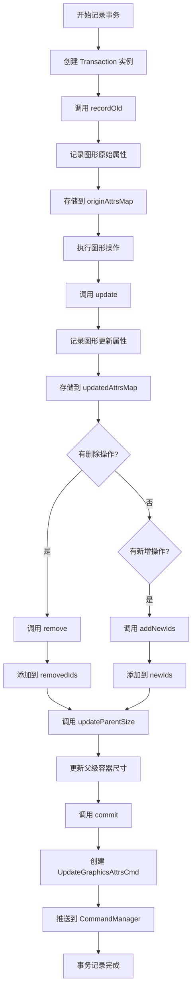
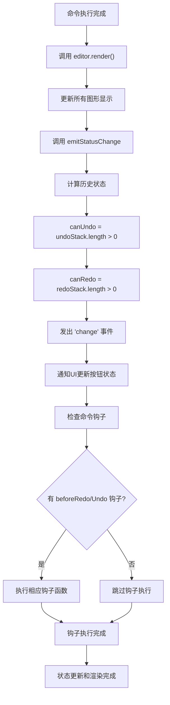

# Suika 编辑器历史记录设计的完整流程文档

## 概述

本文档详细描述了 Suika 编辑器中历史记录系统的完整设计和实现流程，包括撤销/重做机制、事务管理、命令模式和状态持久化的各个阶段。

## 🔍 流程图查看指南

**如果您的 Markdown 查看器不支持 Mermaid 图表渲染，请使用以下在线工具查看：**

1. **Mermaid Live Editor**: <https://mermaid.live/>
2. **复制下方任一流程图代码块 → 粘贴到在线编辑器 → 查看可视化流程图**

## 核心组件

### 1. CommandManager 类

位置：`packages/core/src/commands/command_manager.ts`

#### 主要功能

- 管理撤销/重做命令栈
- 处理批量命令执行
- 提供状态监听和事件通知
- 支持命令的条件执行和钩子函数

#### 核心属性

```typescript
class CommandManager {
  private redoStack: ICommandItem[] = [];    // 重做栈
  private undoStack: ICommandItem[] = [];    // 撤销栈
  private isEnableRedoUndo = true;           // 是否启用撤销重做
  private isBatching = false;                // 是否正在批量执行
}
```

#### 关键接口

```typescript
interface IHistoryStatus {
  canRedo: boolean;  // 是否可以重做
  canUndo: boolean;  // 是否可以撤销
}

interface ICommandItem {
  command: ICommand;           // 命令对象
  isBatched?: boolean;         // 是否为批量命令
  hooks?: {                    // 钩子函数
    beforeRedo?: () => void;
    beforeUndo?: () => void;
  };
}
```

### 2. Transaction 类

位置：`packages/core/src/transaction.ts`

#### 主要功能

- 记录图形状态变化的事务
- 管理原始状态和更新状态的映射
- 处理新增和删除图形的跟踪
- 自动更新父级容器尺寸

#### 核心属性

```typescript
class Transaction {
  private originAttrsMap = new Map<string, Partial<GraphicsAttrs>>(); // 原始属性映射
  private updatedAttrsMap = new Map<string, Partial<GraphicsAttrs>>(); // 更新属性映射
  private removedIds = new Set<string>();     // 删除的图形ID集合
  private newIds = new Set<string>();         // 新增的图形ID集合
  private isCommitDone = false;               // 是否已提交
}
```

### 3. UpdateGraphicsAttrsCmd 命令

位置：`packages/core/src/commands/update_graphics_attrs_cmd.ts`

#### 主要功能

- 执行图形的属性更新操作
- 支持撤销和重做操作
- 处理图形的新增、删除和修改
- 维护图形的父子关系

#### ICommand 接口

```typescript
interface ICommand {
  desc: string;      // 命令描述
  redo(): void;      // 执行重做
  undo(): void;      // 执行撤销
}
```

## 完整流程图

### 📋 Phase 1: 命令执行和记录阶段 (复制下方代码块到 mermaid.live 查看)



### Phase 2: 撤销操作流程 (复制下方代码块到 mermaid.live 查看)


### Phase 3: 重做操作流程 (复制下方代码块到 mermaid.live 查看)



### Phase 4: 事务记录流程 (复制下方代码块到 mermaid.live 查看)



### Phase 5: 状态更新和渲染 (复制下方代码块到 mermaid.live 查看)



## 详细流程说明

### 1. 命令管理器架构

#### 1.1 双栈设计

```typescript
class CommandManager {
  private undoStack: ICommandItem[] = [];  // 撤销栈：存储已执行的命令
  private redoStack: ICommandItem[] = [];  // 重做栈：存储已撤销的命令
}
```

**工作原理**：
- 执行新命令时：推入 `undoStack`，清空 `redoStack`
- 撤销时：从 `undoStack` 弹出，推入 `redoStack`
- 重做时：从 `redoStack` 弹出，推入 `undoStack`

#### 1.2 批量命令支持

```typescript
// 开始批量模式
commandManager.batchCommandStart();

// 执行多个相关命令
// ...

// 结束批量模式
commandManager.batchCommandEnd();
```

**批量执行特点**：
- 连续的批量命令被视为一个操作单元
- 撤销/重做时同时处理所有批量命令
- 支持复杂的复合操作记录

### 2. 事务记录机制

#### 2.1 状态映射管理

```typescript
class Transaction {
  // 原始状态映射：ID -> 原始属性
  private originAttrsMap = new Map<string, Partial<GraphicsAttrs>>();

  // 更新状态映射：ID -> 更新属性
  private updatedAttrsMap = new Map<string, Partial<GraphicsAttrs>>();

  // 删除和新增跟踪
  private removedIds = new Set<string>();
  private newIds = new Set<string>();
}
```

#### 2.2 记录方法

```typescript
// 记录操作前的状态
transaction.recordOld(graphId, {
  transform: cloneDeep(graph.attrs.transform),
  // 其他需要记录的属性
});

// 记录操作后的状态
transaction.update(graphId, {
  transform: cloneDeep(graph.attrs.transform),
  // 更新的属性
});
```

#### 2.3 事务提交

```typescript
transaction.commit('Move Elements');

// 内部执行：
commandManager.pushCommand(
  new UpdateGraphicsAttrsCmd(
    'Move Elements',
    editor,
    originAttrsMap,
    updatedAttrsMap,
    removedIds,
    newIds,
  )
);
```

### 3. 命令执行和撤销

#### 3.1 UpdateGraphicsAttrsCmd 执行逻辑

**重做 (redo) 操作**：

```typescript
redo() {
  // 应用更新后的属性
  for (const [id, attrs] of this.updatedAttrsMap) {
    const graphics = doc.getGraphicsById(id);
    if (attrs.parentIndex) {
      graphics.removeFromParent();  // 先从父级移除
    }
    graphics.updateAttrs(attrs);     // 更新属性
    if (attrs.parentIndex) {
      graphics.insertAtParent(attrs.parentIndex.position); // 重新插入到正确位置
    }
  }

  // 处理删除的图形
  for (const id of this.removedIds) {
    const graphics = doc.getGraphicsById(id);
    graphics.setDeleted(true);
    graphics.removeFromParent();
  }

  // 处理新增的图形
  for (const id of this.newIds) {
    const graphics = doc.getGraphicsById(id);
    graphics.setDeleted(false);
    graphics.insertAtParent(graphics.attrs.parentIndex!.position);
  }
}
```

**撤销 (undo) 操作**：

```typescript
undo() {
  // 恢复原始属性
  for (const [id, attrs] of this.originAttrsMap) {
    const graphics = doc.getGraphicsById(id);
    if (attrs.parentIndex) {
      graphics.removeFromParent();
    }
    graphics.updateAttrs(attrs);
    if (attrs.parentIndex) {
      graphics.insertAtParent(attrs.parentIndex!.position);
    }
  }

  // 恢复删除的图形
  for (const id of this.removedIds) {
    const graphics = doc.getGraphicsById(id);
    graphics.setDeleted(false);
    graphics.insertAtParent(graphics.attrs.parentIndex!.position);
  }

  // 移除新增的图形
  for (const id of this.newIds) {
    const graphics = doc.getGraphicsById(id);
    graphics.setDeleted(true);
    graphics.removeFromParent();
  }

  // 清空选择状态
  if (this.newIds.size !== 0) {
    this.editor.selectedElements.clear();
  }
}
```

### 4. 快捷键绑定

#### 4.1 撤销快捷键

```typescript
// Mac: Cmd + Z
// Windows: Ctrl + Z
editor.keybindingManager.register({
  key: { metaKey: true, keyCode: 'KeyZ' },
  winKey: { ctrlKey: true, keyCode: 'KeyZ' },
  when: (ctx) => !ctx.isToolDragging,
  actionName: 'Undo',
  action: () => editor.commandManager.undo(),
});
```

#### 4.2 重做快捷键

```typescript
// Mac: Cmd + Shift + Z
// Windows: Ctrl + Shift + Z
editor.keybindingManager.register({
  key: { metaKey: true, shiftKey: true, keyCode: 'KeyZ' },
  winKey: { ctrlKey: true, shiftKey: true, keyCode: 'KeyZ' },
  when: (ctx) => !ctx.isToolDragging,
  actionName: 'Redo',
  action: () => editor.commandManager.redo(),
});
```

### 5. 批量操作处理

#### 5.1 批量撤销逻辑

```typescript
undo() {
  const topCmdItem = this.undoStack.pop()!;
  const isBatched = topCmdItem.isBatched;
  const cmdItems: ICommandItem[] = [topCmdItem];

  // 如果是批量命令，收集所有连续的批量命令
  if (isBatched) {
    while (this.undoStack.length > 0 && this.undoStack.at(-1)!.isBatched) {
      const currCmdItem = this.undoStack.pop()!;
      cmdItems.push(currCmdItem);
    }
  }

  // 逆序执行所有命令的撤销操作
  for (const cmdItem of cmdItems) {
    this.redoStack.push(cmdItem);
    cmdItem.hooks?.beforeUndo?.();
    cmdItem.command.undo();
  }
}
```

#### 5.2 批量重做逻辑

```typescript
redo() {
  const topCmdItem = this.redoStack.pop()!;
  const isBatched = topCmdItem.isBatched;
  const cmdItems: ICommandItem[] = [topCmdItem];

  // 如果是批量命令，收集所有连续的批量命令
  if (isBatched) {
    while (this.redoStack.length > 0 && this.redoStack.at(-1)!.isBatched) {
      const currCmdItem = this.redoStack.pop()!;
      cmdItems.push(currCmdItem);
    }
  }

  // 顺序执行所有命令的重做操作
  for (const cmdItem of cmdItems) {
    this.undoStack.push(cmdItem);
    cmdItem.hooks?.beforeRedo?.();
    cmdItem.command.redo();
  }
}
```

## 关键算法分析

### 1. 双栈状态管理算法

**核心思想**：
- **撤销栈**：存储已执行且可撤销的命令
- **重做栈**：存储已撤销且可重做的命令
- **栈操作**：执行新命令时清空重做栈，确保历史的一致性

**状态转换**：
```
初始状态: undoStack = [], redoStack = []

执行命令A: undoStack = [A], redoStack = []
执行命令B: undoStack = [A, B], redoStack = []
撤销命令B: undoStack = [A], redoStack = [B]
撤销命令A: undoStack = [], redoStack = [B, A]
执行命令C: undoStack = [C], redoStack = [] (重做栈被清空)
```

### 2. 事务完整性保证算法

**状态一致性检查**：

```typescript
constructor(...) {
  if (originAttrsMap.size !== updatedAttrsMap.size) {
    console.warn('originAttrsMap 和 updatedAttrsMap 数量不匹配');
  }
}
```

**原因**：
- 确保每个记录的原始状态都有对应的更新状态
- 防止部分状态记录丢失导致的撤销重做错误
- 提供调试信息帮助定位问题

### 3. 图形生命周期管理算法

**删除/恢复逻辑**：

```typescript
// 删除操作
graphics.setDeleted(true);
graphics.removeFromParent();

// 恢复操作
graphics.setDeleted(false);
graphics.insertAtParent(position);
```

**设计考虑**：
- **软删除**：保留图形对象，避免内存泄漏
- **父子关系维护**：正确处理图形在层级结构中的位置
- **选择状态清理**：新增图形撤销时清空选择状态

## 技术特点

### 1. 命令模式实现

- **封装操作**：每个操作都被封装为可撤销的命令对象
- **统一接口**：所有命令实现相同的 `ICommand` 接口
- **状态隔离**：命令之间相互独立，不产生副作用

### 2. 事务原子性

- **完整记录**：记录操作前后的完整状态
- **批量处理**：支持多个相关操作的原子提交
- **回滚保证**：确保撤销操作能够完全恢复到原始状态

### 3. 性能优化

- **延迟提交**：键盘移动等连续操作使用防抖优化
- **选择性记录**：只记录必要的状态变化
- **内存管理**：及时清理不需要的历史记录

### 4. 可扩展性

- **钩子机制**：支持命令执行前后的自定义逻辑
- **批量支持**：允许复杂的复合操作记录
- **类型安全**：TypeScript 提供完整的类型检查

## 使用场景

### 1. 图形编辑操作

- **移动图形**：拖拽或键盘移动位置
- **调整属性**：修改颜色、大小、旋转角度等
- **形状变换**：缩放、旋转、镜像等几何变换

### 2. 批量操作场景

- **多选编辑**：同时修改多个图形的属性
- **对齐操作**：左对齐、居中对齐等布局调整
- **分布排列**：图层顺序的批量调整

### 3. 复合操作场景

- **复杂编辑**：涉及多个步骤的复杂操作
- **撤销重做**：支持任意层级的操作回退
- **状态恢复**：确保编辑过程的可逆性

## 扩展指南

### 1. 添加新的历史记录命令

```typescript
// 1. 实现 ICommand 接口
class CustomCommand implements ICommand {
  desc = 'Custom Operation';

  redo() {
    // 执行操作的逻辑
  }

  undo() {
    // 撤销操作的逻辑
  }
}

// 2. 在适当位置提交命令
const transaction = new Transaction(editor);
// 记录状态...
transaction.commit('Custom Operation');
```

### 2. 支持批量操作

```typescript
// 开始批量模式
editor.commandManager.batchCommandStart();

// 执行多个相关操作
// 每个操作都会被标记为批量命令

// 结束批量模式
editor.commandManager.batchCommandEnd();
```

### 3. 添加命令钩子

```typescript
editor.commandManager.pushCommand(command, {
  beforeRedo: () => {
    // 重做前的准备工作
  },
  beforeUndo: () => {
    // 撤销前的清理工作
  },
});
```

## 总结

Suika 编辑器的历史记录系统通过精心设计的命令模式和事务管理，实现了强大而可靠的撤销重做功能。系统支持复杂的批量操作、状态完整性保证和性能优化，为用户提供了专业级的编辑体验。

历史记录系统作为编辑器的核心基础设施，其设计直接影响了用户的工作流程和操作安全性。通过双栈架构、事务原子性和命令模式的结合，系统能够在各种编辑场景下提供一致和可靠的历史管理功能。
