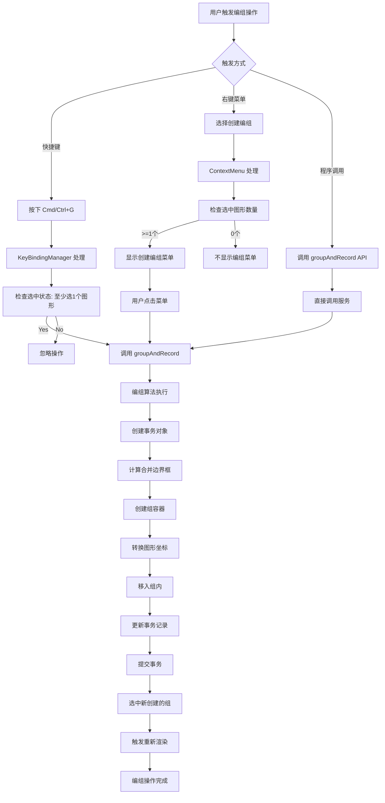
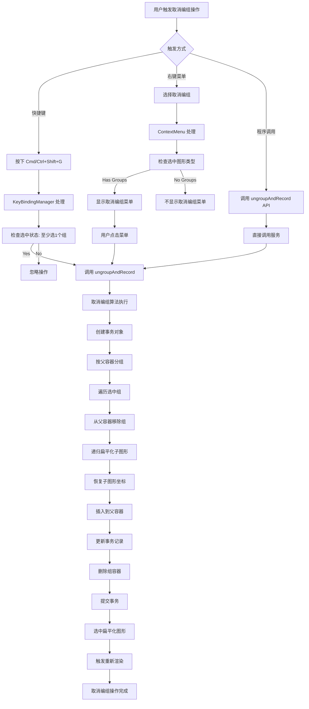
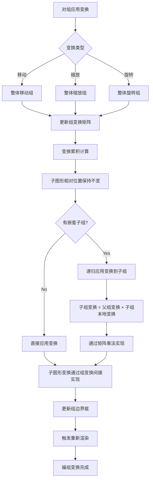

# Suika 编辑器编组功能完整流程文档

## 概述

本文档详细描述了 Suika 编辑器中编组功能（Group）的完整实现流程，包括从创建编组、取消编组到组管理的各个阶段。编组功能允许用户将多个图形组合成逻辑单元，实现整体移动、缩放、旋转等操作。

## 🔍 流程图查看指南

**如果您的 Markdown 查看器不支持 Mermaid 图表渲染，请使用以下在线工具查看：**

1. **Mermaid Live Editor**: https://mermaid.live/
2. **复制下方任一流程图代码块 → 粘贴到在线编辑器 → 查看可视化流程图**

## 核心组件

### 1. GroupAndRecordService 类

位置：`packages/core/src/service/group_and_record.ts`

#### 主要功能

- 实现创建编组的核心算法
- 计算多个图形的合并边界框
- 将图形移入组内并转换坐标系
- 记录事务以支持撤销/重做操作

#### 核心属性

```typescript
export const groupAndRecord = (
  graphicsArr: SuikaGraphics[],  // 要编组的图形数组
  editor: SuikaEditor,           // 编辑器实例
) => {
  // 实现编组逻辑
};
```

### 2. UngroupAndRecordService 类

位置：`packages/core/src/service/ungroup_and_record.ts`

#### 主要功能

- 实现取消编组的核心算法
- 递归处理嵌套编组
- 将子图形移出组并恢复坐标系
- 支持撤销/重做操作

#### 核心属性

```typescript
export const ungroupAndRecord = (
  graphicsArr: SuikaGraphics[],  // 要取消编组的组数组
  editor: SuikaEditor,           // 编辑器实例
) => {
  // 实现取消编组逻辑
};
```

### 3. SuikaFrame 类（组容器）

位置：`packages/core/src/graphics/frame/frame.ts`

#### 主要功能

- 作为编组的容器实现
- 支持嵌套编组结构
- 提供组管理的接口方法

#### 核心特性

```typescript
class SuikaFrame extends SuikaGraphics {
  // 组相关属性
  isGroup(): boolean {
    return this.attrs.resizeToFit === true;
  }

  // 组图标路径
  getLayerIconPath() {
    if (this.isGroup()) {
      return 'M7 1H5V2H7V1ZM9.5 10H10V9.5H11V11H9.5V10ZM2 5V7H1V5H2ZM10 2.5V2H9.5V1H11V2.5H10ZM10 5V7H11V5H10ZM2 2.5V2H2.5V1H1V2.5H2ZM1 9.5H2V10H2.5V11H1V9.5ZM7 10H5V11H7V10Z';
    }
    // 画板图标
    return 'M4 0.5V3H8V0.5H9V3H11.5V4H9V8H11.5V9H9V11.5H8V9H4V11.5H3V9H0.5V8H3V4H0.5V3H3V0.5H4ZM8 8V4H4V8H8Z';
  }
}
```

## 完整流程图

### 📋 Phase 1: 创建编组流程 (复制下方代码块到 mermaid.live 查看)



### Phase 2: 取消编组流程 (复制下方代码块到 mermaid.live 查看)



### Phase 3: 编组变换流程 (复制下方代码块到 mermaid.live 查看)



## 详细流程说明

### 1. 创建编组流程

#### 1.1 触发方式

**快捷键触发**:
```typescript
// Cmd+G (Mac) 或 Ctrl+G (Windows)
const groupAction = () => {
  groupAndRecord(editor.selectedElements.getItems(), editor);
  editor.render();
};
```

**右键菜单触发**:
```typescript
<ContextMenuItem onClick={() => {
  groupAndRecord(editor.selectedElements.getItems(), editor);
}}>
  创建编组
</ContextMenuItem>
```

#### 1.2 边界框计算

```typescript
// 计算所有选中图形的合并边界框
const boundRect = boxToRect(
  mergeBoxes(
    graphicsArr.map((el) => {
      return calcRectBbox({
        ...el.getSize(),
        transform: multiplyMatrix(
          parentOfGroupInvertTf,  // 转换为父容器坐标系
          el.getWorldTransform(),
        ),
      });
    }),
  ),
);
```

#### 1.3 创建组容器

```typescript
// 创建编组容器
const group = new SuikaFrame({
  objectName: getNoConflictObjectName(
    parentOfGroup,
    GraphicsObjectSuffix.Group,  // "组"
  ),
  width: boundRect.width,
  height: boundRect.height,
  resizeToFit: true,  // 自动调整大小
}, {
  advancedAttrs: {
    x: boundRect.x,
    y: boundRect.y,
  },
  doc: editor.doc,
});
```

#### 1.4 坐标转换

```typescript
// 将图形坐标转换为组内坐标
for (const graphics of graphicsArr) {
  // 记录原始状态
  transaction.recordOld(graphics.attrs.id, {
    parentIndex: cloneDeep(graphics.attrs.parentIndex),
    transform: cloneDeep(graphics.attrs.transform),
  });

  // 转换为组内坐标
  graphics.updateAttrs({
    transform: multiplyMatrix(groupInvertTf, graphics.getWorldTransform()),
  });

  // 移入组内
  group.insertChild(graphics);

  // 记录新状态
  transaction.update(graphics.attrs.id, {
    parentIndex: cloneDeep(graphics.attrs.parentIndex),
    transform: cloneDeep(graphics.attrs.transform),
  });
}
```

### 2. 取消编组流程

#### 2.1 嵌套组处理

```typescript
// 递归取消所有嵌套组
const flatFrame = (transaction, parentId, frame, left, right) => {
  const children = frame.getChildren();
  const sortIndies = generateNKeysBetween(left, right, children.length);

  for (let i = 0; i < children.length; i++) {
    const child = children[i];
    const worldTf = child.getWorldTransform();

    // 记录原始状态
    transaction.recordOld(child.attrs.id, {
      parentIndex: cloneDeep(child.attrs.parentIndex),
      transform: cloneDeep(child.attrs.transform),
    });

    // 设置新父级和排序位置
    child.updateAttrs({
      parentIndex: {
        guid: parentId,
        position: sortIndies[i],
      },
    });

    // 插入到新父级
    child.insertAtParent(sortIndies[i]);

    // 恢复世界坐标
    child.setWorldTransform(worldTf);

    // 记录新状态
    transaction.update(child.attrs.id, {
      parentIndex: cloneDeep(child.attrs.parentIndex),
      transform: cloneDeep(graphics.attrs.transform),
    });
  }

  return children;
};
```

#### 2.2 坐标恢复

```typescript
// 恢复图形的世界坐标
child.setWorldTransform(worldTf);
```

### 3. 编组变换

#### 3.1 变换累积

**嵌套组变换计算**:
```
子图形最终变换 = 父组变换 × 子组变换 × 子图形本地变换
```

#### 3.2 边界框更新

```typescript
// 组变换后自动调整边界框
if (group.attrs.resizeToFit) {
  // 重新计算包含所有子图形的边界框
  const newBoundRect = calculateBoundRect(group.getChildren());
  group.updateAttrs({
    width: newBoundRect.width,
    height: newBoundRect.height,
    x: newBoundRect.x,
    y: newBoundRect.y,
  });
}
```

## 关键算法分析

### 1. 边界框合并算法

**mergeBoxes 函数**:

```typescript
// 计算多个边界框的并集
export const mergeBoxes = (boxes: IBox[]): IBox => {
  if (boxes.length === 0) return { minX: 0, minY: 0, maxX: 0, maxY: 0 };

  let minX = Infinity;
  let minY = Infinity;
  let maxX = -Infinity;
  let maxY = -Infinity;

  for (const box of boxes) {
    minX = Math.min(minX, box.minX);
    minY = Math.min(minY, box.minY);
    maxX = Math.max(maxX, box.maxX);
    maxY = Math.max(maxY, box.maxY);
  }

  return { minX, minY, maxX, maxY };
};
```

### 2. 坐标系转换算法

**从世界坐标到组内坐标**:

```typescript
// 组内坐标 = 组逆变换矩阵 × 世界坐标
const localCoords = multiplyMatrix(groupInvertTf, worldCoords);
```

**从组内坐标到世界坐标**:

```typescript
// 世界坐标 = 组变换矩阵 × 组内坐标
const worldCoords = multiplyMatrix(groupTf, localCoords);
```

### 3. 排序位置分配算法

**fractional-indexing 排序**:

```typescript
// 在两个排序索引之间生成 N 个新索引
const sortIndies = generateNKeysBetween(leftSortIndex, rightSortIndex, count);

// 示例：
// left = "a", right = "c", count = 2
// 返回：["b1", "b2"]
```

## 技术特点

### 1. 精确的坐标变换

- **矩阵运算**: 使用标准的 2D 变换矩阵进行精确计算
- **坐标系转换**: 正确处理世界坐标系和本地坐标系的转换
- **变换组合**: 支持组变换与子图形变换的正确组合

### 2. 嵌套组支持

- **递归处理**: 支持多层嵌套编组结构
- **变换累积**: 正确计算嵌套组的变换效果
- **性能优化**: 避免重复计算和不必要的重渲染

### 3. 事务管理

- **状态记录**: 完整记录编组前后的状态变化
- **撤销重做**: 支持编组和取消编组操作的撤销和重做
- **原子操作**: 确保编组操作的原子性和一致性

### 4. 自动边界调整

- **自适应尺寸**: 编组自动调整大小以适应内容
- **动态更新**: 变换后自动重新计算边界框
- **性能平衡**: 在功能性和性能之间取得平衡

## 使用场景

### 1. 设计元素组织

- **场景**: 将相关的设计元素组合在一起
- **操作**: 选中多个图形，创建编组
- **效果**: 便于整体管理和移动

### 2. 复杂组件构建

- **场景**: 构建可重用的设计组件
- **操作**: 将多个图形编组，形成组件
- **效果**: 支持组件的整体操作和复用

### 3. 图层管理优化

- **场景**: 简化复杂的图层结构
- **操作**: 将相关图形编组，减少图层面板复杂度
- **效果**: 提高设计效率和组织性

### 4. 动画和交互设计

- **场景**: 为动画或交互设计准备
- **操作**: 将需要同步变换的元素编组
- **效果**: 支持整体动画和交互效果

## UI集成

### 1. 图层面板显示

```typescript
// 编组显示为可展开的容器
<div className="sk-layer-item">
  <div className="sk-group-collapse-btn">
    {children?.length ? <SmallCaretDownSolid /> : undefined}
  </div>
  <div className="sk-layer-icon">
    <LayerIcon content={layerIcon} />
  </div>
  <span>{name}</span>
</div>
```

### 2. 右键菜单

```typescript
// 创建编组菜单项
<ContextMenuItem onClick={handleGroup}>
  <FormattedMessage id="group" />
</ContextMenuItem>

// 取消编组菜单项
<ContextMenuItem onClick={handleUngroup}>
  <FormattedMessage id="ungroup" />
</ContextMenuItem>
```

### 3. 快捷键绑定

```typescript
// 创建编组：Cmd/Ctrl + G
editor.keybindingManager.register({
  key: { metaKey: true, keyCode: 'KeyG' },
  winKey: { ctrlKey: true, keyCode: 'KeyG' },
  action: groupAction,
});

// 取消编组：Cmd/Ctrl + Shift + G
editor.keybindingManager.register({
  key: { metaKey: true, shiftKey: true, keyCode: 'KeyG' },
  winKey: { ctrlKey: true, shiftKey: true, keyCode: 'KeyG' },
  action: ungroupAction,
});
```

## 扩展性

### 1. 自定义编组行为

可以扩展编组功能以支持自定义行为：

```typescript
// 支持自定义编组选项
export const groupWithOptions = (
  graphicsArr: SuikaGraphics[],
  editor: SuikaEditor,
  options: {
    groupName?: string;
    resizeToFit?: boolean;
    customPosition?: IPoint;
  },
) => {
  // 实现自定义编组逻辑
};
```

### 2. 智能编组建议

可以添加智能编组建议功能：

```typescript
// 根据图形位置和类型自动建议编组
export const suggestGroups = (
  graphicsArr: SuikaGraphics[],
): SuikaGraphics[][] => {
  // 实现智能编组建议算法
  // 返回建议的编组组合
};
```

### 3. 编组模板

可以支持编组模板功能：

```typescript
// 保存和应用编组模板
export const saveGroupTemplate = (
  group: SuikaFrame,
  templateName: string,
) => {
  // 保存编组作为模板
};

export const applyGroupTemplate = (
  templateName: string,
  position: IPoint,
): SuikaFrame => {
  // 应用编组模板
};
```

## 总结

Suika 编辑器的编组功能通过精心设计的算法和流程，实现了强大的图形组织和管理能力。系统支持嵌套编组、精确的坐标变换和完整的事务管理，为用户提供了专业级的设计工具体验。

编组功能作为编辑器的基础组织能力之一，与其他功能（如变换、复制粘贴）协同工作，为复杂的设计项目提供了必要的结构化支持。通过标准化接口和事务系统，编组功能确保了操作的可靠性和用户体验的一致性。
