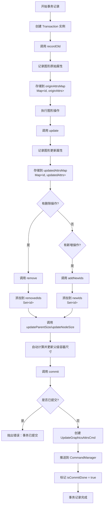
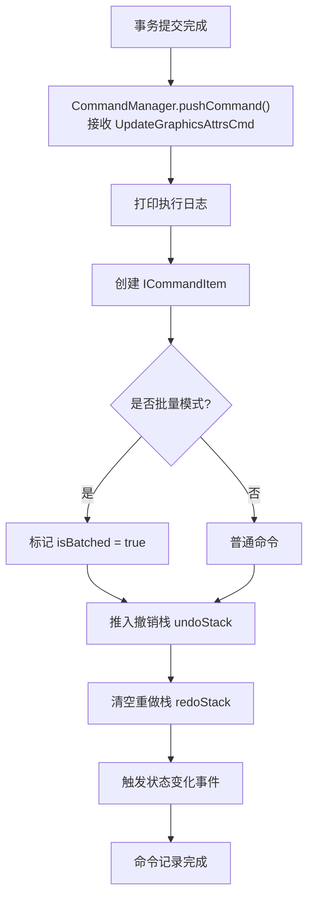
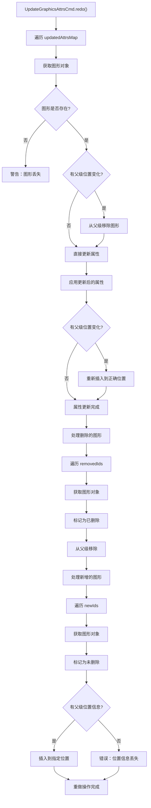
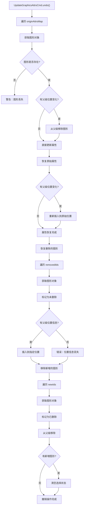
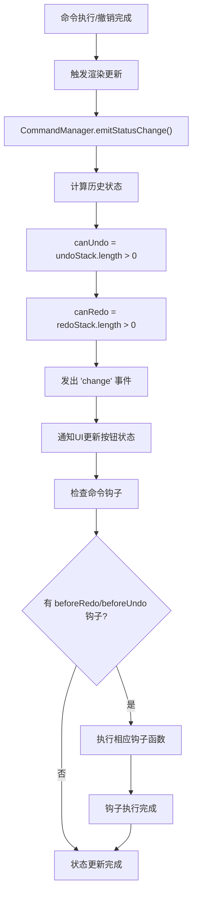

# Suika 编辑器事务完整流程文档

## 概述

本文档详细描述了 Suika 编辑器中事务（Transaction）系统的完整设计和实现流程，包括事务管理、状态记录、命令集成和撤销重做机制的各个阶段。

## 🔍 流程图查看指南

**如果您的 Markdown 查看器不支持 Mermaid 图表渲染，请使用以下在线工具查看：**

1. **Mermaid Live Editor**: <https://mermaid.live/>
2. **复制下方任一流程图代码块 → 粘贴到在线编辑器 → 查看可视化流程图**

## 核心组件

### 1. Transaction 类

位置：`packages/core/src/transaction.ts`

#### 主要功能

- 记录图形状态变化的事务
- 管理原始状态和更新状态的映射
- 处理新增和删除图形的跟踪
- 自动更新父级容器尺寸
- 提供链式 API 便于使用

#### 核心属性

```typescript
class Transaction {
  private originAttrsMap = new Map<string, Partial<GraphicsAttrs>>(); // 原始属性映射
  private updatedAttrsMap = new Map<string, Partial<GraphicsAttrs>>(); // 更新属性映射
  private removedIds = new Set<string>(); // 删除的图形ID集合
  private newIds = new Set<string>(); // 新增的图形ID集合
  private isCommitDone = false; // 是否已提交事务
}
```

#### 主要方法

```typescript
interface TransactionAPI {
  // 记录操作前的原始状态
  recordOld<ATTRS extends GraphicsAttrs>(
    id: string,
    attrs: Partial<ATTRS>,
  ): this;

  // 记录操作后的更新状态
  update<ATTRS extends GraphicsAttrs>(id: string, attrs: Partial<ATTRS>): this;

  // 标记图形为删除
  remove(id: string): this;

  // 添加新增图形的ID
  addNewIds(ids: string[]): this;

  // 更新父级容器尺寸
  updateParentSize(elements: SuikaGraphics[]): this;
  updateNodeSize(idSet: Set<string>): this;

  // 提交事务，生成命令
  commit(desc: string): void;
}
```

### 2. UpdateGraphicsAttrsCmd 命令

位置：`packages/core/src/commands/update_graphics_attrs_cmd.ts`

#### 主要功能

- 执行图形的属性更新操作
- 支持撤销和重做操作
- 处理图形的新增、删除和修改
- 维护图形的父子关系

#### ICommand 接口

```typescript
interface ICommand {
  desc: string; // 命令描述
  redo(): void; // 执行重做
  undo(): void; // 执行撤销
}
```

### 3. CommandManager 类

位置：`packages/core/src/commands/command_manager.ts`

#### 主要功能

- 管理撤销/重做命令栈
- 处理事务提交的命令
- 支持批量命令执行
- 提供状态监听和事件通知

## 完整流程图

### Phase 1: 事务记录流程 (复制下方代码块到 mermaid.live 查看)



### Phase 2: 命令执行流程 (复制下方代码块到 mermaid.live 查看)



### Phase 3: 重做操作流程 (复制下方代码块到 mermaid.live 查看)



### Phase 4: 撤销操作流程 (复制下方代码块到 mermaid.live 查看)



### Phase 5: 状态管理流程 (复制下方代码块到 mermaid.live 查看)



## 详细流程说明

### 1. 事务创建和记录

#### 1.1 事务初始化

```typescript
// 创建事务实例
const transaction = new Transaction(editor);
```

**Transaction 构造函数**：

```typescript
constructor(private editor: SuikaEditor) {
  // 初始化状态映射
  this.originAttrsMap = new Map();
  this.updatedAttrsMap = new Map();
  this.removedIds = new Set();
  this.newIds = new Set();
  this.isCommitDone = false;
}
```

#### 1.2 记录原始状态

```typescript
// 记录操作前的图形状态
transaction.recordOld(graphId, {
  transform: cloneDeep(graph.attrs.transform),
  fill: graph.attrs.fill,
  stroke: graph.attrs.stroke,
  // 其他需要记录的属性
});
```

**recordOld 方法**：

```typescript
recordOld<ATTRS extends GraphicsAttrs>(id: string, attrs: Partial<ATTRS>) {
  this.originAttrsMap.set(id, attrs);
  return this; // 支持链式调用
}
```

#### 1.3 执行操作并记录更新状态

```typescript
// 执行具体的图形操作
graph.updateAttrs({
  transform: newTransform,
  fill: newFill,
});

// 记录操作后的状态
transaction.update(graphId, {
  transform: cloneDeep(graph.attrs.transform),
  fill: graph.attrs.fill,
});
```

#### 1.4 处理删除和新增

```typescript
// 标记图形删除
transaction.remove(deletedGraphId);

// 添加新增图形ID
transaction.addNewIds([newGraphId1, newGraphId2]);
```

#### 1.5 更新父级尺寸

```typescript
// 自动更新受影响的父级容器尺寸
transaction.updateParentSize(affectedElements);

// 或手动指定需要更新的节点
transaction.updateNodeSize(parentIdSet);
```

### 2. 事务提交

#### 2.1 提交流程

```typescript
// 提交事务，生成命令
transaction.commit('Move Elements');
```

**commit 方法实现**：

```typescript
commit(desc: string) {
  if (this.isCommitDone) {
    console.error('It had committed before, can not commit again!');
    return;
  }

  // 创建 UpdateGraphicsAttrsCmd 命令
  this.editor.commandManager.pushCommand(
    new UpdateGraphicsAttrsCmd(
      desc,
      this.editor,
      this.originAttrsMap,
      this.updatedAttrsMap,
      this.removedIds,
      this.newIds,
    ),
  );

  this.isCommitDone = true;
}
```

#### 2.2 命令管理器处理

```typescript
pushCommand(command: ICommand, hooks?: CommandHooks) {
  // 打印执行日志
  console.log(`%c Exec %c [${command.desc}]`, 'background: #222; color: #bada55', '');

  // 创建命令项
  const commandItem: ICommandItem = { command };
  if (this.isBatching) {
    commandItem.isBatched = true;
  }
  if (hooks) {
    commandItem.hooks = hooks;
  }

  // 推入撤销栈，清空重做栈
  this.undoStack.push(commandItem);
  this.redoStack = [];

  // 触发状态变化
  this.emitStatusChange();
}
```

### 3. UpdateGraphicsAttrsCmd 执行

#### 3.1 重做操作

**redo() 方法**：

```typescript
redo() {
  const attrsMap = this.updatedAttrsMap;
  const doc = this.editor.doc;

  // 应用更新后的属性
  for (const [id, attrs] of attrsMap) {
    const graphics = doc.getGraphicsById(id);
    if (!graphics) {
      console.warn(`graphics ${id} is lost.`);
      return;
    }

    // 处理父级位置变化
    if (attrs.parentIndex) {
      graphics.removeFromParent();
    }
    graphics.updateAttrs(attrs);
    if (attrs.parentIndex) {
      graphics.insertAtParent(graphics.attrs.parentIndex!.position);
    }
  }

  // 处理删除的图形
  for (const id of this.removedIds) {
    const graphics = doc.getGraphicsById(id);
    if (graphics) {
      graphics.setDeleted(true);
      graphics.removeFromParent();
    }
  }

  // 处理新增的图形
  for (const id of this.newIds) {
    const graphics = doc.getGraphicsById(id);
    if (graphics) {
      graphics.setDeleted(false);
      const position = graphics.attrs.parentIndex?.position;
      if (position) {
        graphics.insertAtParent(position);
      } else {
        console.error('position lost');
      }
    }
  }
}
```

#### 3.2 撤销操作

**undo() 方法**：

```typescript
undo() {
  const attrsMap = this.originAttrsMap;
  const doc = this.editor.doc;

  // 恢复原始属性
  for (const [id, attrs] of attrsMap) {
    const graphics = doc.getGraphicsById(id);
    if (!graphics) {
      console.warn(`graphics ${id} is lost.`);
      return;
    }

    // 处理父级位置变化
    if (attrs.parentIndex) {
      graphics.removeFromParent();
    }
    graphics.updateAttrs(attrs);
    if (attrs.parentIndex) {
      graphics.insertAtParent(graphics.attrs.parentIndex!.position);
    }
  }

  // 恢复删除的图形
  for (const id of this.removedIds) {
    const graphics = doc.getGraphicsById(id);
    if (graphics) {
      graphics.setDeleted(false);
      const position = graphics.attrs.parentIndex?.position;
      if (position) {
        graphics.insertAtParent(position);
      } else {
        console.error('position lost');
      }
    }
  }

  // 移除新增的图形
  for (const id of this.newIds) {
    const graphics = doc.getGraphicsById(id);
    if (graphics) {
      graphics.setDeleted(true);
      graphics.removeFromParent();
    }
  }

  // 清空选择状态（临时解决方案）
  if (this.newIds.size !== 0) {
    this.editor.selectedElements.clear();
  }
}
```

## 实际使用示例

### 示例 1: 移动图形

```typescript
// 移动单个图形
function moveGraphics(
  editor: SuikaEditor,
  graphicsId: string,
  deltaX: number,
  deltaY: number,
) {
  const transaction = new Transaction(editor);
  const graphics = editor.doc.getGraphicsById(graphicsId);

  if (!graphics) return;

  // 记录原始位置
  transaction.recordOld(graphicsId, {
    transform: cloneDeep(graphics.attrs.transform),
  });

  // 执行移动
  const newTransform = {
    ...graphics.attrs.transform,
    x: graphics.attrs.transform.x + deltaX,
    y: graphics.attrs.transform.y + deltaY,
  };
  graphics.updateAttrs({ transform: newTransform });

  // 记录新位置
  transaction.update(graphicsId, {
    transform: cloneDeep(graphics.attrs.transform),
  });

  // 提交事务
  transaction.commit(`Move Graphics ${graphicsId}`);
}
```

### 示例 2: 批量更新属性

```typescript
// 批量更新多个图形的颜色
function updateGraphicsColors(
  editor: SuikaEditor,
  updates: Array<{ id: string; color: string }>,
) {
  const transaction = new Transaction(editor);

  // 记录所有原始状态
  for (const update of updates) {
    const graphics = editor.doc.getGraphicsById(update.id);
    if (graphics) {
      transaction.recordOld(update.id, {
        fill: graphics.attrs.fill,
      });
    }
  }

  // 执行批量更新
  for (const update of updates) {
    const graphics = editor.doc.getGraphicsById(update.id);
    if (graphics) {
      graphics.updateAttrs({ fill: update.color });
      transaction.update(update.id, {
        fill: graphics.attrs.fill,
      });
    }
  }

  // 提交事务
  transaction.commit(`Update Colors for ${updates.length} Graphics`);
}
```

### 示例 3: 删除和新增操作

```typescript
// 替换图形：删除旧的，添加新的
function replaceGraphics(
  editor: SuikaEditor,
  oldId: string,
  newGraphics: SuikaGraphics,
) {
  const transaction = new Transaction(editor);

  // 记录要删除的图形状态
  const oldGraphics = editor.doc.getGraphicsById(oldId);
  if (oldGraphics) {
    transaction.recordOld(oldId, {
      transform: cloneDeep(oldGraphics.attrs.transform),
      fill: oldGraphics.attrs.fill,
      stroke: oldGraphics.attrs.stroke,
    });
  }

  // 标记删除
  transaction.remove(oldId);

  // 添加新图形
  editor.doc.addGraphics(newGraphics);
  transaction.addNewIds([newGraphics.attrs.id]);

  // 记录新图形的初始状态
  transaction.update(newGraphics.attrs.id, {
    transform: cloneDeep(newGraphics.attrs.transform),
    fill: newGraphics.attrs.fill,
    stroke: newGraphics.attrs.stroke,
  });

  // 提交事务
  transaction.commit(`Replace Graphics ${oldId} with ${newGraphics.attrs.id}`);
}
```

## 关键设计原理

### 1. 状态映射一致性

**设计目标**：

- 确保每个记录的原始状态都有对应的更新状态
- 防止部分状态记录丢失导致的撤销重做错误

**实现方式**：

```typescript
constructor(
  public desc: string,
  private editor: SuikaEditor,
  private originAttrsMap: Map<string, Partial<GraphicsAttrs>>,
  private updatedAttrsMap: Map<string, Partial<GraphicsAttrs>>,
  private removedIds: Set<string> = new Set(),
  private newIds: Set<string> = new Set(),
) {
  // 一致性检查
  if (originAttrsMap.size !== updatedAttrsMap.size) {
    console.warn(
      `originAttrsMap 和 updatedAttrsMap 数量不匹配 ${originAttrsMap.size} ${updatedAttrsMap.size}`,
    );
    console.log('origin:', originAttrsMap);
    console.log('update:', updatedAttrsMap);
  }
}
```

### 2. 图形生命周期管理

**软删除策略**：

- 使用 `setDeleted(true/false)` 标记图形状态
- 保留图形对象，避免内存泄漏
- 通过 `removeFromParent()` 和 `insertAtParent()` 维护层级关系

**删除处理**：

```typescript
// 删除操作
graphics.setDeleted(true);
graphics.removeFromParent();

// 恢复操作
graphics.setDeleted(false);
graphics.insertAtParent(position);
```

### 3. 父级尺寸自动更新

**updateParentSize 方法**：

```typescript
updateParentSize(elements: SuikaGraphics[]) {
  updateNodeSize(
    this.editor,
    getParentIdSet(elements),  // 获取所有父级ID
    this.originAttrsMap,       // 原始状态映射
    this.updatedAttrsMap,      // 更新状态映射
  );
  return this;
}
```

**updateNodeSize 工具函数**：

- 计算受影响的父级容器
- 自动调整容器尺寸以适应内容变化
- 递归处理嵌套容器

### 4. 事务原子性保证

**一次提交原则**：

- `isCommitDone` 标志确保事务只能提交一次
- 防止重复提交导致的命令栈污染

**完整性检查**：

- 状态映射数量一致性验证
- 图形对象存在性检查
- 父级位置信息完整性验证

## 性能优化

### 1. 延迟提交

```typescript
// 对于连续操作（如键盘移动），使用防抖优化
const debouncedCommit = debounce(() => {
  transaction.commit('Move with Keyboard');
}, 100);

// 连续调用只会触发最后一次提交
debouncedCommit();
debouncedCommit();
debouncedCommit();
```

### 2. 选择性记录

```typescript
// 只记录实际发生变化的属性
const changes = {};
if (newFill !== oldFill) changes.fill = newFill;
if (newStroke !== oldStroke) changes.stroke = newStroke;

if (Object.keys(changes).length > 0) {
  transaction.update(id, changes);
}
```

### 3. 批量操作优化

```typescript
// 对于大量图形的操作，使用批量模式
editor.commandManager.batchCommandStart();

// 执行多个事务，每个都会被标记为批量命令
transaction1.commit('Batch Operation 1');
transaction2.commit('Batch Operation 2');
transaction3.commit('Batch Operation 3');

editor.commandManager.batchCommandEnd();
```

## 扩展指南

### 1. 添加自定义事务操作

```typescript
class CustomTransaction extends Transaction {
  // 添加特定领域的便捷方法
  moveByDelta(id: string, deltaX: number, deltaY: number) {
    const graphics = this.editor.doc.getGraphicsById(id);
    if (!graphics) return this;

    // 记录原始位置
    this.recordOld(id, {
      transform: cloneDeep(graphics.attrs.transform),
    });

    // 计算新位置
    const newTransform = {
      ...graphics.attrs.transform,
      x: graphics.attrs.transform.x + deltaX,
      y: graphics.attrs.transform.y + deltaY,
    };

    // 应用变换
    graphics.updateAttrs({ transform: newTransform });

    // 记录新位置
    this.update(id, {
      transform: cloneDeep(graphics.attrs.transform),
    });

    return this;
  }
}
```

### 2. 集成钩子函数

```typescript
transaction.commit('Complex Operation', {
  beforeRedo: () => {
    // 重做前的准备工作
    console.log('Preparing to redo operation');
  },
  beforeUndo: () => {
    // 撤销前的清理工作
    console.log('Preparing to undo operation');
  },
});
```

### 3. 支持条件提交

```typescript
class ConditionalTransaction extends Transaction {
  private shouldCommit = true;

  cancel() {
    this.shouldCommit = false;
  }

  commit(desc: string) {
    if (!this.shouldCommit) {
      console.log('Transaction cancelled');
      return;
    }
    super.commit(desc);
  }
}
```

## 总结

Suika 编辑器的事务系统通过精心设计的状态记录和命令集成机制，实现了强大而可靠的操作历史管理：

### 核心优势

1. **原子性保证**：事务要么完全成功，要么完全失败，确保状态一致性
2. **完整状态记录**：记录操作前后的完整状态，支持精确的撤销重做
3. **自动尺寸更新**：智能计算并更新父级容器尺寸
4. **链式 API 设计**：提供流畅的编程接口
5. **类型安全**：完整的 TypeScript 类型支持

### 技术特点

- **命令模式集成**：与 CommandManager 无缝集成
- **批量操作支持**：支持复杂的复合操作记录
- **性能优化**：通过防抖和选择性记录优化性能
- **可扩展性**：支持自定义事务类型和钩子函数

事务系统作为 Suika 编辑器的核心基础设施，为用户提供了专业级的编辑体验，确保了操作的可逆性和状态的完整性。
