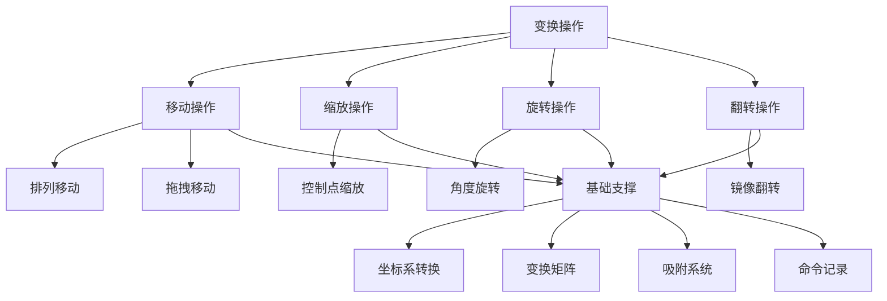

# Suika 编辑器变换操作的完整流程文档总览

## 概述

本文档是 Suika 编辑器所有变换操作功能流程文档的完整索引和导航指南。涵盖了从基本移动、缩放到旋转、翻转等各种图形变换功能，为开发者提供全面的技术参考。变换操作是编辑器最核心的交互功能之一，涉及复杂的数学计算、坐标变换和用户体验优化。

## 📚 变换操作分类体系

### 🖱️ 移动操作 (Move Operations)

#### 1. [排列移动功能的完整流程文档.md](排列移动功能的完整流程文档.md)

**核心功能**：批量图形位置调整

- 精确坐标定位
- 相对和绝对移动
- 对齐和分布功能
- 键盘微调操作

#### 2. [选择工具移动功能的完整流程文档.md](选择工具移动功能的完整流程文档.md)

**核心功能**：鼠标拖拽移动

- 实时拖拽交互
- 多选图形批量移动
- 父子关系坐标变换
- 智能吸附系统
- 约束移动 (Shift 键)

### 🔧 缩放操作 (Scale Operations)

#### 3. [选择工具缩放功能的完整流程文档.md](选择工具缩放功能的完整流程文档.md)

**核心功能**：控制点缩放变换

- 八个方向控制点
- 等比例缩放 (Shift 键)
- 中心缩放 (Alt 键)
- 最小尺寸保护
- 变换矩阵精确计算

### 🔄 旋转操作 (Rotate Operations)

#### 4. [旋转所选图形的完整流程文档.md](旋转所选图形的完整流程文档.md)

**核心功能**：角度旋转变换

- 旋转控制点交互
- 角度计算和约束
- 旋转中心点管理
- 实时角度显示
- 旋转吸附 (Shift 键)

### 🔄 翻转操作 (Flip Operations)

#### 5. [选中图形的水平翻转和垂直翻转完整流程文档.md](选中图形的水平翻转和垂直翻转完整流程文档.md)

**核心功能**：镜像变换

- 水平翻转 (H)
- 垂直翻转 (V)
- 变换矩阵计算
- 控制点位置更新
- 视觉反馈

## 🔗 变换操作关系图



## 📖 变换操作使用指南

### 🏗️ 技术架构理解

1. **统一坐标系统**：所有变换操作都建立在统一的场景坐标系基础上
2. **变换矩阵核心**：使用 2D 变换矩阵进行精确的几何变换
3. **实时交互反馈**：所有变换操作都提供实时的视觉反馈
4. **约束系统**：支持多种修饰键约束（Shift、Alt、Ctrl 等）
5. **撤销重做支持**：所有变换操作都完整支持命令模式

### 🔍 变换操作技术特点

#### 坐标系转换

```typescript
// 视口坐标 → 场景坐标
const scenePoint = editor.toScenePt(viewportX, viewportY);

// 场景坐标 → 视口坐标
const viewportPoint = editor.toViewportPt(sceneX, sceneY);
```

#### 变换矩阵运算

```typescript
// 平移变换
const translateMatrix: IMatrixArr = [1, 0, 0, 1, tx, ty];

// 缩放变换
const scaleMatrix: IMatrixArr = [sx, 0, 0, sy, 0, 0];

// 旋转变换
const rotateMatrix: IMatrixArr = [
  Math.cos(angle),
  -Math.sin(angle),
  Math.sin(angle),
  Math.cos(angle),
  0,
  0,
];

// 矩阵乘法
const combinedMatrix = multiplyMatrix(matrixA, matrixB);
```

#### 逆变换计算

```typescript
// 计算逆矩阵
const inverseMatrix = invertMatrix(transformMatrix);

// 坐标变换
const localPoint = applyInverseMatrix(worldMatrix, worldPoint);
```

### 🎯 变换操作开发模式

#### 1. 控制点交互模式

```typescript
// 定义控制点
enum TransformHandle {
  NW = 'nw',
  NE = 'ne',
  SW = 'sw',
  SE = 'se',
  N = 'n',
  S = 's',
  W = 'w',
  E = 'e',
}

// 控制点命中测试
const handleInfo = controlHandleManager.getHandleInfoByPoint(point);
if (handleInfo) {
  // 激活对应的变换工具
  activateTransformTool(handleInfo.handleName);
}
```

#### 2. 修饰键约束系统

```typescript
// Shift 键：等比例约束
if (hostEventManager.isShiftPressing) {
  applyProportionalConstraint();
}

// Alt 键：中心点模式
if (hostEventManager.isAltPressing) {
  enableCenterMode();
}
```

#### 3. 吸附系统集成

```typescript
// 网格吸附
if (setting.get('snapToGrid')) {
  point = SnapHelper.getSnapPtBySetting(point, setting);
}

// 对象吸附
const snapOffset = refLine.getGraphicsSnapOffset([point]);
point.x += snapOffset.x;
point.y += snapOffset.y;
```

## 🛠️ 变换操作扩展指南

### 开发新变换操作

1. **继承基础变换类**

```typescript
export class CustomTransformTool implements IBaseTool {
  onStart(e: PointerEvent) {
    // 初始化变换状态
  }

  onDrag(e: PointerEvent) {
    // 执行变换计算
  }

  onEnd(e: PointerEvent) {
    // 记录命令并清理
  }
}
```

2. **实现变换算法**

```typescript
private applyTransform(matrix: IMatrixArr) {
  selectedItems.forEach(item => {
    const newMatrix = multiplyMatrix(item.getWorldTransform(), matrix);
    item.setWorldTransform(newMatrix);
  });
}
```

3. **集成约束系统**

```typescript
private applyConstraints() {
  // 实现 Shift、Alt 等键的约束逻辑
}
```

### 性能优化建议

1. **缓存计算结果**

   - 预计算变换矩阵
   - 缓存包围盒计算
   - 避免重复的坐标转换

2. **批量处理**

   - 批量更新多个图形
   - 合并连续的变换操作
   - 使用事务批量记录

3. **渲染优化**
   - 脏标记系统
   - 增量渲染
   - 防抖更新

## 📊 变换操作统计

- **总变换操作类型**：5 大类
- **具体实现文档**：5 个完整流程文档
- **支持的修饰键**：Shift、Alt、Ctrl
- **控制点数量**：8 个方向控制点
- **坐标系转换**：视口 ↔ 场景双向转换
- **吸附系统**：网格吸附 + 对象吸附

## 🎯 变换操作最佳实践

### 用户体验原则

1. **即时反馈**：所有变换操作都要有实时的视觉反馈
2. **精确控制**：支持键盘微调和精确数值输入
3. **约束友好**：提供直观的约束方式（等比例、中心点等）
4. **撤销安全**：所有操作都支持撤销重做

### 开发规范

1. **一致性**：保持所有变换操作的交互一致性
2. **数学精确**：使用精确的矩阵运算避免累积误差
3. **边界处理**：妥善处理各种边界情况和异常输入
4. **性能优先**：在保证功能完整性的前提下优化性能

### 测试要点

1. **功能测试**：各种变换操作的正确性
2. **约束测试**：修饰键约束的生效情况
3. **边界测试**：极限值和异常情况处理
4. **性能测试**：大量图形同时变换的性能表现

## 🎉 总结

Suika 编辑器的变换操作系统是一个高度集成和优化的几何变换框架：

1. **功能完备**：涵盖移动、缩放、旋转、翻转等核心变换操作
2. **交互丰富**：支持多种交互方式和约束模式
3. **数学严谨**：基于变换矩阵的精确几何计算
4. **性能优良**：经过优化的实时交互体验
5. **扩展灵活**：易于添加新的变换操作类型

变换操作是编辑器最核心的功能模块之一，其设计和实现直接影响了用户的创作体验。通过这套完整的变换操作文档体系，开发者可以深入理解和掌握 Suika 编辑器的几何变换技术栈。
