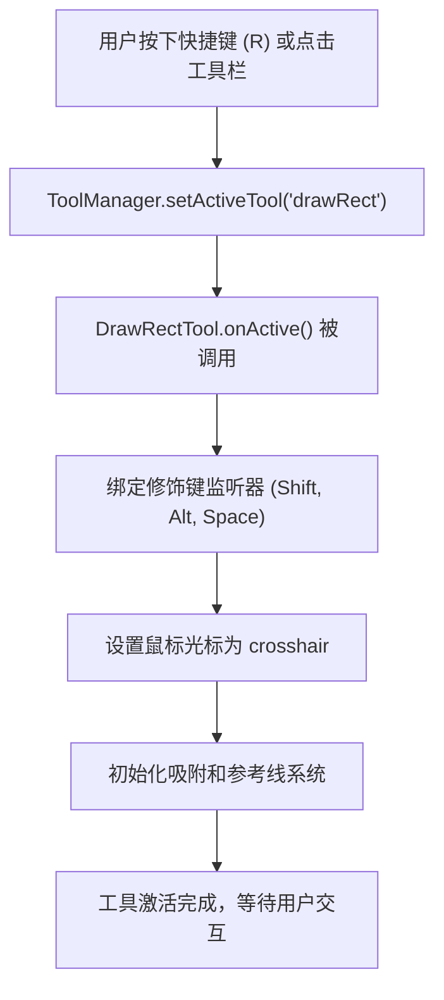
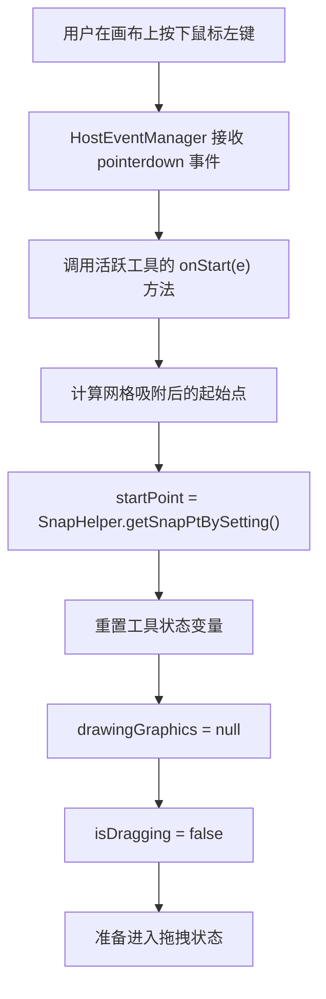
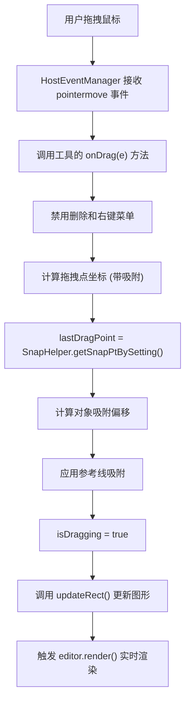
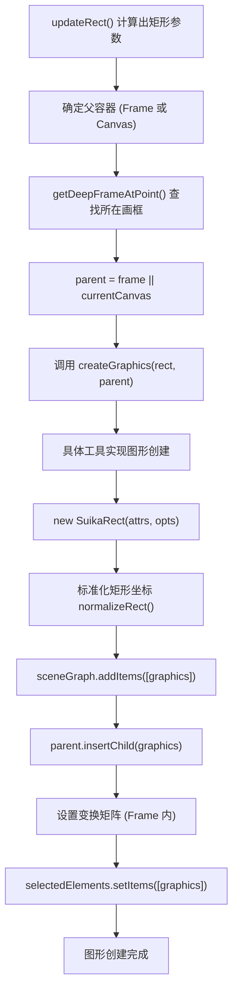
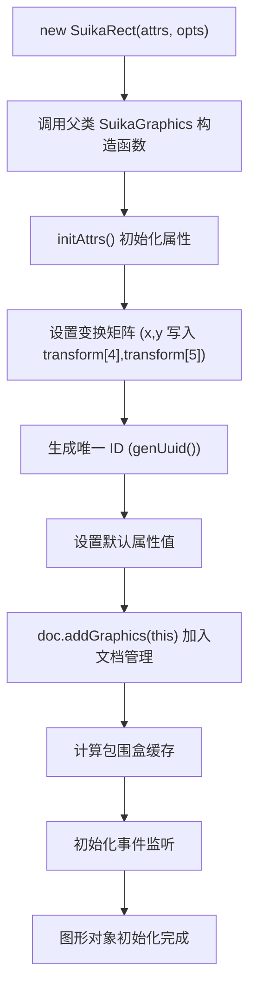
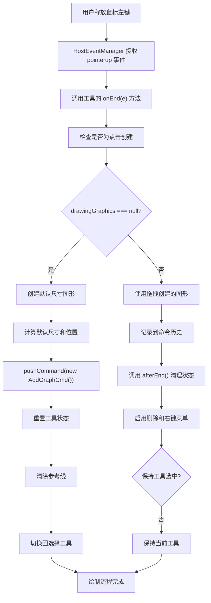

# Suika 编辑器图形从 0 到 1 生成的完整流程文档

## 概述

本文档详细描述了 Suika 编辑器中图形从创建到渲染的完整生命周期，包括从用户激活工具、鼠标交互、图形对象实例化、场景图管理、渲染流程到命令记录的各个阶段。图形生成是编辑器的核心功能之一，涉及复杂的坐标变换、事件处理、状态管理和性能优化。

## 🔍 流程图查看指南

**如果您的 Markdown 查看器不支持 Mermaid 图表渲染，请使用以下在线工具查看：**

1. **Mermaid Live Editor**: <https://mermaid.live/>
2. **复制下方任一流程图代码块 → 粘贴到在线编辑器 → 查看可视化流程图**

## 核心组件架构

### 1. 工具系统 (Tool System)

位置：`packages/core/src/tools/`

#### 绘制工具基类 (DrawGraphicsTool)

```typescript
export abstract class DrawGraphicsTool implements ITool {
  // 工具状态
  protected drawingGraphics: SuikaGraphics | null = null;
  private startPoint: IPoint = { x: -1, y: -1 };
  private lastDragPoint!: IPoint;
  private isDragging = false;

  // 核心生命周期方法
  onActive(): void; // 工具激活
  onStart(e: PointerEvent): void; // 开始绘制
  onDrag(e: PointerEvent): void; // 拖拽绘制
  onEnd(e: PointerEvent): void; // 结束绘制
  afterEnd(): void; // 绘制后清理

  // 抽象方法：子类实现具体图形创建
  protected abstract createGraphics(
    rect: IRect,
    parentGraphics: SuikaGraphics,
    noMove?: boolean,
  ): SuikaGraphics | null;
}
```

#### 具体工具实现 (DrawRectTool)

```typescript
export class DrawRectTool extends DrawGraphicsTool implements ITool {
  static override readonly type = 'drawRect';
  static override readonly hotkey = 'r';

  protected override createGraphics(rect: IRect, parent: SuikaGraphics) {
    rect = normalizeRect(rect); // 标准化矩形
    const graphics = new SuikaRect(
      {
        objectName: getNoConflictObjectName(parent, GraphicsObjectSuffix.Rect),
        width: rect.width,
        height: rect.height,
        fill: [cloneDeep(this.editor.setting.get('firstFill'))],
      },
      {
        advancedAttrs: { x: rect.x, y: rect.y },
        doc: this.editor.doc,
      },
    );
    return graphics;
  }
}
```

### 2. 图形对象基类 (SuikaGraphics)

位置：`packages/core/src/graphics/graphics/graphics.ts`

#### 图形生命周期

```typescript
export class SuikaGraphics<ATTRS extends GraphicsAttrs = GraphicsAttrs> {
  // 基本属性
  type = GraphicsType.Graph;
  attrs: ATTRS;
  protected doc: SuikaDocument;

  // 缓存和状态
  protected _cacheBboxWithStroke: Readonly<IBox> | null = null;
  protected _cacheBbox: Readonly<IBox> | null = null;
  noRender = false;
  private _deleted = false;

  constructor(
    attrs: Omit<Optional<ATTRS, 'transform'>, 'id'>,
    opts: IGraphicsOpts,
  ) {
    // 初始化属性和变换矩阵
    this.attrs = this.initAttrs(attrs, opts);
    // 加入文档管理
    this.doc.addGraphics(this);
  }

  // 核心方法
  updateAttrs(updates: Partial<ATTRS>): void;
  getBbox(): IBox;
  draw(ctx: CanvasRenderingContext2D, opts: IDrawInfo): void;
  hitTest(point: IPoint, options?: IHitOptions): boolean;
}
```

### 3. 场景图管理 (SceneGraph)

位置：`packages/core/src/scene/scene_graph.ts`

#### 场景图职责

```typescript
export class SceneGraph {
  // 图形集合管理
  addItems(items: SuikaGraphics[]): void;
  removeItems(items: SuikaGraphics[]): void;

  // 坐标系转换
  toScenePt(x: number, y: number): IPoint;
  toViewportPt(x: number, y: number): IPoint;

  // 渲染控制
  render(): void;

  // 数据序列化
  toJSON(): string;
}
```

## 完整图形生成流程详解

### 1. 工具激活和初始化流程



#### 详细步骤

1. **工具切换**：`ToolManager` 接收工具切换请求
2. **前工具清理**：调用当前活跃工具的 `onInactive()` 方法
3. **新工具激活**：调用 `DrawRectTool.onActive()` 方法
4. **事件绑定**：
   - 绑定 Shift 键监听（正方形约束）
   - 绑定 Alt 键监听（中心点绘制）
   - 绑定 Space 键监听（画布拖拽）
   - 绑定视口变化监听（参考线更新）
5. **状态初始化**：设置工具的光标样式和初始状态

### 2. 鼠标按下和开始绘制流程



#### 坐标系处理

```typescript
// 1. 获取鼠标在视口坐标
const viewportPt = this.editor.getCursorXY(e);

// 2. 转换为场景坐标
const scenePt = this.editor.getSceneCursorXY(e);

// 3. 应用网格吸附
this.startPoint = SnapHelper.getSnapPtBySetting(scenePt, this.editor.setting);

// 4. 检查对象吸附设置
if (this.editor.setting.get('snapToObjects')) {
  this.editor.refLine.cacheGraphicsRefLines();
}
```

### 3. 鼠标拖拽和实时预览流程



#### 实时更新逻辑

```typescript
private updateRect() {
  // 1. 计算矩形尺寸
  const width = this.lastDragPoint.x - this.startPoint.x;
  const height = this.lastDragPoint.y - this.startPoint.y;

  // 2. 处理修饰键
  const isAltPressed = this.editor.hostEventManager.isAltPressing;    // 中心点绘制
  const isShiftPressed = this.editor.hostEventManager.isShiftPressing; // 正方形约束

  // 3. 处理空格键画布拖拽
  if (this.startPointWhenSpaceDown && this.lastDragPointWhenSpaceDown) {
    // 调整起始点和拖拽点
  }

  // 4. 计算最终矩形参数
  let rect = { x: startX, y: startY, width, height };

  // 5. 应用中心点绘制逻辑
  if (isAltPressed) {
    rect = expandRectFromCenter(rect);
  }

  // 6. 应用正方形约束
  if (isShiftPressed) {
    rect = this.adjustSizeWhenShiftPressing(rect);
  }

  // 7. 创建或更新图形对象
  if (this.drawingGraphics) {
    this.updateGraphics(rect);
  } else {
    this.createAndAddGraphics(rect);
  }

  // 8. 触发渲染
  this.editor.render();
}
```

### 4. 图形对象创建流程



#### 详细创建步骤

```typescript
protected createGraphics(rect: IRect, parent: SuikaGraphics) {
  // 1. 标准化矩形（处理负宽高）
  rect = normalizeRect(rect);

  // 2. 生成唯一对象名称
  const objectName = getNoConflictObjectName(parent, GraphicsObjectSuffix.Rect);

  // 3. 获取默认样式设置
  const fill = [cloneDeep(this.editor.setting.get('firstFill'))];

  // 4. 创建图形实例
  const graphics = new SuikaRect({
    objectName,
    width: rect.width,
    height: rect.height,
    fill,
  }, {
    advancedAttrs: { x: rect.x, y: rect.y },
    doc: this.editor.doc,
  });

  return graphics;
}
```

### 5. 图形对象初始化流程



#### 属性初始化

```typescript
private initAttrs(attrs: any, opts: IGraphicsOpts) {
  // 1. 设置变换矩阵
  const transform = attrs.transform ?? identityMatrix();

  // 2. 处理高级属性 (x, y)
  if (opts.advancedAttrs) {
    if (opts.advancedAttrs.x !== undefined) {
      transform[4] = opts.advancedAttrs.x; // tx
    }
    if (opts.advancedAttrs.y !== undefined) {
      transform[5] = opts.advancedAttrs.y; // ty
    }
  }

  // 3. 生成唯一标识
  const id = attrs.id ?? genUuid();

  // 4. 设置默认值
  const finalAttrs = {
    ...DEFAULT_GRAPHICS_ATTRS,
    ...attrs,
    id,
    transform,
  };

  return finalAttrs;
}
```

### 6. 鼠标释放和完成绘制流程



#### 命令记录

```typescript
onEnd(e: PointerEvent) {
  // ... 图形创建逻辑 ...

  // 记录命令历史，支持撤销重做
  if (this.drawingGraphics) {
    this.editor.commandManager.pushCommand(
      new AddGraphCmd(this.commandDesc, this.editor, [this.drawingGraphics]),
    );
  }
}

afterEnd() {
  // 状态清理
  this.isDragging = false;
  this.drawingGraphics = null;

  // 重新启用被禁用的功能
  this.editor.hostEventManager.enableDelete();
  this.editor.hostEventManager.enableContextmenu();

  // 清理临时状态
  this.startPointWhenSpaceDown = null;
  this.lastDragPointWhenSpaceDown = null;

  // 清除参考线
  this.editor.refLine.clear();

  // 工具切换逻辑
  if (this.drawingGraphics && !this.editor.setting.get('keepToolSelectedAfterUse')) {
    this.editor.toolManager.setActiveTool('select');
  }
}
```

## 高级功能实现

### 1. 修饰键支持

#### Shift 键：正方形约束

```typescript
protected adjustSizeWhenShiftPressing(rect: IRect) {
  const { width, height } = rect;
  const size = Math.max(Math.abs(width), Math.abs(height));
  rect.height = (Math.sign(height) || 1) * size;
  rect.width = (Math.sign(width) || 1) * size;
  return rect;
}
```

#### Alt 键：中心点绘制

```typescript
// 以起始点为中心，向两侧扩展
if (isStartPtAsCenter) {
  rect = {
    x: rect.x - width,
    y: rect.y - height,
    width: rect.width * 2,
    height: rect.height * 2,
  };
}
```

#### Space 键：画布拖拽

```typescript
onSpaceToggle(isSpacePressing: boolean) {
  if (this.isDragging && isSpacePressing) {
    // 记录当前起始点和拖拽点
    this.startPointWhenSpaceDown = this.startPoint;
    this.lastDragPointWhenSpaceDown = this.lastMousePoint;
  } else {
    // 恢复原始状态
    this.startPointWhenSpaceDown = null;
    this.lastDragPointWhenSpaceDown = null;
  }
}
```

### 2. 吸附系统集成

#### 网格吸附

```typescript
const startPoint = SnapHelper.getSnapPtBySetting(
  this.editor.getSceneCursorXY(e),
  this.editor.setting,
);
```

#### 对象吸附

```typescript
// 缓存参考线
this.editor.refLine.cacheGraphicsRefLines({
  excludeItems: this.editor.selectedElements.getItems(),
});

// 计算吸附偏移
const offset = this.editor.refLine.getGraphicsSnapOffset([this.lastDragPoint]);
this.lastDragPoint = {
  x: this.lastDragPoint.x + offset.x,
  y: this.lastDragPoint.y + offset.y,
};
```

### 3. 父子关系管理

#### Frame 内绘制

```typescript
// 查找点击位置所在的画框
const frame = getDeepFrameAtPoint(this.startPoint, currentCanvas.getChildren());

// 设置父容器
const parent = frame || currentCanvas;

// 如果在 Frame 内，需要设置世界变换矩阵
if (frame) {
  const tf = [...graphics.attrs.transform] as IMatrixArr;
  graphics.setWorldTransform(tf);
}
```

## 性能优化策略

### 1. 渲染优化

- **实时预览**：拖拽过程中立即渲染，提高交互反馈
- **缓存管理**：图形包围盒缓存，避免重复计算
- **脏标记系统**：只渲染变化的部分

### 2. 内存管理

- **对象复用**：重复使用图形对象，避免频繁创建销毁
- **事件清理**：及时解绑事件监听器，防止内存泄漏
- **状态重置**：绘制完成后清理临时状态

### 3. 交互优化

- **节流处理**：高频事件节流，减少计算量
- **异步渲染**：使用 `requestAnimationFrame` 优化渲染性能
- **中断处理**：空格键拖拽时暂停绘制逻辑

## 错误处理和边界情况

### 1. 零尺寸处理

```typescript
protected solveWidthOrHeightIsZero(size: ISize, delta: IPoint): ISize {
  const newSize = { width: size.width, height: size.height };

  if (size.width === 0) {
    const sign = Math.sign(delta.x) || 1;
    newSize.width = sign * this.editor.setting.get('gridSnapX');
  }

  if (size.height === 0) {
    const sign = Math.sign(delta.y) || 1;
    newSize.height = sign * this.editor.setting.get('gridSnapY');
  }

  return newSize;
}
```

### 2. 坐标系转换

- **视口坐标 ↔ 场景坐标**：处理缩放和视口偏移
- **本地坐标 ↔ 世界坐标**：Frame 内绘制时的坐标变换
- **标准化矩形**：处理负宽度和负高度的情况

### 3. 状态一致性

- **原子操作**：使用事务确保状态一致性
- **错误恢复**：创建失败时的清理逻辑
- **边界检查**：防止数组越界和无效值

## 扩展性设计

### 1. 新图形类型支持

```typescript
// 继承 DrawGraphicsTool
export class DrawEllipseTool extends DrawGraphicsTool {
  protected override createGraphics(rect: IRect, parent: SuikaGraphics) {
    return new SuikaEllipse(
      {
        // 椭圆特定的属性
        objectName: getNoConflictObjectName(
          parent,
          GraphicsObjectSuffix.Ellipse,
        ),
        width: rect.width,
        height: rect.height,
        // ...
      },
      {
        advancedAttrs: { x: rect.x, y: rect.y },
        doc: this.editor.doc,
      },
    );
  }
}
```

### 2. 自定义绘制行为

```typescript
// 扩展绘制工具支持自定义逻辑
export class DrawCustomTool extends DrawGraphicsTool {
  // 自定义起始点计算
  override onStart(e: PointerEvent) {
    // 自定义逻辑
    super.onStart(e);
  }

  // 自定义拖拽处理
  override onDrag(e: PointerEvent) {
    // 自定义逻辑
    super.onDrag(e);
  }
}
```

## 总结

Suika 编辑器的图形生成系统采用了分层架构设计：

1. **工具层** (`DrawGraphicsTool`)：处理用户交互和绘制逻辑
2. **对象层** (`SuikaGraphics`)：提供图形对象的统一接口
3. **管理层** (`SceneGraph`)：负责图形生命周期和渲染管理
4. **命令层** (`CommandManager`)：支持撤销重做操作

整个图形生成流程经过精心设计，考虑了：

- **实时交互**：拖拽过程中的即时反馈
- **精确控制**：多种修饰键支持和吸附系统
- **性能优化**：缓存、节流和异步渲染
- **错误处理**：边界情况和异常恢复
- **扩展性**：易于添加新的图形类型

图形从 0 到 1 的生成过程体现了编辑器在用户体验、性能优化和代码架构方面的全面考虑，是 Suika 编辑器核心竞争力的重要体现。
