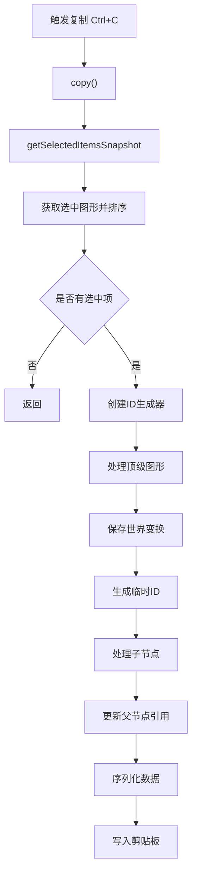
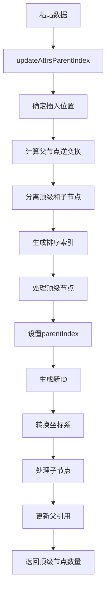

# Suika 编辑器图形的复制粘贴的完整流程文档

## 概述

本文档详细描述了 Suika 编辑器中图形复制粘贴功能的完整实现流程，包括从复制选中图形、处理剪贴板数据到粘贴新图形的各个阶段。复制粘贴功能支持图形属性、层级关系和图片粘贴，是编辑器的核心交互功能之一。

## 🔍 流程图查看指南

**如果您的 Markdown 查看器不支持 Mermaid 图表渲染，请使用以下在线工具查看：**

1. **Mermaid Live Editor**: <https://mermaid.live/>
2. **复制下方任一流程图代码块 → 粘贴到在线编辑器 → 查看可视化流程图**

## 核心组件

### 1. ClipboardManager 类

位置：`packages/core/src/clipboard.ts`

#### 主要功能

- 管理所有复制粘贴操作
- 处理键盘事件绑定和解绑
- 支持图形和图片的复制粘贴
- 处理 ID 冲突和层级关系维护
- 提供事务支持的撤销重做功能

#### 核心属性

```typescript
export class ClipboardManager {
  private unbindEvents = noop;
  private hasBindEvents = false;

  constructor(private editor: SuikaEditor) {}
}
```

#### 关键方法

- `copy()`: 复制选中的图形
- `copyAsSVG()`: 以 SVG 格式复制图形
- `pasteAt(point)`: 在指定位置粘贴
- `bindEvents()`: 绑定键盘和粘贴事件
- `destroy()`: 清理事件监听

### 2. 数据结构

#### IEditorPaperData 接口

```typescript
interface IEditorPaperData {
  appVersion: string;
  paperId: string;
  data: GraphicsAttrs[];
}
```

#### GraphicsAttrs 属性

```typescript
interface GraphicsAttrs {
  id: string;
  type: GraphicsType;
  transform: IMatrixArr;
  parentIndex?: {
    guid: string; // 父节点ID
    position: string; // 排序位置
  };
  // ... 其他图形属性
}
```

## 系统架构

```text
┌─────────────────────────────────────────────────┐
│                 SuikaEditor                     │
│  ┌─────────────────────────────────────────┐    │
│  │          ClipboardManager               │    │
│  │  ├─ copy() → getSelectedItemsSnapshot  │    │
│  │  ├─ paste → addGraphsFromClipboard     │    │
│  │  ├─ bindEvents() → 键盘 + 粘贴事件      │    │
│  │  └─ createGraphicsWithImg()            │    │
│  └─────────────────────────────────────────┘    │
│                                                 │
│  ┌─────────────────────────────────────────┐    │
│  │              数据处理                     │    │
│  │  ├─ ID管理: genUuid + increaseIdGenerator│    │
│  │  ├─ 位置调整: updateAttrsParentIndex    │    │
│  │  ├─ 排序索引: generateNKeysBetween      │    │
│  │  └─ 变换矩阵: multiplyMatrix             │    │
│  └─────────────────────────────────────────┘    │
│                                                 │
│  ┌─────────────────────────────────────────┐    │
│  │              事务管理                     │    │
│  │  ├─ Transaction 创建                    │    │
│  │  ├─ addNewIds() 添加新ID                │    │
│  │  ├─ updateParentSize() 更新父节点       │    │
│  │  └─ commit() 提交事务                   │    │
│  └─────────────────────────────────────────┘    │
└─────────────────────────────────────────────────┘
```

## 复制流程

### 1. 触发复制

#### 键盘事件绑定

位置：`packages/core/src/clipboard.ts`

```typescript
this.editor.keybindingManager.register({
  key: { metaKey: true, keyCode: 'KeyC' }, // Mac: Cmd+C
  winKey: { ctrlKey: true, keyCode: 'KeyC' }, // Windows: Ctrl+C
  actionName: 'Copy',
  action: copyHandler,
});
```

#### 复制处理函数

```typescript
const copyHandler = () => {
  this.copy();
};
```

### 2. 获取选中项快照

#### getSelectedItemsSnapshot() 方法

```typescript
private getSelectedItemsSnapshot() {
  // 1. 获取并排序选中的图形
  const selectedItems = SuikaGraphics.sortGraphics(
    this.editor.selectedElements.getItems(),
  );

  if (selectedItems.length === 0) {
    return null;
  }

  // 2. 创建ID生成器和映射表
  const idGenerator = increaseIdGenerator();
  const replacedIdMap = new Map<string, string>();
  const copiedData: GraphicsAttrs[] = [];

  // 3. 处理选中的顶级图形
  for (const item of selectedItems) {
    const attrs = item.getAttrs();
    attrs.transform = item.getWorldTransform();  // 保存世界坐标变换
    attrs.parentIndex = undefined;               // 清除父节点索引

    const tmpId = idGenerator();                  // 生成临时ID
    replacedIdMap.set(attrs.id, tmpId);
    attrs.id = tmpId;

    copiedData.push(attrs);
  }

  // 4. 处理子节点
  const childNodes = getChildNodeSet(selectedItems);
  for (const item of childNodes) {
    const attrs = item.getAttrs();
    const tmpId = idGenerator();
    replacedIdMap.set(attrs.id, tmpId);
    attrs.id = tmpId;

    // 更新子节点的父节点引用
    if (attrs.parentIndex) {
      attrs.parentIndex.guid = replacedIdMap.get(attrs.parentIndex.guid)!;
    }

    copiedData.push(attrs);
  }

  // 5. 返回序列化的数据
  return JSON.stringify({
    appVersion: this.editor.appVersion,
    paperId: this.editor.paperId,
    data: copiedData,
  });
}
```

### 3. 写入剪贴板

```typescript
copy() {
  const snapshot = this.getSelectedItemsSnapshot();
  if (!snapshot) {
    return;
  }

  // TODO: write to blob data
  navigator.clipboard.writeText(snapshot).then(() => {
    console.log('copied');
  });
}
```

## 粘贴流程

### 1. 触发粘贴

#### 粘贴事件监听

```typescript
window.addEventListener('paste', pasteHandler);

const pasteHandler = (e: Event) => {
  const event = e as ClipboardEvent;
  const clipboardData = event.clipboardData;

  // 过滤条件：文本编辑器激活时不处理
  if (
    !clipboardData ||
    this.editor.textEditor.isActive() ||
    ((e.target instanceof HTMLInputElement ||
      e.target instanceof HTMLTextAreaElement) &&
      !this.editor.textEditor.isEditorInputDom(e.target))
  ) {
    return;
  }

  // 处理图片文件
  if (clipboardData.files.length > 0) {
    for (const file of clipboardData.files) {
      if (file.type.includes('image')) {
        const reader = new FileReader();
        reader.onload = (e) => {
          const base64 = e.target?.result as string;
          this.createGraphicsWithImg(base64);
        };
        reader.readAsDataURL(file);
      }
    }
    return;
  }

  // 处理文本数据
  const pastedData = clipboardData.getData('Text');
  this.addGraphsFromClipboard(pastedData);
};
```

### 2. 图片粘贴处理

#### createGraphicsWithImg() 方法

```typescript
private async createGraphicsWithImg(imgUrl: string) {
  const editor = this.editor;

  // 1. 添加图片到图片管理器
  await editor.imgManager.addImg(imgUrl);
  const img = editor.imgManager.getImg(imgUrl);

  // 2. 获取视口中心位置
  const center = editor.viewportManager.getCenter();

  if (img) {
    // 3. 创建矩形图形
    const rectGraphics = new SuikaRect(
      {
        objectName: '',
        width: img.width,
        height: img.height,
        fill: [{ type: PaintType.Image, attrs: { src: imgUrl } }],
      },
      {
        advancedAttrs: {
          x: center.x - img.width / 2,  // 居中放置
          y: center.y - img.height / 2,
        },
        doc: editor.doc,
      },
    );

    // 4. 添加到场景并插入画布
    editor.sceneGraph.addItems([rectGraphics]);
    editor.doc.getCanvas().insertChild(rectGraphics);
    editor.render();
  }
}
```

### 3. 图形数据处理

#### addGraphsFromClipboard() 方法

```typescript
private addGraphsFromClipboard(dataStr: string, point?: IPoint) {
  // 1. 解析剪贴板数据
  let pastedData: IEditorPaperData | null = null;
  try {
    pastedData = JSON.parse(dataStr);
  } catch (e) {
    // TODO: create text graphics from pastedData
    return;
  }

  // 2. 数据验证
  if (
    !(
      pastedData &&
      typeof pastedData === 'object' &&
      pastedData.appVersion.startsWith('suika-editor') &&
      pastedData.data
    )
  ) {
    // TODO: create text graphics from pastedData
    return;
  }

  const editor = this.editor;
  if (pastedData.data.length === 0) {
    return;
  }

  // 3. 更新属性中的父节点索引和变换
  const topGraphicsCount = this.updateAttrsParentIndex(pastedData.data);

  // 4. 创建图形对象
  const pastedGraphicsArr = editor.sceneGraph.createGraphicsArr(
    pastedData.data,
  );

  // 5. 添加到场景并初始化树结构
  editor.sceneGraph.addItems(pastedGraphicsArr);
  editor.sceneGraph.initGraphicsTree(pastedGraphicsArr);

  // 6. 设置选中状态
  const selectedItems = pastedGraphicsArr.slice(0, topGraphicsCount);
  editor.selectedElements.setItems(selectedItems);

  // 7. 计算边界框并调整位置
  const boundingRect = boxToRect(
    mergeBoxes(selectedItems.map((item) => item.getBbox())),
  );

  // 8. 位置调整逻辑
  if (!point && pastedData.paperId !== editor.paperId) {
    // 跨文档粘贴：放置在视口中心
    const vwCenter = this.editor.viewportManager.getCenter();
    point = {
      x: vwCenter.x - boundingRect.width / 2,
      y: vwCenter.y - boundingRect.height / 2,
    };
  }

  if (point) {
    const dx = point.x - boundingRect.x;
    const dy = point.y - boundingRect.y;
    if (dx || dy) {
      SuikaGraphics.dMove(selectedItems, dx, dy);
    }
  }

  // 9. 创建事务并提交
  const transaction = new Transaction(editor);
  transaction
    .addNewIds(pastedGraphicsArr.map((item) => item.attrs.id))
    .updateParentSize(selectedItems)
    .commit('pasted graphs');

  editor.render();
}
```

## 数据处理核心

### 1. 父节点索引更新

#### updateAttrsParentIndex() 方法

```typescript
private updateAttrsParentIndex(attrsArr: GraphicsAttrs[]): number {
  // 1. 确定插入位置
  let left: string | null = null;
  let right: string | null = null;

  const firstGraphics =
    SuikaGraphics.sortGraphics(this.editor.selectedElements.getItems()).at(
      -1,
    ) ?? this.editor.doc.getCurrCanvas();

  let parent = firstGraphics;

  if (isCanvasGraphics(firstGraphics) || isFrameGraphics(firstGraphics)) {
    // 插入到画布或框架的末尾
    left = firstGraphics.getMaxChildIndex();
  } else {
    // 插入到选中图形之后
    parent = firstGraphics.getParent()!;
    left = firstGraphics.getSortIndex();
    const nextSibling = firstGraphics.getNextSibling();
    right = nextSibling ? nextSibling.getSortIndex() : null;
  }

  // 2. 计算父节点的逆变换矩阵
  const parentId = parent.attrs.id;
  const parentInvertWorldTf = invertMatrix(parent.getWorldTransform());

  // 3. 找到顶级图形数量
  let i = 0;
  while (i < attrsArr.length) {
    const attrs = attrsArr[i];
    if (attrs.parentIndex) {
      break;  // 子节点开始
    }
    i++;
  }

  const topGraphicsCount = i;

  // 4. 生成排序索引
  const sortIndies = generateNKeysBetween(left, right, topGraphicsCount);

  // 5. 处理顶级节点
  const oldNewIdMap = new Map<string, string>();
  for (let j = 0; j < topGraphicsCount; j++) {
    const attrs = attrsArr[j];
    attrs.parentIndex = {
      guid: parentId,
      position: sortIndies[j],
    };

    const newId = genUuid();
    oldNewIdMap.set(attrs.id, newId);
    attrs.id = newId;

    // 转换到父节点坐标系
    attrs.transform = multiplyMatrix(parentInvertWorldTf, attrs.transform);
  }

  // 6. 处理子节点
  while (i < attrsArr.length) {
    const attrs = attrsArr[i];
    const newId = genUuid();
    oldNewIdMap.set(attrs.id, newId);
    attrs.id = newId;

    // 更新父节点引用
    attrs.parentIndex!.guid = oldNewIdMap.get(attrs.parentIndex!.guid)!;
    i++;
  }

  return topGraphicsCount;
}
```

### 2. ID 管理和去重

- **increaseIdGenerator()**: 生成递增的临时 ID
- **genUuid()**: 生成全局唯一的最终 ID
- **replacedIdMap**: 维护复制时 ID 映射关系

### 3. 位置和变换处理

- **世界坐标转换**: 保存和恢复图形的世界坐标变换
- **父节点坐标系**: 将图形变换到正确的父节点坐标系
- **位置偏移**: 根据粘贴位置调整图形位置

## 流程图

### 复制流程图



### 数据处理流程图



## 特殊情况处理

### 1. 跨文档粘贴

```typescript
if (!point && pastedData.paperId !== editor.paperId) {
  // 跨文档粘贴：放置在视口中心
  const vwCenter = this.editor.viewportManager.getCenter();
  point = {
    x: vwCenter.x - boundingRect.width / 2,
    y: vwCenter.y - boundingRect.height / 2,
  };
}
```

### 2. 组和框架的特殊处理

```typescript
if (isCanvasGraphics(firstGraphics) || isFrameGraphics(firstGraphics)) {
  left = firstGraphics.getMaxChildIndex(); // 插入到末尾
} else {
  parent = firstGraphics.getParent()!;
  left = firstGraphics.getSortIndex(); // 插入到选中项之后
  const nextSibling = firstGraphics.getNextSibling();
  right = nextSibling ? nextSibling.getSortIndex() : null;
}
```

### 3. 文本编辑器冲突处理

```typescript
if (
  !clipboardData ||
  this.editor.textEditor.isActive() ||
  ((e.target instanceof HTMLInputElement ||
    e.target instanceof HTMLTextAreaElement) &&
    !this.editor.textEditor.isEditorInputDom(e.target))
) {
  return; // 不处理粘贴事件
}
```

## 性能优化

### 1. 条件检查优化

- 在粘贴事件中提前过滤不需要处理的场景
- 避免在文本编辑模式下触发图形粘贴

### 2. 批量操作

- 一次性创建所有图形对象
- 批量更新父节点大小
- 统一提交事务

### 3. ID 生成优化

- 使用递增 ID 生成器避免冲突
- 批量生成排序索引

## 扩展性设计

### 1. 支持的粘贴格式

- **Suika 内部格式**: JSON 序列化的图形数据
- **图片文件**: 支持常见图片格式的直接粘贴
- **SVG 格式**: 通过 copyAsSVG()方法支持
- **纯文本**: TODO - 创建文本图形

### 2. 未来扩展

代码中标注的 TODO 项：

- **Blob 数据写入**: 支持更丰富的数据格式
- **文本图形创建**: 从纯文本创建文本对象
- **对象名称去重**: 粘贴时自动重命名重复名称
- **更多格式验证**: 增强数据验证逻辑

### 3. 模块化设计

- **事件管理**: 独立的事件绑定和解绑
- **数据处理**: 核心逻辑与 UI 分离
- **事务集成**: 支持撤销重做操作

## 总结

图形的复制粘贴功能是 Suika 编辑器最核心的交互功能之一，通过精心设计的 ID 管理、位置调整和事务支持，实现了复杂图形层级关系的完整复制。系统支持跨文档粘贴、图片直接粘贴等多种场景，同时保持了良好的性能和扩展性。未来可以通过增加更多数据格式支持和智能去重功能进一步完善用户体验。
