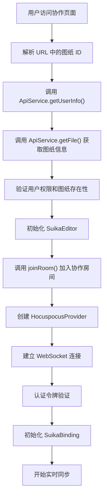
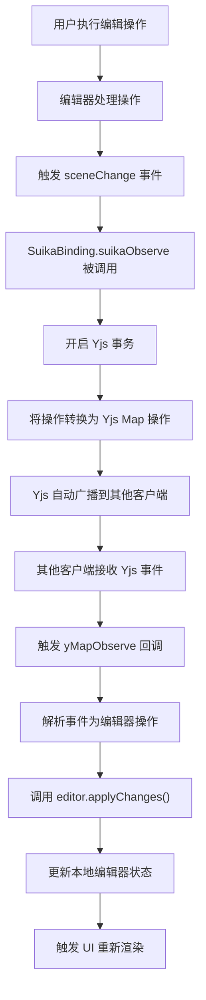
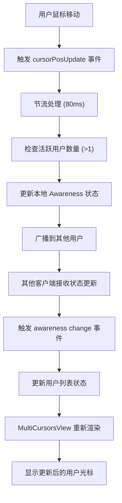
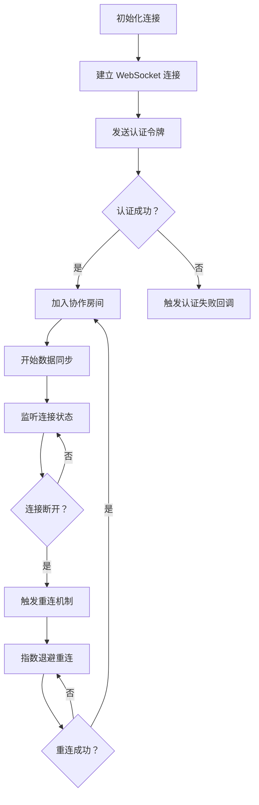

# Suika 编辑器多人协作的完整流程文档

## 概述

本文档详细描述了 Suika 编辑器中多人协作功能的完整实现流程，包括基于 Yjs 的实时同步、多用户光标显示、冲突解决、用户认证等核心功能。多人协作是 Suika 编辑器的核心特性之一，支持多用户同时编辑同一图纸，实现无缝的实时协作体验。

## 🔍 流程图查看指南

**如果您的 Markdown 查看器不支持 Mermaid 图表渲染，请使用以下在线工具查看：**

1. **Mermaid Live Editor**: <https://mermaid.live/>
2. **复制下方任一流程图代码块 → 粘贴到在线编辑器 → 查看可视化流程图**

## 技术架构

### 1. 核心技术栈

- **Yjs**: 无冲突复制数据类型 (CRDT) 库
- **Hocuspocus**: Yjs 的 WebSocket 服务器封装
- **WebSocket**: 实时双向通信协议
- **Awareness**: 用户状态同步机制

### 2. 架构分层

```
┌─────────────────┐
│   React UI      │  ← 用户界面层
├─────────────────┤
│ SuikaBinding    │  ← Yjs 与编辑器桥接层
├─────────────────┤
│   Yjs CRDT      │  ← 数据同步层
├─────────────────┤
│ Hocuspocus      │  ← WebSocket 通信层
├─────────────────┤
│   Backend API   │  ← 业务逻辑层
└─────────────────┘
```

## 核心组件

### 1. SuikaBinding 类

位置：`apps/suika-multiplayer/src/store/y-suika.ts`

#### 主要功能

- Yjs 与 Suika 编辑器的双向数据同步
- 用户状态 (Awareness) 管理
- 冲突自动解决
- 鼠标位置实时同步

#### 核心架构

```typescript
export class SuikaBinding {
  constructor(
    private yMap: YMap<Record<string, any>>,  // Yjs 数据存储
    private editor: SuikaEditor,               // 编辑器实例
    public awareness: HocuspocusProvider['awareness'], // 用户状态
    private user: { username: string; id: number }     // 用户信息
  ) {
    // 初始化数据同步监听器
    this.initDataSync();
    // 初始化用户状态同步
    this.initAwareness();
  }
}
```

#### 双向同步机制

```typescript
// 编辑器 → Yjs (本地操作广播)
private suikaObserve = (ops: IChanges) => {
  this.doc.transact(() => {
    // 处理添加/删除/更新操作
    for (const [id, attrs] of ops.added) {
      this.yMap.set(id, attrs);
    }
    for (const id of ops.deleted) {
      this.yMap.delete(id);
    }
    for (const [id, attrs] of ops.update) {
      this.yMap.set(id, { ...this.yMap.get(id), ...attrs });
    }
  });
};

// Yjs → 编辑器 (远程操作应用)
private yMapObserve = (event: YMapEvent<any>) => {
  // 解析 Yjs 事件为编辑器操作
  const changes = this.parseYjsEvent(event);
  this.editor.applyChanges(changes);
  this.editor.render();
};
```

### 2. JoinRoom 模块

位置：`apps/suika-multiplayer/src/store/join-room.ts`

#### 房间连接流程

```typescript
export const joinRoom = (
  editor: SuikaEditor,
  roomId: string,
  user: { username: string; id: number }
) => {
  // 创建 Hocuspocus 提供者
  const provider = new HocuspocusProvider({
    url: `ws://${host}/join/room/`,
    name: roomId,  // 房间 ID (图纸 ID)
    token: document.cookie.slice(13), // 认证令牌
    onAuthenticationFailed: (data) => {
      console.log('权限不足', data);
    },
  });

  // 获取 Yjs Map 实例
  const yMap = provider.document.getMap<Record<string, any>>('nodes');

  // 创建绑定实例
  return new SuikaBinding(yMap, editor, provider.awareness!, user);
};
```

### 3. MultiCursorsView 组件

位置：`apps/suika-multiplayer/src/components/MultiCursorsView/MultiCursorsView.tsx`

#### 用户光标显示

```typescript
export const MultiCursorsView: FC<IProps> = ({
  users = [],
  awarenessClientId,
  width,
  height
}) => {
  return (
    <div className="sk-cursors-view">
      {users
        .filter(user => user.pos && user.awarenessId !== awarenessClientId)
        .map(user => {
          const pos = toViewportPos(user.pos!);
          return (
            <div key={user.awarenessId}>
              
              <div
                className="sk-multi-cursor-username"
                style={{ background: user.color }}
              >
                {user.name}
              </div>
            </div>
          );
        })}
    </div>
  );
};
```

### 4. API 服务层

位置：`apps/suika-multiplayer/src/api-service/`

#### 用户认证和文件管理

```typescript
export const ApiService = {
  // 用户认证
  login: async (username: string, password: string) => {
    const res = await axios.post<ResStruct<LoginRes>>('auth/login', {
      username, password
    });
    return res.data;
  },

  // 文件操作
  getFileList: async () => {
    const res = await axios.get<ResStruct<FileItem[]>>('files');
    return res.data;
  },

  createFile: async (title: string) => {
    const res = await axios.post<ResStruct<FileItem[]>>('files/create', {
      title
    });
    return res.data;
  },

  // 用户信息
  getUserInfo: async () => {
    const res = await axios.get<ResStruct<UserProfileRes>>('/users/self/profile');
    return res.data;
  }
};
```

## 完整协作流程详解

### 1. 用户认证和房间加入流程



#### 详细步骤：

1. **URL 解析**：从页面路径 `/design/{fileId}` 提取图纸 ID
2. **用户认证**：通过 API 获取当前用户信息
3. **权限验证**：验证用户是否有访问该图纸的权限
4. **编辑器初始化**：创建 SuikaEditor 实例
5. **房间连接**：使用图纸 ID 作为房间标识符建立连接
6. **数据同步**：初始化 Yjs 数据结构和监听器

### 2. 实时数据同步流程



#### 本地操作同步：

```typescript
// 用户操作 → 编辑器更新 → Yjs 广播
editor.doc.on('sceneChange', (ops: IChanges) => {
  yMap.transact(() => {
    // 添加操作
    for (const [id, attrs] of ops.added) {
      yMap.set(id, attrs);
    }
    // 删除操作
    for (const id of ops.deleted) {
      yMap.delete(id);
    }
    // 更新操作
    for (const [id, attrs] of ops.update) {
      yMap.set(id, { ...yMap.get(id), ...attrs });
    }
  });
});
```

#### 远程操作同步：

```typescript
// Yjs 事件 → 编辑器更新
yMap.observe((event: YMapEvent) => {
  if (event.transaction.origin === this) return; // 忽略自己的操作

  const changes: IChanges = { added: new Map(), deleted: new Set(), update: new Map() };

  for (const [id, { action }] of event.changes.keys) {
    if (action === 'delete') {
      changes.deleted.add(id);
    } else {
      const attrs = yMap.get(id);
      if (action === 'add') {
        changes.added.set(id, attrs);
      } else if (action === 'update') {
        changes.update.set(id, attrs);
      }
    }
  }

  editor.applyChanges(changes);
  editor.render();
});
```

### 3. 用户状态同步流程



#### Awareness 管理：

```typescript
// 初始化用户状态
this.awareness.setLocalStateField('user', {
  id: this.user.id,
  name: this.user.username,
  awarenessId: this.awareness.clientID,
  pos: null,
  color: getRandomColor(),
});

// 鼠标位置同步
private onCursorPosChange = throttle((pos: IPoint) => {
  const localState = this.awareness.getLocalState()!;
  this.awareness.setLocalStateField('user', {
    ...localState.user,
    pos: { ...pos },
  });
}, 80);

// 监听其他用户状态变化
private onAwarenessChange = () => {
  const users = Array.from(this.awareness.getStates().values())
    .filter(item => item.user)
    .map(item => item.user) as IUserItem[];
  this.eventEmitter.emit('usersChange', users);
};
```

## 数据结构和类型定义

### 1. 用户信息接口

```typescript
interface IUserItem {
  id: number;           // 用户 ID
  name: string;         // 用户名
  color: string;        // 用户颜色
  pos: IPoint | null;   // 鼠标位置
  awarenessId: number;  // Awareness 客户端 ID
}
```

### 2. 协作操作接口

```typescript
interface IChanges {
  added: Map<string, GraphicsAttrs>;    // 新增的图形
  deleted: Set<string>;                 // 删除的图形 ID
  update: Map<string, GraphicsAttrs>;   // 更新的图形
}
```

### 3. 文件信息接口

```typescript
interface FileItem {
  id: number;        // 文件 ID
  title: string;     // 文件标题
  createdAt: string; // 创建时间
  updatedAt: string; // 更新时间
}
```

## 冲突解决机制

### 1. CRDT 自动冲突解决

Yjs 的 CRDT 机制保证了操作的最终一致性：

- **操作意图保持**：系统理解用户的编辑意图
- **因果关系维护**：保证操作顺序的逻辑正确性
- **自动合并**：不同用户的操作自动合并
- **无中心化协调**：不需要服务器参与冲突解决

### 2. 并发编辑场景

```typescript
// 场景：两人同时修改同一图形的颜色
// 用户 A：将图形颜色改为红色
// 用户 B：将图形颜色改为蓝色

// Yjs 自动处理：
// 1. 记录两个操作的因果关系
// 2. 根据操作时间戳或规则决定最终状态
// 3. 所有客户端最终达到一致状态
```

## 网络连接和错误处理

### 1. 连接生命周期



### 2. 错误处理策略

```typescript
const provider = new HocuspocusProvider({
  url: `ws://${host}/join/room/`,
  name: roomId,
  token: document.cookie.slice(13),

  // 认证失败处理
  onAuthenticationFailed: (data) => {
    console.log('权限不足', data);
    // 跳转登录或显示错误提示
  },

  // 连接状态监听
  onConnect: () => {
    console.log('已连接到协作服务器');
  },

  onDisconnect: () => {
    console.log('与协作服务器断开连接');
    // 显示离线状态
  }
});
```

## 性能优化策略

### 1. 数据传输优化

- **增量同步**：只传输变化的数据，避免全量传输
- **操作压缩**：将多个连续操作合并为单个操作
- **二进制协议**：使用高效的二进制数据格式

### 2. 本地性能优化

```typescript
// 鼠标位置同步节流
private onCursorPosChange = throttle((pos: IPoint) => {
  // 限制更新频率，避免过度同步
}, 80);

// 操作缓冲
private bufferOperations = () => {
  // 收集短时间内的高频操作
  // 批量发送，减少网络请求
};
```

### 3. 内存管理

- **垃圾回收**：及时清理不再需要的 Yjs 文档
- **状态压缩**：定期压缩 Yjs 文档历史
- **连接池管理**：复用 WebSocket 连接

## 安全性和权限管理

### 1. 认证机制

```typescript
// JWT Token 认证
const provider = new HocuspocusProvider({
  token: document.cookie.slice(13), // 从 Cookie 中提取令牌
});

// 服务器端验证
// 1. 验证 token 有效性
// 2. 检查用户对房间的访问权限
// 3. 记录用户操作日志
```

### 2. 权限控制

- **房间访问控制**：基于用户角色的权限检查
- **操作权限验证**：验证用户是否有执行特定操作的权限
- **敏感操作确认**：重要操作需要额外确认

## 扩展性和可维护性

### 1. 插件化架构

协作功能采用插件化设计，支持扩展：

```typescript
interface CollaborationPlugin {
  name: string;
  init: (binding: SuikaBinding) => void;
  destroy: () => void;
}

// 注册插件
const plugins = [
  new CursorPlugin(),
  new ChatPlugin(),
  new HistoryPlugin(),
];
```

### 2. 配置管理

```typescript
interface CollaborationConfig {
  serverUrl: string;
  enableAwareness: boolean;
  cursorUpdateInterval: number;
  reconnectInterval: number;
  maxReconnectAttempts: number;
}
```

## 总结

Suika 编辑器的多人协作系统采用了先进的 CRDT 技术栈：

1. **实时同步**：基于 Yjs 的无冲突复制数据类型
2. **用户体验**：多用户光标、状态同步、平滑协作
3. **冲突解决**：自动冲突解决，保证数据一致性
4. **网络弹性**：断线重连、离线操作缓存
5. **性能优化**：增量同步、操作压缩、本地优化
6. **安全性**：完整的认证授权机制

协作系统为用户提供了无缝的多人编辑体验，支持复杂的图形编辑场景下的实时协作，是 Suika 编辑器的核心竞争力之一。
