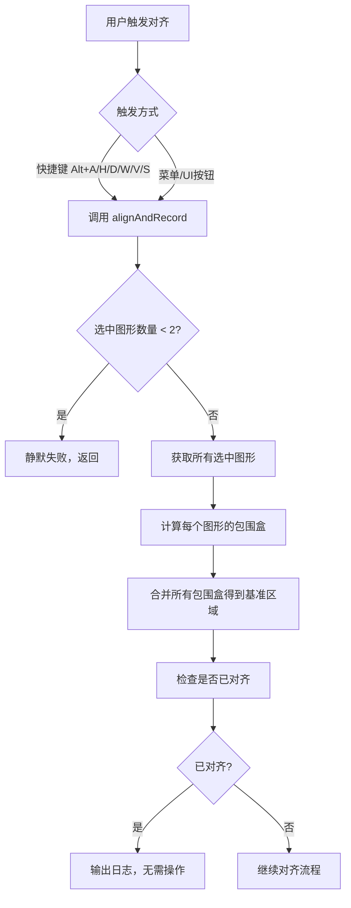
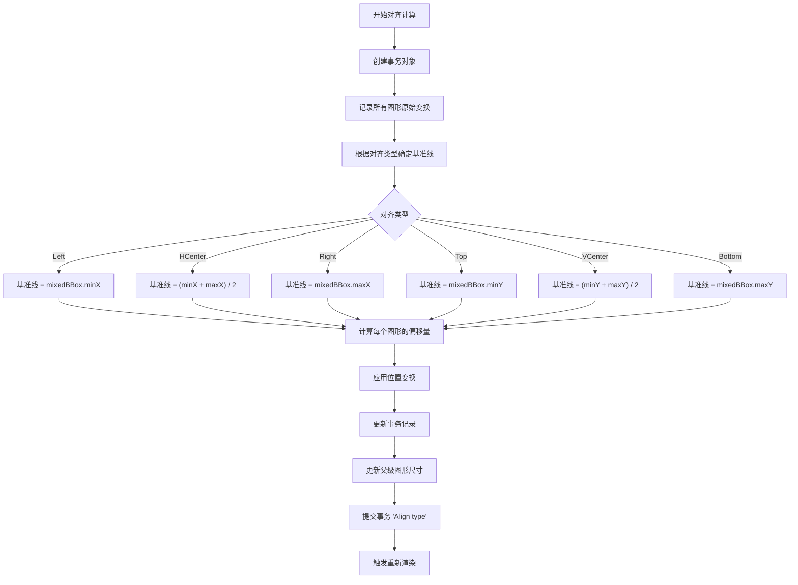
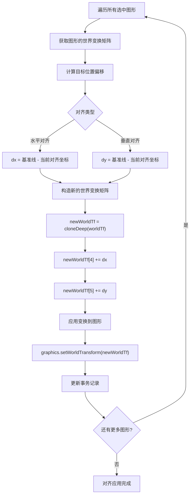
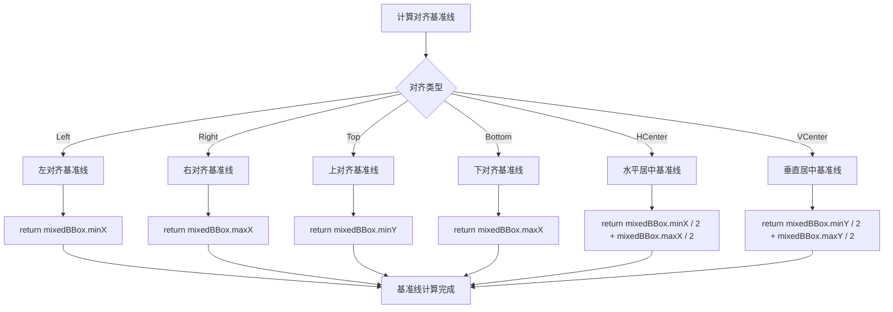

# Suika 编辑器对齐功能的完整流程文档

## 概述

本文档详细描述了 Suika 编辑器中对齐功能的完整实现流程，包括从用户触发、包围盒计算、对齐算法到最终渲染的各个阶段。

## 🔍 流程图查看指南

**如果您的 Markdown 查看器不支持 Mermaid 图表渲染，请使用以下在线工具查看：**

1. **Mermaid Live Editor**: <https://mermaid.live/>
2. **复制下方任一流程图代码块 → 粘贴到在线编辑器 → 查看可视化流程图**

## 核心组件

### 1. 对齐功能服务 (align_and_record.ts)

位置：`packages/core/src/service/align_and_record.ts`

#### 主要功能

- 提供6种标准对齐方式：左对齐、右对齐、水平居中、上对齐、下对齐、垂直居中
- 支持多图形批量对齐操作
- 基于包围盒计算对齐基准线
- 智能跳过已对齐的图形，避免无意义操作
- 完整的事务管理和撤销重做支持

#### 对齐类型枚举

```typescript
export enum AlignType {
  Left = 'Left',        // 左对齐
  HCenter = 'HCenter',  // 水平居中对齐
  Right = 'Right',      // 右对齐
  Top = 'Top',          // 上对齐
  VCenter = 'VCenter',  // 垂直居中对齐
  Bottom = 'Bottom',    // 下对齐
}
```

### 2. 对齐检查算法 (isAlreadyAligned)

#### 功能说明

检查一组图形是否已经按照指定的对齐方式对齐，避免不必要的计算和操作。

```typescript
const isAlreadyAligned = (bboxes: IBox[], type: AlignType): boolean => {
  const alignmentFunctions = {
    [AlignType.Left]: (bbox: IRect) => bbox.x,
    [AlignType.HCenter]: (bbox: IRect) => bbox.x + bbox.width / 2,
    [AlignType.Right]: (bbox: IRect) => bbox.x + bbox.width,
    [AlignType.Top]: (bbox: IRect) => bbox.y,
    [AlignType.VCenter]: (bbox: IRect) => bbox.y + bbox.height / 2,
    [AlignType.Bottom]: (bbox: IRect) => bbox.y + bbox.height,
  };

  const alignmentFunction = alignmentFunctions[type];
  if (!alignmentFunction) return false;

  const rects = bboxes.map((bbox) => boxToRect(bbox));
  const referenceValue = alignmentFunction(rects[0]);
  return rects.every((iRect) => alignmentFunction(iRect) === referenceValue);
};
```

#### 算法逻辑

1. **映射函数**: 为每种对齐类型定义相应的坐标计算函数
2. **基准值**: 使用第一个图形的对齐坐标作为基准
3. **一致性检查**: 验证所有图形是否具有相同的对齐坐标

### 3. 包围盒合并算法 (mergeBoxes)

位置：`packages/core/src/utils/geo.ts`

#### 功能说明

将多个图形的包围盒合并为一个总的包围盒，用于计算对齐基准线。

```typescript
export const mergeBoxes = (boxes: IBox[]): IBox => {
  if (boxes.length === 0) {
    throw new Error('boxes is empty');
  }

  let minX = Infinity;
  let minY = Infinity;
  let maxX = -Infinity;
  let maxY = -Infinity;

  for (const box of boxes) {
    minX = Math.min(minX, box.minX);
    minY = Math.min(minY, box.minY);
    maxX = Math.max(maxX, box.maxX);
    maxY = Math.max(maxY, box.maxY);
  }

  return { minX, minY, maxX, maxY };
};
```

## 完整流程图

### 📋 Phase 1: 对齐功能触发阶段 (复制下方代码块到 mermaid.live 查看)



### Phase 2: 对齐计算阶段 (复制下方代码块到 mermaid.live 查看)



### Phase 3: 位置变换应用阶段 (复制下方代码块到 mermaid.live 查看)



### Phase 4: 基准线计算详解阶段 (复制下方代码块到 mermaid.live 查看)



## 详细流程说明

### 1. 对齐功能初始化

#### 1.1 触发方式

对齐功能可以通过以下方式触发：

```typescript
// 快捷键触发
editor.keybindingManager.register({
  key: { altKey: true, keyCode: 'KeyA' }, // Alt+A
  when: (ctx) => !ctx.isToolDragging,
  actionName: 'AlignLeft',
  action: () => {
    alignAndRecord(editor, AlignType.Left);
  },
});

// 菜单/UI按钮触发
// 通过调用 alignAndRecord(editor, AlignType.Left) 等
```

#### 1.2 预检查

```typescript
export const alignAndRecord = (editor: SuikaEditor, type: AlignType) => {
  // 至少需要2个图形才能对齐
  if (editor.selectedElements.size() < 2) {
    console.warn('can align zero or two elements, fail silently');
    return;
  }

  const graphicsArr = editor.selectedElements.getItems();

  // 计算每个图形的包围盒
  const bboxes = graphicsArr.map((item) => item.getBbox());

  // 合并包围盒得到基准区域
  const mixedBBox = mergeBoxes(bboxes);

  // 优化：检查是否已经对齐
  if (isAlreadyAligned(bboxes, type)) {
    console.log('Already aligned, skip operation');
    return;
  }
};
```

### 2. 对齐算法详解

#### 2.1 左对齐 (AlignType.Left)

```typescript
case AlignType.Left: {
  // 基准线：所有图形包围盒的最小X坐标
  const targetX = mixedBBox.minX;

  for (let i = 0; i < graphicsArr.length; i++) {
    const graphics = graphicsArr[i];
    const currentX = bboxes[i].minX; // 当前图形的左边缘
    const dx = targetX - currentX;

    if (dx !== 0) {
      updateGraphicsPosition(graphics, worldTfs[i], dx, 0);
    }
  }
  break;
}
```

#### 2.2 水平居中对齐 (AlignType.HCenter)

```typescript
case AlignType.HCenter: {
  // 基准线：所有图形包围盒的水平中心线
  const centerX = mixedBBox.minX / 2 + mixedBBox.maxX / 2;

  for (let i = 0; i < graphicsArr.length; i++) {
    const graphics = graphicsArr[i];
    const bbox = bboxes[i];
    const currentCenterX = bbox.minX / 2 + bbox.maxX / 2; // 当前图形的中心X
    const dx = centerX - currentCenterX;

    if (dx !== 0) {
      updateGraphicsPosition(graphics, worldTfs[i], dx, 0);
    }
  }
  break;
}
```

#### 2.3 右对齐 (AlignType.Right)

```typescript
case AlignType.Right: {
  // 基准线：所有图形包围盒的最大X坐标
  const targetX = mixedBBox.maxX;

  for (let i = 0; i < graphicsArr.length; i++) {
    const graphics = graphicsArr[i];
    const currentX = bboxes[i].maxX; // 当前图形的右边缘
    const dx = targetX - currentX;

    if (dx !== 0) {
      updateGraphicsPosition(graphics, worldTfs[i], dx, 0);
    }
  }
  break;
}
```

#### 2.4 上对齐 (AlignType.Top)

```typescript
case AlignType.Top: {
  const targetY = mixedBBox.minY;

  for (let i = 0; i < graphicsArr.length; i++) {
    const graphics = graphicsArr[i];
    const currentY = bboxes[i].minY;
    const dy = targetY - currentY;

    if (dy !== 0) {
      updateGraphicsPosition(graphics, worldTfs[i], 0, dy);
    }
  }
  break;
}
```

#### 2.5 垂直居中对齐 (AlignType.VCenter)

```typescript
case AlignType.VCenter: {
  const centerY = mixedBBox.minY / 2 + mixedBBox.maxY / 2;

  for (let i = 0; i < graphicsArr.length; i++) {
    const graphics = graphicsArr[i];
    const bbox = bboxes[i];
    const currentCenterY = bbox.minY / 2 + bbox.maxY / 2;
    const dy = centerY - currentCenterY;

    if (dy !== 0) {
      updateGraphicsPosition(graphics, worldTfs[i], 0, dy);
    }
  }
  break;
}
```

#### 2.6 下对齐 (AlignType.Bottom)

```typescript
case AlignType.Bottom: {
  const targetY = mixedBBox.maxY;

  for (let i = 0; i < graphicsArr.length; i++) {
    const graphics = graphicsArr[i];
    const currentY = bboxes[i].maxY;
    const dy = targetY - currentY;

    if (dy !== 0) {
      updateGraphicsPosition(graphics, worldTfs[i], 0, dy);
    }
  }
  break;
}
```

### 3. 位置变换应用

#### 3.1 变换矩阵更新

```typescript
const updateGraphicsPosition = (
  graphics: SuikaGraphics,
  worldTf: IMatrixArr,
  dx: number,
  dy: number,
) => {
  // 记录原始状态到事务
  transaction.recordOld(graphics.attrs.id, {
    transform: cloneDeep(graphics.attrs.transform),
  });

  // 计算新的世界变换矩阵
  const newWorldTf = cloneDeep(worldTf);
  newWorldTf[4] += dx; // 平移X (tx)
  newWorldTf[5] += dy; // 平移Y (ty)

  // 应用新的世界变换
  graphics.setWorldTransform(newWorldTf);

  // 记录新状态到事务
  transaction.update(graphics.attrs.id, {
    transform: cloneDeep(graphics.attrs.transform),
  });
};
```

#### 3.2 事务管理和提交

```typescript
// 更新所有父级图形的尺寸
transaction.updateParentSize(graphicsArr);

// 提交事务，创建可撤销的历史记录
transaction.commit('Align ' + type);

// 触发重新渲染
editor.render();
```

## 关键算法分析

### 1. 对齐检查算法

**isAlreadyAligned 函数**：

```typescript
const isAlreadyAligned = (bboxes: IBox[], type: AlignType): boolean => {
  // 为每种对齐类型定义相应的坐标提取函数
  const alignmentFunctions = {
    [AlignType.Left]: (bbox: IRect) => bbox.x,                    // 左边缘X坐标
    [AlignType.HCenter]: (bbox: IRect) => bbox.x + bbox.width / 2, // 水平中心X坐标
    [AlignType.Right]: (bbox: IRect) => bbox.x + bbox.width,      // 右边缘X坐标
    [AlignType.Top]: (bbox: IRect) => bbox.y,                     // 上边缘Y坐标
    [AlignType.VCenter]: (bbox: IRect) => bbox.y + bbox.height / 2, // 垂直中心Y坐标
    [AlignType.Bottom]: (bbox: IRect) => bbox.y + bbox.height,    // 下边缘Y坐标
  };

  const alignmentFunction = alignmentFunctions[type];
  if (!alignmentFunction) return false;

  // 将包围盒转换为矩形格式
  const rects = bboxes.map((bbox) => boxToRect(bbox));

  // 使用第一个图形的对齐坐标作为基准
  const referenceValue = alignmentFunction(rects[0]);

  // 检查所有图形是否具有相同的对齐坐标
  return rects.every((iRect) => alignmentFunction(iRect) === referenceValue);
};
```

**算法优势**：

- **性能优化**: 避免不必要的计算和UI更新
- **精确检查**: 基于坐标值进行精确比较
- **类型安全**: 为每种对齐类型提供专门的检查逻辑

### 2. 包围盒合并算法

**mergeBoxes 函数**：

```typescript
export const mergeBoxes = (boxes: IBox[]): IBox => {
  if (boxes.length === 0) {
    throw new Error('boxes is empty');
  }

  let minX = Infinity;
  let minY = Infinity;
  let maxX = -Infinity;
  let maxY = -Infinity;

  // 遍历所有包围盒，找到全局的最小和最大坐标
  for (const box of boxes) {
    minX = Math.min(minX, box.minX);
    minY = Math.min(minY, box.minY);
    maxX = Math.max(maxX, box.maxX);
    maxY = Math.max(maxY, box.maxY);
  }

  return { minX, minY, maxX, maxY };
};
```

**应用场景**：

- **对齐基准**: 为各种对齐操作提供统一的参考坐标系
- **批量操作**: 支持同时对多个图形进行对齐
- **坐标计算**: 为居中对齐等复杂操作提供必要的几何信息

### 3. 世界变换矩阵

**变换矩阵格式**：

```typescript
// [scaleX, skewX, skewY, scaleY, translateX, translateY]
type IMatrixArr = [number, number, number, number, number, number];
```

**对齐操作的变换**：

- 只修改 `translateX` (索引4) 和 `translateY` (索引5)
- 保持旋转、缩放等其他变换不变
- 通过 `setWorldTransform` 应用变换

## 技术特点

### 1. 批量操作支持

- **多图形对齐**: 同时对多个选中图形进行对齐操作
- **统一基准**: 基于所有图形的总包围盒计算对齐基准
- **原子操作**: 整个对齐过程作为一个可撤销的事务

### 2. 智能优化

- **对齐检查**: 自动跳过已对齐的图形集合
- **零偏移跳过**: 只对需要移动的图形进行变换
- **精确计算**: 基于包围盒坐标进行像素级精确对齐

### 3. 事务完整性

- **状态记录**: 完整记录所有图形变换前后的状态
- **批量更新**: 支持多个图形的批量事务操作
- **回滚支持**: 支持撤销对齐操作，恢复到原始状态

### 4. 几何精确性

- **坐标系统**: 使用世界坐标系确保变换的准确性
- **包围盒计算**: 基于图形实际几何边界进行计算
- **变换合成**: 正确处理旋转、缩放等复合变换

## 快捷键列表

### 对齐操作快捷键

| 快捷键 | 功能 | 对齐基准 | 说明 |
|--------|------|----------|------|
| `Alt + A` | 左对齐 | `mixedBBox.minX` | 将所有图形左边缘对齐到最左边的位置 |
| `Alt + H` | 水平居中 | `(minX + maxX) / 2` | 将所有图形水平中心对齐到整体中心 |
| `Alt + D` | 右对齐 | `mixedBBox.maxX` | 将所有图形右边缘对齐到最右边的位置 |
| `Alt + W` | 上对齐 | `mixedBBox.minY` | 将所有图形上边缘对齐到最上边的位置 |
| `Alt + V` | 垂直居中 | `(minY + maxY) / 2` | 将所有图形垂直中心对齐到整体中心 |
| `Alt + S` | 下对齐 | `mixedBBox.maxY` | 将所有图形下边缘对齐到最下边的位置 |

## 使用场景

### 1. UI界面布局

- **按钮对齐**: 将多个按钮左对齐或水平居中
- **表单元素**: 对齐输入框、标签等表单控件
- **导航栏**: 对齐导航菜单项

### 2. 图形设计

- **图标排列**: 对齐多个图标的基准线
- **形状对位**: 精确对齐几何形状的边缘或中心
- **文字布局**: 对齐标题和正文的基准线

### 3. 数据可视化

- **图表元素**: 对齐图表的各个组成部分
- **标签定位**: 对齐数据标签和图例元素
- **网格布局**: 创建规则的网格排列

## 扩展性

### 1. 自定义对齐类型

可以扩展对齐功能支持更多对齐方式：

```typescript
// 添加新的对齐类型
export enum AlignType {
  // ... 现有类型
  DistributeHorizontal = 'DistributeHorizontal', // 水平分布
  DistributeVertical = 'DistributeVertical',     // 垂直分布
}

// 实现分布对齐算法
case AlignType.DistributeHorizontal: {
  // 计算每个图形之间的水平间距
  const totalWidth = mixedBBox.maxX - mixedBBox.minX;
  const spacing = totalWidth / (graphicsArr.length - 1);

  for (let i = 0; i < graphicsArr.length; i++) {
    const targetX = mixedBBox.minX + i * spacing;
    const currentCenterX = bboxes[i].minX + bboxes[i].width / 2;
    const dx = targetX - currentCenterX;

    updateGraphicsPosition(graphicsArr[i], worldTfs[i], dx, 0);
  }
  break;
}
```

### 2. 对齐到特定图形

可以实现相对于特定图形进行对齐：

```typescript
// 对齐到第一个选中的图形
case AlignType.AlignToFirst: {
  const firstRect = boxToRect(bboxes[0]);
  const referenceValue = alignmentFunction(firstRect);

  for (let i = 1; i < graphicsArr.length; i++) {
    const rect = boxToRect(bboxes[i]);
    const currentValue = alignmentFunction(rect);
    const delta = referenceValue - currentValue;

    updateGraphicsPosition(
      graphicsArr[i],
      worldTfs[i],
      type.includes('Center') ? delta : 0,
      type.includes('Center') ? 0 : delta
    );
  }
  break;
}
```

## 总结

Suika 编辑器的对齐功能通过精心设计的算法和流程，实现了精确、高效的多图形对齐操作。系统支持6种标准对齐方式，结合智能优化和事务管理，为用户提供了专业级的布局对齐体验。

对齐功能作为编辑器的基础布局工具，其实现直接影响了用户的设计效率和操作体验。通过结合快捷键操作、包围盒计算和精确的坐标变换，对齐功能在各种设计场景下都能提供可靠的布局控制。
