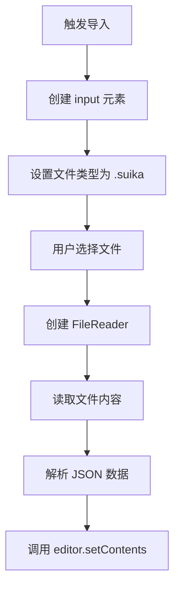
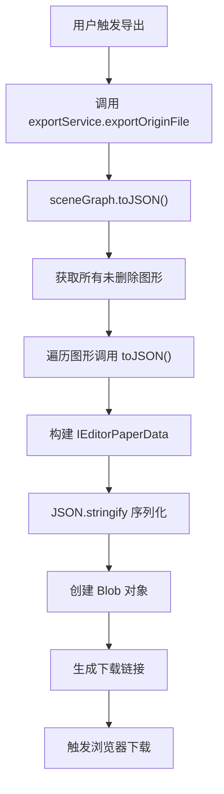
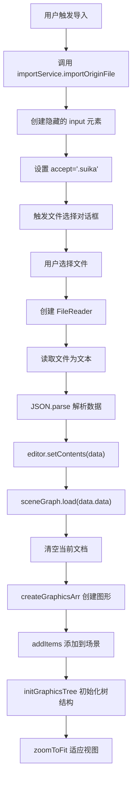
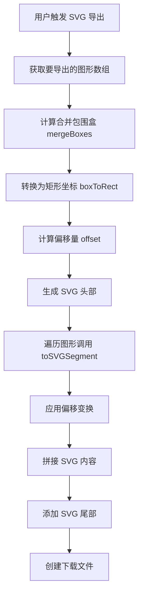

# Suika 编辑器导入导出的完整流程文档

## 概述

本文档详细描述了 Suika 编辑器中导入导出功能的完整实现流程，包括 JSON 数据导入导出、SVG 导出、自动保存恢复等功能。导入导出是编辑器的核心数据管理功能，支持数据的持久化和跨平台交换。

## 🔍 流程图查看指南

**如果您的 Markdown 查看器不支持 Mermaid 图表渲染，请使用以下在线工具查看：**

1. **Mermaid Live Editor**: <https://mermaid.live/>
2. **复制下方任一流程图代码块 → 粘贴到在线编辑器 → 查看可视化流程图**

## 核心组件

### 1. ImportService 类

位置：`packages/core/src/service/import_service.ts`

#### 主要功能

- 处理本地文件导入
- 读取和解析 JSON 文件
- 数据验证和错误处理
- 集成编辑器内容设置

#### 核心方法

```typescript
export const importService = {
  importOriginFile: (editor: SuikaEditor) => {
    readTextFile('.suika', (content) => {
      editor.setContents(JSON.parse(content));
    });
  },
};
```

#### 文件读取流程



### 2. ExportService 类

位置：`packages/core/src/service/export_service.ts`

#### 主要功能

- 处理本地文件导出
- 生成 JSON 数据
- 创建下载链接
- 支持自定义文件名

#### 核心方法

```typescript
export const exportService = {
  exportOriginFile: (editor: SuikaEditor, filename = 'design') => {
    const data = editor.sceneGraph.toJSON();
    const blob = new Blob([data], {
      type: 'application/json',
    });
    download(blob, filename + '.suika');
  },
};
```

### 3. SceneGraph 类

位置：`packages/core/src/scene/scene_graph.ts`

#### 数据序列化方法

```typescript
toJSON() {
  const data = this.editor.doc
    .getAllGraphicsArr()
    .filter((graphics) => !graphics.isDeleted())
    .map((item) => item.toJSON());

  const paperData: IEditorPaperData = {
    appVersion: this.editor.appVersion,
    paperId: this.editor.paperId,
    data: data,
  };
  return JSON.stringify(paperData);
}
```

#### 数据反序列化方法

```typescript
load(info: GraphicsAttrs[], isApplyChanges?: boolean) {
  const graphicsArr = this.createGraphicsArr(info);
  if (!isApplyChanges) {
    this.editor.doc.clear();
  }
  this.addItems(graphicsArr);
  this.initGraphicsTree(graphicsArr);
}
```

#### 图形创建方法

```typescript
createGraphicsArr(data: GraphicsAttrs[]) {
  const children: SuikaGraphics[] = [];
  for (const attrs of data) {
    const type = attrs.type;
    const Ctor = graphCtorMap[type!];
    if (!Ctor) {
      console.error(`Unsupported graphics type "${attrs.type}", ignore it`);
      continue;
    }
    children.push(new Ctor(attrs as any, { doc: this.editor.doc }));
  }
  return children;
}
```

### 4. ToSVG 模块

位置：`packages/core/src/to_svg.ts`

#### SVG 导出功能

```typescript
export const toSVG = (graphicsArr: SuikaGraphics[]) => {
  const mergedBbox = mergeBoxes(
    graphicsArr.map((el) => el.getBboxWithStroke()),
  );
  const mergedRect = boxToRect(mergedBbox);
  const offset = {
    x: -mergedBbox.minX,
    y: -mergedBbox.minY,
  };

  const svgHead = `<svg width="${mergedRect.width}" height="${mergedRect.height}" viewBox="0 0 ${mergedRect.width} ${mergedRect.height}" fill="none" xmlns="http://www.w3.org/2000/svg">\n`;
  const svgTail = `</svg>`;

  let content = '';
  for (const graphics of graphicsArr) {
    content += graphics.toSVGSegment(offset);
  }

  return svgHead + content + svgTail;
};
```

## 核心数据结构

### 1. IEditorPaperData 接口

位置：`packages/core/src/type.ts`

```typescript
interface IEditorPaperData {
  appVersion: string; // 应用版本
  paperId: string; // 图纸 ID
  data: GraphicsAttrs[]; // 图形数据数组
}
```

### 2. GraphicsAttrs 接口

位置：`packages/core/src/graphics/graphics/graphics_attrs.ts`

包含属性：

- 基本属性: type, id, objectName, width, height
- 变换属性: transform
- 样式属性: fill, stroke, strokeWidth, opacity
- 状态属性: visible, lock
- 关系属性: parentIndex

## 完整流程详解

### 1. JSON 导出流程



#### 详细步骤：

1. **数据收集**：遍历文档中的所有图形，过滤掉已删除的图形
2. **序列化转换**：每个图形对象调用自身的 `toJSON()` 方法转换为纯数据对象
3. **数据封装**：将图形数据数组封装到 `IEditorPaperData` 结构中，包含版本和图纸 ID 信息
4. **JSON 序列化**：使用 `JSON.stringify()` 将数据对象转换为 JSON 字符串
5. **文件创建**：创建 `Blob` 对象，指定 MIME 类型为 `application/json`
6. **下载触发**：创建临时下载链接并触发浏览器下载功能

### 2. JSON 导入流程



#### 详细步骤：

1. **文件选择**：创建隐藏的 `<input type="file">` 元素，设置文件类型过滤
2. **文件读取**：使用 `FileReader` 的 `readAsText()` 方法读取文件内容
3. **数据解析**：使用 `JSON.parse()` 将 JSON 字符串转换为 JavaScript 对象
4. **数据验证**：验证数据结构是否符合 `IEditorPaperData` 接口
5. **内容设置**：调用编辑器的 `setContents()` 方法设置编辑器内容
6. **图形创建**：通过 `createGraphicsArr()` 根据类型创建对应的图形对象
7. **场景加载**：将图形添加到场景图中，重建层级关系
8. **视图调整**：自动缩放到适合的视图大小

### 3. SVG 导出流程



#### 详细步骤：

1. **包围盒计算**：计算所有选中图形的包围盒并合并
2. **坐标系转换**：将包围盒转换为矩形坐标，计算偏移量确保坐标从 (0,0) 开始
3. **SVG 结构生成**：创建 `<svg>` 根元素，设置 width、height 和 viewBox 属性
4. **图形转换**：遍历每个图形，调用 `toSVGSegment()` 方法生成 SVG 片段
5. **坐标变换**：对每个图形应用偏移变换，使其在新的坐标系中正确定位
6. **内容拼接**：将所有图形 SVG 片段拼接在一起
7. **文件输出**：将完整的 SVG 字符串作为文件下载

## 自动保存与恢复

### 1. 自动保存机制

位置：编辑器的命令执行后自动触发

#### 保存流程：

```typescript
// 每次命令执行后
private saveToLocalStorage() {
  const data = this.sceneGraph.toJSON();
  localStorage.setItem('suika-paper', data);
}
```

### 2. 自动恢复机制

位置：编辑器初始化时

#### 恢复流程：

```typescript
private loadFromLocalStorage() {
  const data = localStorage.getItem('suika-paper');
  if (data) {
    try {
      const parsedData = JSON.parse(data);
      // 版本兼容性检查
      if (this.isVersionCompatible(parsedData.appVersion)) {
        // 询问用户是否恢复
        if (confirm('是否恢复上次未保存的工作？')) {
          this.setContents(parsedData);
        }
      }
    } catch (e) {
      console.error('Failed to load data from localStorage', e);
    }
  }
}
```

## 数据验证与错误处理

### 1. 导入数据验证

```typescript
private validateImportData(data: any): data is IEditorPaperData {
  return (
    data &&
    typeof data.appVersion === 'string' &&
    typeof data.paperId === 'string' &&
    Array.isArray(data.data)
  );
}
```

### 2. 版本兼容性检查

```typescript
private isVersionCompatible(version: string): boolean {
  const currentVersion = this.appVersion;
  // 简单的版本比较逻辑
  return version === currentVersion;
}
```

### 3. 图形类型验证

在 `createGraphicsArr` 方法中：

```typescript
const Ctor = graphCtorMap[type!];
if (!Ctor) {
  console.error(`Unsupported graphics type "${attrs.type}", ignore it`);
  continue;
}
```

## 性能优化

### 1. 导入优化

- **分批处理**：大文件导入时分批创建图形对象
- **延迟渲染**：导入过程中暂停渲染，完成后统一渲染
- **进度提示**：大文件显示导入进度条

### 2. 导出优化

- **流式处理**：避免一次性生成大字符串
- **内存管理**：及时清理临时对象
- **压缩选项**：未来支持压缩导出

## 扩展性设计

### 1. 插件化架构

导出服务支持扩展：

```typescript
interface ExportPlugin {
  name: string;
  format: string;
  export: (graphics: SuikaGraphics[]) => string;
}

const exportPlugins: ExportPlugin[] = [
  { name: 'JSON', format: 'json', export: exportJSON },
  { name: 'SVG', format: 'svg', export: exportSVG },
  // 未来扩展：PDF, PNG, 等
];
```

### 2. 自定义格式支持

通过扩展 `graphCtorMap` 支持新的图形类型：

```typescript
const graphCtorMap = {
  rect: SuikaRect,
  ellipse: SuikaEllipse,
  path: SuikaPath,
  // 未来扩展新的图形类型
};
```

## 总结

Suika 编辑器的导入导出系统采用了分层设计：

1. **服务层** (`ImportService`, `ExportService`)：处理用户交互和文件操作
2. **数据层** (`SceneGraph`)：负责数据的序列化/反序列化
3. **图形层** (`SuikaGraphics`)：每个图形负责自身的 JSON/SVG 转换

这样的设计保证了：

- **高内聚**：每个组件职责明确
- **低耦合**：组件间依赖关系清晰
- **易扩展**：新的导出格式可以轻松添加
- **高性能**：支持大数据量的导入导出操作

导入导出功能作为编辑器的核心数据管理能力，为用户提供了完整的数据生命周期管理解决方案。
