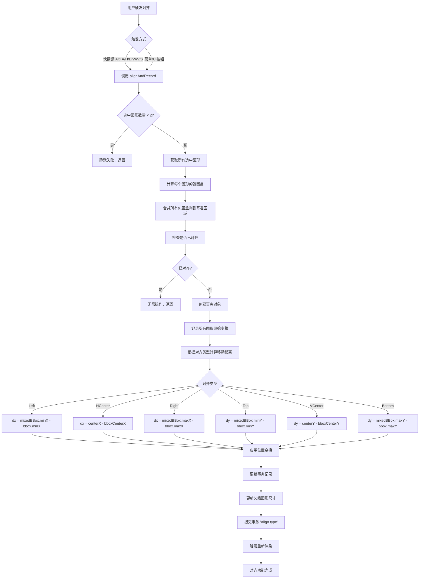
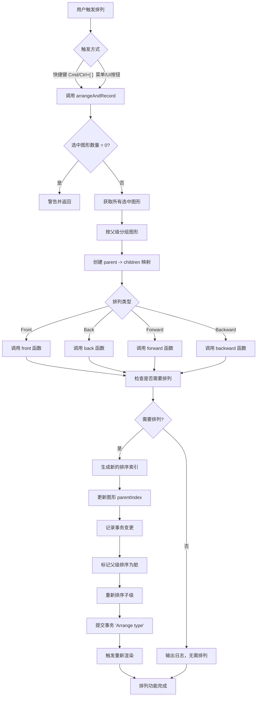
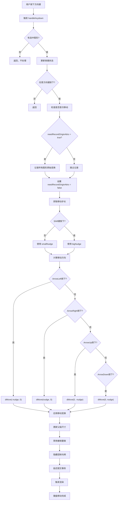
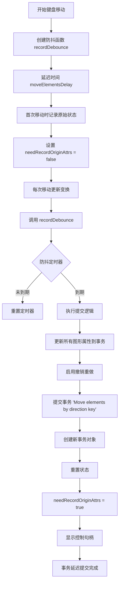

# Suika 编辑器排列移动功能的完整流程文档

## 概述

本文档详细描述了 Suika 编辑器中排列（对齐、分布）和移动（键盘移动、拖拽移动）功能的完整实现流程，包括从用户触发到最终渲染的各个阶段。

## 🔍 流程图查看指南

**如果您的 Markdown 查看器不支持 Mermaid 图表渲染，请使用以下在线工具查看：**

1. **Mermaid Live Editor**: <https://mermaid.live/>
2. **复制下方任一流程图代码块 → 粘贴到在线编辑器 → 查看可视化流程图**

## 核心组件

### 1. 对齐功能 (Align)

位置：`packages/core/src/service/align_and_record.ts`

#### 主要功能

- 提供6种对齐方式：左对齐、右对齐、水平居中、上对齐、下对齐、垂直居中
- 支持多图形批量对齐
- 基于包围盒计算对齐基准线
- 自动跳过已对齐的图形

#### 对齐类型枚举

```typescript
export enum AlignType {
  Left = 'Left',        // 左对齐
  HCenter = 'HCenter',  // 水平居中对齐
  Right = 'Right',      // 右对齐
  Top = 'Top',          // 上对齐
  VCenter = 'VCenter',  // 垂直居中对齐
  Bottom = 'Bottom',    // 下对齐
}
```

### 2. 排列功能 (Arrange)

位置：`packages/core/src/service/arrange_and_record.ts`

#### 主要功能

- 提供4种图层排列方式：置前、置后、前移、後移
- 基于分数索引(fractional-indexing)管理图层顺序
- 支持跨不同父级图形的批量排列
- 智能跳过无需排列的情况

#### 排列类型枚举

```typescript
export enum ArrangeType {
  Front = 'Front',      // 置于最前
  Back = 'Back',        // 置于最后
  Forward = 'Forward',  // 前移一层
  Backward = 'Backward', // 后移一层
}
```

### 3. 键盘移动功能 (MoveGraphsKeyBinding)

位置：`packages/core/src/host_event_manager/move_graphs_key_binding.ts`

#### 主要功能

- 支持方向键移动选中图形
- Shift键切换大步长/小步长移动
- 防抖延迟提交事务，避免频繁的历史记录
- 支持连续按键的流畅移动

#### 移动配置

```typescript
// 设置中的移动相关配置
smallNudge: 1,          // 小步长移动距离（像素）
bigNudge: 10,           // 大步长移动距离（像素）
moveElementsDelay: 500, // 移动延迟提交时间（毫秒）
```

## 完整流程图

### 📋 Phase 1: 对齐功能流程 (复制下方代码块到 mermaid.live 查看)



### Phase 2: 排列功能流程 (复制下方代码块到 mermaid.live 查看)



### Phase 3: 键盘移动功能流程 (复制下方代码块到 mermaid.live 查看)



### Phase 4: 事务延迟提交机制 (复制下方代码块到 mermaid.live 查看)



## 详细流程说明

### 1. 对齐功能详细流程

#### 1.1 初始化和验证

```typescript
export const alignAndRecord = (editor: SuikaEditor, type: AlignType) => {
  // 验证：至少需要2个图形才能对齐
  if (editor.selectedElements.size() < 2) {
    console.warn('can align zero or two elements, fail silently');
    return;
  }

  const graphicsArr = editor.selectedElements.getItems();

  // 计算每个图形的包围盒
  const bboxes = graphicsArr.map((item) => item.getBbox());

  // 合并包围盒得到基准区域
  const mixedBBox = mergeBoxes(bboxes);

  // 优化：检查是否已经对齐
  if (isAlreadyAligned(bboxes, type)) {
    return; // 无需操作
  }
}
```

#### 1.2 对齐计算逻辑

```typescript
// 对齐计算的核心逻辑
switch (type) {
  case AlignType.Left: {
    // 左对齐：所有图形左边缘对齐到最左边的位置
    const targetX = mixedBBox.minX;
    for (const graphics of graphicsArr) {
      const dx = targetX - graphics.getBbox().minX;
      if (dx !== 0) {
        updateGraphicsPosition(graphics, worldTf, dx, 0);
      }
    }
    break;
  }
  case AlignType.HCenter: {
    // 水平居中：所有图形中心对齐到整体中心
    const centerX = mixedBBox.minX / 2 + mixedBBox.maxX / 2;
    for (const graphics of graphicsArr) {
      const bbox = graphics.getBbox();
      const currentCenterX = bbox.minX / 2 + bbox.maxX / 2;
      const dx = centerX - currentCenterX;
      if (dx !== 0) {
        updateGraphicsPosition(graphics, worldTf, dx, 0);
      }
    }
    break;
  }
  // ... 其他对齐类型的实现类似
}
```

#### 1.3 位置更新和事务管理

```typescript
const updateGraphicsPosition = (
  graphics: SuikaGraphics,
  worldTf: IMatrixArr,
  dx: number,
  dy: number,
) => {
  // 记录原始状态
  transaction.recordOld(graphics.attrs.id, {
    transform: cloneDeep(graphics.attrs.transform),
  });

  // 计算新的世界变换
  const newWorldTf = cloneDeep(worldTf);
  newWorldTf[4] += dx; // 平移X
  newWorldTf[5] += dy; // 平移Y

  // 应用变换
  graphics.setWorldTransform(newWorldTf);

  // 记录新状态
  transaction.update(graphics.attrs.id, {
    transform: cloneDeep(graphics.attrs.transform),
  });
};

// 更新父级尺寸并提交事务
transaction.updateParentSize(graphicsArr);
transaction.commit('Align ' + type);
editor.render();
```

### 2. 排列功能详细流程

#### 2.1 分组和索引管理

```typescript
// 按父级分组选中图形
const map = new Map<SuikaGraphics, Set<SuikaGraphics>>();
for (const graphics of selectedItems) {
  const parent = graphics.getParent()!;
  if (!map.has(parent)) {
    map.set(parent, new Set());
  }
  const graphicsSet = map.get(parent)!;
  graphicsSet.add(graphics);
}
```

#### 2.2 置前排列算法

```typescript
const front = (transaction: Transaction, map: Map<SuikaGraphics, Set<SuikaGraphics>>) => {
  for (const [parent, movedChildSet] of map) {
    // 检查是否所有子级都被选中
    if (parent.getChildrenCount() === movedChildSet.size) {
      continue; // 无需排列
    }

    // 获取最后一个未移动图形的索引
    const { count } = getLastUnmovedGraphics(parent.getChildren(), movedChildSet);
    if (count === movedChildSet.size) {
      continue; // 已经在最前
    }

    // 获取最大排序索引
    const maxSortIndex = parent.getMaxChildIndex();

    // 为移动的图形生成新的排序位置
    const sortedMovedChildren = SuikaGraphics.sortGraphicsArray(
      Array.from(movedChildSet),
    );
    const positionArr = generateNKeysBetween(
      maxSortIndex,
      null, // 没有上限
      sortedMovedChildren.length,
    );

    // 更新每个图形的排序索引
    for (let i = 0; i < sortedMovedChildren.length; i++) {
      const child = sortedMovedChildren[i];
      // 记录原始状态
      transaction.recordOld(child.attrs.id, {
        parentIndex: cloneDeep(child.attrs.parentIndex),
      });

      // 更新排序索引
      child.updateAttrs({
        parentIndex: {
          guid: parent.attrs.id,
          position: positionArr[i],
        },
      });

      // 记录新状态
      transaction.update(child.attrs.id, {
        parentIndex: cloneDeep(child.attrs.parentIndex),
      });
    }

    // 标记需要重新排序
    parent.markSortDirty();
    parent.sortChildren();
  }
};
```

#### 2.3 前移排列算法

```typescript
const forward = (transaction: Transaction, map: Map<SuikaGraphics, Set<SuikaGraphics>>) => {
  for (const [parent, movedChildSet] of map) {
    if (parent.getChildrenCount() === movedChildSet.size) {
      continue;
    }

    const children = parent.getChildren();
    const { index } = getLastUnmovedGraphics(children, movedChildSet);
    if (count === movedChildSet.size) {
      continue;
    }

    // 从后往前遍历，逐个向前移动
    for (let i = index; i >= 0; i--) {
      const child = children[i];
      if (movedChildSet.has(child)) {
        // 计算新的排序索引
        const newLeft = children[i + 1].getSortIndex();
        const newRight = children[i + 2]?.getSortIndex() ?? null;
        const newIndex = generateKeyBetween(newLeft, newRight);

        // 交换数组位置
        swap(children, i, i + 1);

        // 更新图形属性
        transaction.recordOld(child.attrs.id, {
          parentIndex: cloneDeep(child.attrs.parentIndex),
        });

        child.updateAttrs({
          parentIndex: {
            guid: parent.attrs.id,
            position: newIndex,
          },
        });

        transaction.update(child.attrs.id, {
          parentIndex: cloneDeep(child.attrs.parentIndex),
        });
      }
    }

    parent.markSortDirty();
    parent.sortChildren();
  }
};
```

### 3. 键盘移动功能详细流程

#### 3.1 初始化和绑定

```typescript
bindKey() {
  // 注册方向键快捷键（支持Shift组合）
  this.editor.keybindingManager.register({
    key: [
      ...keys.map((keyCode) => ({ keyCode })),           // 普通移动
      ...keys.map((keyCode) => ({ shiftKey: true, keyCode })), // Shift大步长移动
    ],
    actionName: 'Move Elements',
    action: handleKeydown,
  });

  // 监听键盘释放事件
  window.addEventListener('keyup', handleKeyup);

  // 监听命令执行前的事件（用于刷新延迟提交）
  editor.commandManager.on('beforeExecCmd', flushRecordDebounce);
}
```

#### 3.2 移动处理逻辑

```typescript
const handleKeydown = (event: KeyboardEvent) => {
  const movedGraphicsArr = editor.selectedElements.getItems();
  if (movedGraphicsArr.length === 0) return;

  // 更新按键状态
  if (event.key in pressed) {
    pressed[event.key as keyof typeof pressed] = true;
  }
  if (!checkPressed()) return;

  // 首次移动时记录原始状态
  if (needRecordOriginAttrs) {
    for (const graphics of movedGraphicsArr) {
      this.transaction.recordOld(graphics.attrs.id, {
        transform: cloneDeep(graphics.attrs.transform),
      });
    }
    needRecordOriginAttrs = false;
  }

  // 计算移动距离
  let nudge = editor.setting.get('smallNudge'); // 默认1px
  if (event.shiftKey) nudge = editor.setting.get('bigNudge'); // Shift时10px

  // 根据按下的方向键移动
  if (pressed.ArrowLeft) {
    SuikaGraphics.dMove(movedGraphicsArr, -nudge, 0);
  }
  if (pressed.ArrowRight) {
    SuikaGraphics.dMove(movedGraphicsArr, nudge, 0);
  }
  if (pressed.ArrowUp) {
    SuikaGraphics.dMove(movedGraphicsArr, 0, -nudge);
  }
  if (pressed.ArrowDown) {
    SuikaGraphics.dMove(movedGraphicsArr, 0, nudge);
  }

  // 更新事务和UI
  this.transaction.updateParentSize(movedGraphicsArr);
  this.editor.commandManager.disableRedoUndo();
  this.editor.controlHandleManager.hideCustomHandles();
  recordDebounce(movedGraphicsArr);
  editor.render();
};
```

#### 3.3 延迟提交机制

```typescript
// 创建防抖函数，延迟500ms提交
const recordDebounce = debounce((movedGraphicsArr: SuikaGraphics[]) => {
  // 显示控制句柄
  this.editor.controlHandleManager.showCustomHandles();

  // 重置状态
  needRecordOriginAttrs = true;

  // 更新事务
  for (const graphics of movedGraphicsArr) {
    this.transaction.update(graphics.attrs.id, {
      transform: cloneDeep(graphics.attrs.transform),
    });
  }

  // 启用撤销重做
  this.editor.commandManager.enableRedoUndo();

  // 提交事务
  this.transaction.commit('Move elements by direction key');

  // 创建新事务
  this.transaction = new Transaction(editor);
}, editor.setting.get('moveElementsDelay'));
```

## 关键算法分析

### 1. 包围盒合并算法

**mergeBoxes 函数**：

```typescript
export const mergeBoxes = (boxes: IBox[]): IBox => {
  if (boxes.length === 0) {
    throw new Error('boxes is empty');
  }

  let minX = Infinity;
  let minY = Infinity;
  let maxX = -Infinity;
  let maxY = -Infinity;

  for (const box of boxes) {
    minX = Math.min(minX, box.minX);
    minY = Math.min(minY, box.minY);
    maxX = Math.max(maxX, box.maxX);
    maxY = Math.max(maxY, box.maxY);
  }

  return { minX, minY, maxX, maxY };
};
```

- **输入**: 多个图形的包围盒数组
- **输出**: 合并后的总包围盒
- **应用**: 计算对齐基准线

### 2. 分数索引排序算法

**generateNKeysBetween 函数**：

```typescript
// 生成N个排序键，介于start和end之间
generateNKeysBetween(start: string | null, end: string | null, n: number)
```

- **基于分数索引**: 提供稳定的排序系统
- **动态插入**: 支持在任意位置插入新元素
- **冲突避免**: 自动处理排序冲突

### 3. 防抖延迟提交算法

**debounce 函数应用**：

```typescript
const recordDebounce = debounce((movedGraphicsArr) => {
  // 提交事务逻辑
}, 500); // 500ms延迟
```

- **减少历史记录**: 避免连续移动产生过多历史记录
- **性能优化**: 减少频繁的UI更新
- **用户体验**: 在移动过程中保持撤销重做的可用性

## 技术特点

### 1. 批量操作支持

- **多图形对齐**: 同时对多个图形进行对齐操作
- **跨父级排列**: 支持不同父级图形的批量排列
- **统一移动**: 键盘移动支持多个选中图形的同步移动

### 2. 智能优化

- **对齐检查**: 自动跳过已对齐的图形，避免无意义的计算
- **排列判断**: 智能检测是否需要排列，提高性能
- **状态缓存**: 记录原始状态，支持精确的撤销重做

### 3. 实时反馈

- **即时渲染**: 对齐和排列操作立即可见结果
- **键盘连续移动**: 支持长按方向键的流畅移动
- **防抖优化**: 平衡响应速度和操作流畅性

### 4. 事务管理

- **状态完整性**: 完整记录变换前后的状态
- **批量更新**: 支持多个图形的批量事务操作
- **父级同步**: 自动更新父级图形的尺寸和布局

## 使用场景

### 1. 对齐操作场景

- **界面布局**: 对齐按钮、输入框等UI元素
- **图形排列**: 对齐图标、图片等视觉元素
- **精确对位**: 需要像素级对齐的设计场景

### 2. 排列操作场景

- **图层管理**: 调整元素的显示顺序
- **视觉层次**: 控制元素的遮挡关系
- **交互设计**: 管理弹出层、菜单的显示层次

### 3. 移动操作场景

- **精确定位**: 使用键盘进行像素级移动
- **批量调整**: 同时移动多个选中元素
- **布局微调**: 小幅调整元素位置

## 快捷键列表

### 对齐快捷键

| 快捷键 | 功能 | 说明 |
|--------|------|------|
| `Alt + A` | 左对齐 | 将选中图形左边缘对齐 |
| `Alt + H` | 水平居中 | 将选中图形水平中心对齐 |
| `Alt + D` | 右对齐 | 将选中图形右边缘对齐 |
| `Alt + W` | 上对齐 | 将选中图形上边缘对齐 |
| `Alt + V` | 垂直居中 | 将选中图形垂直中心对齐 |
| `Alt + S` | 下对齐 | 将选中图形下边缘对齐 |

### 排列快捷键

| 快捷键 | 功能 | 说明 |
|--------|------|------|
| `Cmd/Ctrl + ]` | 置前 | 将选中图形移到最上层 |
| `Cmd/Ctrl + [` | 置后 | 将选中图形移到最下层 |
| `Cmd/Ctrl + Shift + ]` | 前移 | 将选中图形向前移一层 |
| `Cmd/Ctrl + Shift + [` | 后移 | 将选中图形向后移一层 |

### 移动快捷键

| 快捷键 | 功能 | 说明 |
|--------|------|------|
| `← → ↑ ↓` | 小步长移动 | 每次移动1像素 |
| `Shift + ← → ↑ ↓` | 大步长移动 | 每次移动10像素 |

## 扩展性

### 1. 自定义对齐算法

可以扩展对齐功能支持更多对齐方式：

```typescript
// 添加新的对齐类型
export enum AlignType {
  // ... 现有类型
  DistributeHorizontal = 'DistributeHorizontal', // 水平分布
  DistributeVertical = 'DistributeVertical',     // 垂直分布
}
```

### 2. 自定义移动步长

可以通过设置调整移动的精确度：

```typescript
// 自定义步长设置
editor.setting.set('smallNudge', 0.5);  // 0.5px微调
editor.setting.set('bigNudge', 50);     // 50px大步长
```

### 3. 高级排列功能

可以添加更多排列控制：

```typescript
export enum ArrangeType {
  // ... 现有类型
  BringToFrontOf = 'BringToFrontOf',    // 置于指定图形之前
  SendToBackOf = 'SendToBackOf',        // 置于指定图形之后
}
```

## 总结

Suika 编辑器的排列移动功能通过精心设计的算法和流程，实现了专业设计工具所需的精确布局控制。系统支持批量对齐、灵活排列和精确移动，为用户提供了丰富的布局调整能力。

排列功能作为编辑器的基础布局工具，其实现直接影响了用户的设计效率和操作体验。通过结合键盘快捷键、事务管理和实时反馈，排列移动功能在各种设计场景下都能提供可靠的布局控制。
