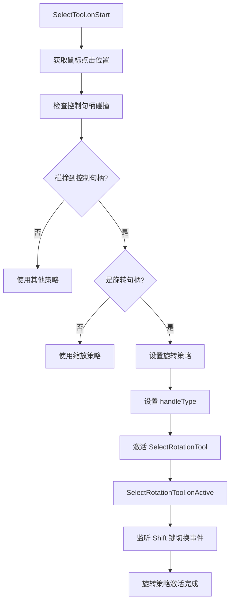
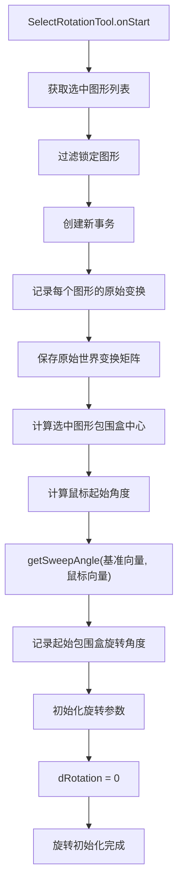
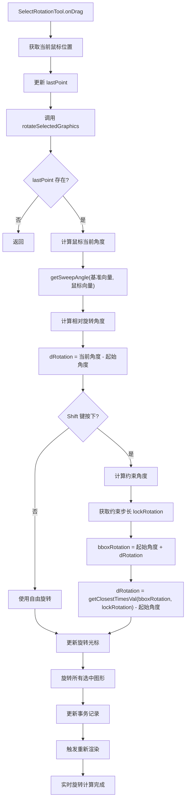
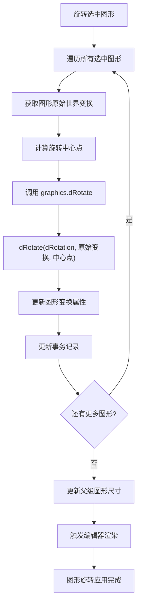
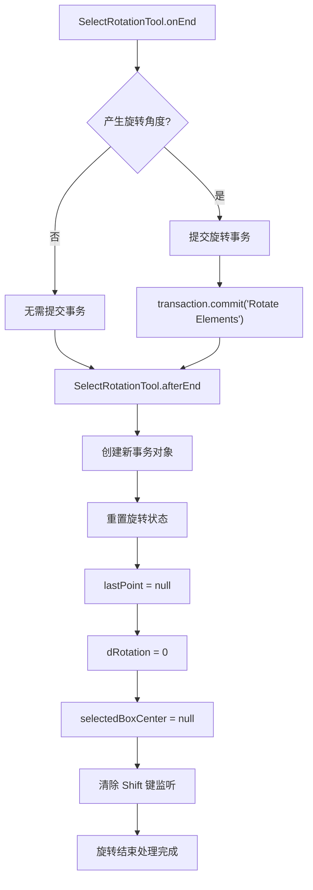
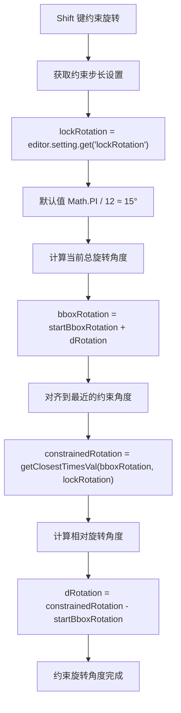

# Suika 编辑器旋转所选图形的完整流程文档

## 概述

本文档详细描述了 Suika 编辑器中旋转所选图形的完整实现流程，包括从用户交互、策略选择、角度计算到最终渲染的各个阶段。

## 🔍 流程图查看指南

**如果您的 Markdown 查看器不支持 Mermaid 图表渲染，请使用以下在线工具查看：**

1. **Mermaid Live Editor**: <https://mermaid.live/>
2. **复制下方任一流程图代码块 → 粘贴到在线编辑器 → 查看可视化流程图**

## 核心组件

### 1. SelectRotationTool 类

位置：`packages/core/src/tools/tool_select/tool_select_rotation.ts`

#### 主要功能

- 处理选中图形的旋转操作
- 计算鼠标移动产生的旋转角度
- 支持 Shift 键约束旋转角度
- 实时更新图形变换和光标显示
- 管理旋转事务的提交和回滚

#### 核心属性

```typescript
class SelectRotationTool implements IBaseTool {
  private originWorldTfMap = new Map<string, IMatrixArr>(); // 原始世界变换
  private transaction: Transaction; // 事务管理
  private selectedItems: SuikaGraphics[] = []; // 选中图形列表
  private lastPoint: IPoint | null = null; // 最后鼠标位置
  private startRotation = 0; // 开始时的旋转角度
  private startBboxRotation = 0; // 开始时包围盒的旋转角度
  private dRotation = 0; // 相对旋转角度
  private selectedBoxCenter: IPoint | null = null; // 选中图形中心点
  handleType = ''; // 控制句柄类型
}
```

### 2. 角度计算算法

#### 主要函数

- `getSweepAngle()`: 计算鼠标相对于中心的扫描角度
- `getClosestTimesVal()`: 将角度约束到指定步长的整数倍
- `rad2Deg()`: 弧度转角度（用于光标显示）

#### 旋转角度计算

```typescript
const lastMouseRotation = getSweepAngle(
  { x: 0, y: -1 }, // 基准向量（向上）
  {
    x: lastPoint.x - cxInSelectedElementsBBox,
    y: lastPoint.y - cyInSelectedElementsBBox,
  }, // 鼠标向量
);

this.dRotation = lastMouseRotation - this.startRotation;
```

### 3. 控制句柄管理

位置：`packages/core/src/control_handle_manager/`

#### 旋转句柄类型

```typescript
const types = [
  'nwRotation', // 左上旋转句柄
  'neRotation', // 右上旋转句柄
  'seRotation', // 右下旋转句柄
  'swRotation', // 左下旋转句柄
];
```

#### 旋转光标判断

```typescript
export const isRotationCursor = (cursor: ICursor): boolean => {
  return cursor.type === 'rotation' ||
         (cursor.type === 'custom' && cursor.name?.includes('rotate'));
};
```

## 完整流程图

### 📋 Phase 1: 旋转策略激活阶段 (复制下方代码块到 mermaid.live 查看)



### Phase 2: 旋转初始化阶段 (复制下方代码块到 mermaid.live 查看)



### Phase 3: 实时旋转计算阶段 (复制下方代码块到 mermaid.live 查看)



### Phase 4: 图形旋转应用阶段 (复制下方代码块到 mermaid.live 查看)



### Phase 5: 旋转结束处理阶段 (复制下方代码块到 mermaid.live 查看)



### Phase 6: 约束旋转角度阶段 (复制下方代码块到 mermaid.live 查看)



## 详细流程说明

### 1. 旋转策略激活

#### 1.1 控制句柄检测

```typescript
// SelectTool.onStart - 策略选择
const handleInfo = this.editor.controlHandleManager.getHandleInfoByPoint(
  this.startPoint,
);

if (handleInfo) {
  if (isRotationCursor(handleInfo.cursor)) {
    // 激活旋转策略
    this.strategySelectRotation.handleType = handleInfo.handleName;
    this.currStrategy = this.strategySelectRotation;
  } else {
    // 激活缩放策略
    this.currStrategy = this.strategySelectResize;
  }
}
```

#### 1.2 旋转光标判断

```typescript
export const isRotationCursor = (cursor: ICursor): boolean => {
  return cursor.type === 'rotation' ||
         (cursor.type === 'custom' && cursor.name?.includes('rotate'));
};
```

### 2. 旋转初始化

#### 2.1 状态记录

```typescript
// SelectRotationTool.onStart
onStart(e: PointerEvent) {
  // 获取并过滤选中图形
  this.selectedItems = this.editor.selectedElements.getItems({
    excludeLocked: true, // 排除锁定图形
  });

  // 记录每个图形的原始状态
  for (const graphics of this.selectedItems) {
    this.transaction.recordOld(graphics.attrs.id, {
      transform: cloneDeep(graphics.attrs.transform),
    });

    // 保存原始世界变换矩阵
    this.originWorldTfMap.set(
      graphics.attrs.id,
      graphics.getWorldTransform(),
    );
  }

  // 计算选中图形的中心点
  const boundingRect = this.editor.selectedElements.getBoundingRect()!;
  this.selectedBoxCenter = {
    x: boundingRect.x + boundingRect.width / 2,
    y: boundingRect.y + boundingRect.height / 2,
  };
}
```

#### 2.2 起始角度计算

```typescript
// 计算鼠标起始角度
const mousePoint = this.editor.getSceneCursorXY(e);
this.startRotation = getSweepAngle(
  { x: 0, y: -1 }, // 基准向量（向上）
  {
    x: mousePoint.x - this.selectedBoxCenter.x,
    y: mousePoint.y - this.selectedBoxCenter.y,
  }, // 鼠标相对向量
);

// 记录起始包围盒旋转角度
this.startBboxRotation = this.editor.selectedElements.getRotation();
```

### 3. 实时旋转计算

#### 3.1 角度计算

```typescript
private rotateSelectedGraphics() {
  const lastPoint = this.lastPoint;
  if (!lastPoint) return;

  // 计算当前鼠标角度
  const lastMouseRotation = getSweepAngle(
    { x: 0, y: -1 }, // 基准向量
    {
      x: lastPoint.x - this.selectedBoxCenter!.x,
      y: lastPoint.y - this.selectedBoxCenter!.y,
    }, // 当前鼠标相对向量
  );

  // 计算相对旋转角度
  this.dRotation = lastMouseRotation - this.startRotation;

  // Shift 键约束
  if (this.editor.hostEventManager.isShiftPressing) {
    const lockRotation = this.editor.setting.get('lockRotation');
    const bboxRotation = this.startBboxRotation + this.dRotation;
    this.dRotation = getClosestTimesVal(bboxRotation, lockRotation) -
                    this.startBboxRotation;
  }
}
```

#### 3.2 光标更新

```typescript
// 更新旋转光标
if (this.editor.selectedElements.size() === 1) {
  // 单图形旋转 - 使用控制句柄光标
  this.editor.setCursor(
    getRotationCursor(this.handleType, this.editor.selectedBox.getBox()!),
  );
} else {
  // 多图形旋转 - 显示当前角度
  this.editor.setCursor({
    type: 'rotation',
    degree: rad2Deg(lastMouseRotation),
  });
}
```

### 4. 图形变换应用

#### 4.1 旋转应用

```typescript
for (const graphics of this.selectedItems) {
  // 以选中图形中心为旋转点进行相对旋转
  graphics.dRotate(
    this.dRotation, // 相对旋转角度
    this.originWorldTfMap.get(graphics.attrs.id)!, // 原始世界变换
    {
      x: this.selectedBoxCenter!.x,
      y: this.selectedBoxCenter!.y,
    }, // 旋转中心点
  );

  // 更新事务记录
  this.transaction.update(graphics.attrs.id, {
    transform: [...graphics.attrs.transform],
  });
}

// 更新父级图形尺寸
this.transaction.updateParentSize(this.selectedItems);

// 触发重新渲染
this.editor.render();
```

#### 4.2 Shift 键约束

```typescript
// lockRotation 默认值为 Math.PI / 12 ≈ 15°
const lockRotation = this.editor.setting.get('lockRotation'); // 15°

// 计算约束后的旋转角度
const bboxRotation = this.startBboxRotation + this.dRotation;
const constrainedRotation = getClosestTimesVal(bboxRotation, lockRotation);

// 计算相对旋转角度
this.dRotation = constrainedRotation - this.startBboxRotation;
```

### 5. 事务管理和结束处理

#### 5.1 事务提交

```typescript
onEnd() {
  // 只有产生实际旋转角度才提交事务
  if (this.dRotation !== 0) {
    this.transaction.commit('Rotate Elements');
  }
}
```

#### 5.2 状态清理

```typescript
afterEnd() {
  // 创建新事务对象
  this.transaction = new Transaction(this.editor);

  // 重置所有状态
  this.lastPoint = null;
  this.dRotation = 0;
  this.selectedBoxCenter = null;

  // 清除事件监听
  this.editor.hostEventManager.off('shiftToggle', this.shiftPressHandler);
}
```

## 关键算法分析

### 1. 扫描角度计算

**getSweepAngle 函数**：

```typescript
export const getSweepAngle = (baseVec: IPoint, targetVec: IPoint): number => {
  // 计算两个向量之间的夹角
  const cross = baseVec.x * targetVec.y - baseVec.y * targetVec.x;
  const dot = baseVec.x * targetVec.x + baseVec.y * targetVec.y;

  // 返回扫描角度（考虑旋转方向）
  return Math.atan2(cross, dot);
};
```

- **基准向量**: `{x: 0, y: -1}` (向上)
- **目标向量**: 鼠标位置相对于旋转中心的向量
- **返回值**: 以弧度为单位的扫描角度

### 2. 角度约束算法

**getClosestTimesVal 函数**：

```typescript
export const getClosestTimesVal = (value: number, step: number): number => {
  // 计算最接近的值，该值是 step 的整数倍
  return Math.round(value / step) * step;
};
```

- **输入**: 当前角度值和约束步长
- **输出**: 最接近的约束角度值
- **应用**: Shift 键约束旋转角度

### 3. 图形旋转算法

**dRotate 方法**：

```typescript
graphics.dRotate(
  dRotation,      // 相对旋转角度
  originWorldTf,  // 原始世界变换矩阵
  centerPoint,    // 旋转中心点
);
```

- **相对旋转**: 基于原始位置的增量旋转
- **世界变换**: 考虑图形在场景中的完整变换
- **中心旋转**: 以指定点为中心进行旋转

## 技术特点

### 1. 实时反馈

- **即时响应**: 鼠标移动时实时计算和显示旋转效果
- **光标更新**: 根据旋转角度动态更新光标显示
- **视觉反馈**: 旋转过程中立即渲染图形变化

### 2. 约束控制

- **Shift 约束**: 按住 Shift 键时角度自动对齐到指定步长
- **可配置步长**: 通过设置调整约束角度的精度
- **平滑过渡**: 约束角度计算确保流畅的用户体验

### 3. 事务管理

- **状态记录**: 开始旋转时记录所有图形的原始状态
- **增量更新**: 实时更新图形变换到事务中
- **条件提交**: 只有实际产生旋转时才提交事务
- **回滚支持**: 支持撤销旋转操作

### 4. 性能优化

- **批量处理**: 对所有选中图形进行批量旋转
- **矩阵运算**: 使用变换矩阵进行高效的几何计算
- **最小重渲染**: 只在必要时触发重新渲染

## 使用场景

### 1. 单图形旋转

- 点击单个图形的旋转控制句柄
- 自由拖拽旋转或按住 Shift 键约束角度
- 适用于调整单个元素的旋转角度

### 2. 多图形旋转

- 选中多个图形后点击任一旋转控制句柄
- 所有选中图形以它们的几何中心为轴心同时旋转
- 适用于批量调整多个元素的旋转角度

### 3. 约束旋转

- 按住 Shift 键进行旋转
- 旋转角度自动对齐到 15° 的整数倍
- 适用于需要精确角度对齐的场景

## 扩展性

### 1. 自定义约束角度

可以通过修改设置来调整约束步长：

```typescript
// 设置为 45° 约束
editor.setting.set('lockRotation', Math.PI / 4);

// 设置为 30° 约束
editor.setting.set('lockRotation', Math.PI / 6);
```

### 2. 自定义旋转中心

可以扩展旋转策略以支持自定义旋转中心点：

```typescript
// 扩展 SelectRotationTool
private getRotationCenter(): IPoint {
  // 返回自定义旋转中心逻辑
  // 例如：鼠标位置、图形特定点等
}
```

### 3. 高级旋转功能

可以添加更多旋转相关的功能：

```typescript
// 旋转到特定角度
rotateToAngle(angle: number) { /* ... */ }

// 镜像旋转
rotateMirror(axis: 'horizontal' | 'vertical') { /* ... */ }

// 逐步旋转
rotateByStep(step: number) { /* ... */ }
```

## 总结

Suika 编辑器的旋转功能通过精心设计的算法和流程，实现了精确、直观的多图形旋转操作。系统支持实时反馈、角度约束和事务管理，为用户提供了专业级的旋转体验。

旋转功能作为编辑器的基础变换能力之一，其实现直接影响了用户的操作效率和设计精度。通过结合鼠标交互、键盘约束和事务系统，旋转功能在各种使用场景下都能提供可靠的变换控制。
