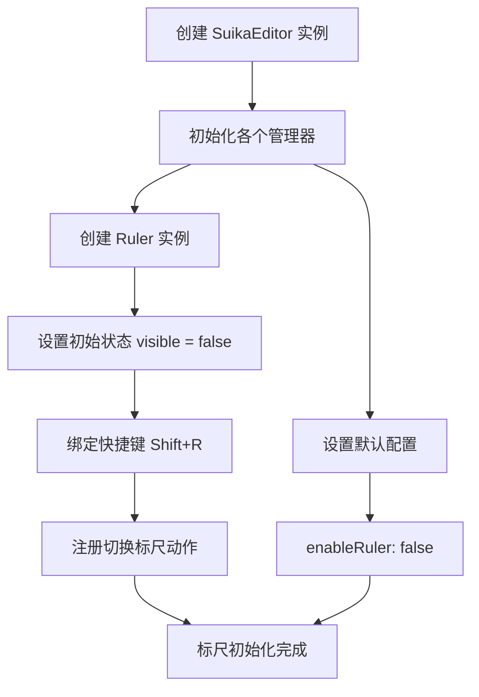
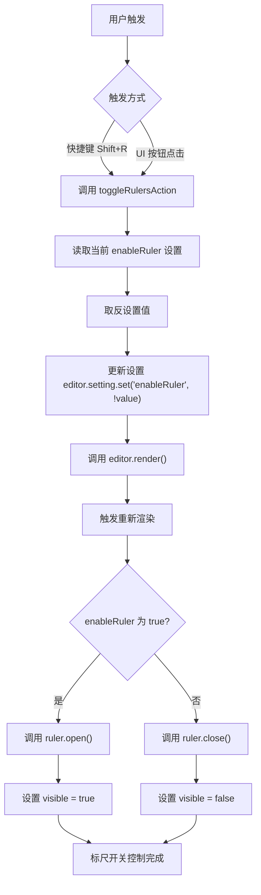
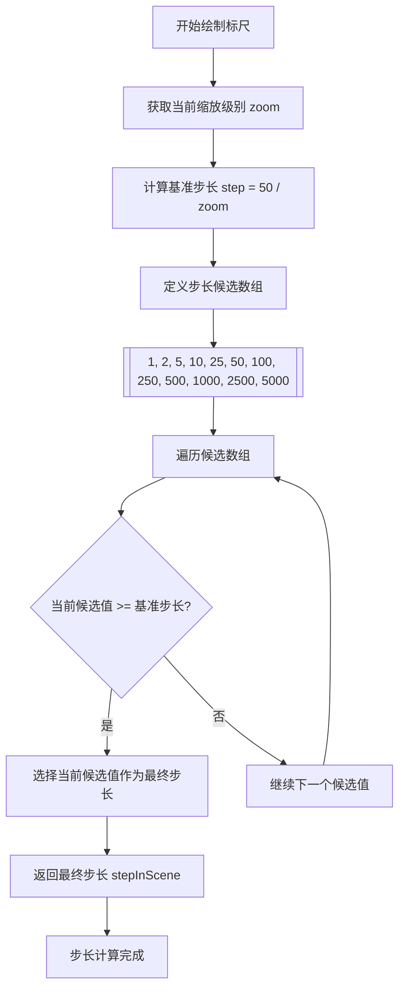
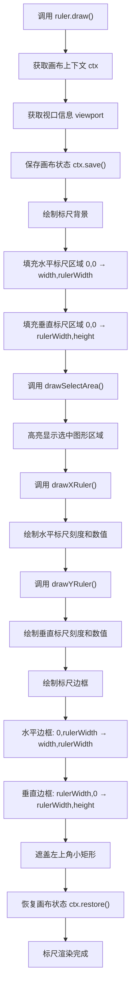
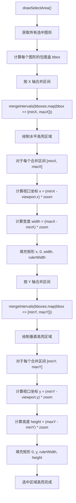
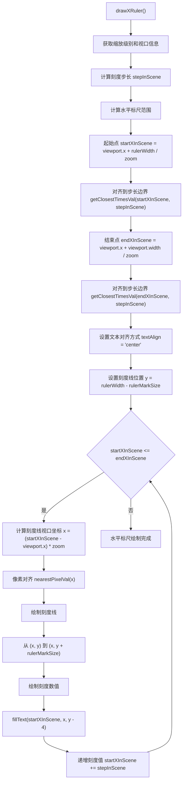
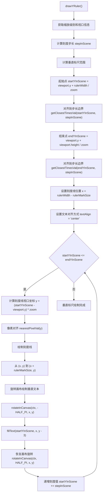

# Suika 编辑器标尺功能的完整流程文档

## 概述

本文档详细描述了 Suika 编辑器中标尺功能的完整实现流程，包括从初始化、开关控制、动态刻度计算到渲染的各个阶段。

## 🔍 流程图查看指南

**如果您的 Markdown 查看器不支持 Mermaid 图表渲染，请使用以下在线工具查看：**

1. **Mermaid Live Editor**: <https://mermaid.live/>
2. **复制下方任一流程图代码块 → 粘贴到在线编辑器 → 查看可视化流程图**

## 核心组件

### 1. Ruler 类

位置：`packages/core/src/ruler.ts`

#### 主要功能

- 管理标尺的显示状态（开/关）
- 根据缩放级别动态计算刻度步长
- 渲染水平和垂直标尺
- 高亮显示选中图形的区域
- 处理坐标转换和像素对齐

#### 核心属性

```typescript
class Ruler {
  visible = false; // 标尺显示状态
  // 通过构造函数传入 editor 实例
}
```

#### 关键方法

- `open()`: 开启标尺显示
- `close()`: 关闭标尺显示
- `draw()`: 执行标尺绘制
- `drawXRuler()`: 绘制水平标尺
- `drawYRuler()`: 绘制垂直标尺
- `drawSelectArea()`: 绘制选中区域高亮

### 2. 缩放步长算法 (getStepByZoom)

#### 功能说明

根据当前缩放级别动态计算标尺刻度的显示步长，确保在不同缩放比例下都有合适的刻度密度。

```typescript
const getStepByZoom = (zoom: number) => {
  const steps = [1, 2, 5, 10, 25, 50, 100, 250, 500, 1000, 2500, 5000];
  const step = 50 / zoom;
  for (let i = 0, len = steps.length; i < len; i++) {
    if (steps[i] >= step) return steps[i];
  }
  return steps[0];
};
```

#### 算法逻辑

1. **基准计算**: `step = 50 / zoom`
   - zoom = 1.0 时，step = 50（100% 缩放）
   - zoom = 2.0 时，step = 25（200% 缩放）
   - zoom = 0.5 时，step = 100（50% 缩放）

2. **步长映射**: 从预定义数组中选择最接近且不小于计算值的步长
3. **步长序列**: [1, 2, 5, 10, 25, 50, 100, 250, 500, 1000, 2500, 5000]

### 3. 设置配置

位置：`packages/core/src/setting.ts`

#### 标尺相关配置

```typescript
/**** ruler ****/
enableRuler: false,              // 是否启用标尺
minStepInViewport: 50,           // 视口区域下的最小步长
rulerBgColor: '#fff',            // 标尺背景色
rulerStroke: '#e6e6e6',          // 标尺边框色
rulerMarkStroke: '#c1c1c1',      // 刻度线颜色
rulerSelectedBgColor: '#e6f5ff', // 选中区域高亮色
rulerWidth: 20,                  // 标尺宽度
rulerMarkSize: 4,                // 刻度线长度
```

## 完整流程图

### 📋 Phase 1: 初始化阶段 (复制下方代码块到 mermaid.live 查看)



### Phase 2: 开关控制阶段 (复制下方代码块到 mermaid.live 查看)



### Phase 3: 步长计算阶段 (复制下方代码块到 mermaid.live 查看)



### Phase 4: 渲染准备阶段 (复制下方代码块到 mermaid.live 查看)



### Phase 5: 选中区域高亮阶段 (复制下方代码块到 mermaid.live 查看)



### Phase 6: 水平标尺绘制阶段 (复制下方代码块到 mermaid.live 查看)



### Phase 7: 垂直标尺绘制阶段 (复制下方代码块到 mermaid.live 查看)



## 详细流程说明

### 1. 初始化和配置

#### 1.1 编辑器初始化

```typescript
// 在 SuikaEditor 构造函数中
this.ruler = new Ruler(this);

// 默认配置
enableRuler: false,  // 标尺默认关闭
rulerWidth: 20,      // 标尺宽度 20px
rulerMarkSize: 4,    // 刻度线长度 4px
```

#### 1.2 快捷键绑定

```typescript
// 在 CommandKeyBinding 中
const toggleRulersAction = () => {
  editor.setting.set('enableRuler', !editor.setting.get('enableRuler'));
  editor.render();
};

editor.keybindingManager.register({
  key: { shiftKey: true, keyCode: 'KeyR' },
  actionName: 'Toggle Rulers',
  action: toggleRulersAction,
});
```

#### 1.3 UI 控制

标尺开关位于缩放控制面板中：

```typescript
// ZoomActions.tsx
<ActionItem
  check={setting.enableRuler}
  suffix={isWindows() ? 'Shift+R' : '⇧R'}
  onClick={() => {
    const enableRuler = editor.setting.get('enableRuler');
    editor.setting.set('enableRuler', !enableRuler);
    editor.render();
  }}
>
  <FormattedMessage id="setting.rulers" />
</ActionItem>
```

### 2. 动态步长计算

#### 2.1 步长算法详解

```typescript
const getStepByZoom = (zoom: number) => {
  // 缩放步长映射表（从大到小排列）
  const steps = [1, 2, 5, 10, 25, 50, 100, 250, 500, 1000, 2500, 5000];

  // 基准计算：50px 是 100% 缩放下的理想步长
  const step = 50 / zoom;

  // 找到第一个不小于基准值的候选步长
  for (let i = 0, len = steps.length; i < len; i++) {
    if (steps[i] >= step) return steps[i];
  }

  // 兜底返回最小步长
  return steps[0];
};
```

#### 2.2 实际应用举例

| 缩放级别 | 基准步长 | 选择步长 | 说明 |
|----------|----------|----------|------|
| 800% | 50/8 = 6.25 | 10 | 选择第一个 ≥6.25 的值 |
| 400% | 50/4 = 12.5 | 25 | 选择第一个 ≥12.5 的值 |
| 200% | 50/2 = 25 | 25 | 精确匹配 |
| 100% | 50/1 = 50 | 50 | 精确匹配 |
| 50% | 50/0.5 = 100 | 100 | 精确匹配 |
| 25% | 50/0.25 = 200 | 250 | 选择第一个 ≥200 的值 |

### 3. 坐标系统转换

#### 3.1 场景坐标 ↔ 视口坐标

```typescript
// 场景坐标 → 视口坐标
const { x: xInViewport, y: yInViewport } = this.editor.toViewportPt(x, y);

// 视口坐标 → 场景坐标
const { x: xInScene, y: yInScene } = this.editor.toScenePt(x, y);
```

#### 3.2 像素对齐

```typescript
// 确保刻度线绘制在像素边界上，避免模糊
const x = nearestPixelVal((startXInScene - viewport.x) * zoom);
const y = nearestPixelVal((startYInScene - viewport.y) * zoom);
```

### 4. 选中区域高亮

#### 4.1 区间合并算法

```typescript
// 获取所有选中图形的包围盒
const bboxes = this.editor.selectedElements
  .getItems()
  .map((item) => item.getBbox());

// 合并 X 轴区间
const xIntervals = mergeIntervals(
  bboxes.map(({ minX, maxX }) => [minX, maxX])
);

// 合并 Y 轴区间
const yIntervals = mergeIntervals(
  bboxes.map(({ minY, maxY }) => [minY, maxY])
);
```

#### 4.2 高亮绘制

```typescript
// 绘制水平高亮条
for (const [minX, maxX] of xIntervals) {
  const x = (minX - viewport.x) * zoom;
  const width = (maxX - minX) * zoom;
  ctx.fillRect(x, 0, width, rulerWidth);
}

// 绘制垂直高亮条
for (const [minY, maxY] of yIntervals) {
  const y = (minY - viewport.y) * zoom;
  const height = (maxY - minY) * zoom;
  ctx.fillRect(0, y, rulerWidth, height);
}
```

### 5. 刻度绘制优化

#### 5.1 范围计算

```typescript
// 水平标尺
const startX = rulerWidth;
let startXInScene = viewport.x + startX / zoom;
startXInScene = getClosestTimesVal(startXInScene, stepInScene);

const endX = viewport.width;
let endXInScene = viewport.x + endX / zoom;
endXInScene = getClosestTimesVal(endXInScene, stepInScene);

// 垂直标尺
const startY = rulerWidth;
let startYInScene = viewport.y + startY / zoom;
startYInScene = getClosestTimesVal(startYInScene, stepInScene);

const endY = viewport.height;
let endYInScene = viewport.y + endY / zoom;
endYInScene = getClosestTimesVal(endYInScene, stepInScene);
```

#### 5.2 垂直文本绘制

```typescript
// 保存当前变换状态
ctx.save();

// 移动到刻度位置并旋转 -90 度
rotateInCanvas(ctx, -HALF_PI, x, y);

// 绘制垂直方向的文本
ctx.fillText(String(startYInScene), x, y - 3);

// 恢复变换状态
rotateInCanvas(ctx, HALF_PI, x, y);
ctx.restore();
```

## 技术特点

### 1. 自适应缩放

- **动态步长**: 根据缩放级别自动调整刻度密度
- **视觉一致性**: 在任何缩放比例下都保持良好的可读性
- **性能优化**: 只绘制可见区域内的刻度

### 2. 精确坐标

- **像素对齐**: 刻度线和文本都对齐到像素边界
- **坐标转换**: 正确保口坐标与场景坐标的转换
- **边界处理**: 刻度值对齐到步长边界

### 3. 选中反馈

- **实时高亮**: 选中图形区域在标尺上高亮显示
- **区间合并**: 避免重叠区域重复绘制
- **视觉引导**: 帮助用户理解图形在画布中的位置

### 4. 跨平台兼容

- **快捷键适配**: Windows (Shift+R) / macOS (⇧R)
- **文本渲染**: 处理不同平台的文本渲染差异
- **像素密度**: 支持高 DPI 显示器

## 扩展性

### 1. 自定义步长算法

可以通过修改 `getStepByZoom` 函数来实现自定义的步长计算：

```typescript
const getCustomStepByZoom = (zoom: number) => {
  // 自定义步长逻辑
  if (zoom > 4) return 1;
  if (zoom > 2) return 5;
  if (zoom > 1) return 10;
  // ...
};
```

### 2. 自定义样式

可以通过设置配置来自定义标尺外观：

```typescript
editor.setting.set('rulerBgColor', '#f0f0f0');
editor.setting.set('rulerMarkStroke', '#666666');
editor.setting.set('rulerSelectedBgColor', '#cce7ff');
```

### 3. 额外的标尺功能

可以扩展标尺类来添加更多功能：

```typescript
class ExtendedRuler extends Ruler {
  // 添加网格线显示
  drawGridLines() { /* ... */ }

  // 添加参考线
  drawGuideLines() { /* ... */ }

  // 添加鼠标位置指示器
  drawMouseIndicator() { /* ... */ }
}
```

## 总结

Suika 编辑器的标尺功能通过精心设计的算法和渲染流程，实现了专业设计工具所需的精确测量和视觉引导功能。系统支持动态缩放、选中反馈和跨平台兼容，为用户提供了直观准确的坐标参考。

标尺功能作为编辑器的基础视觉组件，其实现直接影响了用户的操作体验和设计精度。通过自适应算法和精确的坐标处理，标尺在各种缩放比例和使用场景下都能提供可靠的测量参考。
