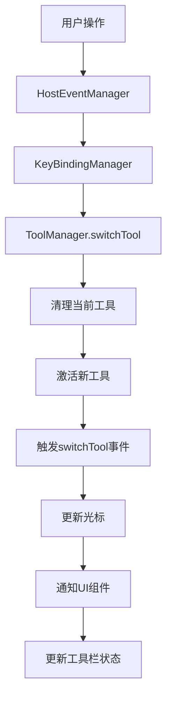
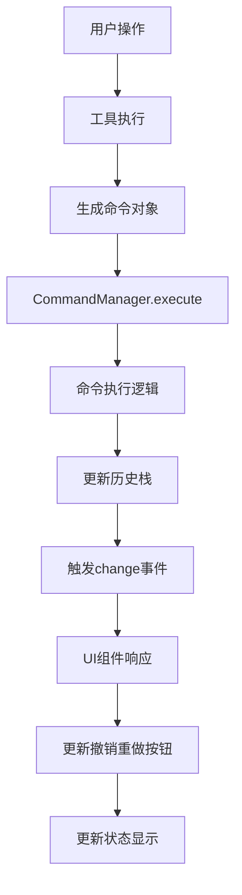
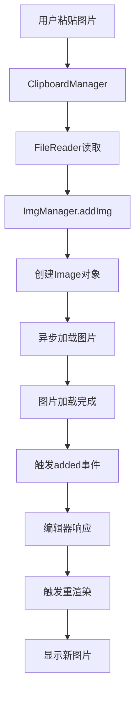

# Suika 编辑器模块间的通信完整的流程文档

## 概述

本文档详细描述了 Suika 编辑器中模块间的通信机制，包括从事件驱动架构、消息传递模式到各个模块间的协作流程。Suika 采用事件驱动的松耦合架构，通过 EventEmitter 实现模块间的解耦通信，确保系统的高可维护性和扩展性。

## 🔍 流程图查看指南

**如果您的 Markdown 查看器不支持 Mermaid 图表渲染，请使用以下在线工具查看：**

1. **Mermaid Live Editor**: <https://mermaid.live/>
2. **复制下方任一流程图代码块 → 粘贴到在线编辑器 → 查看可视化流程图**

## 核心通信机制

### 1. EventEmitter 事件发射器

位置：`packages/common/src/event_emitter.ts`

#### 主要功能

- 实现发布-订阅模式的核心机制
- 支持类型安全的泛型事件定义
- 提供事件监听、触发和移除功能

#### 核心实现

```typescript
export class EventEmitter<T extends Record<string | symbol, any>> {
  private eventMap: Record<keyof T, Array<(...args: any[]) => void>> =
    {} as any;

  on<K extends keyof T>(eventName: K, listener: T[K]) {
    if (!this.eventMap[eventName]) {
      this.eventMap[eventName] = [];
    }
    this.eventMap[eventName].push(listener);
    return this;
  }

  emit<K extends keyof T>(eventName: K, ...args: Parameters<T[K]>) {
    const listeners = this.eventMap[eventName];
    if (!listeners || listeners.length === 0) return false;
    listeners.forEach((listener) => {
      listener(...args);
    });
    return true;
  }

  off<K extends keyof T>(eventName: K, listener: T[K]) {
    if (this.eventMap[eventName]) {
      this.eventMap[eventName] = this.eventMap[eventName].filter(
        (item) => item !== listener,
      );
    }
    return this;
  }
}
```

### 2. 中央协调器模式

位置：`packages/core/src/editor.ts`

#### 编辑器作为通信枢纽

```typescript
export class SuikaEditor {
  // 各个管理器模块
  cursorManager: CursorManger;
  toolManager: ToolManager;
  commandManager: CommandManager;
  viewportManager: ViewportManager;
  zoomManager: ZoomManager;
  imgManager: ImgManager;
  // ... 其他模块

  // 全局事件发射器
  private emitter = new EventEmitter<Events>();

  constructor(options: IEditorOptions) {
    // 初始化各个模块
    this.cursorManager = new CursorManger(this);
    this.toolManager = new ToolManager(this);
    this.commandManager = new CommandManager(this);
    // ...
  }
}
```

## 通信模式分析

### 1. 模块内部通信

#### 每个模块拥有独立的 EventEmitter

```typescript
// ToolManager 内部通信
export class ToolManager {
  private eventEmitter = new EventEmitter<Events>();

  switchTool(toolType: string) {
    // 切换工具逻辑
    this.eventEmitter.emit('switchTool', toolType);
  }

  onToolSwitch(callback: (type: string) => void) {
    this.eventEmitter.on('switchTool', callback);
  }
}
```

#### CommandManager 状态变更通知

```typescript
export class CommandManager {
  private emitter = new EventEmitter<Events>();

  executeCommand(command: ICommand) {
    // 执行命令
    this.updateHistoryStatus();
    this.emitter.emit('change', this.getHistoryStatus());
  }

  onHistoryChange(callback: (status: IHistoryStatus) => void) {
    this.emitter.on('change', callback);
  }
}
```

### 2. 跨模块通信

#### 通过编辑器实例进行协调

```typescript
// 工具管理器通知编辑器更新光标
export class ToolManager {
  setCursorWhenActive() {
    if (this.currentTool) {
      // 通过编辑器设置光标
      this.editor.cursorManager.setCursor(this.currentTool.cursor);
    }
  }
}

// 编辑器响应图片加载事件
constructor(options: IEditorOptions) {
  this.imgManager.on('added', () => {
    this.render(); // 图片加载完成触发重渲染
  });
}
```

#### 设置同步机制

```typescript
// 全局设置变更通知所有相关模块
export class Setting {
  private emitter = new EventEmitter<SettingEvents>();

  set<K extends keyof ISetting>(key: K, value: ISetting[K]) {
    this.data[key] = value;
    this.emitter.emit('change', { key, value });
  }

  onChange(callback: (change: ISettingChange) => void) {
    this.emitter.on('change', callback);
  }
}
```

## 通信流程详解

### 1. 工具切换通信流程

#### 流程描述

1. 用户按下快捷键或点击工具栏
2. HostEventManager 捕获事件
3. KeyBindingManager 处理快捷键绑定
4. ToolManager 切换工具
5. 触发工具切换事件
6. 相关模块响应更新

#### 代码实现

```typescript
// 1. 快捷键绑定 (HostEventManager)
this.keybindingManager.register({
  key: { metaKey: true, keyCode: 'KeyV' }, // Cmd+V (Mac)
  winKey: { ctrlKey: true, keyCode: 'KeyV' }, // Ctrl+V (Windows)
  actionName: 'Select Tool',
  action: () => {
    this.editor.toolManager.switchTool('select');
  },
});

// 2. 工具切换 (ToolManager)
switchTool(toolType: string) {
  // 清理当前工具
  if (this.currentTool) {
    this.currentTool.onDeactive();
  }

  // 切换到新工具
  this.currentTool = this.toolCtorMap.get(toolType)?.(this.editor) || null;
  if (this.currentTool) {
    this.currentTool.onActive();
  }

  // 通知监听者
  this.eventEmitter.emit('switchTool', toolType);

  // 更新UI状态
  this.setCursorWhenActive();
}
```

### 2. 命令执行通信流程

#### 撤销重做状态同步

```typescript
// CommandManager 执行命令后通知状态变更
executeCommand(command: ICommand) {
  command.execute();
  this.undoStack.push({ command });

  // 清空重做栈
  this.redoStack = [];

  // 通知状态变更
  this.emitter.emit('change', this.getHistoryStatus());
}

// UI组件监听状态变更
commandManager.onHistoryChange((status) => {
  // 更新撤销/重做按钮状态
  undoButton.disabled = !status.canUndo;
  redoButton.disabled = !status.canRedo;
});
```

### 3. 图片加载通信流程

#### 异步资源加载通知

```typescript
// ImgManager 图片加载完成通知
async addImg(url: string) {
  const img = new Image();
  img.src = url;

  await new Promise((resolve) => {
    img.onload = () => {
      this.imgMap.set(url, img);
      // 通知所有监听者图片已加载
      this.eventEmitter.emit('added', img);
      resolve(img);
    };
  });
}

// 编辑器监听图片加载事件
this.imgManager.on('added', () => {
  // 图片加载完成，触发重渲染
  this.render();
});
```

### 4. 鼠标事件通信流程

#### 多模块协同处理

```typescript
// MouseEventManager 统一处理鼠标事件
handleMouseEvent(event: MouseEvent, eventType: string) {
  // 更新鼠标位置状态
  this.setCursorPos(this.getSceneCoords(event));

  // 通知工具管理器处理事件
  const toolEvent = this.createToolEvent(event, eventType);
  this.editor.toolManager.handleMouseEvent(toolEvent);

  // 更新光标
  this.editor.cursorManager.updateCursor(event);
}
```

## 通信模式分类

### 1. 一对一通信

#### 直接方法调用

```typescript
// 编辑器直接调用模块方法
setCursor(cursor: ICursor) {
  this.cursorManager.setCursor(cursor);
}

// 模块直接调用编辑器方法
this.editor.render();
```

### 2. 一对多通信

#### 事件广播模式

```typescript
// 设置变更广播给所有监听者
setting.set('snapToGrid', true);
// 所有监听该设置的模块都会收到通知

// 工具切换通知所有相关UI组件
toolManager.switchTool('select');
// 工具栏、属性面板等都会更新状态
```

### 3. 异步通信

#### Promise 和事件结合

```typescript
// 图片加载异步通信
const imgUrl = await this.loadImageFile(file);
await this.imgManager.addImg(imgUrl);
// 图片加载完成后通过事件通知渲染
```

## 系统架构

```text
┌─────────────────────────────────────────────────┐
│                 SuikaEditor                     │
│  ┌─────────────────────────────────────────┐    │
│  │        Central Coordinator             │    │
│  │  ├─ toolManager.switchTool()          │    │
│  │  ├─ cursorManager.setCursor()         │    │
│  │  ├─ commandManager.execute()          │    │
│  │  └─ render()                          │    │
│  └─────────────────────────────────────────┘    │
│                                                 │
│  ┌─────────────────────────────────────────┐    │
│  │           Module Communication          │    │
│  │  ├─ EventEmitter (内部事件)            │    │
│  │  ├─ Direct Call (直接调用)             │    │
│  │  ├─ Callback (回调函数)                │    │
│  │  └─ Observer Pattern (观察者模式)     │    │
│  └─────────────────────────────────────────┘    │
│                                                 │
│  ┌─────────────────────────────────────────┐    │
│  │              Data Flow                  │    │
│  │  ├─ User Input → EventManager          │    │
│  │  ├─ EventManager → ToolManager         │    │
│  │  ├─ ToolManager → Canvas Operations    │    │
│  │  ├─ Canvas → Render → Display          │    │
│  │  └─ State Changes → UI Updates         │    │
│  └─────────────────────────────────────────┘    │
└─────────────────────────────────────────────────┘
```

## 通信协议规范

### 1. 事件命名约定

```typescript
// 模块内部事件
interface ToolManagerEvents {
  switchTool(type: string): void;
  changeEnableTools(toolTypes: string[]): void;
}

// 全局事件
interface EditorEvents {
  destroy(): void;
  paperChange(): void;
}

// 设置变更事件
interface SettingEvents {
  change(change: ISettingChange): void;
}
```

### 2. 消息格式标准化

```typescript
// 工具切换消息
{
  type: 'switchTool',
  data: {
    fromTool: 'select',
    toTool: 'draw-rect',
    timestamp: Date.now()
  }
}

// 命令执行消息
{
  type: 'commandExecuted',
  data: {
    commandType: 'addGraphs',
    graphCount: 3,
    canUndo: true,
    canRedo: false
  }
}
```

## 性能优化策略

### 1. 事件节流和防抖

```typescript
// 鼠标移动事件节流
private throttledMouseMove = rafThrottle((event: MouseEvent) => {
  this.handleMouseMove(event);
});

// 渲染节流
render = rafThrottle(() => {
  // 实际渲染逻辑
});
```

### 2. 选择性通知

```typescript
// 只在必要时触发重渲染
private needsRender = false;

markDirty() {
  this.needsRender = true;
}

renderIfNeeded() {
  if (this.needsRender) {
    this.render();
    this.needsRender = false;
  }
}
```

### 3. 事件监听器清理

```typescript
// 组件卸载时清理所有事件监听器
destroy() {
  this.toolManager.off('switchTool', this.handleToolSwitch);
  this.commandManager.off('change', this.handleHistoryChange);
  this.imgManager.off('added', this.handleImageAdded);
}
```

## 流程图

### 工具切换通信流程图



### 命令执行通信流程图



### 图片加载通信流程图



## 通信模式对比

| 通信模式   | 优点                 | 缺点                   | 适用场景                 |
| ---------- | -------------------- | ---------------------- | ------------------------ |
| 直接调用   | 简单高效，类型安全   | 紧耦合，难以扩展       | 模块初始化，简单状态同步 |
| 事件发射器 | 松耦合，易扩展       | 异步处理，调试困难     | 用户交互，状态变更通知   |
| 回调函数   | 灵活，易理解         | 回调地狱，生命周期管理 | 单次响应，异步操作完成   |
| 观察者模式 | 完全解耦，多对多通信 | 复杂度较高             | 设置变更，全局状态同步   |

## 调试和监控

### 1. 事件日志记录

```typescript
// 开发环境下记录所有事件
if (process.env.NODE_ENV === 'development') {
  const originalEmit = emitter.emit;
  emitter.emit = function (eventName, ...args) {
    console.log(`Event: ${eventName}`, args);
    return originalEmit.call(this, eventName, ...args);
  };
}
```

### 2. 通信性能监控

```typescript
// 统计事件触发频率
private eventStats = new Map<string, number>();

emit(eventName, ...args) {
  this.eventStats.set(eventName,
    (this.eventStats.get(eventName) || 0) + 1
  );
  // 原始发射逻辑
}
```

## 总结

Suika 编辑器的模块间通信采用了事件驱动的松耦合架构，通过 EventEmitter 实现模块解耦，编辑器作为中央协调器管理各个模块间的协作。这种设计确保了系统的可维护性、可扩展性和性能表现，为构建复杂的图形编辑功能提供了坚实的基础。

通信机制的核心特点包括：

- **类型安全**：使用 TypeScript 泛型确保事件参数类型正确
- **异步处理**：支持异步操作和事件驱动的 UI 更新
- **性能优化**：通过节流、防抖和选择性通知优化性能
- **生命周期管理**：完善的监听器清理和内存管理

这种架构使得各个模块能够独立开发和测试，同时保持整体系统的一致性和响应性。
