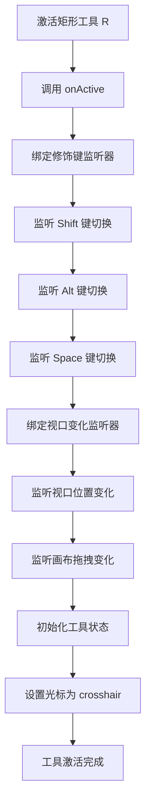
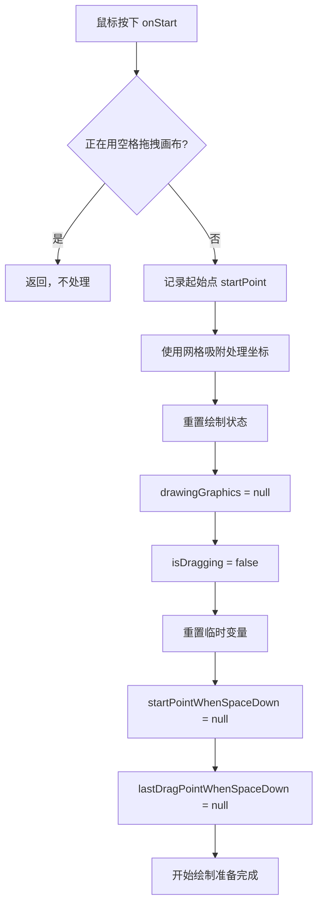
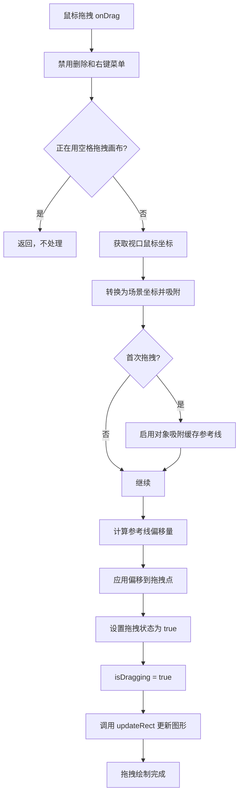
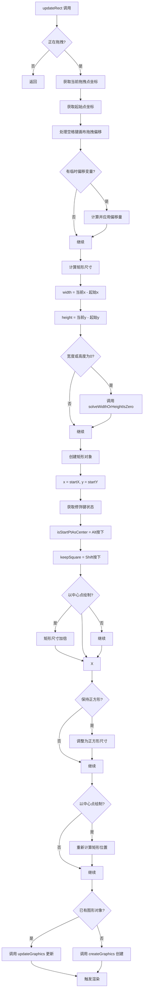
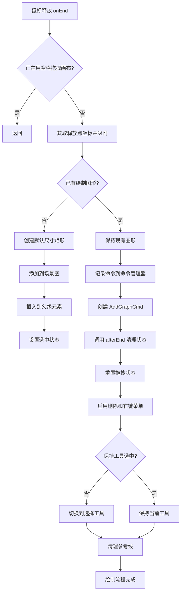
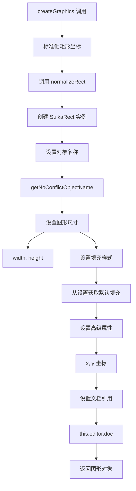
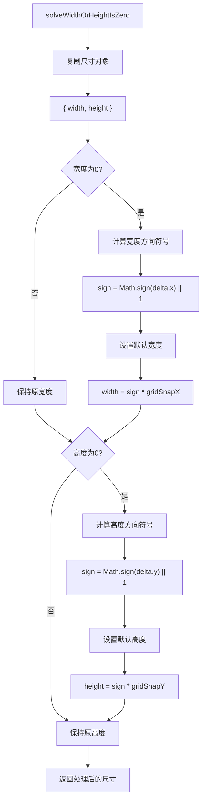

# Suika 编辑器矩形绘制功能完整流程文档

## 概述

本文档详细描述了 Suika 编辑器中矩形绘制功能的完整实现流程，包括从工具激活到图形创建、修饰键操作和命令记录的各个阶段。矩形绘制功能基于 `DrawGraphicsTool` 抽象类实现，由 `DrawRectTool` 具体实现，为用户提供了灵活的矩形创建和编辑能力。

## 🔍 流程图查看指南

**如果您的 Markdown 查看器不支持 Mermaid 图表渲染，请使用以下在线工具查看：**

1. **Mermaid Live Editor**: <https://mermaid.live/>
2. **复制下方任一流程图代码块 → 粘贴到在线编辑器 → 查看可视化流程图**

## 核心组件

### 1. DrawRectTool 类

位置：`packages/core/src/tools/tool_draw_rect.ts`

#### 主要功能

- 实现矩形图形的精确绘制
- 支持多种绘制模式（普通绘制、中心点绘制、正方形绘制）
- 提供实时的预览和交互反馈
- 集成网格吸附和对象吸附功能

#### 核心属性

```typescript
export class DrawRectTool extends DrawGraphicsTool implements ITool {
  static override readonly type = 'drawRect';
  static override readonly hotkey = 'r';

  override readonly type = 'drawRect';
  override readonly hotkey = 'r';
  commandDesc = 'Add Rect';
}
```

### 2. DrawGraphicsTool 抽象类

位置：`packages/core/src/tools/tool_draw_graphics.ts`

#### 主要功能

- 提供绘制工具的基础框架和生命周期管理
- 实现通用的绘制逻辑和事件处理
- 管理吸附、对齐和修饰键功能
- 处理图形创建、更新和命令记录

#### 核心属性

```typescript
export abstract class DrawGraphicsTool implements ITool {
  static readonly type: string = '';
  static readonly hotkey: string = '';

  protected drawingGraphics: SuikaGraphics | null = null;
  private startPoint: IPoint = { x: -1, y: -1 };
  private lastDragPoint!: IPoint;
  private isDragging = false;

  constructor(protected editor: SuikaEditor) {}
}
```

### 3. 相关命令类

#### AddGraphCmd 类

位置：`packages/core/src/commands/add_graphs.ts`

##### 主要功能

- 记录图形添加操作，支持撤销重做
- 管理图形的显示和隐藏状态
- 维护图形在场景图中的位置关系

```typescript
export class AddGraphCmd implements ICommand {
  constructor(
    public desc: string,
    private editor: SuikaEditor,
    private elements: SuikaGraphics[],
  ) {}

  redo() {
    for (const el of this.elements) {
      el.setDeleted(false);
      const parent = el.getParent();
      if (parent) {
        parent.insertChild(el, el.attrs.parentIndex?.position);
      }
    }
    this.editor.selectedElements.setItems(this.elements);
  }

  undo() {
    this.elements.forEach((el) => {
      el.setDeleted(true);
      el.removeFromParent();
    });
    this.editor.selectedElements.clear();
  }
}
```

## 完整流程图

### 📋 Phase 1: 工具激活和初始化阶段 (复制下方代码块到 mermaid.live 查看)



### Phase 2: 鼠标按下开始绘制阶段 (复制下方代码块到 mermaid.live 查看)



### Phase 3: 鼠标拖拽实时绘制阶段 (复制下方代码块到 mermaid.live 查看)



### Phase 4: 实时图形更新阶段 (复制下方代码块到 mermaid.live 查看)



### Phase 5: 鼠标释放结束绘制阶段 (复制下方代码块到 mermaid.live 查看)



### Phase 6: 图形创建和更新阶段 (复制下方代码块到 mermaid.live 查看)



### Phase 7: 尺寸处理算法阶段 (复制下方代码块到 mermaid.live 查看)



## 详细流程说明

### 1. 工具生命周期管理

#### 1.1 工具激活流程

```typescript
onActive() {
  const editor = this.editor;
  const hotkeysManager = editor.hostEventManager;

  // 更新矩形的节流函数
  const updateRect = () => {
    if (this.isDragging) {
      this.updateRect();
    }
  };

  // 监听 Shift 键切换事件
  hotkeysManager.on('shiftToggle', updateRect);

  // 监听视口变化
  const updateRectWhenViewportTranslate = () => {
    if (editor.hostEventManager.isDraggingCanvasBySpace) {
      return;
    }
    if (this.isDragging) {
      this.lastDragPoint = editor.toScenePt(
        this.lastDragPointInViewport.x,
        this.lastDragPointInViewport.y,
        this.editor.setting.get('snapToGrid'),
      );
      this.updateRect();
    }
  };

  editor.viewportManager.on('xOrYChange', updateRectWhenViewportTranslate);

  // 绑定清理函数
  this.unbindEvent = () => {
    hotkeysManager.off('shiftToggle', updateRect);
    editor.viewportManager.off('xOrYChange', updateRectWhenViewportTranslate);
  };
}
```

#### 1.2 工具非激活流程

```typescript
onInactive() {
  this.unbindEvent();
}
```

### 2. 绘制核心算法

#### 2.1 矩形尺寸计算

```typescript
private updateRect() {
  if (!this.isDragging) return;

  const { x, y } = this.lastDragPoint;
  const { x: startX, y: startY } = this.startPoint;

  // 处理空格键拖拽画布时的偏移
  if (this.startPointWhenSpaceDown && this.lastDragPointWhenSpaceDown) {
    const { x: sx, y: sy } = this.startPointWhenSpaceDown;
    const { x: lx, y: ly } = this.lastDragPointWhenSpaceDown;
    const dx = x - lx;
    const dy = y - ly;
    this.startPoint = {
      x: sx + dx,
      y: sy + dy,
    };
  }

  // 计算基础尺寸
  let width = x - startX;
  let height = y - startY;

  // 处理零尺寸情况
  if (width === 0 || height === 0) {
    const size = this.solveWidthOrHeightIsZero(
      { width, height },
      // lastMousePoint 仅网格吸附，未应用对象吸附
      {
        x: this.lastMousePoint.x - this.startPoint.x,
        y: this.lastMousePoint.y - this.startPoint.y,
      },
    );
    width = size.width;
    height = size.height;
  }

  // 创建矩形对象
  let rect = {
    x: startX,
    y: startY,
    width,
    height,
  };

  // 处理修饰键
  const isStartPtAsCenter = this.editor.hostEventManager.isAltPressing;
  const keepSquare = this.editor.hostEventManager.isShiftPressing;

  // 中心点绘制处理
  if (isStartPtAsCenter) {
    rect = {
      x: rect.x - width,
      y: rect.y - height,
      width: rect.width * 2,
      height: rect.height * 2,
    };
  }

  // 正方形处理
  if (keepSquare) {
    rect = this.adjustSizeWhenShiftPressing(rect);
  }

  // 重新定位中心点绘制
  if (isStartPtAsCenter) {
    rect.x = cx - rect.width / 2;
    rect.y = cy - rect.height / 2;
  }

  // 创建或更新图形
  if (this.drawingGraphics) {
    this.updateGraphics(rect);
  } else {
    const currentCanvas = this.editor.doc.getCurrCanvas();
    const frame = getDeepFrameAtPoint(this.startPoint, currentCanvas.getChildren());
    const parent = frame || currentCanvas;

    const graphics = this.createGraphics(rect, parent);
    this.drawingGraphics = graphics;

    if (!graphics) return;

    this.editor.sceneGraph.addItems([graphics]);
    parent.insertChild(graphics);

    if (frame) {
      const tf = [...graphics.attrs.transform] as IMatrixArr;
      graphics.setWorldTransform(tf);
    }

    this.editor.selectedElements.setItems([graphics]);
  }

  this.editor.render();
}
```

#### 2.2 正方形调整算法

```typescript
protected adjustSizeWhenShiftPressing(rect: IRect) {
  const { width, height } = rect;
  const size = Math.max(Math.abs(width), Math.abs(height));
  rect.height = (Math.sign(height) || 1) * size;
  rect.width = (Math.sign(width) || 1) * size;
  return rect;
}
```

#### 2.3 零尺寸处理算法

```typescript
protected solveWidthOrHeightIsZero(size: ISize, delta: IPoint): ISize {
  const newSize = { width: size.width, height: size.height };

  if (size.width === 0) {
    const sign = Math.sign(delta.x) || 1;
    newSize.width = sign * this.editor.setting.get('gridSnapX');
  }

  if (size.height === 0) {
    const sign = Math.sign(delta.y) || 1;
    newSize.height = sign * this.editor.setting.get('gridSnapY');
  }

  return newSize;
}
```

### 3. 图形创建和更新

#### 3.1 矩形图形创建

```typescript
protected override createGraphics(rect: IRect, parent: SuikaGraphics) {
  rect = normalizeRect(rect);

  const graphics = new SuikaRect(
    {
      objectName: getNoConflictObjectName(parent, GraphicsObjectSuffix.Rect),
      width: rect.width,
      height: rect.height,
      fill: [cloneDeep(this.editor.setting.get('firstFill'))],
    },
    {
      advancedAttrs: {
        x: rect.x,
        y: rect.y,
      },
      doc: this.editor.doc,
    },
  );

  return graphics;
}
```

#### 3.2 图形属性更新

```typescript
protected updateGraphics(rect: IRect) {
  rect = normalizeRect(rect);
  const drawingShape = this.drawingGraphics!;

  const parent = drawingShape.getParent();
  let x = rect.x;
  let y = rect.y;

  if (parent && isFrameGraphics(parent)) {
    const tf = parent.getWorldTransform();
    const point = applyInverseMatrix(tf, rect);
    x = point.x;
    y = point.y;
  }

  drawingShape.updateAttrs({
    x: x,
    y: y,
    width: rect.width,
    height: rect.height,
  });
}
```

### 4. 命令系统集成

#### 4.1 命令记录

```typescript
onEnd(e: PointerEvent) {
  // ... 省略其他逻辑

  if (this.drawingGraphics) {
    this.editor.commandManager.pushCommand(
      new AddGraphCmd(this.commandDesc, this.editor, [this.drawingGraphics]),
    );
  }
}
```

## 关键算法分析

### 1. 修饰键状态处理算法

**决策树逻辑**：

```
修饰键状态检测
├── Alt 键按下 → 中心点绘制模式
│   └── 矩形尺寸加倍，从起始点向外扩展
├── Shift 键按下 → 正方形模式
│   └── 取最大边长作为正方形边长
└── Space 键按下 → 画布拖拽模式
    └── 临时改变起始点，支持拖拽中途移动画布
```

**算法优势**：

- **组合支持**: 支持多个修饰键同时使用
- **实时响应**: 按键状态变化立即生效
- **状态一致性**: 确保绘制过程中的状态同步

### 2. 尺寸计算算法

**核心计算公式**：

```typescript
// 基础尺寸计算
width = currentX - startX;
height = currentY - startY;

// 中心点绘制扩展
if (isAltPressing) {
  width = width * 2;
  height = height * 2;
  x = x - originalWidth;
  y = y - originalHeight;
}

// 正方形调整
if (isShiftPressing) {
  size = max(abs(width), abs(height));
  width = sign(width) * size;
  height = sign(height) * size;
}
```

**算法特点**：

- **方向保持**: 使用 Math.sign() 保持原始拖拽方向
- **比例一致性**: 正方形模式下保持宽高比
- **中心对称**: Alt 键确保以起始点为中心对称绘制

### 3. 坐标变换算法

**视口坐标到场景坐标转换**：

```typescript
// 鼠标位置转换
lastDragPoint = SnapHelper.getSnapPtBySetting(
  this.editor.getSceneCursorXY(e),
  this.editor.setting,
);

// 视口变化时的坐标更新
lastDragPoint = editor.toScenePt(
  lastDragPointInViewport.x,
  lastDragPointInViewport.y,
  this.editor.setting.get('snapToGrid'),
);
```

**变换考虑因素**：

- **缩放级别**: 考虑当前画布缩放对坐标的影响
- **视口偏移**: 处理画布平移时的坐标变换
- **吸附设置**: 网格和对象吸附的坐标调整

## 技术特点

### 1. 抽象基类设计

- **模板方法模式**: `DrawGraphicsTool` 提供绘制框架，子类实现具体逻辑
- **职责分离**: 通用逻辑在基类，特定逻辑在子类
- **易于扩展**: 新图形类型只需继承并实现 `createGraphics`

### 2. 实时预览系统

- **增量更新**: 拖拽过程中实时更新图形属性
- **性能优化**: 只在必要时触发渲染
- **状态同步**: 确保预览图形与最终结果一致

### 3. 吸附对齐系统

- **多重吸附**: 支持网格吸附和对象吸附
- **参考线系统**: 集成全局参考线计算
- **精确控制**: 提供像素级精度的位置控制

### 4. 命令模式集成

- **完整撤销重做**: 支持图形添加的撤销和重做
- **状态管理**: 正确处理图形的显示/隐藏状态
- **批量操作**: 支持同时添加多个图形

## 使用场景

### 1. 基本矩形绘制

- **自由绘制**: 鼠标拖拽创建任意尺寸矩形
- **点击绘制**: 快速创建默认尺寸矩形
- **精确绘制**: 配合网格吸附精确控制位置和尺寸

### 2. 特殊绘制模式

- **正方形绘制**: Shift + 拖拽创建正方形
- **中心点绘制**: Alt + 拖拽从中心向外扩展
- **组合模式**: Alt + Shift 同时使用创建中心正方形

### 3. 交互式调整

- **实时预览**: 拖拽过程中实时看到绘制结果
- **动态调整**: 松开修饰键后立即调整绘制模式
- **平移画布**: Space + 拖拽中途移动画布位置

## 快捷键列表

### 工具切换

| 快捷键 | 功能             |
| ------ | ---------------- |
| `R`    | 激活矩形绘制工具 |

### 绘制模式

| 快捷键               | 功能                 |
| -------------------- | -------------------- |
| `鼠标拖拽`           | 绘制矩形             |
| `Shift + 拖拽`       | 绘制正方形           |
| `Alt + 拖拽`         | 从中心点绘制         |
| `Alt + Shift + 拖拽` | 从中心点绘制正方形   |
| `Space + 拖拽`       | 拖拽画布（绘制中途） |
| `单击`               | 创建默认尺寸矩形     |

## 扩展性

### 1. 添加新的绘制工具

```typescript
// 继承 DrawGraphicsTool
export class DrawCustomTool extends DrawGraphicsTool {
  // 实现抽象方法
  protected createGraphics(rect: IRect, parent: SuikaGraphics) {
    // 创建自定义图形
    return new CustomGraphics({ ... });
  }

  // 可选：重写调整方法
  protected adjustSizeWhenShiftPressing(rect: IRect) {
    // 自定义比例调整逻辑
    return adjustedRect;
  }
}
```

### 2. 扩展修饰键功能

```typescript
// 在 updateRect 中添加新的修饰键处理
const isCustomMode = this.editor.hostEventManager.isCustomKeyPressing;

if (isCustomMode) {
  // 自定义绘制逻辑
  rect = this.applyCustomMode(rect);
}
```

### 3. 自定义吸附逻辑

```typescript
// 重写坐标处理逻辑
protected getSnappedPoint(point: IPoint): IPoint {
  // 自定义吸附算法
  return customSnappedPoint;
}
```

## 配置项说明

| 配置项                     | 说明                   | 默认值   |
| -------------------------- | ---------------------- | -------- |
| `gridSnapX`                | X 轴网格吸附尺寸       | 10       |
| `gridSnapY`                | Y 轴网格吸附尺寸       | 10       |
| `drawGraphDefaultWidth`    | 默认图形宽度           | 100      |
| `drawGraphDefaultHeight`   | 默认图形高度           | 100      |
| `firstFill`                | 默认填充样式           | 白色填充 |
| `snapToGrid`               | 是否启用网格吸附       | true     |
| `snapToObjects`            | 是否启用对象吸附       | true     |
| `keepToolSelectedAfterUse` | 绘制后是否保持工具选中 | false    |

## 总结

Suika 编辑器的矩形绘制功能通过精心设计的类继承结构和事件处理机制，实现了丰富的绘制能力和灵活的交互体验。基于 `DrawGraphicsTool` 抽象基类的设计使得系统具有良好的扩展性，而实时预览、修饰键支持和吸附系统则大大提升了用户的使用体验。

矩形绘制功能作为编辑器的基础图形创建工具，其设计直接影响了整个编辑系统的可用性和专业性。通过模块化的设计和优化的性能处理，矩形绘制功能能够在各种设计场景下提供高效、精确的图形创建支持。
