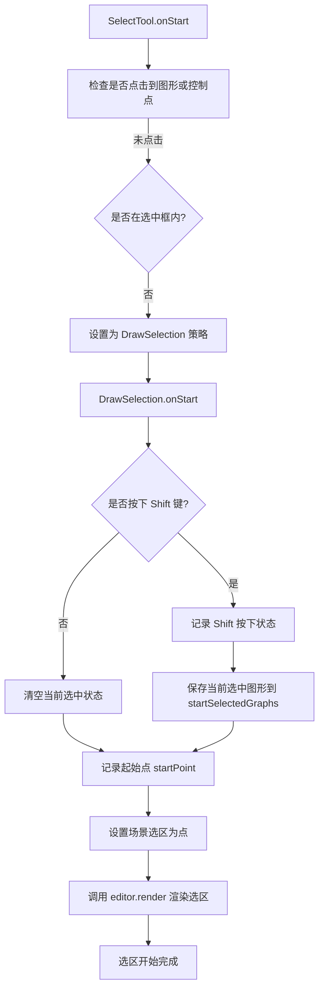
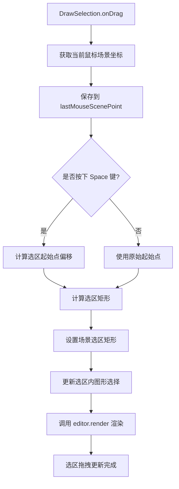
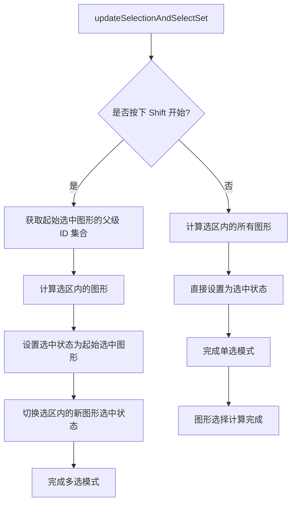
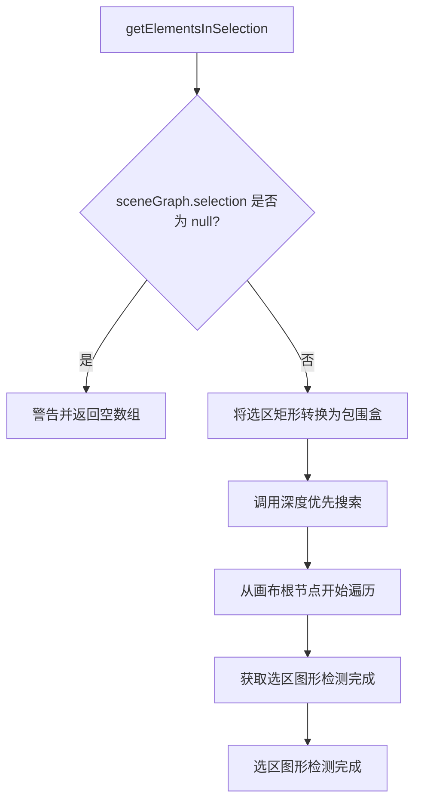
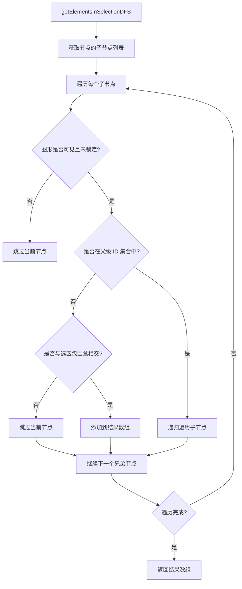
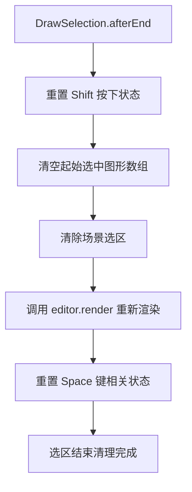
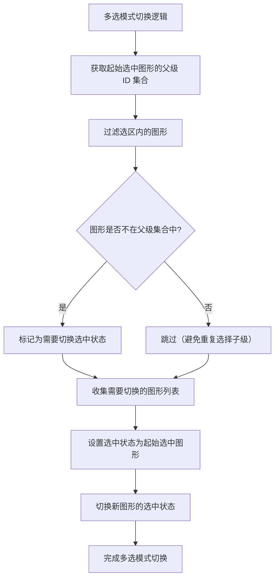

# Suika 编辑器矩形选区选择多个图形的完整流程文档

## 概述

本文档详细描述了 Suika 编辑器中矩形选区（DrawSelection）选择多个图形的完整实现流程，包括从鼠标按下到选择完成的各个阶段。

## 🔍 流程图查看指南

**如果您的 Markdown 查看器不支持 Mermaid 图表渲染，请使用以下在线工具查看：**

1. **Mermaid Live Editor**: <https://mermaid.live/>
2. **复制下方任一流程图代码块 → 粘贴到在线编辑器 → 查看可视化流程图**

## 核心组件

### 1. DrawSelection 类

位置：`packages/core/src/tools/tool_select/tool_select_selection.ts`

#### 主要功能

- 处理矩形选区的绘制和选择逻辑
- 支持 Shift 键的多选模式
- 支持 Space 键的临时抓手功能
- 实时计算和更新选区内的图形

#### 核心属性

```typescript
private startPoint: IPoint = { x: -1, y: -1 }; // 选区起始点
private isShiftPressingWhenStart = false; // 开始时是否按下 Shift
private startSelectedGraphs: SuikaGraphics[] = []; // 开始时的选中图形
private lastMouseScenePoint!: IPoint; // 最后的鼠标场景坐标
```

### 2. getElementsInSelection 函数

位置：`packages/core/src/tools/tool_select/utils.ts`

#### 主要功能

- 计算哪些图形位于选区内
- 使用深度优先搜索遍历图形树
- 考虑图形可见性和锁定状态
- 支持父级 ID 过滤（避免重复选择）

### 3. SceneGraph.setSelection 方法

位置：`packages/core/src/scene/scene_graph.ts`

#### 主要功能

- 设置和更新选区矩形
- 触发选区渲染更新

## 完整流程图

### 📋 Phase 1: 选区开始阶段 (复制下方代码块到 mermaid.live 查看)



### Phase 2: 选区拖拽更新阶段 (复制下方代码块到 mermaid.live 查看)



### Phase 3: 图形选择计算阶段 (复制下方代码块到 mermaid.live 查看)



### Phase 4: 选区图形检测阶段 (复制下方代码块到 mermaid.live 查看)



### Phase 5: 深度优先搜索遍历阶段 (复制下方代码块到 mermaid.live 查看)



### Phase 6: 选区结束清理阶段 (复制下方代码块到 mermaid.live 查看)



### Phase 7: 多选模式切换逻辑阶段 (复制下方代码块到 mermaid.live 查看)



## 详细流程说明

### 1. 选区初始化流程

#### 1.1 策略选择

```typescript
// SelectTool.onStart - 策略选择逻辑
if (handleInfo) {
  // 控制点操作
} else {
  const isInsideSelectedBox = this.editor.selectedBox.hitTest(this.startPoint);
  const topHitElement = getTopHitElement(this.editor, this.startPoint);

  if (isInsideSelectedBox) {
    this.currStrategy = this.strategyMove;
  } else if (topHitElement) {
    // 点中单个图形
  } else {
    // 空白区域 - 使用矩形选区
    this.currStrategy = this.strategyDrawSelection;
  }
}

if (this.currStrategy) {
  this.currStrategy.onActive();
  this.currStrategy.onStart(e);
}
```

#### 1.2 选区开始设置

```typescript
// DrawSelection.onStart
onStart(e: PointerEvent) {
  // 检查是否按下 Shift 键（多选模式）
  this.isShiftPressingWhenStart = false;
  if (this.editor.hostEventManager.isShiftPressing) {
    this.isShiftPressingWhenStart = true;
    // 保存当前选中状态，用于多选模式
    this.startSelectedGraphs = this.editor.selectedElements.getItems();
  } else {
    // 单选模式 - 清空当前选中
    this.editor.selectedElements.clear();
  }

  // 记录起始点
  this.startPoint = this.editor.getSceneCursorXY(e);

  // 设置初始选区（点）
  this.editor.sceneGraph.setSelection(this.startPoint);

  // 触发渲染
  this.editor.render();
}
```

### 2. 选区更新流程

#### 2.1 拖拽过程中的实时更新

```typescript
// DrawSelection.onDrag
onDrag(e: PointerEvent) {
  // 获取当前鼠标位置
  this.lastMouseScenePoint = this.editor.getSceneCursorXY(e);
  this.lastMousePoint = this.lastMouseScenePoint;

  // 更新选区和选中状态
  this.updateSelectionAndSelectSet();
}

// updateSelectionAndSelectSet
private updateSelectionAndSelectSet() {
  const { x, y } = this.lastMouseScenePoint;

  // 处理 Space 键临时抓手功能
  if (this.startPointWhenSpaceDown && this.lastDragPointWhenSpaceDown) {
    // 计算偏移并调整起始点
    const { x: sx, y: sy } = this.startPointWhenSpaceDown;
    const { x: lx, y: ly } = this.lastDragPointWhenSpaceDown;
    const dx = x - lx;
    const dy = y - ly;
    this.startPoint = { x: sx + dx, y: sy + dy };
  }

  // 计算选区矩形
  const box = getRectByTwoPoint(this.startPoint, this.lastMouseScenePoint);

  // 更新场景选区
  this.editor.sceneGraph.setSelection(box);

  // 根据模式更新选中图形
  if (this.isShiftPressingWhenStart) {
    // 多选模式
    const parentIdSet = getParentIdSet(this.startSelectedGraphs);
    const graphsInSelection = getElementsInSelection(this.editor, parentIdSet);

    this.editor.selectedElements.setItems(this.startSelectedGraphs);
    this.editor.selectedElements.toggleItems(
      graphsInSelection.filter((item) => !parentIdSet.has(item.attrs.id))
    );
  } else {
    // 单选模式
    const graphsInSelection = getElementsInSelection(this.editor);
    this.editor.selectedElements.setItems(graphsInSelection);
  }

  // 重新渲染
  this.editor.render();
}
```

#### 2.2 Space 键临时抓手功能

```typescript
// DrawSelection.onSpaceToggle
onSpaceToggle(isSpacePressing: boolean) {
  if (this.editor.toolManager.isDragging() && isSpacePressing) {
    // 记录当前状态
    this.startPointWhenSpaceDown = this.startPoint;
    this.lastDragPointWhenSpaceDown = this.lastMousePoint;
    // 重新计算选区
    this.updateSelectionAndSelectSet();
  } else {
    // 恢复原始状态
    this.startPointWhenSpaceDown = null;
    this.lastDragPointWhenSpaceDown = null;
  }
}
```

### 3. 图形检测流程

#### 3.1 获取选区内图形的算法

```typescript
// getElementsInSelection
export const getElementsInSelection = (
  editor: SuikaEditor,
  parentIdSet: Set<string> = new Set(),
): SuikaGraphics[] => {
  const selection = editor.sceneGraph.selection;
  if (selection === null) {
    console.warn('selection 为 null，请确认在正确的时机调用当前方法');
    return [];
  }

  // 将选区矩形转换为包围盒
  const selectionBox = rectToBox(selection);

  // 深度优先搜索
  const graphicsArr = getElementsInSelectionDFS(
    editor,
    selectionBox,
    editor.doc.getCurrCanvas(),
    parentIdSet,
  );

  return graphicsArr;
};

// 深度优先搜索实现
const getElementsInSelectionDFS = (
  editor: SuikaEditor,
  box: IBox,
  node: SuikaGraphics,
  parentIdSet: Set<string>,
): SuikaGraphics[] => {
  const graphicsArr: SuikaGraphics[] = [];
  const children = node.getChildren();

  for (const child of children) {
    // 跳过不可见或锁定的图形
    if (!child.isVisible() || child.isLock()) continue;

    if (parentIdSet.has(child.attrs.id)) {
      // 如果是已选中图形的父级，递归遍历其子级
      graphicsArr.push(
        ...getElementsInSelectionDFS(editor, box, child, parentIdSet),
      );
    } else if (child.intersectWithChildrenBox(box)) {
      // 检查是否与选区相交
      graphicsArr.push(child);
    }
  }

  return graphicsArr;
};
```

#### 3.2 相交检测

```typescript
// intersectWithChildrenBox - 检测图形是否与选区相交
child.intersectWithChildrenBox(box)
```

这个方法会：
1. 获取图形的包围盒（包括子级）
2. 检查包围盒是否与选区矩形相交
3. 返回布尔值表示是否相交

### 4. 多选模式处理

#### 4.1 多选模式的特殊处理

```typescript
// 多选模式的核心逻辑
if (this.isShiftPressingWhenStart) {
  // 获取起始选中图形的父级 ID 集合
  const parentIdSet = getParentIdSet(this.startSelectedGraphs);

  // 获取选区内的图形（排除已选中图形的子级）
  const graphsInSelection = getElementsInSelection(this.editor, parentIdSet);

  // 恢复起始选中状态
  this.editor.selectedElements.setItems(this.startSelectedGraphs);

  // 切换选区内新图形的选中状态
  this.editor.selectedElements.toggleItems(
    graphsInSelection.filter((item) => !parentIdSet.has(item.attrs.id))
  );
}
```

#### 4.2 getParentIdSet 功能

```typescript
// getParentIdSet - 获取所有祖先节点的 ID 集合
function getParentIdSet(graphics: SuikaGraphics[]): Set<string> {
  const idSet = new Set<string>();

  for (const graphic of graphics) {
    let current: SuikaGraphics | null = graphic;
    while (current) {
      idSet.add(current.attrs.id);
      current = current.getParent();
    }
  }

  return idSet;
}
```

这个函数确保：
1. 已选中图形的祖先节点不会被重复选择
2. 已选中图形的子级可以被单独选择

### 5. 选区渲染

#### 5.1 选区视觉效果

```typescript
// SceneGraph 渲染选区
if (this.selection) {
  ctx.save();
  ctx.strokeStyle = setting.get('selectionStroke'); // 边框颜色
  ctx.fillStyle = setting.get('selectionFill');     // 填充颜色

  const { x, y, width, height } = this.selection;

  // 转换为视口坐标
  const { x: xInViewport, y: yInViewport } = this.editor.toViewportPt(x, y);
  const widthInViewport = width * zoom;
  const heightInViewport = height * zoom;

  // 绘制半透明填充
  ctx.fillRect(xInViewport, yInViewport, widthInViewport, heightInViewport);

  // 绘制边框
  ctx.strokeRect(xInViewport, yInViewport, widthInViewport, heightInViewport);

  ctx.restore();
}
```

#### 5.2 选区样式配置

- `selectionStroke`: 选区边框颜色（通常为蓝色）
- `selectionFill`: 选区填充颜色（通常为半透明蓝色）
- 选区会实时跟随鼠标移动更新

### 6. 结束和清理

#### 6.1 选区结束处理

```typescript
// DrawSelection.afterEnd
afterEnd() {
  // 重置状态
  this.isShiftPressingWhenStart = false;
  this.startSelectedGraphs = [];

  // 清除选区显示
  this.editor.sceneGraph.selection = null;

  // 重新渲染以清除选区视觉效果
  this.editor.render();

  // 重置 Space 键相关状态
  this.startPointWhenSpaceDown = null;
  this.lastDragPointWhenSpaceDown = null;
}
```

## 关键算法分析

### 1. 相交检测算法

**intersectWithChildrenBox(box)** 方法：

1. **获取图形包围盒**: 计算图形及其所有子级的总包围盒
2. **矩形相交检测**: 使用标准的矩形相交算法
3. **性能优化**: 只计算可见图形的包围盒

### 2. 深度优先遍历

**优势**：
- 自然处理图形树结构
- 内存使用高效
- 易于实现过滤逻辑

**过滤策略**：
- 跳过不可见图形 (`!child.isVisible()`)
- 跳过锁定图形 (`child.isLock()`)
- 避免重复选择已选中图形的子级

### 3. 多选模式算法

**核心思想**：
- 保持原有选中状态不变
- 只对新增的图形进行切换操作
- 避免已选中图形的子级被意外取消选择

## 性能优化

### 1. 实时更新优化

- 鼠标移动事件会被节流处理
- 只在选区变化时重新计算和渲染
- 使用包围盒检测而非精确几何检测

### 2. 内存管理

- 及时清理选区状态
- 避免保留不必要的图形引用
- 状态重置完整，防止内存泄漏

## 使用场景

### 1. 单选模式（默认）

- 清空原有选中状态
- 直接选择选区内的所有图形
- 适用于重新选择场景

### 2. 多选模式（Shift 键）

- 保持原有选中状态
- 切换选区内图形的选中状态
- 适用于添加或移除部分选择

### 3. 临时抓手（Space 键）

- 拖拽过程中按住 Space 可临时移动选区起始点
- 松开 Space 恢复正常选区操作
- 适用于精确控制选区位置

## 扩展性

### 1. 自定义选择逻辑

可以通过修改 `getElementsInSelectionDFS` 函数来：
- 添加自定义的图形过滤条件
- 实现不同的相交检测算法
- 支持特定类型的图形选择

### 2. 自定义选区样式

可以通过配置 `selectionStroke` 和 `selectionFill` 来：
- 改变选区颜色
- 调整透明度
- 添加动画效果

## 总结

Suika 编辑器的矩形选区功能通过精心设计的算法和流程，实现了高效、准确的多个图形选择。系统支持单选和多选两种模式，提供了良好的用户体验和性能表现。

选区功能作为编辑器的基础交互能力，其实现直接影响了用户的操作效率和体验质量。通过深度优先搜索和优化的相交检测算法，系统能够在复杂的设计场景中快速准确地选择目标图形。
