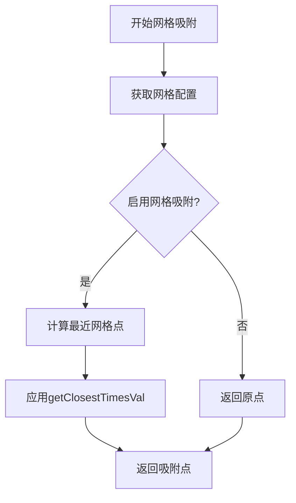
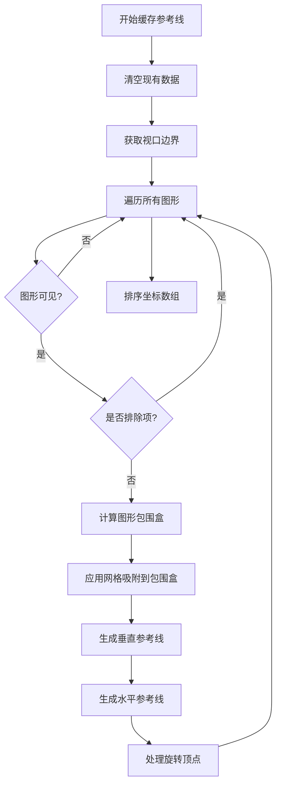
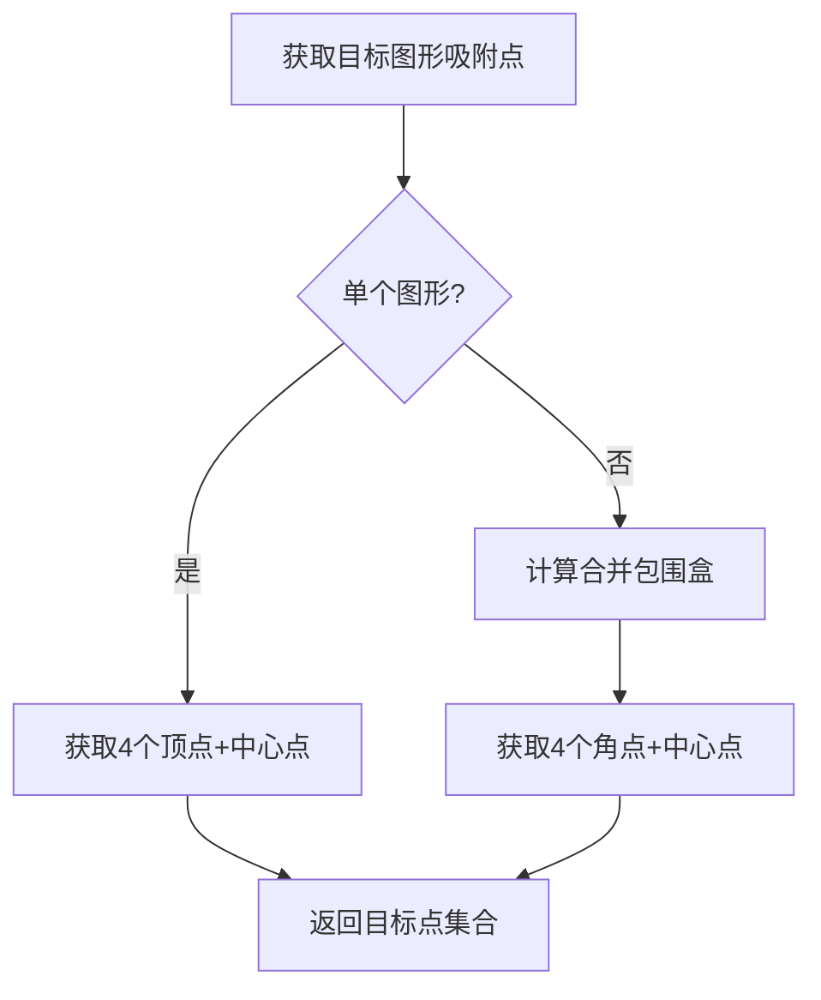
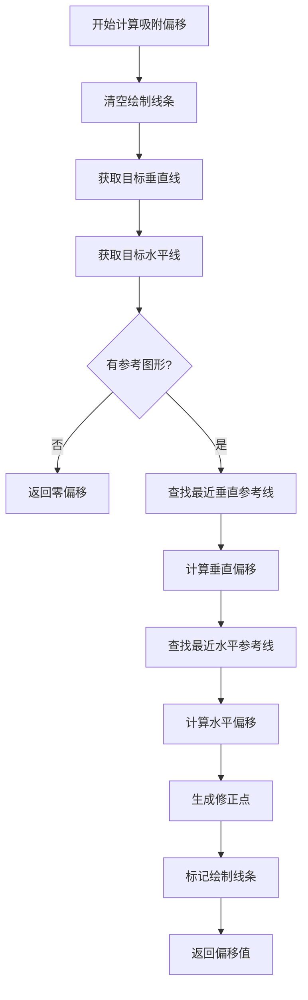
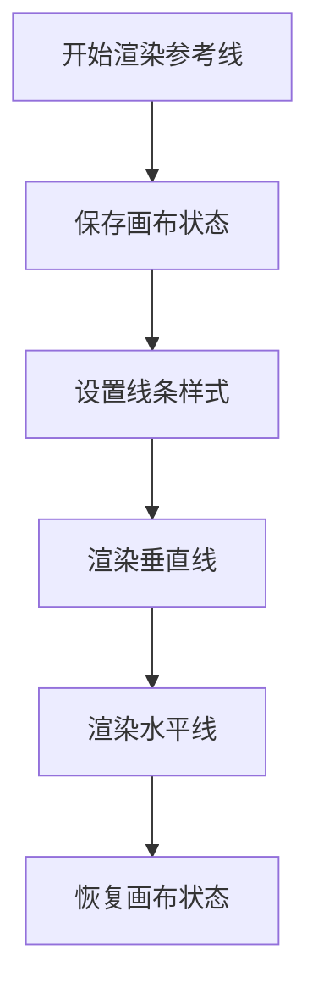
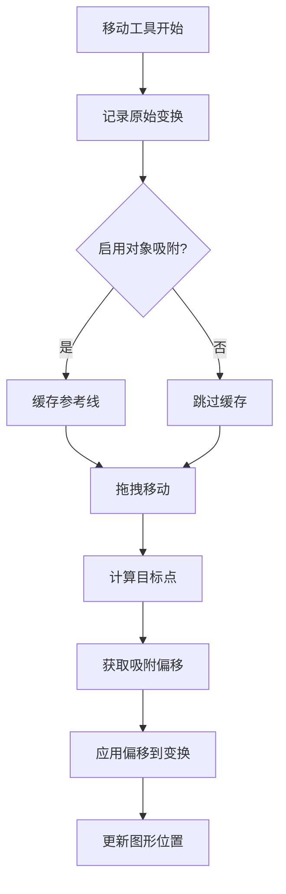
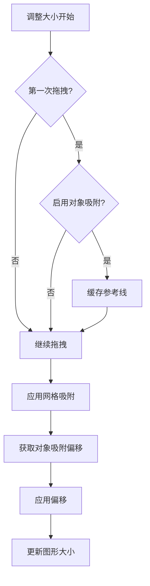
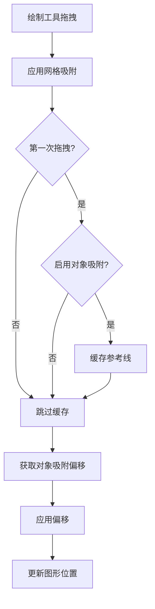

# 线吸附功能的完整流程文档

## 概述

线吸附功能让图形在移动、调整大小和绘制过程中能够自动对齐到其他图形、网格线或参考线，提高设计精度和效率。该系统包含网格吸附和对象吸附两部分，通过智能计算最近的吸附点并提供视觉反馈。

## 核心组件

### 1. 网格吸附 (SnapHelper)

**位置**: `packages/core/src/snap.ts`

网格吸附功能将图形对齐到像素网格或自定义网格间距。

#### 1.1 网格吸附计算流程



**代码实现**:

```12:35:packages/core/src/snap.ts
export const SnapHelper = {
  /**
   * support grid snap
   *
   * TODO:
   * objects snap
   * polar tracking snap
   * ortho
   * ruler ref line snap
   */
  getSnapPtBySetting(point: IPoint, setting: Setting) {
    point = { x: point.x, y: point.y };
    const snapGrid = setting.get('snapToGrid');
    if (snapGrid) {
      const gridSnapSpacing = {
        x: setting.get('gridSnapX'),
        y: setting.get('gridSnapY'),
      };
      return this.getGridSnapPt(point, gridSnapSpacing);
    }
    return point;
  },

  getGridSnapPt(point: IPoint, snapSpacing: IPoint) {
    return {
      x: getClosestTimesVal(point.x, snapSpacing.x),
      y: getClosestTimesVal(point.y, snapSpacing.y),
    };
  },
};
```

#### 1.2 网格配置项

- `snapToGrid`: 是否启用网格吸附
- `gridSnapX`: X轴网格间距
- `gridSnapY`: Y轴网格间距
- `enablePixelGrid`: 是否显示像素网格

### 2. 对象吸附 (RefLine类)

**位置**: `packages/core/src/ref_line.ts`

对象吸附功能将图形对齐到其他图形的边缘、中心线或参考线。

#### 2.1 参考线数据结构

```typescript
// 垂直参考线映射: x坐标 -> y坐标集合
private vRefLineMap = new Map<number, Set<number>>();

// 水平参考线映射: y坐标 -> x坐标集合
private hRefLineMap = new Map<number, Set<number>>();

// 排序的坐标数组，用于快速查找
private sortedXs: number[] = [];
private sortedYs: number[] = [];
```

#### 2.2 缓存参考线流程



**关键实现**:

```54:164:packages/core/src/ref_line.ts
  /**
   * cache reference line of graphics in viewport
   */
  cacheGraphicsRefLines(
    options: {
      excludeItems: SuikaGraphics[];
    } = {
      excludeItems: [],
    },
  ) {
    this.clear();

    const excludeItems = options.excludeItems;

    const vRefLineMap = this.vRefLineMap;
    const hRefLineMap = this.hRefLineMap;

    const viewportBbox = this.editor.viewportManager.getBbox();

    const refGraphicsSet = new Set<SuikaGraphics>();
    this.editor.doc.getCurrCanvas().forEachVisibleChildNode((graphics) => {
      if (
        isCanvasGraphics(graphics) ||
        (isFrameGraphics(graphics) && graphics.isGroup())
      ) {
        return;
      }
      refGraphicsSet.add(graphics);
    });

    for (const selectedItem of excludeItems) {
      selectedItem.forEachVisibleChildNode((graphics) => {
        if (refGraphicsSet.has(graphics)) {
          refGraphicsSet.delete(graphics);
        }
      });
    }

    const excludeIdSet = new Set(excludeItems.map((item) => item.attrs.id));
    for (const graphics of refGraphicsSet) {
      if (excludeIdSet.has(graphics.attrs.id)) {
        continue;
      }

      const bbox = bboxToBboxWithMid(graphics.getBbox());
      if (!isBoxIntersect(viewportBbox, bbox)) {
        continue;
      }

      const setting = this.editor.setting;
      if (setting.get('snapToGrid')) {
        const gridSnapSpacingX = setting.get('gridSnapX');
        const gridSnapSpacingY = setting.get('gridSnapY');
        bbox.minX = getClosestTimesVal(bbox.minX, gridSnapSpacingX);
        bbox.minY = getClosestTimesVal(bbox.minY, gridSnapSpacingY);
        bbox.midX = getClosestTimesVal(bbox.midX, gridSnapSpacingX);
        bbox.midY = getClosestTimesVal(bbox.midY, gridSnapSpacingY);
        bbox.maxX = getClosestTimesVal(bbox.maxX, gridSnapSpacingX);
        bbox.maxY = getClosestTimesVal(bbox.maxY, gridSnapSpacingY);
      }

      // bbox 中水平线
      RefLine.addRefLinesToMap(vRefLineMap, bbox.midX, [bbox.minY, bbox.maxY]);
      // bbox 中垂直线
      RefLine.addRefLinesToMap(hRefLineMap, bbox.midY, [bbox.minX, bbox.maxX]);

      /**
       * 获取旋转后4个顶点的坐标
       */
      const bboxVerts = graphics.getWorldBboxVerts();

      if (setting.get('snapToGrid')) {
        const gridSnapSpacingX = setting.get('gridSnapX');
        const gridSnapSpacingY = setting.get('gridSnapSpacingY');
        for (const vert of bboxVerts) {
          vert.x = getClosestTimesVal(vert.x, gridSnapSpacingX);
          vert.y = getClosestTimesVal(vert.y, gridSnapSpacingY);
        }
      }

      const top = bboxVerts.filter((p) => p.x === bbox.minX);
      const bottom = bboxVerts.filter((p) => p.x === bbox.maxX);
      const left = bboxVerts.filter((p) => p.y === bbox.minY);
      const right = bboxVerts.filter((p) => p.y === bbox.maxY);

      // top 和 bottom 要绘制水平参考线，不要绘制垂直参照线
      for (const p of [...top, ...bottom]) {
        RefLine.addRefLinesToMap(vRefLineMap, p.x, [p.y]);
      }
      // left 和 right 要绘制垂直参照线，不要绘制水平参照线
      for (const p of [...left, ...right]) {
        RefLine.addRefLinesToMap(hRefLineMap, p.y, [p.x]);
      }
    }

    this.sortedXs = Array.from(vRefLineMap.keys()).sort((a, b) => a - b);
    this.sortedYs = Array.from(hRefLineMap.keys()).sort((a, b) => a - b);
  }
```

#### 2.3 获取目标图形吸附点



**实现代码**:

```188:220:packages/core/src/ref_line.ts
  static getGraphicsTargetPoints(record: Map<string, ITransformRect>) {
    let targetPoints: IPoint[] = [];
    // 选中的为单个图形，要以旋转后的 4 个顶点和中心点为目标线
    if (record.size === 1) {
      const { width, height, transform } = Array.from(record.values())[0];
      const points = rectToVertices(
        { x: 0, y: 0, width: width, height: height },
        transform,
      );
      points.push({
        x: (points[0].x + points[2].x) / 2,
        y: (points[0].y + points[2].y) / 2,
      });
      return points;
    } else {
      const targetBbox = bboxToBboxWithMid(
        mergeBoxes(
          Array.from(record.values()).map((item) => calcRectBbox(item)),
        ),
      );

      targetPoints = [
        { x: targetBbox.minX, y: targetBbox.minY },
        { x: targetBbox.minX, y: targetBbox.maxY },

        { x: targetBbox.maxX, y: targetBbox.minY },
        { x: targetBbox.maxX, y: targetBbox.maxY },

        { x: targetBbox.midX, y: targetBbox.midY },
      ];
    }
    return targetPoints;
  }
```

#### 2.4 计算图形吸附偏移



**核心算法**:

```226:342:packages/core/src/ref_line.ts
  /**
   * update ref line
   * and return offset
   */
  getGraphicsSnapOffset(targetPoints: IPoint[]): IPoint {
    this.toDrawVLines = [];
    this.toDrawHLines = [];

    let vTargetLines = pointsToVLines(targetPoints); // 目标矩形的垂直线
    let vTargetLineKeys = Array.from(vTargetLines.keys()); // 目标矩形的垂直线的 x 坐标
    let hTargetLines = pointsToHLines(targetPoints); // 目标矩形的水平线
    let hTargetLineKeys = Array.from(hTargetLines.keys()); // 目标矩形的水平线的 y 坐标

    const vRefLineMap = this.vRefLineMap;
    const hRefLineMap = this.hRefLineMap;
    const sortedXs = this.sortedXs;
    const sortedYs = this.sortedYs;

    // there are no reference graphs
    if (sortedXs.length === 0 && sortedYs.length === 0) {
      return { x: 0, y: 0 };
    }

    let offsetX: number | undefined = undefined;
    let offsetY: number | undefined = undefined;

    const closestXs = arrMap(vTargetLineKeys, (x) =>
      getClosestValInSortedArr(sortedXs, x),
    );
    // 目标矩形的每个 x 坐标离它们最近的参照线的差值
    const closestXDiffs = arrMap(vTargetLineKeys, (x, i) => closestXs[i] - x);
    const closestXDist = Math.min(
      ...arrMap(closestXDiffs, (item) => Math.abs(item)),
    );

    const closestYs = arrMap(hTargetLineKeys, (y) =>
      getClosestValInSortedArr(sortedYs, y),
    );
    // 目标矩形的每个 y 坐标离它们最近的参照线的差值
    const closestYDiffs = arrMap(hTargetLineKeys, (y, i) => closestYs[i] - y);
    const closestYDist = Math.min(
      ...arrMap(closestYDiffs, (item) => Math.abs(item)),
    );

    const isEqualNum = (a: number, b: number) => Math.abs(a - b) < 0.00001;

    const tol =
      this.editor.setting.get('refLineTolerance') /
      this.editor.zoomManager.getZoom();

    // 确定最终偏移值 offsetX
    if (closestXDist <= tol) {
      for (const closestXDiff of closestXDiffs) {
        if (isEqualNum(closestXDist, Math.abs(closestXDiff))) {
          offsetX = closestXDiff;
          break;
        }
      }
      if (offsetX === undefined) {
        throw new Error('it should not reach here, please put a issue to us');
      }
    }

    // 再确认偏移值 offsetY
    if (closestYDist <= tol) {
      for (const closestYDiff of closestYDiffs) {
        if (isEqualNum(closestYDist, Math.abs(closestYDiff))) {
          offsetY = closestYDiff;
          break;
        }
      }
      if (offsetY === undefined) {
        throw new Error('it should not reach here, please put a issue to us');
      }
    }

    const correctedTargetPoints: IPoint[] = arrMap(targetPoints, (p) => ({
      x: p.x + (offsetX ?? 0),
      y: p.y + (offsetY ?? 0),
    }));

    vTargetLines = pointsToVLines(correctedTargetPoints);
    vTargetLineKeys = Array.from(vTargetLines.keys()); // 对应 x

    if (offsetX !== undefined) {
      /*************** 标记需要绘制的垂直参考线 ************/
      forEach(vTargetLineKeys, (y, i) => {
        if (isEqualNum(offsetX!, closestXDiffs[i])) {
          const vLine: IVerticalLine = {
            x: closestXs[i],
            ys: [],
          };

          vLine.ys.push(...vTargetLines.get(y)!);
          vLine.ys.push(...Array.from(vRefLineMap.get(y)! ?? []));
          this.toDrawVLines.push(vLine);
        }
      });
    }

    if (offsetY !== undefined) {
      /*************** 标记需要绘制的水平参考线 ************/
      hTargetLines = pointsToHLines(correctedTargetPoints);
      hTargetLineKeys = Array.from(hTargetLines.keys()); // 对应 y

      forEach(hTargetLineKeys, (x, i) => {
        if (isEqualNum(offsetY!, closestYDiffs[i])) {
          const hLine: IHorizontalLine = {
            y: closestYs[i],
            xs: [],
          };

          hLine.xs.push(...hTargetLines.get(x)!);
          hLine.xs.push(...Array.from(hRefLineMap.get(x) ?? []));

          this.toDrawHLines.push(hLine);
        }
      });
    }

    return { x: offsetX ?? 0, y: offsetY ?? 0 };
  }
```

#### 2.5 渲染参考线



**渲染实现**:

```345:403:packages/core/src/ref_line.ts
  drawRefLine(ctx: CanvasRenderingContext2D) {
    ctx.save();

    const color = this.editor.setting.get('refLineStroke');
    ctx.fillStyle = color;
    ctx.strokeStyle = color;
    ctx.lineWidth = this.editor.setting.get('refLineStrokeWidth');

    const pointsSet = new Set<string>();
    const pointSize = this.editor.setting.get('refLinePointSize');

    this.drawVerticalLines(ctx, pointSize, pointsSet);
    this.drawHorizontalLines(ctx, pointSize, pointsSet);

    ctx.restore();
  }
```

## 工具中的吸附应用

### 1. 移动工具中的吸附



**关键代码**:

```89:94:packages/core/src/tools/tool_select/tool_select_move.ts
    if (this.editor.setting.get('snapToObjects')) {
      this.editor.refLine.cacheGraphicsRefLines({
        excludeItems: this.selectedItems,
      });
    }
```

```149:165:packages/core/src/tools/tool_select/tool_select_move.ts
    const targetPoints = RefLine.getGraphicsTargetPoints(record);
    const offset = this.editor.refLine.getGraphicsSnapOffset(targetPoints);

    // ... 中间代码 ...

    // 2. snap to ref line
    for (const graphics of selectedItems) {
      const newWorldTf = cloneDeep(
        this.originWorldTfMap.get(graphics.attrs.id)!,
      );
      newWorldTf[4] += dx + offset.x;
      newWorldTf[5] += dy + offset.y;

      graphics.setWorldTransform(newWorldTf);
    }
```

### 2. 调整大小工具中的吸附



**关键代码**:

```109:113:packages/core/src/tools/tool_select/tool_select_resize.ts
    if (!this.lastDragPoint && this.editor.setting.get('snapToObjects')) {
      this.editor.refLine.cacheGraphicsRefLines({
        excludeItems: this.editor.selectedElements.getItems(),
      });
    }
```

```124:132:packages/core/src/tools/tool_select/tool_select_resize.ts
      const objectSnapOffset = this.editor.refLine.getGraphicsSnapOffset([
        this.lastDragPoint,
      ]);

      this.lastDragPoint = {
        x: this.lastDragPoint.x + objectSnapOffset.x,
        y: this.lastDragPoint.y + objectSnapOffset.y,
      };
```

### 3. 绘制工具中的吸附



**关键代码**:

```144:151:packages/core/src/tools/tool_draw_graphics.ts
    this.lastDragPoint = SnapHelper.getSnapPtBySetting(
      this.editor.getSceneCursorXY(e),
      this.editor.setting,
    );

    if (!this.isDragging && this.editor.setting.get('snapToObjects')) {
      this.editor.refLine.cacheGraphicsRefLines();
    }
    const offset = this.editor.refLine.getGraphicsSnapOffset([
      this.lastDragPoint,
    ]);
    this.lastDragPoint = {
      x: this.lastDragPoint.x + offset.x,
      y: this.lastDragPoint.y + offset.y,
    };
```

## 吸附配置

### 1. 主要配置项

- `snapToObjects`: 启用对象吸附 (默认: true)
- `snapToGrid`: 启用网格吸附 (默认: true)
- `refLineTolerance`: 参考线吸附容差 (默认: 8px)
- `gridSnapX`: X轴网格间距 (默认: 1px)
- `gridSnapY`: Y轴网格间距 (默认: 1px)

### 2. 视觉样式配置

- `refLineStroke`: 参考线颜色 (默认: `#f14f30ee`)
- `refLineStrokeWidth`: 参考线宽度 (默认: 1px)
- `refLinePointSize`: 参考点大小 (默认: 4px)

## 性能优化

### 1. 缓存策略

- 只在拖拽开始时缓存参考线
- 排除选中的图形避免自吸附
- 使用排序数组进行快速查找

### 2. 计算优化

- 使用视口裁剪减少处理图形数量
- 预计算包围盒和顶点坐标
- 批量处理距离计算

## 扩展功能

### 1. 智能吸附

- 基于图形内容的智能吸附
- 形状识别和自动对齐
- 比例保持吸附

### 2. 自定义参考线

- 手动创建和编辑参考线
- 参考线样式自定义
- 参考线分组管理

### 3. 吸附历史

- 记录吸附操作历史
- 智能吸附建议
- 学习用户吸附偏好

这个线吸附系统通过网格吸附和对象吸附的组合，为用户提供了精确、高效的设计对齐功能，在各种编辑操作中都能提供流畅的吸附体验。
