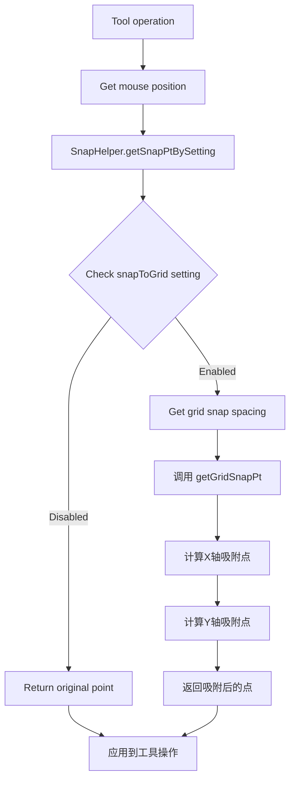
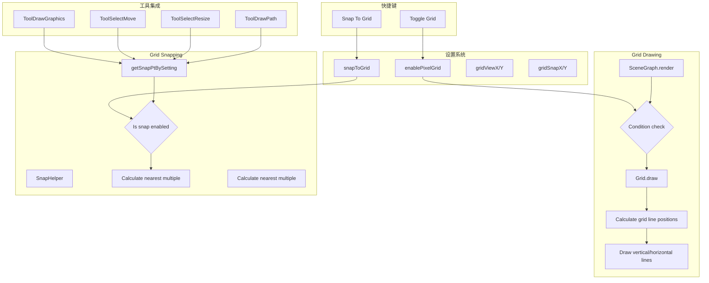

# Suika 编辑器网格与网格吸附的完整流程文档

## 概述

本文档详细描述了 Suika 编辑器中网格与网格吸附功能的完整实现流程，包括从网格绘制、吸附计算到与各种工具集成的各个阶段。网格功能提供了精确的视觉参考线，网格吸附功能确保了图形的精确定位和对齐。

## 🔍 流程图查看指南

**如果您的 Markdown 查看器不支持 Mermaid 图表渲染，请使用以下在线工具查看：**

1. **Mermaid Live Editor**: <https://mermaid.live/>
2. **复制下方任一流程图代码块 → 粘贴到在线编辑器 → 查看可视化流程图**

## 核心组件

### 1. Grid 类

位置：`packages/core/src/grid.ts`

#### 主要功能

- 计算网格线的绘制位置
- 根据视口和缩放级别确定网格范围
- 绘制垂直和水平网格线
- 支持像素级精确定位

#### 核心属性

```typescript
class Grid {
  constructor(private editor: SuikaEditor) {}
}
```

#### 关键方法

- `draw()`: 绘制网格线条

### 2. SnapHelper 对象

位置：`packages/core/src/snap.ts`

#### 功能特性

- 根据设置计算吸附点
- 提供网格吸附算法
- 支持多种吸附类型的扩展（TODO: 对象吸附、极轴追踪、正交模式、标尺参考线吸附）

#### 核心方法

```typescript
export const SnapHelper = {
  getSnapPtBySetting(point: IPoint, setting: Setting),
  getGridSnapPt(point: IPoint, snapSpacing: IPoint),
};
```

### 3. 设置系统

位置：`packages/core/src/setting.ts`

#### 网格相关设置

```typescript
interface ISetting {
  /**** pixel grid ****/
  enablePixelGrid: true; // 是否启用像素网格
  snapToGrid: true; // 是否吸附到网格
  minPixelGridZoom: 8; // 最小缩放级别显示网格
  pixelGridLineColor: '#cccccc55'; // 网格线颜色

  gridViewX: 1; // X轴网格显示间距
  gridViewY: 1; // Y轴网格显示间距
  gridSnapX: 1; // X轴网格吸附间距
  gridSnapY: 1; // Y轴网格吸附间距
}
```

## 系统架构

```text
┌─────────────────────────────────────────────────┐
│                 SuikaEditor                     │
│  ┌─────────────────────────────────────────┐    │
│  │              Setting                     │    │
│  │  ├─ enablePixelGrid                     │    │
│  │  ├─ snapToGrid                          │    │
│  │  ├─ gridViewX/Y                         │    │
│  │  └─ gridSnapX/Y                         │    │
│  └─────────────────────────────────────────┘    │
│                                                 │
│  ┌─────────────────────────────────────────┐    │
│  │            SceneGraph                   │    │
│  │  ├─ Grid (网格绘制)                      │    │
│  │  └─ render() → grid.draw()             │    │
│  └─────────────────────────────────────────┘    │
│                                                 │
│  ┌─────────────────────────────────────────┐    │
│  │            SnapHelper                   │    │
│  │  ├─ getSnapPtBySetting()               │    │
│  │  └─ getGridSnapPt()                    │    │
│  └─────────────────────────────────────────┘    │
│                                                 │
│  ┌─────────────────────────────────────────┐    │
│  │              Tools                      │    │
│  │  ├─ ToolDrawGraphics (绘制工具)         │    │
│  │  ├─ ToolSelectMove (选择移动)           │    │
│  │  ├─ ToolSelectResize (选择缩放)         │    │
│  │  └─ ToolDrawPath (路径绘制)             │    │
│  └─────────────────────────────────────────┘    │
└─────────────────────────────────────────────────┘
```

## 网格绘制流程

### 1. 绘制触发条件

网格绘制在 `SceneGraph.render()` 方法中触发：

```typescript
/** draw pixel grid */
if (
  setting.get('enablePixelGrid') &&
  zoom >= this.editor.setting.get('minPixelGridZoom')
) {
  this.grid.draw();
}
```

### 2. 网格绘制算法

#### 步骤 1: 获取视口信息

```typescript
const {
  x: offsetX,
  y: offsetY,
  width,
  height,
} = this.editor.viewportManager.getViewport();
const zoom = this.editor.zoomManager.getZoom();
```

#### 步骤 2: 计算网格参数

```typescript
const stepX = this.editor.setting.get('gridViewX');
const stepY = this.editor.setting.get('gridViewY');
```

#### 步骤 3: 绘制垂直网格线

```typescript
// 计算起始和结束位置
let startXInScene = getClosestTimesVal(offsetX, stepX);
const endXInScene = getClosestTimesVal(offsetX + width / zoom, stepX);

// 循环绘制垂直线
while (startXInScene <= endXInScene) {
  const x = nearestPixelVal((startXInScene - offsetX) * zoom);
  ctx.beginPath();
  ctx.moveTo(x, 0);
  ctx.lineTo(x, height);
  ctx.stroke();
  startXInScene += stepX;
}
```

#### 步骤 4: 绘制水平网格线

```typescript
// 计算起始和结束位置
let startYInScene = getClosestTimesVal(offsetY, stepY);
const endYInScene = getClosestTimesVal(offsetY + height / zoom, stepY);

// 循环绘制水平线
while (startYInScene <= endYInScene) {
  const y = nearestPixelVal((startYInScene - offsetY) * zoom);
  ctx.beginPath();
  ctx.moveTo(0, y);
  ctx.lineTo(width, y);
  ctx.stroke();
  startYInScene += stepY;
}
```

## 网格吸附流程

### 1. 吸附点计算

#### SnapHelper.getSnapPtBySetting()

```typescript
getSnapPtBySetting(point: IPoint, setting: Setting) {
  point = { x: point.x, y: point.y };

  // 检查是否启用网格吸附
  const snapGrid = setting.get('snapToGrid');

  if (snapGrid) {
    // 获取网格吸附间距
    const gridSnapSpacing = {
      x: setting.get('gridSnapX'),
      y: setting.get('gridSnapY'),
    };
    // 计算网格吸附点
    return this.getGridSnapPt(point, gridSnapSpacing);
  }

  return point;
}
```

#### SnapHelper.getGridSnapPt()

```typescript
getGridSnapPt(point: IPoint, snapSpacing: IPoint) {
  return {
    x: getClosestTimesVal(point.x, snapSpacing.x),
    y: getClosestTimesVal(point.y, snapSpacing.y),
  };
}
```

### 2. getClosestTimesVal 算法

`getClosestTimesVal` 函数用于计算最接近给定倍数的数值：

```typescript
// 示例：getClosestTimesVal(15, 10) = 10 或 20
// 返回离 15 最近的 10 的倍数
function getClosestTimesVal(value: number, step: number): number {
  return Math.round(value / step) * step;
}
```

## 与工具系统的集成

### 1. 图形绘制工具 (ToolDrawGraphics)

#### 开始绘制时应用吸附

```typescript
onStart(e: PointerEvent) {
  // 获取鼠标点击的起点【网格吸附点】
  this.startPoint = SnapHelper.getSnapPtBySetting(
    this.editor.getSceneCursorXY(e),
    this.editor.setting,
  );
}
```

#### 拖拽过程中应用吸附

```typescript
onDrag(e: PointerEvent) {
  // 获取鼠标在场景中的位置
  this.lastDragPoint = this.lastMousePoint = SnapHelper.getSnapPtBySetting(
    this.editor.getSceneCursorXY(e),
    this.editor.setting,
  );
}
```

#### 结束绘制时应用吸附

```typescript
onEnd(e: PointerEvent) {
  const endPoint = SnapHelper.getSnapPtBySetting(
    this.editor.getSceneCursorXY(e),
    this.editor.setting,
  );
  // 创建图形...
}
```

### 2. 选择移动工具 (ToolSelectMove)

#### 移动过程中的像素对齐

```typescript
// in the moving phase, AABBox's x and y should round to be integer (snap to pixel grid)
if (this.editor.setting.get('snapToGrid')) {
  // if dx == 0, we think it is in vertical moving.
  if (dx !== 0) dx = Math.round(this.prevBBoxPos.x + dx) - this.prevBBoxPos.x;
  // similarly dy
  if (dy !== 0) dy = Math.round(this.prevBBoxPos.y + dy) - this.prevBBoxPos.y;
}
```

### 3. 选择缩放工具 (ToolSelectResize)

#### 缩放过程中的吸附

```typescript
if (this.editor.setting.get('snapToGrid')) {
  this.lastDragPoint = SnapHelper.getSnapPtBySetting(
    this.lastDragPoint,
    this.editor.setting,
  );
}
```

### 4. 路径绘制工具 (ToolDrawPath)

#### 路径点吸附

```typescript
if (this.editor.setting.get('snapToGrid')) {
  // 对路径顶点进行网格吸附
  for (const vert of verts) {
    vert.x = getClosestTimesVal(vert.x, gridSnapSpacingX);
    vert.y = getClosestTimesVal(vert.y, gridSnapSpacingY);
  }
}
```

## 快捷键集成

### 网格显示切换

位置：`packages/core/src/host_event_manager/command_key_binding.ts`

```typescript
const toggleGridAction = () => {
  editor.setting.set('enablePixelGrid', !editor.setting.get('enablePixelGrid'));
};
```

### 网格吸附切换

```typescript
const snapToGridAction = () => {
  editor.setting.set('snapToGrid', !editor.setting.get('snapToGrid'));
};
```

## 流程图

### 网格绘制流程图

**网格绘制流程：**

1. SceneGraph.render 检查条件
2. 如果 enablePixelGrid 为 true 且缩放级别 >= minPixelGridZoom：
   - 调用 grid.draw()
   - 获取视口信息
   - 计算网格参数 (stepX, stepY)
   - 计算垂直线起始/结束位置
   - 循环绘制垂直线
   - 计算水平线起始/结束位置
   - 循环绘制水平线
   - 绘制完成
3. 否则跳过网格绘制

### 网格吸附流程图



### 完整集成流程图



## 性能优化

### 1. 条件渲染

网格只在满足条件时才绘制：

- `enablePixelGrid` 设置为 true
- 缩放级别达到 `minPixelGridZoom`（默认 8 倍）

### 2. 视口范围计算

只绘制视口范围内的网格线，避免绘制超出屏幕的线条：

```typescript
const startXInScene = getClosestTimesVal(offsetX, stepX);
const endXInScene = getClosestTimesVal(offsetX + width / zoom, stepX);
```

### 3. 像素对齐

使用 `nearestPixelVal` 确保网格线绘制在像素边界上，避免模糊：

```typescript
const x = nearestPixelVal((startXInScene - offsetX) * zoom);
```

## 扩展性设计

### TODO 功能

代码中标注了未来扩展的功能：

```typescript
/**
 * TODO:
 * objects snap       // 对象吸附
 * polar tracking snap // 极轴追踪吸附
 * ortho              // 正交模式
 * ruler ref line snap // 标尺参考线吸附
 */
```

### 模块化设计

- `Grid` 类专注于网格绘制
- `SnapHelper` 专注于吸附计算
- 设置系统统一管理参数
- 工具类独立集成吸附功能

这种设计使得未来扩展新的吸附类型和网格样式变得容易。

## 总结

网格与网格吸附功能是 Suika 编辑器中重要的辅助功能，通过精确的视觉参考和自动对齐能力，大大提升了用户的操作精度和效率。该功能采用了模块化设计，具有良好的性能优化和扩展性，为编辑器的专业绘图能力提供了坚实基础。
