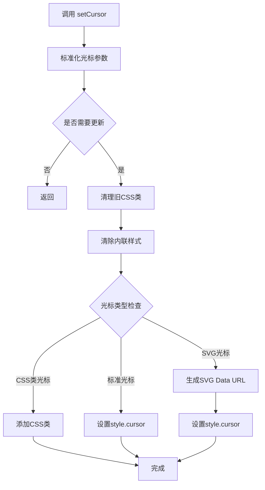
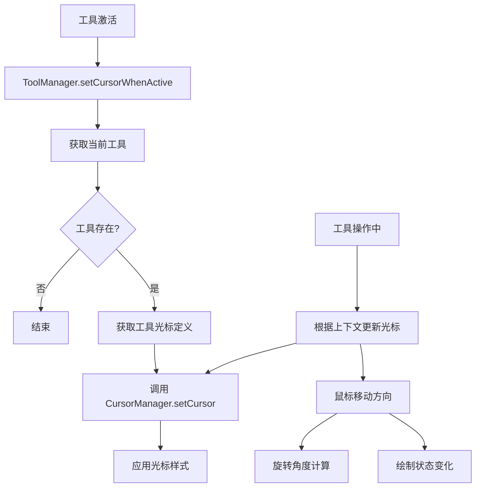

# Suika 编辑器自定义光标的完整流程文档

## 概述

本文档详细描述了 Suika 编辑器中自定义光标系统的完整实现流程，包括从光标类型定义、SVG生成、CSS样式管理到与各种工具集成的各个阶段。自定义光标系统为编辑器提供了丰富的视觉反馈，提升了用户操作体验。

## 🔍 流程图查看指南

**如果您的 Markdown 查看器不支持 Mermaid 图表渲染，请使用以下在线工具查看：**

1. **Mermaid Live Editor**: https://mermaid.live/
2. **复制下方任一流程图代码块 → 粘贴到在线编辑器 → 查看可视化流程图**

## 核心组件

### 1. CursorManger 类

位置：`packages/core/src/cursor_manager/cursor_manager.ts`

#### 主要功能

- 管理所有光标类型的设置和切换
- 处理自定义CSS类光标和SVG光标
- 标准化旋转和缩放光标的角度
- 缓存当前光标状态避免不必要的更新

#### 核心属性

```typescript
export interface ICursorRotation {
  type: 'rotation';
  degree: number;
}

interface ICursorResize {
  type: 'resize';
  degree: number;
}

export type ICursor =
  | 'default'
  | ICursorResize
  | ICursorRotation
  | 'grab'
  | 'grabbing'
  | 'move'
  | 'move-ns'
  | 'move-ew'
  | 'pointer'
  | 'crosshair'
  | 'text'
  | 'pen'
  | 'pen-close';
```

#### 关键方法

- `setCursor(cursor: ICursor)`: 设置光标样式
- `getCursor()`: 获取当前光标
- `normalizeCursor()`: 标准化光标参数

### 2. 光标图标资源

位置：`packages/core/src/cursor_manager/cursor-icons/`

#### 静态光标图标

- `suika-cursor-default.png`: 默认光标
- `suika-cursor-move.png`: 移动光标
- `suika-cursor-move-ns.png`: 垂直移动光标
- `suika-cursor-move-ew.png`: 水平移动光标
- `suika-cursor-pen.png`: 钢笔工具光标
- `suika-cursor-pen-close.png`: 钢笔工具关闭光标
- `suika-cursor-crosshair.png`: 十字准线光标

### 3. SVG光标生成工具

位置：`packages/core/src/cursor_manager/util.ts`

#### 主要功能

- 动态生成旋转和缩放光标的SVG
- 缓存生成的SVG避免重复计算
- 将SVG转换为Data URL格式

#### 核心函数

```typescript
export const getIconSvgDataUrl = (
  type: 'resize' | 'rotation',
  degree: number,
) => {
  // 生成并缓存SVG光标
};
```

## 系统架构

```text
┌─────────────────────────────────────────────────┐
│                 SuikaEditor                     │
│  ┌─────────────────────────────────────────┐    │
│  │            CursorManger                │    │
│  │  ├─ setCursor()                       │    │
│  │  ├─ getCursor()                       │    │
│  │  ├─ normalizeCursor()                 │    │
│  │  └─ customClassCursor Set             │    │
│  └─────────────────────────────────────────┘    │
│                                                 │
│  ┌─────────────────────────────────────────┐    │
│  │              光标资源                    │    │
│  │  ├─ CSS样式 (cursor.css)               │    │
│  │  ├─ PNG图标 (cursor-icons/)            │    │
│  │  └─ SVG生成 (util.ts)                  │    │
│  └─────────────────────────────────────────┘    │
│                                                 │
│  ┌─────────────────────────────────────────┐    │
│  │              Tools                      │    │
│  │  ├─ ToolDrawGraphics (cursor: crosshair)│    │
│  │  ├─ ToolSelect (cursor: default)       │    │
│  │  ├─ ToolDrawPath (cursor: pen)         │    │
│  │  └─ ToolDragCanvas (cursor: grab)      │    │
│  └─────────────────────────────────────────┘    │
└─────────────────────────────────────────────────┘
```

## 光标设置流程

### 1. 光标设置入口

#### CursorManger.setCursor()

```typescript
setCursor(cursor: ICursor) {
  // 1. 标准化光标参数
  cursor = this.normalizeCursor(cursor);

  // 2. 检查是否需要更新
  if (isEqual(cursor, this.cursor)) {
    return;
  }

  // 3. 更新当前光标状态
  this.cursor = cursor;

  // 4. 清理旧的CSS类
  const canvasElement = this.editor.canvasElement;
  canvasElement.classList.forEach((className) => {
    if (className.startsWith('suika-cursor-')) {
      canvasElement.classList.remove(className);
    }
  });

  // 5. 清除内联样式
  this.editor.canvasElement.style.cursor = '';

  // 6. 根据光标类型设置样式
  if (this.customClassCursor.has(cursor)) {
    // CSS类光标
    const className = `suika-cursor-${cursor}`;
    this.editor.canvasElement.classList.add(className);
  } else if (typeof cursor == 'string') {
    // 标准CSS光标
    this.editor.canvasElement.style.cursor = cursor;
  } else if (cursor.type === 'resize' || cursor.type === 'rotation') {
    // SVG光标
    this.editor.canvasElement.style.cursor = getIconSvgDataUrl(
      cursor.type,
      cursor.degree,
    );
  }
}
```

### 2. 光标标准化处理

#### normalizeCursor 方法

```typescript
private normalizeCursor(cursor: ICursor): ICursor {
  if (typeof cursor === 'string') {
    return cursor;
  }

  if (cursor.type === 'resize') {
    // 缩放光标角度标准化：0-179度
    return {
      type: cursor.type,
      degree: normalizeDegree(cursor.degree) % 180,
    };
  }

  if (cursor.type === 'rotation') {
    // 旋转光标角度标准化：完整360度
    return {
      type: cursor.type,
      degree: normalizeDegree(Math.round(cursor.degree)),
    };
  }

  return cursor;
}
```

## CSS样式管理

### 1. 静态光标样式

位置：`packages/core/src/cursor_manager/cursor.css`

#### PNG光标样式示例

```css
.suika-cursor-default {
  cursor: url(data:image/png;base64,iVBORw0KGgoAAAANSUhEUgAAACAAAAAgCAYAAABzenr0AAAACXBIWXMAAAsTAAALEwEAmpwYAAAAAXNSR0IArs4c6QAAAARnQU1BAACxjwv8YQUAAANbSURBVHgB7VZNSxtRFJ3J93eaNGk0jRKsO3HlqtiFK6GuulFK3fgPlLaLLgSlKwkUXXVV0C4EG+syC+nCuii0a4luBMEGxS8kftSkSWZ6zus8CEPaYhy7yoXHG97Me/e8e869cxWlznRdV5X/bOrfAKiqyjXOunKbAAwnKueRkRHb0dGRWI/H48JxNpvVJEaCshwAZ+l8c3PTXiwW7ZqmiXd7e3vawMBAlWCWl5d1mthgUVTqr2Pr6+uzT0xMxAYHB590d3dnxaLNpjmdzqrH46kmEolqV1eX1tPTo09NTelWUqQODw/bMXvuwKrV6m6lUvm+tbX1fHZ29iHW20OhUBRzCMOL4eL309PTNkM3N+eFh6VSKS8dgYIPc3Nz+sLCggj58fHxx0wm0+/z+dqDwWAsEolEk8mkj0AwHNyr/KbxRkAEADgoXi0tPZY6YEqSkpmZmUdG7gdIl6kcW1OSeTDLLSuerAcEwuLDsFNs+NSJIUqwYqXJesDw8qZXV1df6Bw9wjvqgsCo9BtxXWc28wJ/rfz3o7JVXC5X+fz8PNfZ2bmLtVdut/sHIvATxaaGJqVmxW/Y1miRjQed4MaVg4ODz+vr60NYLgFUGRlQQYQ0qzqjhqcwtLI1wxAgkXY6lM/iUxMbLeqIHH96wT6QtwTXOjug+ne32aSazdw1Ky1rWctaZrX9AlYw33XoyEJlAAAAAElFTkSuQmCC)
    5 5,
  auto;
}

.suika-cursor-move {
  cursor: url(data:image/png;base64,iVBORw0KGgoAAAANSUhEUgAAACAAAAAgCAYAAABzenr0AAAACXBIWXMAAAsTAAALEwEAmpwYAAAAAXNSR0IArs4c6QAAAARnQU1BAACxjwv8YQUAAANUSURBVHgB7VY7TxtBEN47mxjf2Q7YRiYIEAWKAhQg8Qfo8gv4EaRNKkAyUUBCRBQUFKmgc0FJlwaKJE4B4hGBFBqUpOBpy7F9fpwfl/kuu87JxrGFHxISI61ub2ZnZ3Ye3y5jj/SASaIhT09P2/i8fWQYhjQ5OdkRDodH9vb2XhCrg3isnWRfX18fKBQKP/L5/M/l5eXBqakpOxxjrSYY8nq9Hl3Xvy0sLBgYmUzmE4k8kLFWpQOnQ779fr87Fot92NzcRMzNgXkikQhBRv921gqik8qBQECNRCIrBwcHRldXV8kBzMG7ublZoX8Va1kzCRsODw8/7Li8v587Pz42hoaGScTHAg+z6+nq2v7/fSbzGneBFJdPmnVdXVzNGGVHOzVFOFxcXM6TXScPGGiAz5wg7ToWNVVUNeDweL8l6k8nkV+EA5iTrJb4Pa7AWOtCtVZhytZOTom1nZ0c5PT0Napq2BD59c/F4XKNi02RZLpY2obnT6dTGxsYSNpstx9cuQffk5EREor7u4GG3d3d3P6WThVBcyK/xF2kCvNJ9ZCAsIoC52+32Ed+tKMozrIUOdNEx4GPPmjghjK+trQ2it9FeotpBMJRKpb7gSyD0WziAuZAhHdxZUxd7ADMAXEDP8kiUeyQfHx8/Hx0d/bi4uDhA1V8SkKEKhw8PD83vxMREhWx3d7c0xz7z8/O/jo6OXm5vb3+n/3/psyphYS6Xk3g0WLMIe0mSVNeG5iWzuro6EdvwWtHQvpLtFhX4QSRdsxgGoGyrH9wAOl++B2g78R56KLvc78mm3LS0t9+Yb/DIRnjFPXtgAAAAASUVORK5CYII=)
    16 16,
  auto;
}
```

## SVG光标生成

### 1. 旋转光标SVG生成

```typescript
const getRotationIconSvg = (degree: number) =>
  `<svg width="32" height="32" viewBox="0 0 32 32" fill="none" xmlns="http://www.w3.org/2000/svg">
    <g filter="url(#filter0_d_1139_2)" transform="rotate(${degree} 16 16)">
      <path d="M4.38452 17.3499L9.68782 16.9963L7.78571 15.0942C8.84801 14.0319 10.1091 13.1892 11.4971 12.6143C12.8851 12.0394 14.3727 11.7435 15.875 11.7435C17.3773 11.7435 18.8649 12.0394 20.2529 12.6143C21.6409 13.1892 22.902 14.0319 23.9643 15.0942L22.0622 16.9963L27.3655 17.3499L27.0119 12.0466L25.0674 13.9911C23.8602 12.784 22.4271 11.8264 20.8499 11.1731C19.2727 10.5198 17.5822 10.1835 15.875 10.1835C14.1678 10.1835 12.4774 10.5198 10.9001 11.1731C9.32289 11.8264 7.88978 12.784 6.68262 13.9911L4.73807 12.0466L4.38452 17.3499Z" fill="#000000"/>
      <path d="M9.72108 17.4952L10.8205 17.4219L10.0414 16.6428L8.5009 15.1023C9.43698 14.2481 10.5153 13.5622 11.6884 13.0763C13.0158 12.5265 14.4383 12.2435 15.875 12.2435C17.3117 12.2435 18.7343 12.5265 20.0616 13.0763C21.2347 13.5622 22.313 14.2481 23.2491 15.1023L21.7086 16.6428L20.9295 17.4219L22.0289 17.4952L27.3322 17.8488L27.9024 17.8868L27.8644 17.3166L27.5108 12.0133L27.4375 10.9139L26.6584 11.693L25.0608 13.2906C23.8859 12.1996 22.525 11.3257 21.0412 10.7111C19.4033 10.0327 17.6479 9.68351 15.875 9.68351C14.1022 9.68351 12.3467 10.0327 10.7088 10.7111C9.22503 11.3257 7.86411 12.1996 6.68917 13.2906L5.09163 11.693L4.31248 10.9139L4.23918 12.0133L3.88563 17.3166L3.84762 17.8868L4.41778 17.8488L9.72108 17.4952Z" stroke="white"/>
    </g>
    <defs>
      <filter id="filter0_d_1139_2" x="1.3107" y="7.18351" width="29.1286" height="13.2402" filterUnits="userSpaceOnUse" color-interpolation-filters="sRGB">
        <feFlood flood-opacity="0" result="BackgroundImageFix"/>
        <feColorMatrix in="SourceAlpha" type="matrix" values="0 0 0 0 0 0 0 0 0 0 0 0 0 0 0 0 0 0 127 0" result="hardAlpha"/>
        <feOffset/>
        <feGaussianBlur stdDeviation="1"/>
        <feComposite in2="hardAlpha" operator="out"/>
        <feColorMatrix type="matrix" values="0 0 0 0 0 0 0 0 0 0 0 0 0 0 0 0 0 0 0.2 0"/>
        <feBlend mode="normal" in2="BackgroundImageFix" result="effect1_dropShadow_1139_2"/>
        <feBlend mode="normal" in="SourceGraphic" in2="effect1_dropShadow_1139_2" result="shape"/>
      </filter>
    </defs>
  </svg>`;
```

### 2. 缩放光标SVG生成

```typescript
const getResizeIconSvg = (degree: number) =>
  `<svg width="32" height="32" viewBox="0 0 32 32" fill="none" xmlns="http://www.w3.org/2000/svg">
    <g filter="url(#filter0_d_1173_45)" transform="rotate(${degree} 16 16)">
      <path d="M16 6L12.5 10H19.5L16 6Z" fill="#000000"/>
      <path d="M16 26L12.5 22H19.5L16 26Z" fill="#000000"/>
      <path d="M15.25 10H16.75V22H15.25V10Z" fill="#000000"/>
      <path d="M12.1237 9.67075L11.3981 10.5H12.5H14.75V21.5H12.5H11.3981L12.1237 22.3293L15.6237 26.3293L16 26.7593L16.3763 26.3293L19.8763 22.3293L20.6019 21.5H19.5H17.25V10.5H19.5H20.6019L19.8763 9.67075L16.3763 5.67075L16 5.2407L15.6237 5.67075L12.1237 9.67075Z" stroke="white"/>
    </g>
    <defs>
      <filter id="filter0_d_1173_45" x="8.29623" y="2.48141" width="15.4075" height="27.0372" filterUnits="userSpaceOnUse" color-interpolation-filters="sRGB">
        <feFlood flood-opacity="0" result="BackgroundImageFix"/>
        <feColorMatrix in="SourceAlpha" type="matrix" values="0 0 0 0 0 0 0 0 0 0 0 0 0 0 0 0 0 0 127 0" result="hardAlpha"/>
        <feOffset/>
        <feGaussianBlur stdDeviation="1"/>
        <feComposite in2="hardAlpha" operator="out"/>
        <feColorMatrix type="matrix" values="0 0 0 0 0 0 0 0 0 0 0 0 0 0 0 0 0 0 0.2 0"/>
        <feBlend mode="normal" in2="BackgroundImageFix" result="effect1_dropShadow_1173_45"/>
        <feBlend mode="normal" in="SourceGraphic" in2="effect1_dropShadow_1173_2" result="shape"/>
      </filter>
    </defs>
  </svg>`;
```

### 3. SVG转Data URL

```typescript
export const getIconSvgDataUrl = (
  type: 'resize' | 'rotation',
  degree: number,
) => {
  const key = type + degree;
  if (svgIconCache.has(key)) {
    return svgIconCache.get(key)!;
  }

  let svgStr = '';
  switch (type) {
    case 'resize':
      svgStr = getResizeIconSvg(degree);
      break;
    case 'rotation':
      svgStr = getRotationIconSvg(degree);
      break;
  }

  const dataUrl = `url("data:image/svg+xml,${svgStr
    .replace(/"/g, "'")
    .replace(/#/g, '%23')}") 16 16, auto`;

  svgIconCache.set(key, dataUrl);
  return dataUrl;
};
```

## 与工具系统的集成

### 1. 工具光标定义

每个工具类都定义了默认光标：

```typescript
// 绘图工具
export class ToolDrawGraphics {
  cursor: ICursor = 'crosshair';
}

// 选择工具
export class ToolSelect {
  cursor: ICursor = 'default';
}

// 路径绘制工具
export class ToolDrawPath {
  cursor: ICursor = 'pen';
}

// 画布拖拽工具
export class ToolDragCanvas {
  cursor: ICursor = 'grab';
}
```

### 2. 工具激活时的光标设置

位置：`packages/core/src/tools/tool_manager.ts`

```typescript
setCursorWhenActive() {
  if (this.currentTool) {
    this.editor.cursorManager.setCursor(this.currentTool.cursor);
  }
}
```

### 3. 动态光标更新

#### 选择工具中的动态光标

```typescript
// 移动工具根据方向设置光标
if (Math.abs(dx) > Math.abs(dy)) {
  this.editor.setCursor('move-ew'); // 水平移动
} else {
  this.editor.setCursor('move-ns'); // 垂直移动
}
```

#### 旋转工具的动态光标

```typescript
editor.setCursor({
  type: 'rotation',
  degree: rad2Deg(lastMouseRotation),
});
```

#### 路径绘制工具的光标变化

```typescript
if (isNearStartPoint) {
  editor.setCursor('pen-close'); // 接近起点时显示关闭光标
} else {
  editor.setCursor('pen'); // 正常绘制光标
}
```

## 流程图

### 光标设置流程图



### 工具集成流程图



## 性能优化

### 1. 光标状态缓存

- 使用 `isEqual` 比较避免不必要的DOM更新
- 缓存当前光标状态

### 2. SVG缓存机制

```typescript
const svgIconCache = new Map<string, string>();
```

- 相同角度的SVG只生成一次
- 提高旋转和缩放光标的渲染性能

### 3. CSS类批量管理

- 统一清理旧的CSS类前缀
- 避免CSS类冲突

## 扩展性设计

### 1. 光标类型扩展

系统支持三种光标类型：

- **字符串光标**：标准CSS光标和自定义CSS类
- **旋转光标**：`{type: 'rotation', degree: number}`
- **缩放光标**：`{type: 'resize', degree: number}`

### 2. 自定义光标添加流程

1. 在 `cursor-icons/` 目录添加PNG图标
2. 在 `cursor.css` 中添加CSS样式
3. 在 `ICursor` 类型中添加新光标名称
4. 在 `customClassCursor` 集合中注册

### 3. SVG光标扩展

通过扩展 `getIconSvgDataUrl` 函数支持新的SVG光标类型。

## 总结

自定义光标系统是 Suika 编辑器用户体验的重要组成部分，通过精确的光标反馈帮助用户理解当前的操作状态。系统采用了分层设计，将静态资源、动态生成和状态管理分离，同时提供了良好的扩展性支持未来新增的光标类型。性能优化措施确保了光标切换的流畅性，是专业设计工具不可或缺的功能模块。
