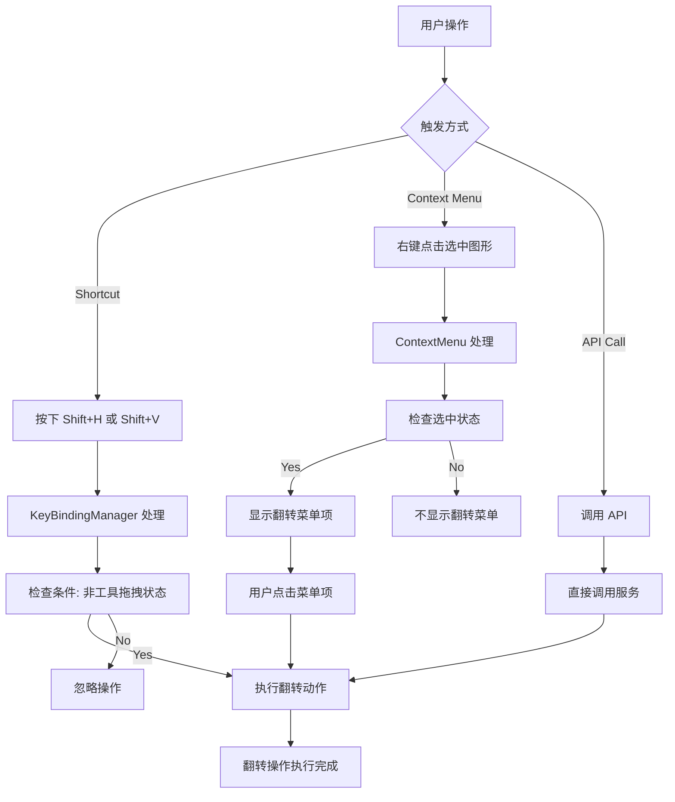
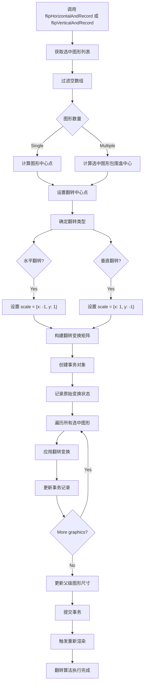
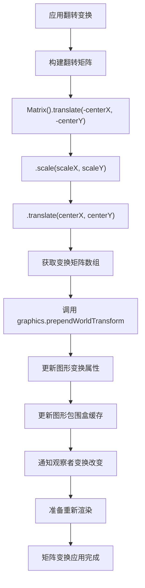

# Suika 编辑器选中图形的水平翻转和垂直翻转完整流程文档

## 概述

本文档详细描述了 Suika 编辑器中选中图形的水平翻转和垂直翻转功能的完整实现流程，包括从用户交互、核心算法、事务管理到最终渲染的各个阶段。

## 🔍 流程图查看指南

**如果您的 Markdown 查看器不支持 Mermaid 图表渲染，请使用以下在线工具查看：**

1. **Mermaid Live Editor**: <https://mermaid.live/>
2. **复制下方任一流程图代码块 → 粘贴到在线编辑器 → 查看可视化流程图**

## 核心组件

### 1. FlipAndRecordService 类

位置：`packages/core/src/service/flip_and_record.ts`

#### 主要功能

- 提供水平翻转和垂直翻转的核心算法
- 支持单个图形和多个图形的翻转操作
- 记录翻转操作到事务系统中
- 支持撤销和重做操作

#### 核心属性

```typescript
// 水平翻转
export const flipHorizontalAndRecord = (
  editor: SuikaEditor,
  graphicsArr: SuikaGraphics[],
) => {
  flipAndRecord(editor, graphicsArr, { x: -1, y: 1 });
};

// 垂直翻转
export const flipVerticalAndRecord = (
  editor: SuikaEditor,
  graphicsArr: SuikaGraphics[],
) => {
  flipAndRecord(editor, graphicsArr, { x: 1, y: -1 });
};
```

### 2. 快捷键绑定系统

位置：`packages/core/src/host_event_manager/command_key_binding.ts`

#### 快捷键配置

```typescript
// 水平翻转快捷键：Shift + H
editor.keybindingManager.register({
  key: { shiftKey: true, keyCode: 'KeyH' },
  winKey: { shiftKey: true, keyCode: 'KeyH' },
  when: (ctx) => !ctx.isToolDragging,
  actionName: 'FlipHorizontal',
  action: flipHorizontalAction,
});

// 垂直翻转快捷键：Shift + V
editor.keybindingManager.register({
  key: { shiftKey: true, keyCode: 'KeyV' },
  winKey: { shiftKey: true, keyCode: 'KeyV' },
  when: (ctx) => !ctx.isToolDragging,
  actionName: 'FlipVertical',
  action: flipVerticalAction,
});
```

### 3. 右键菜单集成

位置：`apps/suika/src/components/ContextMenu/ContextMenu.tsx`

#### 菜单项配置

```typescript
{/* 水平翻转 */}
<ContextMenuItem
  suffix={isWindows() ? 'Shift+H' : '⇧H'}
  onClick={() => {
    setVisible(false);
    if (editor) {
      flipHorizontalAndRecord(
        editor,
        editor.selectedElements.getItems(),
      );
      editor.render();
    }
  }}
>
  <FormattedMessage id="flip.horizontal" />
</ContextMenuItem>

{/* 垂直翻转 */}
<ContextMenuItem
  suffix={isWindows() ? 'Shift+V' : '⇧V'}
  onClick={() => {
    setVisible(false);
    if (editor) {
      flipVerticalAndRecord(editor, editor.selectedElements.getItems());
      editor.render();
    }
  }}
>
  <FormattedMessage id="flip.vertical" />
</ContextMenuItem>
```

## 完整流程图

### 📋 Phase 1: 用户触发阶段 (复制下方代码块到 mermaid.live 查看)



### Phase 2: 翻转算法执行阶段 (复制下方代码块到 mermaid.live 查看)



### Phase 3: 矩阵变换应用阶段 (复制下方代码块到 mermaid.live 查看)



## 详细流程说明

### 1. 用户触发翻转操作

#### 1.1 快捷键触发

```typescript
// 用户按下 Shift + H (水平翻转) 或 Shift + V (垂直翻转)
const flipHorizontalAction = () => {
  flipHorizontalAndRecord(editor, editor.selectedElements.getItems());
  editor.render();
};

const flipVerticalAction = () => {
  flipVerticalAndRecord(editor, editor.selectedElements.getItems());
  editor.render();
};
```

#### 1.2 右键菜单触发

```typescript
// 用户右键点击选中图形，选择翻转菜单项
<ContextMenuItem
  onClick={() => {
    if (editor) {
      flipHorizontalAndRecord(editor, editor.selectedElements.getItems());
      editor.render();
    }
  }}
>
  水平翻转
</ContextMenuItem>
```

### 2. 翻转算法实现

#### 2.1 翻转中心点计算

```typescript
const flipAndRecord = (
  editor: SuikaEditor,
  graphicsArr: SuikaGraphics[],
  scale: IPoint,
) => {
  let flipCenter: IPoint;

  if (size === 1) {
    // 单个图形：使用图形中心点
    flipCenter = graphicsArr[0].getWorldCenter();
  } else {
    // 多个图形：使用选中图形包围盒中心点
    flipCenter = getBoxCenter(
      mergeBoxes(graphicsArr.map((item) => item.getBbox())),
    );
  }
};
```

#### 2.2 翻转矩阵构建

```typescript
// 构建翻转变换矩阵
// 1. 移动到原点（以翻转中心为基准）
// 2. 应用缩放变换（翻转）
// 3. 移回原位置
const tf = new Matrix()
  .translate(-flipCenter.x, -flipCenter.y)  // 步骤1：移到原点
  .scale(scale.x, scale.y)                  // 步骤2：应用翻转
  .translate(flipCenter.x, flipCenter.y);   // 步骤3：移回原位置
```

#### 2.3 变换应用

```typescript
// 对每个选中图形应用翻转变换
for (const graphics of graphicsArr) {
  // 记录原始状态
  transaction.recordOld(graphics.attrs.id, {
    transform: cloneDeep(graphics.attrs.transform),
  });

  // 应用翻转变换
  graphics.prependWorldTransform(tf.getArray());

  // 记录新状态
  transaction.update(graphics.attrs.id, {
    transform: cloneDeep(graphics.attrs.transform),
  });
}
```

### 3. 事务管理和状态更新

#### 3.1 事务记录

```typescript
const prependMatrixAndRecord = (
  editor: SuikaEditor,
  graphicsArr: SuikaGraphics[],
  tf: IMatrixArr,
  recordDesc: string,
) => {
  const transaction = new Transaction(editor);

  // 记录所有图形的原始状态
  for (const graphics of graphicsArr) {
    transaction.recordOld(graphics.attrs.id, {
      transform: cloneDeep(graphics.attrs.transform),
    });

    // 应用变换
    graphics.prependWorldTransform(tf);

    // 记录新状态
    transaction.update(graphics.attrs.id, {
      transform: cloneDeep(graphics.attrs.transform),
    });
  }

  // 更新父级图形尺寸
  transaction.updateParentSize(graphicsArr);

  // 提交事务
  transaction.commit(recordDesc);
};
```

#### 3.2 渲染更新

```typescript
// 翻转操作完成后触发重新渲染
editor.render();
```

## 关键算法分析

### 1. 翻转中心点计算算法

**单个图形翻转中心**：

```typescript
flipCenter = graphics.getWorldCenter();
```

- 使用图形的几何中心作为翻转轴心
- 确保图形围绕自身中心翻转

**多个图形翻转中心**：

```typescript
flipCenter = getBoxCenter(
  mergeBoxes(graphicsArr.map((item) => item.getBbox())),
);
```

- 计算所有选中图形的包围盒
- 使用包围盒中心作为翻转轴心
- 确保多个图形作为一个整体翻转

### 2. 矩阵变换算法

**翻转变换矩阵**：

```typescript
const tf = new Matrix()
  .translate(-cx, -cy)    // 1. 移到原点
  .scale(sx, sy)          // 2. 应用翻转缩放
  .translate(cx, cy);     // 3. 移回原位置
```

- **translate(-cx, -cy)**: 将图形移动到以翻转中心为原点的坐标系
- **scale(sx, sy)**: 应用翻转缩放变换
- **translate(cx, cy)**: 将图形移回原来的世界坐标位置

**水平翻转**: `scale(-1, 1)` - X轴方向翻转
**垂直翻转**: `scale(1, -1)` - Y轴方向翻转

### 3. 世界变换应用

```typescript
graphics.prependWorldTransform(tf.getArray());
```

- `prependWorldTransform`: 在当前变换基础上前置新的变换
- 确保翻转变换与现有的旋转、缩放等变换正确组合
- 保持变换的相对顺序和累积效果

## 技术特点

### 1. 精确的几何变换

- **矩阵运算**: 使用标准的2D变换矩阵进行精确计算
- **坐标系转换**: 正确处理局部坐标系和世界坐标系的转换
- **变换组合**: 支持与旋转、缩放等变换的正确组合

### 2. 多图形批量处理

- **统一轴心**: 多个图形使用共同的翻转中心点
- **批量操作**: 对所有选中图形同时应用翻转变换
- **性能优化**: 减少重复计算，提高执行效率

### 3. 事务管理

- **状态记录**: 完整记录翻转前后的状态变化
- **撤销重做**: 支持翻转操作的撤销和重做
- **原子操作**: 确保翻转操作的原子性和一致性

### 4. 用户体验优化

- **多触发方式**: 支持快捷键、右键菜单等多种触发方式
- **即时反馈**: 翻转操作立即可见
- **跨平台支持**: 适配Windows和macOS的快捷键规范

## 使用场景

### 1. 单个图形翻转

- **场景**: 调整单个图形的方向
- **操作**: 选中图形，使用快捷键或右键菜单翻转
- **效果**: 图形围绕自身中心翻转

### 2. 多个图形翻转

- **场景**: 批量调整多个图形的方向
- **操作**: 选中多个图形，执行翻转操作
- **效果**: 所有图形围绕选中区域中心同时翻转

### 3. 设计元素镜像

- **场景**: 创建对称的设计元素
- **操作**: 复制图形后翻转得到镜像效果
- **效果**: 快速创建左右或上下对称的图形组合

### 4. 文字和图标调整

- **场景**: 调整文字或图标的方向
- **操作**: 对文字图层或图标进行翻转
- **效果**: 快速改变视觉元素的方向

## 扩展性

### 1. 自定义翻转中心

可以扩展翻转功能以支持自定义翻转中心点：

```typescript
// 扩展接口支持自定义翻转中心
export const flipWithCustomCenter = (
  editor: SuikaEditor,
  graphicsArr: SuikaGraphics[],
  scale: IPoint,
  customCenter?: IPoint,
) => {
  // 使用自定义中心点或计算默认中心点
  const flipCenter = customCenter || calculateFlipCenter(graphicsArr);
  // ... 执行翻转逻辑
};
```

### 2. 动画支持

可以为翻转操作添加动画效果：

```typescript
// 支持动画的翻转操作
export const flipWithAnimation = (
  editor: SuikaEditor,
  graphicsArr: SuikaGraphics[],
  scale: IPoint,
  duration: number = 300,
) => {
  // 实现带动画的翻转效果
  // ... 动画逻辑
};
```

### 3. 高级翻转功能

可以添加更多翻转相关的功能：

```typescript
// 旋转180度翻转
export const flip180 = (editor: SuikaEditor, graphicsArr: SuikaGraphics[]) => {
  flipAndRecord(editor, graphicsArr, { x: -1, y: -1 });
};

// 沿任意角度翻转
export const flipByAngle = (
  editor: SuikaEditor,
  graphicsArr: SuikaGraphics[],
  angle: number,
) => {
  // 实现沿指定角度的翻转
};
```

## 总结

Suika 编辑器的翻转功能通过精心设计的算法和流程，实现了精确、直观的多图形翻转操作。系统支持多种触发方式、精确的几何变换和完整的事务管理，为用户提供了专业级的图形编辑体验。

翻转功能作为编辑器的基础变换能力之一，与旋转、缩放等功能协同工作，为用户提供了完整的图形变换工具集。通过标准化接口和事务系统，翻转功能确保了操作的可靠性和用户体验的一致性。
