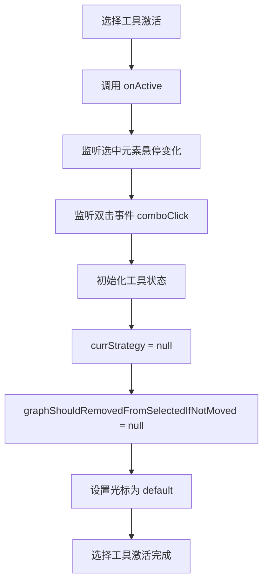
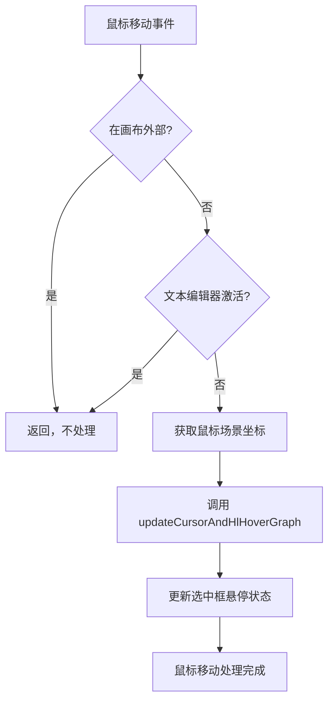
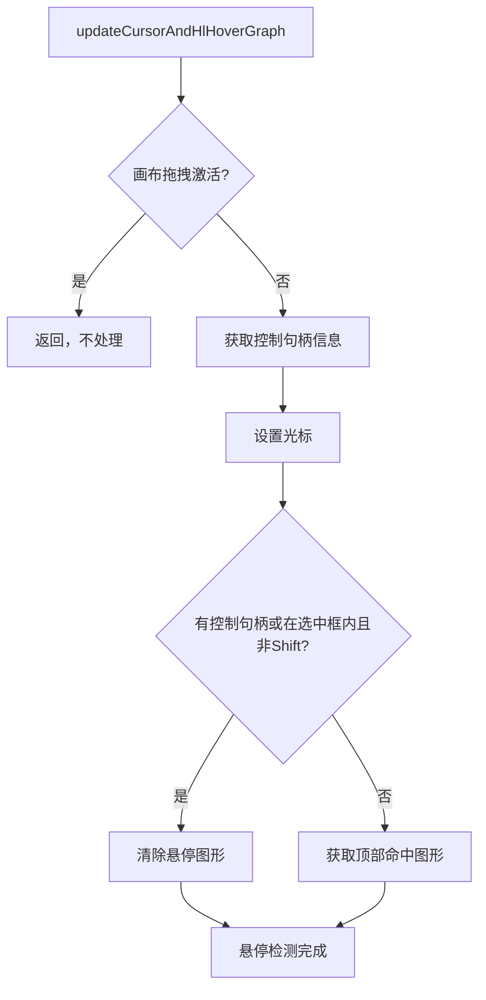
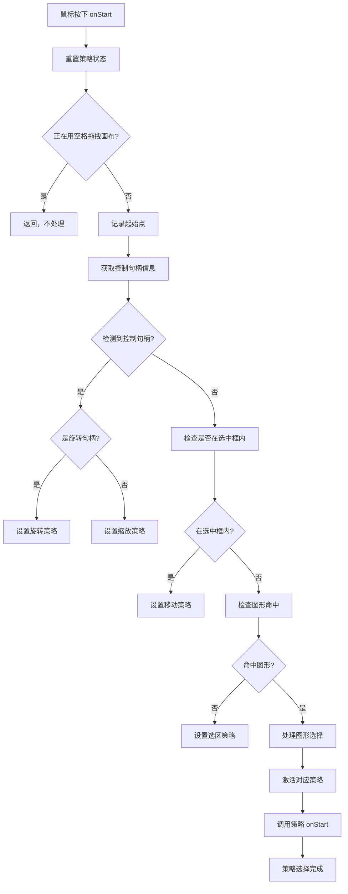
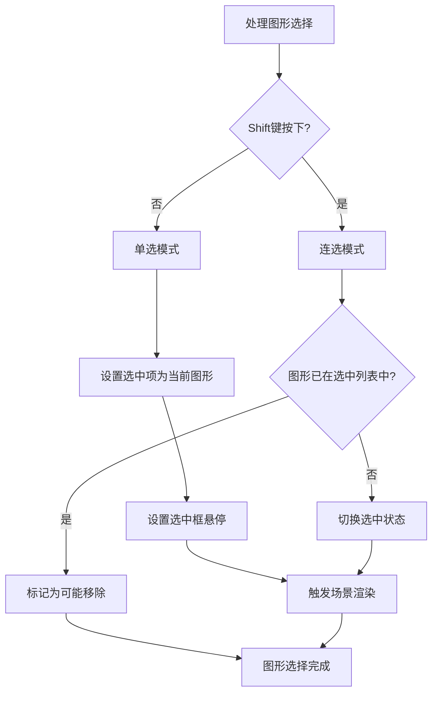
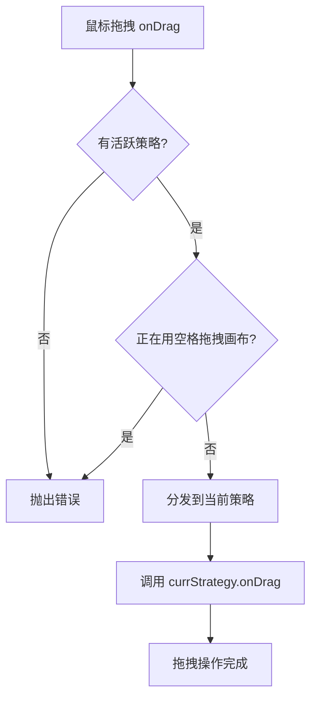
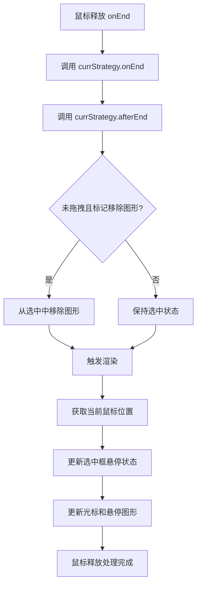
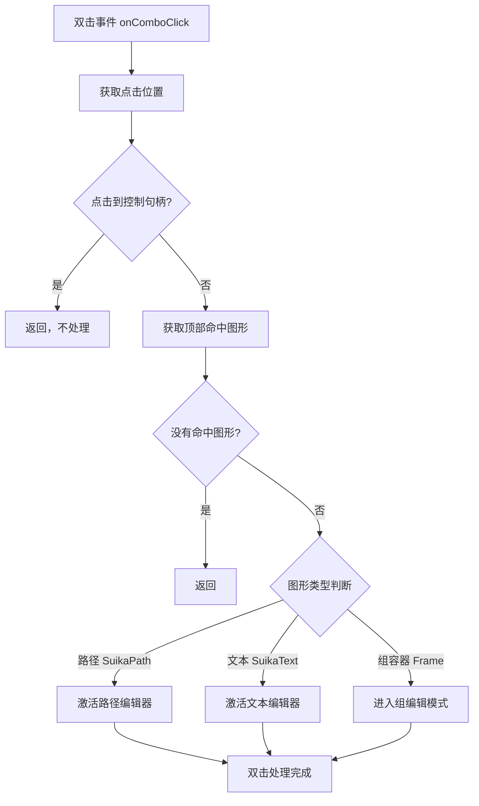
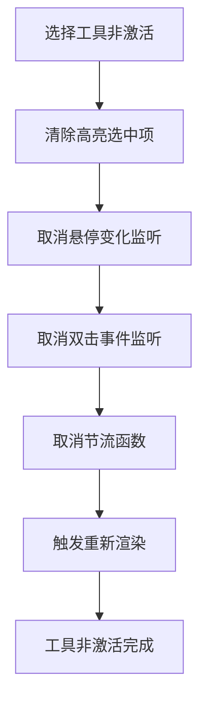

# Suika 编辑器选择工具的完整流程文档

## 概述

本文档详细描述了 Suika 编辑器中选择工具的完整实现流程，包括从激活到策略选择、图形选择、拖拽操作和特殊交互的各个阶段。

## 🔍 流程图查看指南

**如果您的 Markdown 查看器不支持 Mermaid 图表渲染，请使用以下在线工具查看：**

1. **Mermaid Live Editor**: <https://mermaid.live/>
2. **复制下方任一流程图代码块 → 粘贴到在线编辑器 → 查看可视化流程图**

## 核心组件

### 1. SelectTool 类

位置：`packages/core/src/tools/tool_select/tool_select.ts`

#### 主要功能

- 作为主要的图形选择和操作工具
- 实现策略模式，支持不同操作类型的切换
- 处理鼠标交互、键盘修饰键和双击事件
- 管理选中状态和高亮显示

#### 核心属性

```typescript
class SelectTool implements ITool {
  static readonly type = 'select';
  static readonly hotkey = 'v';

  private currStrategy: IBaseTool | null = null;
  private readonly strategyMove: SelectMoveTool;           // 移动策略
  private readonly strategyDrawSelection: DrawSelectionTool; // 选区策略
  private readonly strategySelectRotation: SelectRotationTool; // 旋转策略
  private readonly strategySelectResize: SelectResizeTool; // 缩放策略
}
```

#### 策略模式设计

选择工具采用策略模式来处理不同类型的操作：

- **SelectMoveTool**: 处理选中图形的移动
- **DrawSelectionTool**: 处理矩形选区创建
- **SelectRotationTool**: 处理图形旋转
- **SelectResizeTool**: 处理图形缩放

### 2. 工具注册信息

#### 快捷键绑定

```typescript
// 工具快捷键
static readonly hotkey = 'v';  // V 键激活选择工具

// 快捷键注册
editor.keybindingManager.register({
  key: { keyCode: 'KeyV' },
  actionName: 'SelectTool',
  action: () => editor.toolManager.setActiveTool('select'),
});
```

#### 默认工具

选择工具是编辑器的默认工具，在编辑器初始化时自动激活：

```typescript
// 在 ToolManager 构造函数中
this.setActiveTool(SelectTool.type);  // 设置为默认工具
```

## 完整流程图

### 📋 Phase 1: 选择工具激活阶段 (复制下方代码块到 mermaid.live 查看)



### Phase 2: 鼠标移动处理阶段 (复制下方代码块到 mermaid.live 查看)



### Phase 3: 悬停检测和光标更新阶段 (复制下方代码块到 mermaid.live 查看)



### Phase 4: 鼠标按下策略选择阶段 (复制下方代码块到 mermaid.live 查看)



### Phase 5: 图形选择逻辑阶段 (复制下方代码块到 mermaid.live 查看)



### Phase 6: 拖拽操作分发阶段 (复制下方代码块到 mermaid.live 查看)



### Phase 7: 鼠标释放处理阶段 (复制下方代码块到 mermaid.live 查看)



### Phase 8: 双击事件处理阶段 (复制下方代码块到 mermaid.live 查看)



### Phase 9: 工具非激活清理阶段 (复制下方代码块到 mermaid.live 查看)



## 详细流程说明

### 1. 工具生命周期

#### 1.1 激活流程

```typescript
onActive() {
  // 监听选中元素的悬停变化
  this.editor.selectedElements.on(
    'hoverItemChange',
    this.handleHoverItemChange,
  );

  // 监听双击事件
  this.editor.mouseEventManager.on('comboClick', this.onComboClick);
}
```

#### 1.2 非激活流程

```typescript
onInactive() {
  // 清理状态
  this.editor.selectedElements.setHighlightedItem(null);

  // 取消事件监听
  this.editor.selectedElements.off('hoverItemChange', this.handleHoverItemChange);
  this.editor.mouseEventManager.off('comboClick', this.onComboClick);

  // 取消节流函数
  this.updateCursorAndHlHoverGraph.cancel();

  // 重新渲染
  this.editor.render();
}
```

### 2. 策略选择算法

#### 2.1 策略选择逻辑

选择工具根据鼠标点击的位置和上下文选择不同的操作策略：

```typescript
onStart(e: PointerEvent) {
  // 重置状态
  this.currStrategy = null;
  this.graphShouldRemovedFromSelectedIfNotMoved = null;

  // 跳过画布拖拽
  if (this.editor.hostEventManager.isDraggingCanvasBySpace) {
    return;
  }

  // 获取点击信息
  const handleInfo = this.editor.controlHandleManager.getHandleInfoByPoint(
    this.startPoint,
  );

  // 策略选择
  if (handleInfo) {
    // 控制句柄操作
    if (isRotationCursor(handleInfo.cursor)) {
      this.currStrategy = this.strategySelectRotation;
    } else {
      this.currStrategy = this.strategySelectResize;
    }
  } else {
    // 图形或选区操作
    const isInsideSelectedBox = this.editor.selectedBox.hitTest(this.startPoint);
    const topHitElement = getTopHitElement(this.editor, this.startPoint);

    if (isInsideSelectedBox) {
      // 在选中框内 - 移动操作
      this.currStrategy = this.strategyMove;
    } else if (topHitElement) {
      // 命中图形 - 选择操作
      this.handleGraphicsSelection(topHitElement);
      this.currStrategy = this.strategyMove;
    } else {
      // 空白区域 - 选区操作
      this.currStrategy = this.strategyDrawSelection;
    }
  }

  // 激活策略
  if (this.currStrategy) {
    this.currStrategy.onActive();
    this.currStrategy.onStart(e);
  }
}
```

#### 2.2 图形选择处理

```typescript
private handleGraphicsSelection(topHitElement: SuikaGraphics) {
  const selectedElements = this.editor.selectedElements;
  const isShiftPressing = this.editor.hostEventManager.isShiftPressing;

  if (topHitElement && isShiftPressing &&
      selectedElements.getItems().includes(topHitElement)) {
    // Shift + 点击已选中图形 - 标记为可能移除
    this.graphShouldRemovedFromSelectedIfNotMoved = topHitElement;
  }

  // 选择逻辑
  if (isShiftPressing) {
    // 连选模式
    if (!selectedElements.getItems().includes(topHitElement)) {
      selectedElements.toggleItems([topHitElement]);
    }
  } else {
    // 单选模式
    selectedElements.setItems([topHitElement]);
  }

  // 更新UI
  this.editor.selectedBox.setHover(true);
  this.editor.sceneGraph.render();
}
```

### 3. 鼠标移动处理

#### 3.1 光标和悬停更新

```typescript
private updateCursorAndHlHoverGraph = throttle((point: IPoint) => {
  // 跳过画布拖拽
  if (this.editor.canvasDragger.isActive()) {
    return;
  }

  // 获取控制句柄信息
  const handleInfo = this.editor.controlHandleManager.getHandleInfoByPoint(point);

  // 设置光标
  this.editor.setCursor(handleInfo?.cursor || 'default');

  // 处理悬停状态
  if (handleInfo ||
      (!this.editor.hostEventManager.isShiftPressing &&
       this.editor.selectedBox.hitTest(point))) {
    // 清除悬停图形
    this.editor.selectedElements.setHoverItem(null);
  } else {
    // 设置悬停图形
    const topHitElement = getTopHitElement(this.editor, point);
    this.editor.selectedElements.setHoverItem(topHitElement);
  }
}, 20); // 20ms 节流
```

### 4. 双击事件处理

#### 4.1 双击逻辑

```typescript
private onComboClick = (event: IMouseEvent) => {
  const point = event.pos;

  // 跳过控制句柄
  const handleInfo = this.editor.controlHandleManager.getHandleInfoByPoint(point);
  if (handleInfo) return;

  const topHitElement = getTopHitElement(this.editor, point);
  if (!topHitElement) return;

  // 根据图形类型处理
  if (topHitElement instanceof SuikaPath) {
    // 双击路径 - 进入路径编辑模式
    this.editor.pathEditor.active(topHitElement);
  } else if (topHitElement instanceof SuikaText) {
    // 双击文本 - 进入文本编辑模式
    this.editor.textEditor.active({
      textGraphics: topHitElement,
      pos: topHitElement.getWorldPosition(),
      range: {
        start: 0,
        end: topHitElement.getContentLength(),
      },
    });
    event.nativeEvent.preventDefault();
  } else if (isFrameGraphics(topHitElement) && topHitElement.isGroup()) {
    // 双击组容器 - 进入组编辑模式
    const children = topHitElement.getChildren();
    for (let i = children.length - 1; i >= 0; i--) {
      if (children[i].hitTestChildren(point)) {
        if (this.editor.hostEventManager.isShiftPressing) {
          this.editor.selectedElements.toggleItems([children[i]]);
        } else {
          this.editor.selectedElements.setItems([children[i]]);
        }
        this.editor.selectedElements.setHoverItem(children[i]);
        break;
      }
    }
  }
};
```

## 关键算法分析

### 1. 策略选择算法

**决策树逻辑**：

```
鼠标按下
├── 有控制句柄？
│   ├── 是旋转句柄 → 旋转策略
│   └── 其他句柄 → 缩放策略
└── 无控制句柄
    ├── 在选中框内 → 移动策略
    └── 不在选中框内
        ├── 命中图形 → 选择操作 + 移动策略
        └── 空白区域 → 选区策略
```

**算法优势**：
- **上下文感知**: 根据点击位置智能选择操作类型
- **状态一致性**: 确保不同操作之间的平滑切换
- **用户直觉**: 操作行为符合用户的预期

### 2. 图形命中检测算法

**getTopHitElement 函数**：

```typescript
export const getTopHitElement = (editor: SuikaEditor, point: IPoint): SuikaGraphics | null => {
  const zoom = editor.zoomManager.getZoom();
  const tol = editor.setting.get('selectionHitPadding') / zoom;

  const canvasGraphics = editor.doc.getCurrCanvas();
  const parentIdSet = editor.selectedElements.getParentIdSet();

  const hitOptions = {
    tol,          // 命中容差
    parentIdSet,  // 父级ID集合
    zoom,         // 缩放级别
  };

  return canvasGraphics.getHitGraphics(point, hitOptions);
};
```

**命中检测考虑因素**：
- **容差设置**: 考虑缩放级别调整命中区域
- **父级过滤**: 避免选择被遮挡的子元素
- **性能优化**: 只检测可见和可交互的图形

### 3. 节流优化算法

**鼠标移动节流**：

```typescript
private updateCursorAndHlHoverGraph = throttle((point: IPoint) => {
  // 光标和悬停更新逻辑
}, 20); // 20ms 节流间隔
```

**优化效果**：
- **减少计算**: 避免高频鼠标移动造成过多计算
- **提升性能**: 平衡响应速度和系统负载
- **用户体验**: 保持操作的流畅性

## 技术特点

### 1. 策略模式实现

- **模块化设计**: 不同操作类型分离到独立策略类
- **易于扩展**: 新增操作类型只需添加新的策略类
- **职责分离**: 每个策略类专注特定的操作逻辑

### 2. 事件驱动架构

- **统一事件处理**: 通过 ToolManager 统一管理鼠标事件
- **状态同步**: 实时更新选中状态和UI反馈
- **生命周期管理**: 完善的激活/非激活状态管理

### 3. 交互丰富性

- **多选支持**: Shift键实现连选和取消选择
- **双击编辑**: 不同图形类型的专用编辑模式
- **悬停反馈**: 实时光标和悬停状态更新

### 4. 性能优化

- **节流处理**: 鼠标移动事件防抖优化
- **条件渲染**: 只在必要时触发重新渲染
- **状态缓存**: 避免重复计算和查询

## 使用场景

### 1. 基本选择操作

- **单击选择**: 点击图形进行选择
- **框选多个**: 拖拽创建选区选择多个图形
- **连选操作**: Shift + 点击添加/移除选择

### 2. 图形操作

- **移动图形**: 在选中框内拖拽移动
- **缩放图形**: 拖拽控制句柄调整大小
- **旋转图形**: 拖拽旋转句柄调整角度

### 3. 高级交互

- **路径编辑**: 双击路径进入编辑模式
- **文本编辑**: 双击文本进入编辑模式
- **组编辑**: 双击组容器进入内部编辑

## 快捷键列表

### 工具切换

| 快捷键 | 功能 |
|--------|------|
| `V` | 激活选择工具 |

### 选择操作

| 快捷键 | 功能 |
|--------|------|
| `Shift + 单击` | 连选/取消选择 |
| `双击` | 进入对应编辑模式 |

## 扩展性

### 1. 添加新的策略

```typescript
// 新增策略类
class SelectCustomTool implements IBaseTool {
  onStart(e: PointerEvent) { /* 自定义逻辑 */ }
  onDrag(e: PointerEvent) { /* 自定义逻辑 */ }
  onEnd() { /* 自定义逻辑 */ }
  // ... 其他接口方法
}

// 在 SelectTool 中集成
private readonly strategyCustom: SelectCustomTool;

constructor(editor: SuikaEditor) {
  this.strategyCustom = new SelectCustomTool(editor);
}

// 在策略选择逻辑中添加条件
if (/* 自定义条件 */) {
  this.currStrategy = this.strategyCustom;
}
```

### 2. 扩展双击行为

```typescript
// 在 onComboClick 中添加新的图形类型处理
else if (topHitElement instanceof CustomGraphics) {
  // 自定义双击行为
  this.handleCustomDoubleClick(topHitElement);
}
```

### 3. 自定义命中检测

```typescript
// 修改 getTopHitElement 的过滤逻辑
const customHitOptions = {
  ...hitOptions,
  customFilter: (graphics: SuikaGraphics) => {
    // 自定义过滤条件
    return shouldBeSelectable(graphics);
  },
};
```

## 总结

Suika 编辑器的选择工具通过精心设计的策略模式和事件处理，实现了丰富的图形选择和操作功能。工具支持基本的选择操作、拖拽变换和高级的编辑模式切换，为用户提供了直观而强大的交互体验。

选择工具作为编辑器的核心交互组件，其设计直接影响了用户的操作效率和编辑体验。通过模块化的策略设计和优化的性能处理，选择工具能够在各种使用场景下提供一致和高效的选择操作支持。
