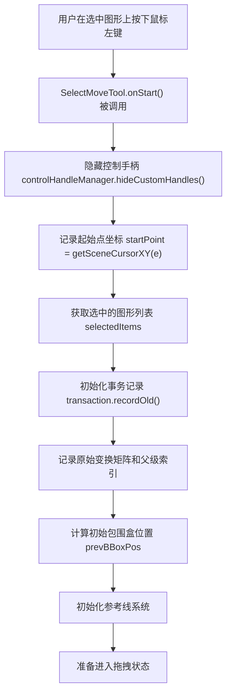
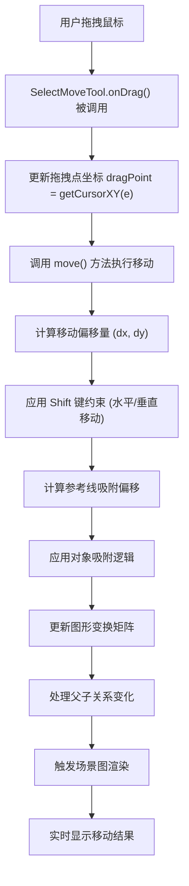
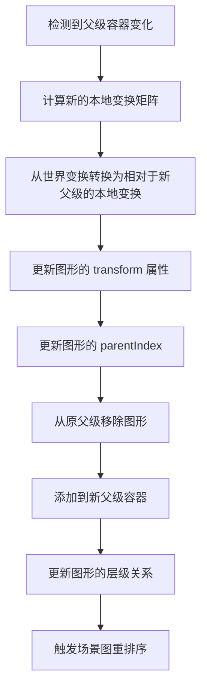
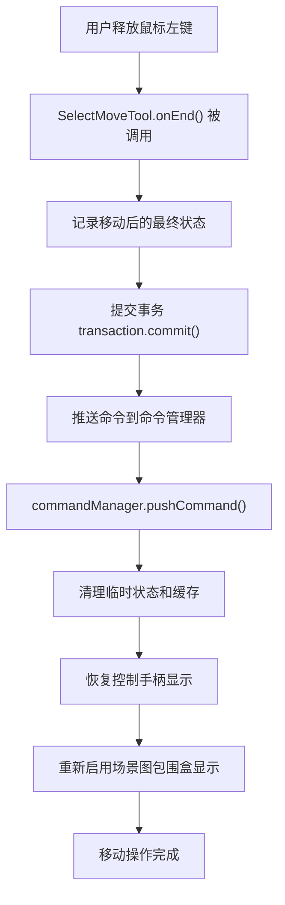

# Suika 编辑器选择工具移动功能的完整流程文档

## 概述

本文档详细描述了 Suika 编辑器中选择工具移动功能的完整实现流程，包括从鼠标按下到图形移动、碰撞检测、吸附计算、命令记录的各个阶段。选择工具移动是编辑器最常用的交互操作之一，支持单个和多个图形的精确移动，以及复杂的坐标变换和约束处理。

## 🔍 流程图查看指南

**如果您的 Markdown 查看器不支持 Mermaid 图表渲染，请使用以下在线工具查看：**

1. **Mermaid Live Editor**: <https://mermaid.live/>
2. **复制下方任一流程图代码块 → 粘贴到在线编辑器 → 查看可视化流程图**

## 核心组件

### 1. SelectMoveTool 类

位置：`packages/core/src/tools/tool_select/tool_select_move.ts`

#### 主要功能

- 实现选中图形的拖拽移动
- 支持多个图形的批量移动
- 处理复杂的父子关系变换
- 集成网格和对象吸附功能
- 支持撤销重做操作

#### 核心属性

```typescript
export class SelectMoveTool implements IBaseTool {
  private originWorldTfMap = new Map<string, IMatrixArr>(); // 原始世界变换矩阵
  private originParentIndexMap = new Map<string, IParentIndex>(); // 原始父级索引

  private transaction: Transaction; // 事务管理器
  private selectedItems: SuikaGraphics[] = []; // 选中的图形
  private selectedFrameIdSet = new Set<string>(); // 选中的画框ID集合

  private startPoint: IPoint = { x: -1, y: -1 }; // 起始点
  private dragPoint: IPoint | null = null; // 拖拽点
  private dx = 0; // X轴偏移
  private dy = 0; // Y轴偏移
  private prevBBoxPos: IPoint = { x: -1, y: -1 }; // 之前的包围盒位置
}
```

### 2. 事务管理 (Transaction)

位置：`packages/core/src/transaction.ts`

#### 主要功能

- 记录操作前后的状态变化
- 支持撤销重做功能
- 管理图形属性变更历史

```typescript
class Transaction {
  private oldAttrsMap = new Map<string, Record<string, any>>();
  private newAttrsMap = new Map<string, Record<string, any>>();

  recordOld(id: string, attrs: Record<string, any>): void;
  recordNew(id: string, attrs: Record<string, any>): void;
  commit(): void;
}
```

### 3. 参考线系统 (RefLine)

位置：`packages/core/src/ref_line.ts`

#### 主要功能

- 计算和显示智能参考线
- 处理对象间对齐关系
- 提供精确的吸附反馈

## 完整移动流程详解

### 1. 移动激活和初始化流程



#### 详细初始化步骤

1. **控制手柄管理**：

```typescript
this.editor.controlHandleManager.hideCustomHandles();
```

在移动开始时隐藏控制手柄，避免视觉干扰。

2. **状态记录初始化**：

```typescript
this.startPoint = this.editor.getSceneCursorXY(e);
this.selectedItems = this.editor.selectedElements.getItems({
  excludeLocked: true, // 排除锁定的图形
});
```

3. **事务记录**：

```typescript
for (const item of this.selectedItems) {
  const id = item.attrs.id;
  this.transaction.recordOld(id, {
    transform: cloneDeep(item.attrs.transform),
    parentIndex: cloneDeep(item.attrs.parentIndex),
  });
  this.originWorldTfMap.set(id, item.getWorldTransform());
  this.originParentIndexMap.set(id, cloneDeep(item.attrs.parentIndex!));
}
```

4. **父级容器确定**：

```typescript
const canvasGraphics = this.editor.doc.getCanvas();
this.prevParent =
  getDeepFrameAtPoint(this.startPoint, canvasGraphics.getChildren(), (node) =>
    this.selectedFrameIdSet.has(node.attrs.id),
  ) ?? canvasGraphics;
```

### 2. 实时拖拽和移动流程



#### 移动计算逻辑

```typescript
private move() {
  // 1. 计算基础偏移量
  this.dx = this.dragPoint!.x - this.startPoint.x;
  this.dy = this.dragPoint!.y - this.startPoint.y;

  // 2. 处理 Shift 键约束
  if (this.editor.hostEventManager.isShiftPressing) {
    // 取较大的偏移量，保持水平或垂直移动
    if (Math.abs(this.dx) > Math.abs(this.dy)) {
      this.dy = 0;  // 水平移动
    } else {
      this.dx = 0;  // 垂直移动
    }
  }

  // 3. 计算参考线吸附
  const snapOffset = this.editor.refLine.getGraphicsSnapOffset([
    {
      x: this.prevBBoxPos.x + this.dx,
      y: this.prevBBoxPos.y + this.dy,
    },
  ]);

  // 4. 应用吸附偏移
  this.dx += snapOffset.x;
  this.dy += snapOffset.y;
}
```

#### 图形变换更新

```typescript
// 更新每个选中图形的变换
for (const item of this.selectedItems) {
  const originWorldTf = this.originWorldTfMap.get(item.attrs.id)!;
  const originParentIndex = this.originParentIndexMap.get(item.attrs.id)!;

  // 计算新的世界变换矩阵
  const newWorldTf: IMatrixArr = [
    originWorldTf[0],
    originWorldTf[1],
    originWorldTf[2],
    originWorldTf[3],
    originWorldTf[4] + this.dx,
    originWorldTf[5] + this.dy,
  ];

  // 处理父子关系变化
  const currentParent = getDeepFrameAtPoint(
    { x: this.prevBBoxPos.x + this.dx, y: this.prevBBoxPos.y + this.dy },
    canvasGraphics.getChildren(),
  );

  if (currentParent !== this.prevParent) {
    // 父级容器发生变化，需要重新计算本地变换
    this.handleParentChange(item, newWorldTf, currentParent);
  } else {
    // 父级不变，直接设置世界变换
    item.setWorldTransform(newWorldTf);
  }
}
```

### 3. 父子关系变化处理流程



#### 父级变化处理

```typescript
private handleParentChange(
  item: SuikaGraphics,
  newWorldTf: IMatrixArr,
  newParent: SuikaFrame | SuikaCanvas
) {
  // 1. 计算相对于新父级的本地变换
  const parentWorldTf = newParent.getWorldTransform();
  const localTf = multiplyMatrix(newWorldTf, invertMatrix(parentWorldTf));

  // 2. 更新图形属性
  item.updateAttrs({
    transform: localTf,
    parentIndex: {
      ...item.attrs.parentIndex!,
      position: newParent.getChildren().length,  // 插入到最后
    },
  });

  // 3. 更新父子关系
  const oldParent = item.getParent();
  if (oldParent) {
    oldParent.removeChild(item);
  }
  newParent.insertChild(item);

  // 4. 记录新的父级引用
  this.prevParent = newParent;
}
```

### 4. 移动结束和命令记录流程



#### 命令记录和清理

```typescript
onEnd() {
  // 1. 记录最终状态
  for (const item of this.selectedItems) {
    this.transaction.recordNew(item.attrs.id, {
      transform: item.attrs.transform,
      parentIndex: item.attrs.parentIndex,
    });
  }

  // 2. 提交事务
  this.transaction.commit();

  // 3. 创建并推送命令
  this.editor.commandManager.pushCommand(
    new UpdateGraphicsAttrsCmd(
      'Move Graphics',
      this.editor,
      this.transaction.oldAttrsMap,
      this.transaction.newAttrsMap,
    ),
  );

  // 4. 清理状态
  this.cleanup();
}

private cleanup() {
  // 清理临时状态
  this.originWorldTfMap.clear();
  this.originParentIndexMap.clear();
  this.selectedFrameIdSet.clear();

  // 恢复 UI 状态
  this.editor.sceneGraph.showBoxAndHandleWhenSelected = true;
  this.editor.controlHandleManager.showCustomHandles();

  // 清除参考线
  this.editor.refLine.clear();

  // 重置状态变量
  this.startPoint = { x: -1, y: -1 };
  this.dragPoint = null;
  this.dx = 0;
  this.dy = 0;
}
```

## 高级功能实现

### 1. Shift 键约束移动

```typescript
onShiftToggle() {
  if (this.dragPoint) {
    // 重新计算移动，应用约束
    this.move();
  }
}

// 在 move() 方法中：
if (this.editor.hostEventManager.isShiftPressing) {
  if (Math.abs(this.dx) > Math.abs(this.dy)) {
    this.dy = 0;  // 强制水平移动
  } else {
    this.dx = 0;  // 强制垂直移动
  }
}
```

### 2. 对象吸附系统

#### 参考线计算

```typescript
// 初始化时缓存参考线
if (this.editor.setting.get('snapToObjects')) {
  this.editor.refLine.cacheGraphicsRefLines({
    excludeItems: this.selectedItems, // 排除自身
  });
}

// 实时计算吸附偏移
const snapOffset = this.editor.refLine.getGraphicsSnapOffset([
  {
    x: this.prevBBoxPos.x + this.dx,
    y: this.prevBBoxPos.y + this.dy,
  },
]);

// 应用吸附
this.dx += snapOffset.x;
this.dy += snapOffset.y;
```

### 3. 多选移动优化

#### 批量变换处理

```typescript
// 对所有选中的图形应用相同的变换
for (const item of this.selectedItems) {
  const originWorldTf = this.originWorldTfMap.get(item.attrs.id)!;

  // 计算新的世界位置
  const newX = originWorldTf[4] + this.dx;
  const newY = originWorldTf[5] + this.dy;

  // 批量更新变换矩阵
  item.setWorldTransform([
    originWorldTf[0],
    originWorldTf[1],
    originWorldTf[2],
    originWorldTf[3],
    newX,
    newY,
  ]);
}
```

## 性能优化策略

### 1. 渲染优化

- **实时更新**：拖拽过程中立即更新图形位置
- **批量渲染**：多个图形同时更新，减少渲染次数
- **脏标记**：只重新渲染发生变化的区域

### 2. 计算优化

- **缓存策略**：预计算并缓存原始变换矩阵
- **增量更新**：基于偏移量进行增量计算
- **边界检查**：避免无效的计算操作

### 3. 内存管理

- **及时清理**：移动结束后清理所有临时状态
- **对象复用**：重用事务和映射对象
- **垃圾回收**：主动释放不再需要的引用

## 边界情况处理

### 1. 锁定图形过滤

```typescript
this.selectedItems = this.editor.selectedElements.getItems({
  excludeLocked: true, // 自动排除锁定的图形
});
```

### 2. 空选择处理

```typescript
const boundingRect = this.editor.selectedElements.getBoundingRect();
if (!boundingRect) {
  console.error("selected elements shouldn't be empty when moving");
  return;
}
```

### 3. 坐标系转换

- **场景坐标 ↔ 视口坐标**：处理缩放和视口变换
- **世界坐标 ↔ 本地坐标**：处理父子关系变换
- **吸附坐标校正**：确保吸附计算的准确性

## 扩展性设计

### 1. 自定义移动行为

```typescript
// 扩展移动工具支持自定义约束
export class CustomMoveTool extends SelectMoveTool {
  override move() {
    // 应用自定义移动逻辑
    super.move();
    // 添加额外的约束或行为
  }
}
```

### 2. 移动预览功能

```typescript
// 添加移动预览模式
private enablePreviewMode() {
  // 创建临时预览图形
  // 显示移动轨迹
  // 提供视觉反馈
}
```

## 总结

Suika 编辑器的选择工具移动功能采用了分层设计：

1. **交互层** (`SelectMoveTool`)：处理用户鼠标交互
2. **计算层**：处理坐标变换和约束逻辑
3. **渲染层** (`SceneGraph`)：负责图形更新和显示
4. **持久层** (`CommandManager`)：支持撤销重做操作

移动功能的实现考虑了：

- **精确控制**：像素级别的精确移动
- **性能优化**：实时响应和高性能渲染
- **复杂场景**：多选、父子关系、吸附等复杂情况
- **用户体验**：流畅的交互反馈和视觉反馈
- **数据一致性**：完整的事务管理和命令记录

选择工具移动功能作为编辑器的核心交互功能，为用户提供了强大而灵活的图形操作能力。
