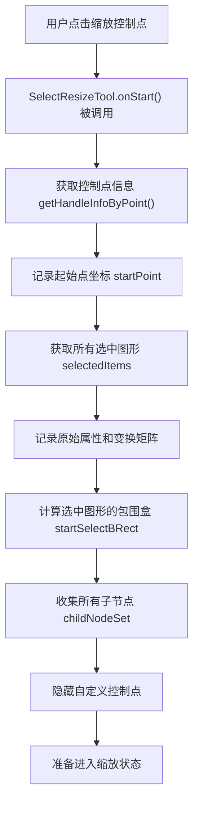
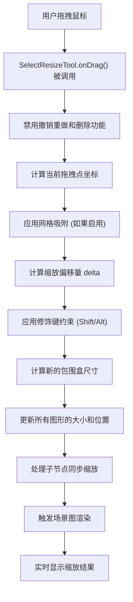
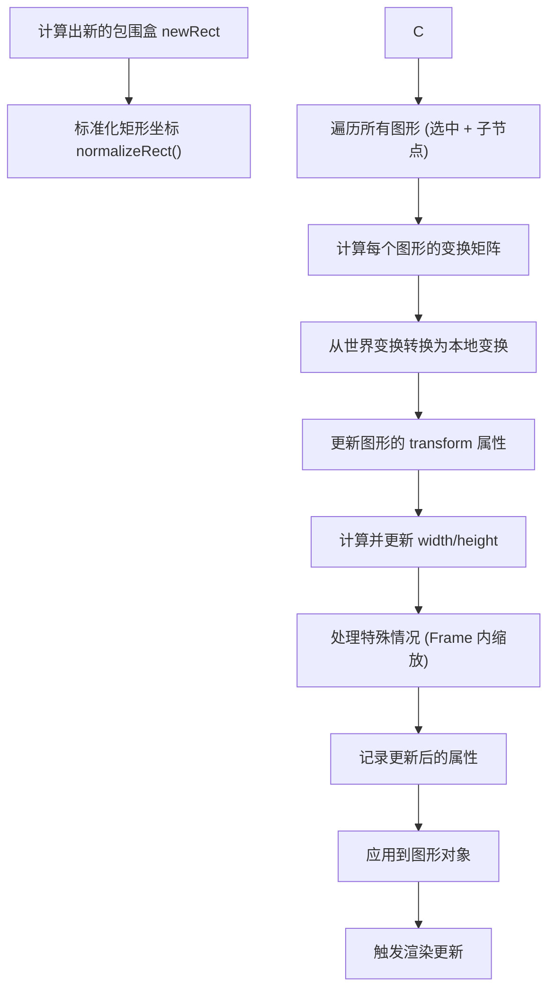
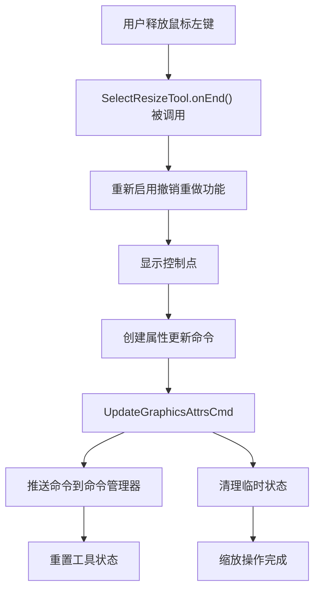

# Suika 编辑器选择工具缩放功能的完整流程文档

## 概述

本文档详细描述了 Suika 编辑器中选择工具缩放功能的完整实现流程，包括从控制点交互到尺寸计算、变换矩阵更新、约束处理、命令记录的各个阶段。选择工具缩放是编辑器重要的变换操作之一，支持等比例缩放、单向缩放、中心点缩放等复杂场景。

## 🔍 流程图查看指南

**如果您的 Markdown 查看器不支持 Mermaid 图表渲染，请使用以下在线工具查看：**

1. **Mermaid Live Editor**: <https://mermaid.live/>
2. **复制下方任一流程图代码块 → 粘贴到在线编辑器 → 查看可视化流程图**

## 核心组件

### 1. SelectResizeTool 类

位置：`packages/core/src/tools/tool_select/tool_select_resize.ts`

#### 主要功能

- 实现选中图形的精确缩放
- 支持八个方向的控制点缩放
- 处理等比例和单向缩放约束
- 支持中心点和边缘点缩放模式
- 集成吸附和参考线功能

#### 核心属性

```typescript
export class SelectResizeTool implements IBaseTool {
  private startPoint: IPoint = { x: -1, y: -1 }; // 缩放起始点
  private handleName!: string; // 控制点名称

  private startSelectBRect: IRect | null = null; // 初始包围盒
  private originAttrsMap = new Map<string, GraphicsAttrs>(); // 原始属性
  private originWorldTransforms = new Map<string, IMatrixArr>(); // 原始世界变换

  private childNodeSet = new Set<SuikaGraphics>(); // 子节点集合
  private updatedAttrsMap = new Map<string, Partial<GraphicsAttrs>>(); // 更新属性

  private lastDragPoint: IPoint | null = null; // 最后拖拽点
  private prevLastPoint: IPoint | null = null; // 上一拖拽点
}
```

### 2. 控制点管理器 (ControlHandleManager)

位置：`packages/core/src/control_handle_manager/`

#### 主要功能

- 定义八个方向的缩放控制点
- 计算控制点位置和交互区域
- 提供控制点命中测试
- 管理控制点的显示和隐藏

```typescript
enum TransformHandleType {
  NW = 'nw', // 西北
  N = 'n', // 北
  NE = 'ne', // 东北
  E = 'e', // 东
  SE = 'se', // 东南
  S = 's', // 南
  SW = 'sw', // 西南
  W = 'w', // 西
}
```

### 3. 几何变换库 (@suika/geo)

位置：`packages/geo/src/`

#### 主要功能

- 提供矩形缩放计算函数
- 处理变换矩阵运算
- 支持逆矩阵和矩阵乘法
- 计算包围盒和变换后的几何

```typescript
// 核心几何函数
export function resizeRect(
  rect: IRect,
  handleType: TransformHandleType,
  delta: IPoint,
  options?: ResizeOptions,
): IRect;

export function recomputeTransformRect(
  rect: ITransformRect,
  transform: IMatrixArr,
): ITransformRect;
```

## 完整缩放流程详解

### 1. 缩放激活和初始化流程



#### 详细初始化步骤

1. **控制点识别**：

```typescript
const handleInfo = this.editor.controlHandleManager.getHandleInfoByPoint(
  this.startPoint,
);
if (!handleInfo) {
  throw new Error('handleName is invalid');
}
this.handleName = handleInfo.handleName;
```

2. **状态记录**：

```typescript
// 记录选中图形的状态
selectedItems.forEach((item) => {
  this.originAttrsMap.set(item.attrs.id, item.getAttrs());
  this.originWorldTransforms.set(item.attrs.id, [...item.getWorldTransform()]);
});

// 记录子节点状态（处理编组情况）
this.childNodeSet = getChildNodeSet(selectedItems);
for (const item of this.childNodeSet) {
  this.originAttrsMap.set(item.attrs.id, item.getAttrs());
  this.originWorldTransforms.set(item.attrs.id, [...item.getWorldTransform()]);
}
```

3. **包围盒计算**：

```typescript
this.startSelectBRect = this.editor.selectedElements.getBoundingRect();
if (!this.startSelectBRect) {
  throw new Error('startSelectBbox should not be null');
}
```

### 2. 实时拖拽和缩放计算流程



#### 缩放计算逻辑

```typescript
onDrag(e: PointerEvent) {
  // 1. 计算当前拖拽点
  let currentPoint = this.editor.getSceneCursorXY(e);

  // 2. 应用网格吸附
  if (this.editor.setting.get('snapToGrid')) {
    currentPoint = SnapHelper.getSnapPtBySetting(
      currentPoint,
      this.editor.setting
    );
  }

  this.lastDragPoint = currentPoint;

  // 3. 计算相对偏移
  const delta = {
    x: currentPoint.x - this.startPoint.x,
    y: currentPoint.y - this.startPoint.y,
  };

  // 4. 调用缩放更新
  this.updateGraphicsWithDelta(delta);
}
```

#### 核心缩放计算

```typescript
private updateGraphicsWithDelta(delta: IPoint) {
  const startRect = this.startSelectBRect!;
  const handleName = this.handleName;

  // 1. 处理 Alt 键中心缩放
  let actualDelta = { ...delta };
  if (this.editor.hostEventManager.isAltPressing) {
    // 中心缩放：双倍偏移
    actualDelta.x *= 2;
    actualDelta.y *= 2;
  }

  // 2. 处理 Shift 键等比例缩放
  if (this.editor.hostEventManager.isShiftPressing) {
    // 计算等比例缩放因子
    const scaleX = (startRect.width + actualDelta.x) / startRect.width;
    const scaleY = (startRect.height + actualDelta.y) / startRect.height;
    const scale = Math.min(Math.abs(scaleX), Math.abs(scaleY));

    // 应用等比例缩放
    actualDelta.x = (scale - 1) * startRect.width * Math.sign(actualDelta.x);
    actualDelta.y = (scale - 1) * startRect.height * Math.sign(actualDelta.y);
  }

  // 3. 使用几何库计算新的矩形
  const newRect = resizeRect(startRect, handleName as TransformHandleType, actualDelta);

  // 4. 更新图形
  this.updateGraphics(newRect);
}
```

### 3. 图形属性更新流程



#### 变换矩阵计算

```typescript
private updateGraphics(newRect: IRect) {
  // 标准化新的包围盒
  newRect = normalizeRect(newRect);

  // 获取绘制图形对象
  const drawingShape = this.drawingGraphics!;

  // 获取绘制图形对象的父级图形
  const parent = drawingShape.getParent();

  // 计算左上角坐标
  let x = newRect.x;
  let y = newRect.y;

  // 如果父级是画框，需要转换为本地坐标
  if (parent && isFrameGraphics(parent)) {
    const tf = parent.getWorldTransform();
    const point = applyInverseMatrix(tf, newRect);
    x = point.x;
    y = point.y;
  }

  // 更新图形属性
  drawingShape.updateAttrs({
    x: x,
    y: y,
    width: newRect.width,
    height: newRect.height,
  });
}
```

#### 多图形同步缩放

```typescript
private updateGraphics(rect: IRect) {
  rect = normalizeRect(rect);

  const allGraphics = [
    ...this.editor.selectedElements.getItems(),
    ...this.childNodeSet
  ];

  for (const graphics of allGraphics) {
    const originAttrs = this.originAttrsMap.get(graphics.attrs.id)!;
    const originWorldTf = this.originWorldTransforms.get(graphics.attrs.id)!;

    // 计算缩放比例
    const scaleX = rect.width / this.startSelectBRect!.width;
    const scaleY = rect.height / this.startSelectBRect!.height;

    // 计算新的位置偏移
    const offsetX = (rect.x - this.startSelectBRect!.x) * scaleX;
    const offsetY = (rect.y - this.startSelectBRect!.y) * scaleY;

    // 构建新的变换矩阵
    const newWorldTf: IMatrixArr = [
      originWorldTf[0] * scaleX, originWorldTf[1] * scaleY, originWorldTf[2],
      originWorldTf[3] * scaleX, originWorldTf[4] + offsetX, originWorldTf[5] + offsetY,
    ];

    // 处理父子关系
    const parent = graphics.getParent();
    if (parent && isFrameGraphics(parent)) {
      // 转换为本地变换
      const parentWorldTf = parent.getWorldTransform();
      const localTf = multiplyMatrix(newWorldTf, invertMatrix(parentWorldTf));
      graphics.updateAttrs({ transform: localTf });
    } else {
      graphics.setWorldTransform(newWorldTf);
    }

    // 记录更新的属性
    this.updatedAttrsMap.set(graphics.attrs.id, {
      transform: graphics.attrs.transform,
      width: graphics.attrs.width,
      height: graphics.attrs.height,
    });
  }
}
```

### 4. 缩放结束和命令记录流程



#### 命令记录

```typescript
onEnd() {
  // 1. 重新启用被禁用的功能
  this.editor.commandManager.enableRedoUndo();
  this.editor.hostEventManager.enableDelete();

  // 2. 显示控制点
  if (isTransformHandle(this.handleName)) {
    this.editor.controlHandleManager.showCustomHandles();
  }

  // 3. 创建和推送命令
  this.editor.commandManager.pushCommand(
    new UpdateGraphicsAttrsCmd(
      'Resize Graphics',
      this.editor,
      this.originAttrsMap,
      new Map(this.updatedAttrsMap)
    )
  );

  // 4. 清理状态
  this.cleanup();
}

private cleanup() {
  // 清理所有临时状态
  this.originAttrsMap.clear();
  this.originWorldTransforms.clear();
  this.childNodeSet.clear();
  this.updatedAttrsMap.clear();

  // 重置状态变量
  this.startPoint = { x: -1, y: -1 };
  this.handleName = '';
  this.startSelectBRect = null;
  this.lastDragPoint = null;
  this.prevLastPoint = null;
}
```

## 高级功能实现

### 1. 八个方向的控制点缩放

#### 控制点类型定义

```typescript
const TransformHandleType = {
  NW: 'nw', // 西北 - 自由缩放
  N: 'n', // 北 - 垂直缩放
  NE: 'ne', // 东北 - 自由缩放
  E: 'e', // 东 - 水平缩放
  SE: 'se', // 东南 - 自由缩放
  S: 's', // 南 - 垂直缩放
  SW: 'sw', // 西南 - 自由缩放
  W: 'w', // 西 - 水平缩放
} as const;
```

#### 不同控制点的缩放行为

```typescript
function resizeRect(
  rect: IRect,
  handleType: TransformHandleType,
  delta: IPoint,
): IRect {
  switch (handleType) {
    case 'nw': // 西北
      return {
        ...rect,
        x: rect.x + delta.x,
        y: rect.y + delta.y,
        width: rect.width - delta.x,
        height: rect.height - delta.y,
      };
    case 'n': // 北
      return { ...rect, y: rect.y + delta.y, height: rect.height - delta.y };
    case 'e': // 东
      return { ...rect, width: rect.width + delta.x };
    // ... 其他方向类似处理
  }
}
```

### 2. Shift 键等比例缩放

```typescript
onActive() {
  const handler = () => {
    // Shift 键状态改变时重新计算缩放
    if (this.lastDragPoint) {
      const delta = {
        x: this.lastDragPoint.x - this.startPoint.x,
        y: this.lastDragPoint.y - this.startPoint.y,
      };
      this.updateGraphicsWithDelta(delta);
      this.editor.render();
    }
  };

  this.editor.hostEventManager.on('shiftToggle', handler);
  this.editor.hostEventManager.on('altToggle', handler);

  this.unbind = () => {
    this.editor.hostEventManager.off('shiftToggle', handler);
    this.editor.hostEventManager.off('altToggle', handler);
  };
}
```

### 3. Alt 键中心缩放

```typescript
// 在 updateGraphicsWithDelta 中处理 Alt 键
if (this.editor.hostEventManager.isAltPressing) {
  // 中心缩放：从中心向外扩展
  actualDelta.x *= 2;
  actualDelta.y *= 2;
}
```

## 性能优化策略

### 1. 计算优化

- **增量更新**：基于偏移量进行增量计算，避免全量重算
- **矩阵缓存**：缓存原始变换矩阵，减少重复计算
- **批量处理**：一次性处理所有相关图形

### 2. 内存管理

- **及时清理**：缩放结束后立即清理临时状态
- **对象复用**：重用 Map 和 Set 对象
- **引用释放**：主动释放不再需要的对象引用

### 3. 渲染优化

- **实时反馈**：拖拽过程中提供即时视觉反馈
- **脏区域更新**：只更新发生变化的图形
- **防抖渲染**：避免过度频繁的渲染调用

## 边界情况处理

### 1. 最小尺寸限制

```typescript
// 处理宽度或高度为零的特殊情况
private solveWidthOrHeightIsZero(size: ISize, delta: IPoint): ISize {
  const newSize = { width: size.width, height: size.height };

  if (size.width === 0) {
    const sign = Math.sign(delta.x) || 1;
    newSize.width = sign * this.editor.setting.get('gridSnapX');
  }

  if (size.height === 0) {
    const sign = Math.sign(delta.y) || 1;
    newSize.height = sign * this.editor.setting.get('gridSnapY');
  }

  return newSize;
}
```

### 2. 翻转处理

```typescript
// 处理缩放时可能的翻转情况
if (newRect.width < 0) {
  newRect.width = Math.abs(newRect.width);
  newRect.x -= newRect.width;
  // 可能需要调整控制点类型
}

if (newRect.height < 0) {
  newRect.height = Math.abs(newRect.height);
  newRect.y -= newRect.height;
  // 可能需要调整控制点类型
}
```

### 3. 父子关系复杂情况

- **嵌套编组**：处理多层嵌套的缩放变换
- **Frame 内缩放**：正确处理画框内的坐标变换
- **混合类型**：处理不同类型图形的混合缩放

## 扩展性设计

### 1. 自定义缩放行为

```typescript
// 扩展缩放工具支持自定义约束
export class CustomResizeTool extends SelectResizeTool {
  override updateGraphicsWithDelta(delta: IPoint) {
    // 应用自定义缩放逻辑
    const customDelta = this.applyCustomConstraints(delta);
    super.updateGraphicsWithDelta(customDelta);
  }
}
```

### 2. 智能缩放建议

```typescript
// 提供智能缩放比例建议
private getSmartScaleSuggestions(originalSize: ISize, targetSize: ISize) {
  // 计算常用比例：1/2, 1/3, 2/3, 3/2, 2, 3 等
  const ratios = [0.5, 1/3, 2/3, 3/2, 2, 3];
  // 返回最接近的建议比例
}
```

## 总结

Suika 编辑器的选择工具缩放功能采用了模块化设计：

1. **交互层** (`SelectResizeTool`)：处理用户控制点交互
2. **计算层** (`@suika/geo`)：提供精确的几何变换算法
3. **状态层** (`Transaction`)：管理操作历史和撤销重做
4. **渲染层** (`SceneGraph`)：负责图形更新和显示

缩放功能的实现考虑了：

- **精确控制**：八个方向的控制点支持
- **灵活约束**：Shift 等比例、Alt 中心缩放
- **复杂场景**：多选、编组、父子关系处理
- **性能优化**：实时反馈和高效计算
- **边界处理**：各种边缘情况的鲁棒性

选择工具缩放功能为用户提供了专业级的图形变换能力，是编辑器核心功能的重要组成部分。
