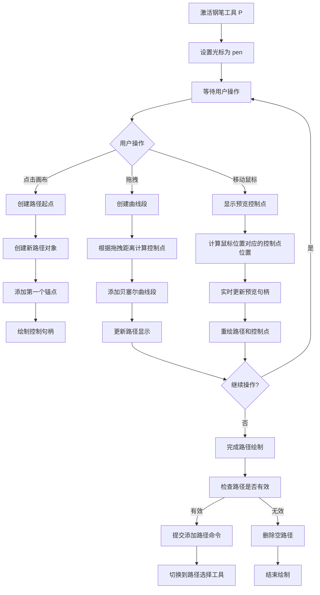
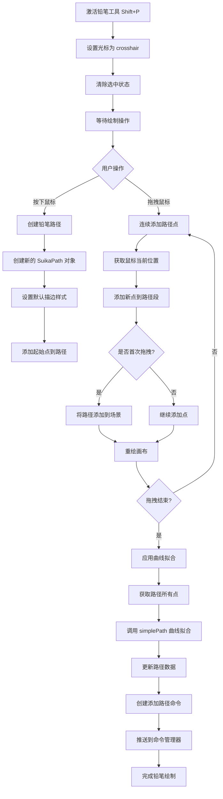
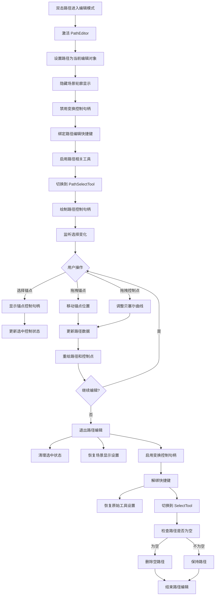
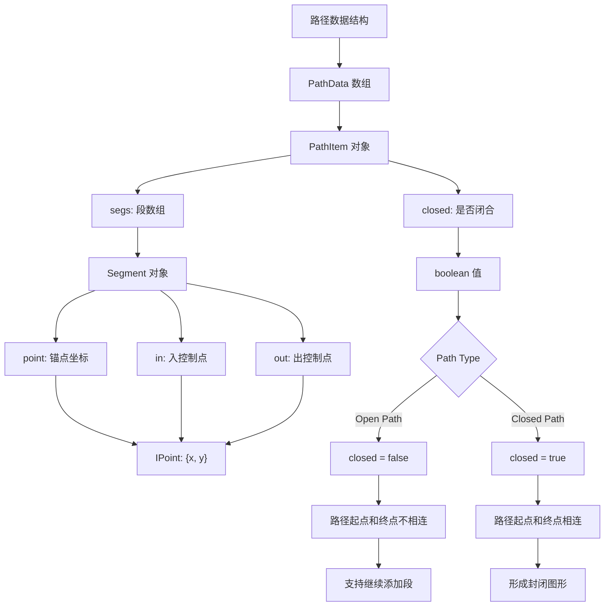

# Suika 编辑器钢笔工具完整流程文档

## 概述

本文档详细描述了 Suika 编辑器中钢笔工具系统的完整实现流程，包括钢笔工具（Pen Tool）、铅笔工具（Pencil Tool）和路径编辑器（Path Editor）的各个阶段。钢笔工具系统为用户提供了强大的矢量路径绘制和编辑能力，支持从简单直线到复杂贝塞尔曲线的创建和修改。

## 🔍 流程图查看指南

**如果您的 Markdown 查看器不支持 Mermaid 图表渲染，请使用以下在线工具查看：**

1. **Mermaid Live Editor**: https://mermaid.live/
2. **复制下方任一流程图代码块 → 粘贴到在线编辑器 → 查看可视化流程图**

## 核心组件

### 1. DrawPathTool 类（钢笔工具）

位置：`packages/core/src/tools/tool_draw_path.ts`

#### 主要功能

- 实现贝塞尔曲线路径的精确绘制
- 支持直线段和曲线段的混合创建
- 提供路径闭合和编辑功能
- 支持锚点和控制点的精确控制

#### 核心属性

```typescript
export class DrawPathTool implements ITool {
  static readonly type = 'drawPath';
  static readonly hotkey = 'p';
  readonly cursor: ICursor = 'pen';

  private startPoint: IPoint | null = null;
  private path: SuikaPath | null = null;
  private prevAttrs: {
    transform: IMatrixArr;
    pathData: IPathItem[];
  } | null = null;
  private pathIdx = 0;
}
```

### 2. PencilTool 类（铅笔工具）

位置：`packages/core/src/tools/tool_pencil.ts`

#### 主要功能

- 实现自由手绘路径的创建
- 自动进行曲线拟合和优化
- 将手绘线条转换为平滑的贝塞尔曲线

#### 核心属性

```typescript
export class PencilTool implements ITool {
  static readonly type = 'pencil';
  static readonly hotkey = { shiftKey: true, keyCode: 'KeyP' };
  readonly cursor: ICursor = 'crosshair';

  private path: SuikaPath | null = null;
  private isFirstDrag = true;
}
```

### 3. PathEditor 类（路径编辑器）

位置：`packages/core/src/path_editor/path_editor.ts`

#### 主要功能

- 提供路径的精确编辑功能
- 管理锚点和控制点的交互
- 支持路径的实时预览和修改
- 集成路径选择和绘制工具

#### 核心属性

```typescript
export class PathEditor {
  private _active = false;
  private path: SuikaPath | null = null;
  private eventTokens: number[] = [];
  selectedControl: SelectedControl;
}
```

## 完整流程图

### 📋 Phase 1: 钢笔工具绘制流程 (复制下方代码块到 mermaid.live 查看)



### Phase 2: 铅笔工具绘制流程 (复制下方代码块到 mermaid.live 查看)



### Phase 3: 路径编辑器工作流程 (复制下方代码块到 mermaid.live 查看)



### Phase 4: 路径数据结构流程 (复制下方代码块到 mermaid.live 查看)



## 详细流程说明

### 1. 钢笔工具绘制流程

#### 1.1 工具激活

```typescript
// 按下 P 键激活钢笔工具
onActive() {
  if (this.editor.pathEditor.isActive()) {
    this.path = this.editor.pathEditor.getPath()!;
    this.pathIdx = this.path.attrs.pathData.length;
  }
  this.updateControlHandlesWithPreviewHandles(this.getCorrectedPoint());
}
```

#### 1.2 路径创建

```typescript
// 创建新的路径对象
if (!pathEditor.isActive()) {
  const pathData: IPathItem[] = [{
    segs: [{
      point: { x: 0, y: 0 },
      in: { x: 0, y: 0 },
      out: { x: 0, y: 0 },
    }],
    closed: false,
  }];

  const path = new SuikaPath({
    objectName: getNoConflictObjectName(currCanvas, GraphicsObjectSuffix.Path),
    width: 0,
    height: 0,
    pathData,
    stroke: [cloneDeep(this.editor.setting.get('firstStroke'))],
    strokeWidth: 1,
  }, {
    doc: this.editor.doc,
  });

  this.path = path;
  this.editor.sceneGraph.addItems([path]);
  currCanvas.insertChild(path);
  pathEditor.active(path);
}
```

#### 1.3 锚点和控制点管理

```typescript
// 添加新的锚点
addAnchor(point: IPoint) {
  const path = this.path!;
  const lastSeg = path.getLastSeg();

  if (lastSeg) {
    // 计算控制点位置
    const controlPoint = this.calculateControlPoint(lastSeg.point, point);

    // 更新上一段的出控制点
    lastSeg.out = controlPoint.out;

    // 添加新的段
    path.addSeg(this.pathIdx, {
      point,
      in: controlPoint.in,
      out: { x: 0, y: 0 },
    });
  }
}
```

#### 1.4 路径闭合检测

```typescript
// 检查是否与起点重合以闭合路径
checkCursorPtInStartAnchor() {
  const startPoint = this.startPoint;
  if (!startPoint) return null;

  const cursorPt = this.getCorrectedPoint();
  const distance = Math.sqrt(
    Math.pow(cursorPt.x - startPoint.x, 2) +
    Math.pow(cursorPt.y - startPoint.y, 2)
  );

  if (distance <= 8) { // 8px 阈值
    return startPoint;
  }
  return null;
}
```

### 2. 铅笔工具绘制流程

#### 2.1 工具初始化

```typescript
// 铅笔工具激活
onActive() {
  this.editor.selectedElements.clear();
}
```

#### 2.2 自由绘制

```typescript
// 开始绘制
onStart(e: PointerEvent) {
  this.path = new SuikaPath({
    objectName: getNoConflictObjectName(
      this.editor.doc.getCurrCanvas(),
      GraphicsObjectSuffix.Path,
    ),
    width: 0,
    height: 0,
    pathData: [{
      segs: [],
      closed: false,
    }],
    stroke: [cloneDeep(this.editor.setting.get('firstStroke'))],
    strokeWidth: 3,
  }, {
    doc: this.editor.doc,
  });

  const point = this.editor.getSceneCursorXY(e);
  this.path!.addSeg(0, {
    point,
    in: { x: 0, y: 0 },
    out: { x: 0, y: 0 },
  });
}

// 拖拽绘制
onDrag(e: PointerEvent) {
  const point = this.editor.getSceneCursorXY(e);
  const path = this.path!;
  path.addSeg(0, {
    point,
    in: { x: 0, y: 0 },
    out: { x: 0, y: 0 },
  });

  if (this.isFirstDrag) {
    this.editor.sceneGraph.addItems([path]);
    this.editor.doc.getCurrCanvas().insertChild(path);
    this.isFirstDrag = false;
  }
  this.editor.render();
}
```

#### 2.3 曲线拟合优化

```typescript
// 绘制结束时进行曲线拟合
onEnd(_e: PointerEvent, isDragHappened: boolean) {
  const path = this.path!;
  if (isDragHappened) {
    const segs = path.attrs.pathData[0].segs;
    const newSegs = simplePath(
      segs,
      this.editor.setting.get('pencilCurveFitTolerance'), // 曲线拟合容差
    );
    path.attrs.pathData[0].segs = newSegs;

    // 提交命令
    this.editor.commandManager.pushCommand(
      new AddGraphCmd('Add Path by pencil', this.editor, [path]),
    );
  } else {
    path.setDeleted(true);
  }
}
```

### 3. 路径编辑器工作流程

#### 3.1 进入编辑模式

```typescript
// 双击路径进入编辑模式
active(path: SuikaPath) {
  this._active = true;
  this.path = path;

  const editor = this.editor;
  editor.sceneGraph.showSelectedGraphsOutline = false;
  editor.sceneGraph.highlightLayersOnHover = false;
  editor.controlHandleManager.enableTransformControl = false;

  // 启用路径编辑工具
  this.prevToolKeys = editor.toolManager.getEnableTools();
  editor.toolManager.setEnableHotKeyTools([
    PathSelectTool.type,
    DrawPathTool.type,
  ]);

  // 切换到路径选择工具
  editor.toolManager.setActiveTool(PathSelectTool.type);

  this.eventEmitter.emit('toggle', true);
}
```

#### 3.2 控制句柄管理

```typescript
// 绘制路径控制句柄
drawControlHandles() {
  const path = this.path;
  if (!path) return;

  const handles: ControlHandle[] = [];

  path.attrs.pathData.forEach((pathItem, pathIdx) => {
    pathItem.segs.forEach((seg, segIdx) => {
      // 锚点句柄
      handles.push({
        id: `anchor-${pathIdx}-${segIdx}`,
        x: seg.point.x,
        y: seg.point.y,
        type: 'anchor',
        cursor: 'move',
      });

      // 控制点句柄
      if (seg.in.x !== 0 || seg.in.y !== 0) {
        handles.push({
          id: `control-in-${pathIdx}-${segIdx}`,
          x: seg.point.x + seg.in.x,
          y: seg.point.y + seg.in.y,
          type: 'control-in',
          cursor: 'move',
        });
      }

      if (seg.out.x !== 0 || seg.out.y !== 0) {
        handles.push({
          id: `control-out-${pathIdx}-${segIdx}`,
          x: seg.point.x + seg.out.x,
          y: seg.point.y + seg.out.y,
          type: 'control-out',
          cursor: 'move',
        });
      }
    });
  });

  this.editor.controlHandleManager.setCustomHandles(handles);
}
```

#### 3.3 退出编辑模式

```typescript
inactive(source?: 'undo') {
  if (!this._active) return;

  this._active = false;

  if (source !== 'undo') {
    this.removePathIfEmpty(); // 删除空的路径
  }

  this.selectedControl.clear();
  this.path = null;

  const editor = this.editor;
  editor.sceneGraph.showSelectedGraphsOutline = true;
  editor.sceneGraph.highlightLayersOnHover = true;
  editor.controlHandleManager.enableTransformControl = true;

  // 恢复原始工具设置
  editor.toolManager.setEnableHotKeyTools(this.prevToolKeys);
  editor.toolManager.setActiveTool(SelectTool.type);

  this.eventEmitter.emit('toggle', false);
}
```

## 关键算法分析

### 1. 贝塞尔曲线控制点计算

**控制点计算算法**:

```typescript
calculateControlPoint(fromPoint: IPoint, toPoint: IPoint) {
  const distance = Math.sqrt(
    Math.pow(toPoint.x - fromPoint.x, 2) +
    Math.pow(toPoint.y - fromPoint.y, 2)
  );

  const controlLength = Math.min(distance * 0.4, 50); // 最大50px

  // 计算控制点方向（垂直于连线方向）
  const dx = toPoint.x - fromPoint.x;
  const dy = toPoint.y - fromPoint.y;
  const angle = Math.atan2(dy, dx);

  return {
    out: {
      x: Math.cos(angle - Math.PI/2) * controlLength,
      y: Math.sin(angle - Math.PI/2) * controlLength,
    },
    in: {
      x: Math.cos(angle + Math.PI/2) * controlLength,
      y: Math.sin(angle + Math.PI/2) * controlLength,
    },
  };
}
```

### 2. 铅笔曲线拟合算法

**simplePath 算法**:

```typescript
// 使用 Ramer-Douglas-Peucker 算法进行曲线简化
export const simplePath = (
  points: IPoint[],
  tolerance: number,
): ISegment[] => {
  // 1. 移除连续的重复点
  // 2. 使用 RDP 算法简化路径
  // 3. 将简化后的点转换为贝塞尔曲线段
  // 4. 优化控制点位置
};
```

### 3. 路径数据结构管理

**路径数据更新算法**:

```typescript
updatePathData(pathIdx: number, segIdx: number, updates: Partial<ISegment>) {
  const pathData = this.path!.attrs.pathData;
  const seg = pathData[pathIdx].segs[segIdx];

  // 更新段数据
  Object.assign(seg, updates);

  // 重新计算路径边界
  this.updatePathBounds();

  // 通知观察者
  this.path!.emit('pathDataChange');
}
```

## 技术特点

### 1. 双工具架构

- **钢笔工具**: 精确的贝塞尔曲线绘制，适合专业设计
- **铅笔工具**: 自然的自由绘制，适合快速草图

### 2. 实时预览系统

- **控制句柄预览**: 鼠标移动时实时显示控制点位置
- **路径实时渲染**: 绘制过程中即时显示路径形状
- **编辑模式预览**: 编辑时实时反馈修改效果

### 3. 智能路径优化

- **曲线拟合**: 铅笔绘制后自动优化为平滑曲线
- **控制点智能计算**: 基于距离和角度自动计算控制点
- **路径简化**: 移除冗余点，优化性能

### 4. 完整编辑支持

- **锚点编辑**: 支持锚点的添加、删除、移动
- **控制点调整**: 精确控制贝塞尔曲线的形状
- **路径闭合**: 支持开放和闭合路径的创建

## 使用场景

### 1. 专业矢量设计

- **场景**: 创建精确的logo、图标、插图
- **工具**: 钢笔工具
- **优势**: 完全控制曲线形状，支持复杂图形

### 2. 快速草图绘制

- **场景**: 快速记录想法，创建概念草图
- **工具**: 铅笔工具
- **优势**: 自然绘制体验，快速成型

### 3. 路径编辑和优化

- **场景**: 细化现有路径，调整曲线形状
- **功能**: 路径编辑器
- **优势**: 精确控制每个锚点和控制点

### 4. 混合工作流

- **场景**: 先用铅笔工具快速绘制，再用钢笔工具精确调整
- **工作流**: 铅笔 → 钢笔 → 路径编辑器
- **优势**: 结合两种工具的优势

## UI集成

### 1. 工具栏集成

```typescript
// 钢笔工具配置
{
  name: 'drawPath',
  hotkey: 'P',
  intlId: 'tool.pen',
  icon: <PenOutlined />,
}

// 铅笔工具配置
{
  name: 'pencil',
  hotkey: '⇧P',
  intlId: 'tool.pencil',
  icon: <PencilOutlined />,
}
```

### 2. 路径编辑器UI

```typescript
// 编辑模式切换按钮
{isPathEditorActive && (
  <Button onClick={() => editor.pathEditor.inactive()}>
    {intl.formatMessage({ id: 'done' })}
  </Button>
)}
```

### 3. 控制句柄显示

- **锚点**: 实心圆形，可拖拽移动
- **控制点**: 空心圆形，通过线条连接到锚点
- **选中状态**: 高亮显示选中的控制点

## 扩展性

### 1. 自定义曲线算法

可以扩展支持不同的曲线拟合算法：

```typescript
// 支持不同的曲线类型
export const advancedPathFitting = (
  points: IPoint[],
  algorithm: 'bezier' | 'spline' | 'catmull-rom',
): ISegment[] => {
  switch (algorithm) {
    case 'bezier':
      return fitBezierCurve(points);
    case 'spline':
      return fitSplineCurve(points);
    case 'catmull-rom':
      return fitCatmullRomCurve(points);
  }
};
```

### 2. 路径效果增强

可以添加路径效果和修改器：

```typescript
// 路径变形效果
export const applyPathEffect = (
  path: SuikaPath,
  effect: 'dash' | 'wave' | 'roughen',
): SuikaPath => {
  // 应用路径效果
};
```

### 3. 高级编辑功能

可以添加更高级的编辑功能：

```typescript
// 路径布尔运算
export const pathBooleanOperation = (
  path1: SuikaPath,
  path2: SuikaPath,
  operation: 'union' | 'subtract' | 'intersect',
): SuikaPath => {
  // 实现路径布尔运算
};
```

## 总结

Suika 编辑器的钢笔工具系统通过精心设计的工具架构和算法，实现了从自由绘制到精确编辑的完整矢量路径工作流。系统支持钢笔工具的精确贝塞尔曲线绘制、铅笔工具的自然手绘体验，以及路径编辑器的专业修改功能，为用户提供了强大的矢量图形创作能力。

钢笔工具系统作为编辑器的核心绘制工具之一，与其他功能（如变换、样式设置）无缝集成，为专业设计工作提供了完整的技术基础。通过实时预览、智能优化和精确控制，钢笔工具系统确保了高质量的矢量图形输出。
